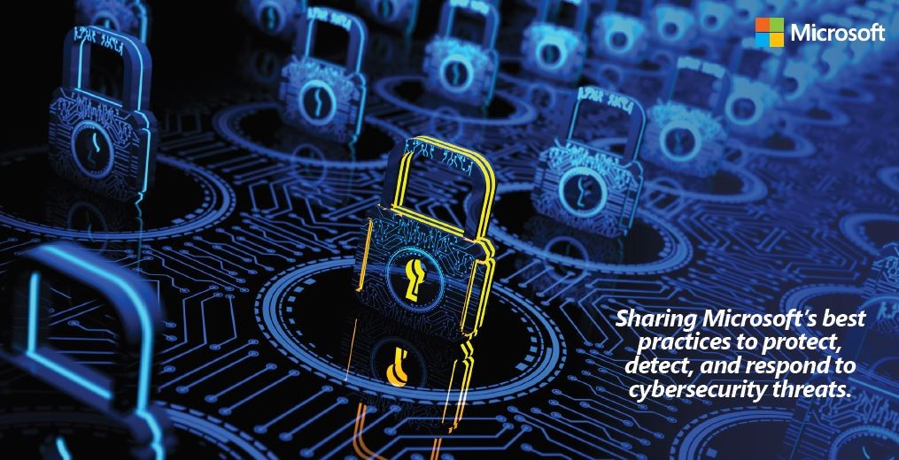

Today, a single breach, physical or virtual, can cause millions of dollars of damage to an organization and potentially billions in financial losses to the global economy. Each week seems to bring a new disclosure of a cybersecurity breach somewhere in the world. As we look at the current state of cybersecurity challenges today, we see the same types of attacks, but the sophistication and scope of each attack continues to grow and evolve. Add to these the threats of nation-state actors seeking to disrupt operations, conduct intelligence gathering, or generally undermine trust.

You can download the [Cyber Defense Operations Center strategy brief](https://docs.microsoft.com/en-us/security/msrc/fy18-strategy-brief) to gain more insight into how we work to protect, detect, and respond to cybersecurity threats.

Like many companies, Microsoft takes technical dependencies upon a shared infrastructure, multiple teams, and inter-dependent services. Because of these dependencies, teams must _work together_ to effectively detect and defeat the tactics of sophisticated attackers and cybersecurity threats. With shared guidance and perspective, we can leverage existing people and process to respond to the previously “unseen” and the “unknown” issues that suddenly fall into scope. There are also situations where a group of people can share deep subject matter expertise, or cross-organizational talents and contacts, or some combination of qualities without having to resource them in each team.

Within the Microsoft Cyber Defense Operation Center (CDOC), we focus on these dependencies with teams that coordinate threat intelligence, security monitoring and incident response by exploiting both the common, and unique capabilities of each specialization. It is here that we leverage our global workforce of more than 3,500 security professionals across our product development teams, information security groups, and legal teams to protect our cloud infrastructure and services, products and devices, and internal resources. The engineering teams behind our commercial security solutions, like Azure Security Center (ASC), also take advantage of the Cyber Defense Operation Center (CDOC) community to test hypotheses and pre-flight solutions in a real-world environment. This model is based on a closed-loop system of intelligence, defense, and control that streamlines our security capabilities for more than 200 cloud services, over 100 datacenters, millions of devices, and over a billion customers around the globe.

It is also critical that Microsoft meet and exceed customer expectations of an enterprise-focused cloud provider. Customers expect an integrated security operations center with a mission to enhance the capability, cooperation and information sharing in cyber defense by virtue of education, research and development, lessons learned and consultation. By sharing the state of our security capabilities, as well as proposed improvement investments, we can replace vulnerability with capability by building innovative security solutions intended to outpace cyber adversaries. While security has always been a priority for Microsoft, we recognize that the digital world requires continuous advances in our commitment in how we protect, detect, and respond to cybersecurity threats. These three commitments define our approach to cyber defense and serve as a useful framework for our discussion of Microsoft’s cyber defense strategies and capabilities.

Microsoft’s protect tactics include:

- **Multifactor authentication **like Windows Hello for Business (H4B) is employed across our infrastructure to control identity and access management.
- **Non-persistent administration **using just-in-time (JIT) and just-enough administrator (JEA) privileges to engineering staff managing infrastructure and services. This provides a unique set of credentials for elevated access that automatically expires after a pre-designated duration
- **Proper hygiene** is rigorously maintained through updated, anti-malware software and adherence to strict patching and configuration management.
- **Microsoft Security Development Lifecycle** is used to harden all applications, online services and products, and to routinely validate its effectiveness through penetration testing and vulnerability scanning.
- **Threat modeling and attack surface analysis** ensures that potential threats are assessed, exposed aspects of the service are evaluated, and the attack surface is minimized by restricting services or eliminating unnecessary functions.
- **Classifying data according to its sensitivity**—high, medium or low business impact—and taking the appropriate measures to protect it, including encryption in transit and at rest, and enforcing the principle of least-privilege access provides additional protection.
- **Awareness training** that fosters a trust relationship between the user and the security team to develop an environment where users will report incidents and anomalies without fear of repercussion
- **Extensive monitoring and controls** over the physical environment of our global datacenters, including cameras, personnel screening, fences and barriers, and multi-factor authentication for physical access.
- **Software-defined networks **that protect our cloud infrastructure from intrusions and distributed denial of service attacks.
- **Secure Admin Workstations** are securely controlled, and provisioned workstations designed for both managing valuable production systems and daily activities like email, document editing and development work.
- **Windows Defender Security Intelligence** team of researchers identify, reverse engineer, and develop malware signatures and then deploy them across our infrastructure for advanced detection and defense. These signatures are available to millions of customers using Microsoft anti-malware solutions.

Having a rich set of controls and a defense-in-depth strategy helps ensure that should any one area fail, there are compensating controls in other areas to help maintain the security and privacy of our customers, cloud services, and our own infrastructure environment.

Microsoft operates under an Assume Breach posture. This simply means that despite the confidence we have in the defensive protections in place, we assume adversaries can and will find a way to penetrate security perimeters. It is then critical to detect an adversary rapidly and evict them from the network.

Microsoft’s detect tactics include:

- **Monitoring network and physical environments** 24x7x365 for potential cybersecurity events. Behavior profiling based on usage patterns and an understanding of unique threats to our services.
- **Identity and behavioral analytics** are developed to highlight abnormal activity.
- **Machine learning software tools and techniques** are routinely used to discover and flag irregularities.
- **Advanced analytical tools and processes** are deployed to further identify anomalous activity and innovative correlation capabilities. This enables highly contextualized detections to be created from the enormous volumes of data in near real-time.
- **Automated software-based processes** that are continuously audited and evolved for increased effectiveness.
- **Data scientists and security experts **routinely work side-by-side to address escalated events that exhibit unusual characteristics requiring further analysis of targets. They can then determine potential response and remediation efforts.

When we detect something abnormal in our systems, it triggers our response teams to engage.

Microsoft’s respond tactics include:

- **Automated response systems\*\*** using risk-based algorithms\*\* to flag events requiring human intervention.
- **Endpoint Detection and Response (EDR) solutions **for granular machine isolation, ability to restrict machine(s) and initiate AV updates and scans
- **Well-defined, documented and scalable incident response processes** within a continuous improvement model helps to keep us ahead of adversaries by making these available to all responders.
- **Subject matter expertise\*\*** across our teams\*\*, in multiple security areas, including crisis management, forensics, and intrusion analysis, and deep understanding of the platforms, services and applications operating in our cloud datacenters provides a diverse skill set for addressing incidents.
- **Wide enterprise searching** across both cloud, hybrid and on-premises data and systems to determine the scope of the incident.
- **Deep forensic analysis**, for major threats, are performed by specialists to understand incidents and to aid in their containment and eradication.
- **Microsoft’s security software tools, automation and hyper-scale cloud infrastructure** enable our security experts to reduce the time to detect, investigate, analyze, respond, and recover from cyberattacks.

There is a lot of data and tips in this strategy brief that I hope you will find useful. You can download the [Cyber Defense Operations Center strategy brief](https://docs.microsoft.com/en-us/security/msrc/fy18-strategy-brief) to gain more insight into how we work to protect, detect and respond to cybersecurity threats. And I encourage you to visit the Microsoft Security Response Center’s [website](https://www.microsoft.com/msrc) to learn more about how we build security into Microsoft’s products and services to help you protect your endpoints, move faster to detect threats, and respond to security breaches.

Happy hunting! Microsoft’s Cyber Defense Operations Center: Kristina Laidler, Sr. Director SOC and IR, Digital Security & Risk Engineering Monica Drake, Principal Security Program Manager, Microsoft Security Response Center

_The Microsoft Security Response Center is part of the defender community and on the front line of security response evolution. For more than twenty years, we have been engaged with security researchers working to protect customers and the global online community. For more information, please visit our website at [www.microsoft.com/msrc](http://www.microsoft.com/msrc) and follow our Twitter page at _[@msftsecresponse*.*](https://twitter.com/msftsecresponse)
