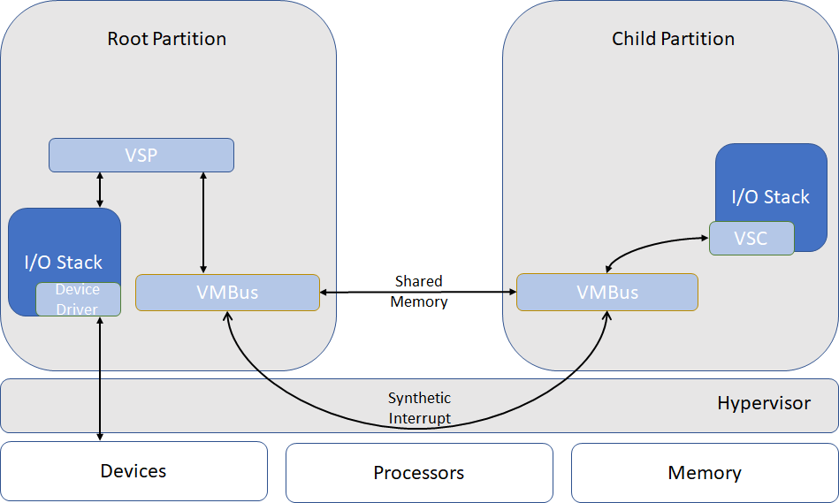
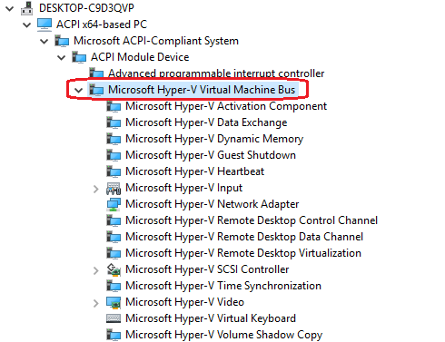
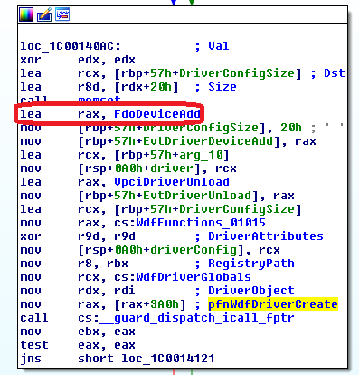
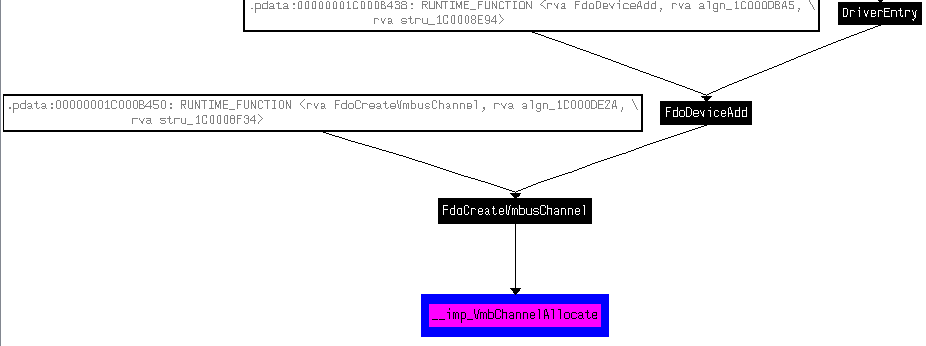
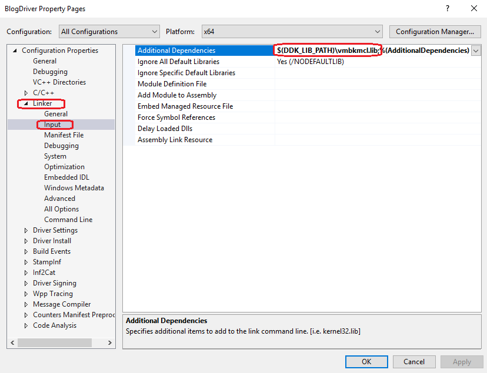
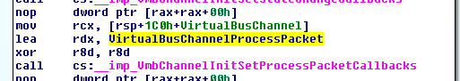
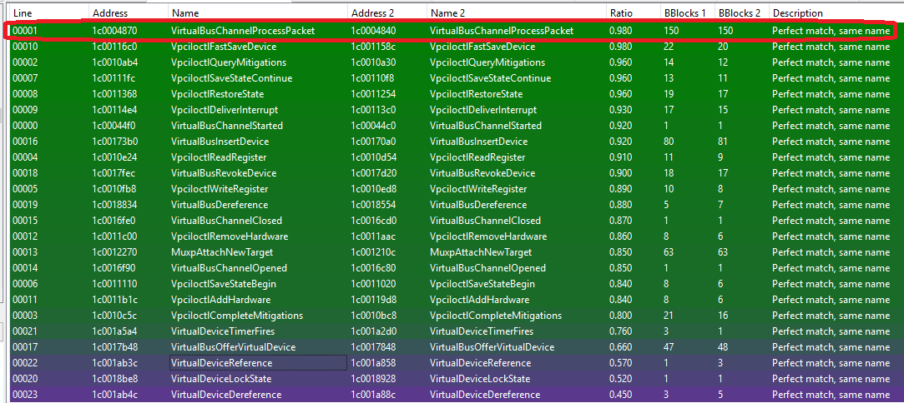
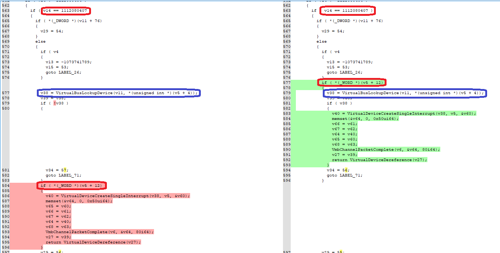
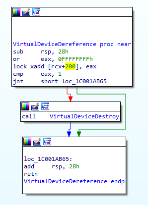

# Introduction

Hyper-V is the backbone of Azure, running on its Hosts to provide efficient and fair sharing of resources, but also isolation. That’s why we, in the [vulnerability research team for Windows](https://www.linkedin.com/pulse/vulnerability-research-scale-windows-arthur-wongtschowski/), have been working in the background for years now helping secure Hyper-V. And why Microsoft invites security researchers across the globe to submit their vulnerabilities through the [Hyper-V Bounty Program](https://www.microsoft.com/en-us/msrc/bounty-hyper-v) for payment of up to \$250,000 USD.  
To help engage people in the Hyper-V security space, last year internal teams from Microsoft published some of their work.  
At BlackHat 2018 USA [Joe Bialek](https://twitter.com/JosephBialek) and [Nicolas Joly](https://twitter.com/n_joly) presented "[A Dive in to Hyper-V Architecture and Vulnerabilities](https://github.com/Microsoft/MSRC-Security-Research/blob/master/presentations/2018_08_BlackHatUSA/A%20Dive%20in%20to%20Hyper-V%20Architecture%20and%20Vulnerabilities.pdf)". They covered an architecture overview of Hyper-V oriented to security researchers. They also discussed some interesting vulnerabilities seen in Hyper-V.  
In the same conference, [Jordan Rabet](https://twitter.com/smealum) presented "[Hardening Hyper-V through offensive security research](https://i.blackhat.com/us-18/Thu-August-9/us-18-Rabet-Hardening-Hyper-V-Through-Offensive-Security-Research.pdf)", where he discussed in great detail the exploitation process for [CVE-2017-0075](https://portal.msrc.microsoft.com/en-US/security-guidance/advisory/CVE-2017-0075) in VMSwitch, a Hyper-V component.  
Last December [Saar Amar](https://twitter.com/AmarSaar) published a [detailed blog](https://blogs.technet.microsoft.com/srd/2018/12/10/first-steps-in-hyper-v-research/) with the fundamentals to get introduced into Hyper-V security research.  
Following their work, we’d like to share a new story related to Hyper-V security for anyone interested in getting introduced in Hyper-V security or learning more. Recently we have been working in Virtual PCI (VPCI), one of the para-virtualized devices available in Hyper-V, used to expose hardware to virtual machines. As other para-virtualized devices, it uses [VMBus](https://docs.microsoft.com/en-us/virtualization/hyper-v-on-windows/reference/hyper-v-architecture) for inter-partition communication.  
On this blog we would like to share some of our learnings, introduce both VMBus and VPCI, share one strategy to fuzz the VMBus channel used by VPCI and discuss one of our findings. Some of the concepts and strategies here can be used to work with other virtual devices using VMBus in Hyper-V.

# VMBus overview

VMBus is one of the mechanisms used by Hyper-V to offer para-virtualization. In short, it is a virtual bus device that sets up channels between the guest and the host. These channels provide the capability to share data between partitions and setup synthetic devices.  
In this section we’ll introduce the VMBus architecture, learn how channels are offered to partitions, and how synthetic devices are setup.  
The root partition (or host) hosts Virtualization Service Providers (VSP) that communicate over VMBus to handle devices access requests from child partitions. On the other hand, child partitions (or guests) use Virtualization Service Consumers (VSC) to redirect device requests to the VSP over VMBus. Child partitions require VMBus and VSC drivers to use the para-virtualized device stacks.  
VMBus channels allow VSCs and VSPs to transfer data primarily through two ring buffers: upstream and downstream. These ring buffers are mapped into both partitions thanks to the hypervisor, who also provides synthetic interrupts to drive notification between partitions when there is data available.  
The architecture can be summarized in the next diagram:  


A more detailed introduction to VMBus can be found in the presentations linked before:

- "[A Dive in to Hyper-V Architecture and Vulnerabilities](<https://github.com/Microsoft/MSRC-Security-Research/blob/master/presentations/2018_08_BlackHatUSA/A Dive in to Hyper-V Architecture and Vulnerabilities.pdf>)", slides 15-19.
- "[Hardening Hyper-V through offensive security research](https://i.blackhat.com/us-18/Thu-August-9/us-18-Rabet-Hardening-Hyper-V-Through-Offensive-Security-Research.pdf)", slides 5-16.

Since VMBus allows I/O related data transmission between the potentially malicious guest and the VSP drivers in the host, the later are a prime candidate for vulnerability hunting and fuzzing. A general idea to fuzz virtual devices is finding the VMBus channel available to a VSC and use it to send malformed data to the VSP.  
To do so, we need to understand broadly how VMBus channels are made available to VSCs. Let’s start by introducing how the VMBus device is made available to the guest. From a practical point of view, if you deploy a Windows Generation 2 Virtual Machine (enlightened guest) you can find the exposed VMBus device in the Device Manager:  


The connection view in Device Manger also reveals that VMBus is exposed to the guest via ACPI. Indeed, its description can be found in the Differentiated System Description Table (DSDT):

```
Device(\_SB.VMOD.VMBS)
{
    Name(STA, 0x0F)
    Name(_ADR, Zero)
    Name(_DDN, "VMBUS")
    Name(_HID, "VMBus")
    Name(_UID, Zero)
    Method(_DIS, 0, NotSerialized)
    {
        And(STA, 0x0D, STA)
    }
    Method(_PS0, 0, NotSerialized)
    {
        Or(STA, 0x0F, STA)
    }
    Method(_STA, 0, NotSerialized)
    {
        Return(STA)
    }
    Name(_PS3, Zero)
    Name(_CRS, ResourceTemplate()
    {
        IRQ(Edge, ActiveHigh, Exclusive) {5}
    })
}
```

Once VMBus is ready, for every channel offered by the root partition, the guest will build a new node in the device tree. The summarized (and generic) flow is:

1. The root partition offers a channel.
2. The offer is delivered to the guest through a synthetic interrupt.
3. In the guest, because of the interrupt, a bus relation query is injected in the PnP system.
4. In the guest, the VMBus driver creates a new Physical Device Object (PDO) for the device stack. The information of the offer is saved in the PDO context.
5. The device driver (for example VPCI), creates a new Functional Device Object (FDO) for the device stack. The routine used to create the FDO objects, for example AddDevice in the case of a Plug and Play driver, is a good point to find the code that allocates and opens the new VMBus channel.

A kernel debugger and the command “`!devnode`” can be used to list the devices available on the top of VMBus inside a guest:

```
0: kd> !devnode 0 1
Dumping IopRootDeviceNode (= 0xffffe28c76fbd9e0)
DevNode 0xffffe28c76fbd9e0 for PDO 0xffffe28c76e6b830
  InstancePath is "HTREE\ROOT\0"
  State = DeviceNodeStarted (0x308)
  Previous State = DeviceNodeEnumerateCompletion (0x30d)
  .
  .
  .
  DevNode 0xffffe28c76ed19b0 for PDO 0xffffe28c76ecfd80
    InstancePath is "ROOT\ACPI_HAL\0000"
    State = DeviceNodeStarted (0x308)
    Previous State = DeviceNodeEnumerateCompletion (0x30d)
    DevNode 0xffffe28c76f17c00 for PDO 0xffffe28c76eeed30
      InstancePath is "ACPI_HAL\PNP0C08\0"
      ServiceName is "ACPI"
      State = DeviceNodeStarted (0x308)
      Previous State = DeviceNodeEnumerateCompletion (0x30d)
      DevNode 0xffffe28c76e9e8b0 for PDO 0xffffe28c76f52900
        InstancePath is "ACPI\ACPI0004\0"
        State = DeviceNodeStarted (0x308)
        Previous State = DeviceNodeEnumerateCompletion (0x30d)
        DevNode 0xffffe28c76f5b8b0 for PDO 0xffffe28c76f54d60
          InstancePath is "ACPI\PNP0003\3&fdac00f&0"
          State = DeviceNodeInitialized (0x302)
          Previous State = DeviceNodeUninitialized (0x301)
        DevNode 0xffffe28c76f5bbe0 for PDO 0xffffe28c76f59c30
          InstancePath is "ACPI\VMBus\0"
          ServiceName is "vmbus"
          State = DeviceNodeStarted (0x308)
          Previous State = DeviceNodeEnumerateCompletion (0x30d)
          .
          .
          .
          DevNode 0xffffe28c78629340 for PDO 0xffffe28c78625c90
            InstancePath is "VMBUS\{44c4f61d-4444-4400-9d52-802e27ede19f}\{7f7e8f36-7342-4531-a380-d3a9911f80bf}"
            ServiceName is "vpci"
            State = DeviceNodeStarted (0x308)
            Previous State = DeviceNodeEnumerateCompletion (0x30d)
            .
            .
```

Now that we’ve established VMBus as an interesting attack vector and learned how to use it, we can discuss one of the virtual devices making use of it: VPCI.

# Use case: VPCI

VPCI is a virtualized bus driver used to expose hardware to virtual machines. Scenarios using VPCI include [SR-IOV](https://docs.microsoft.com/en-us/windows-hardware/drivers/network/single-root-i-o-virtualization--sr-iov-) and [DDA](https://docs.microsoft.com/en-us/windows-server/virtualization/hyper-v/plan/plan-for-deploying-devices-using-discrete-device-assignment). It’s important to point out that VPCI will be exposed to the guest only if there is a virtual device requiring it (and this must be configured by the host). \*\*\*\*In this section we’ll learn how to find the VMBus channel used by VPCI, and how to use it to send arbitrary data to the VSP. We also provide the skeleton of a Windows driver to illustrate the idea.

As previously explained, every para-virtualized device will require a VSC and VSP pair. In the case of VPCI we’ll identify the VSC component as VPCI and the VSP component as VPCIVSP. The VPCI is managed by the vpci.sys driver in the guest. On the other side, vpcivsp.sys manages the VPCIVSP component in the host. For the current analysis we are using vpci.sys version 10.0.17134.228.

## Finding the VMBus channel

As we have introduced before, the initialization of a new FDO is a good point to start searching for allocation of VMBus channels. Since VPCI is a Kernel-Mode Driver Framework (KMDF) driver, we are interested in the call to `WdfDriverCreate`, and specifically in the DriverConfig parameter:

```
NTSTATUS WdfDriverCreate(
  PDRIVER_OBJECT         DriverObject,
  PCUNICODE_STRING       RegistryPath,
  PWDF_OBJECT_ATTRIBUTES DriverAttributes,
  PWDF_DRIVER_CONFIG     DriverConfig,
  WDFDRIVER              *Driver
);
```

The DriverConfig parameter is interesting because it’s a pointer to a `WDF_DRIVER_CONFIG` structure, where we can find the `EvtDriverDeviceAdd` callback function:

```
typedef struct _WDF_DRIVER_CONFIG {
  ULONG                     Size;
  PFN_WDF_DRIVER_DEVICE_ADD EvtDriverDeviceAdd;
  PFN_WDF_DRIVER_UNLOAD     EvtDriverUnload;
  ULONG                     DriverInitFlags;
  ULONG                     DriverPoolTag;
} WDF_DRIVER_CONFIG, *PWDF_DRIVER_CONFIG;
```

`EvtDriverDeviceAdd` is called by the PnP manager to perform device initialization when a new device is found.  
In the VPCI case it is `FdoDeviceAdd`:



During `FdoDeviceAdd` VPCI will allocate the new VMBus channel with a call to `VmbChannelAllocate`:  


The `VmbChannelAllocate` prototype can be found in the [vmbuskernelmodeclientlibapi.h](https://docs.microsoft.com/en-us/windows-hardware/drivers/ddi/content/vmbuskernelmodeclientlibapi/) public header. The pointer to the allocated channel is returned within the third parameter:

```
/// \page VmbChannelAllocate VmbChannelAllocate
/// Allocates a new VMBus channel with default parameters and callbacks. The
/// channel may be further initialized using the VmbChannelInit* routines before
/// being enabled with VmbChannelEnable. The channel must be freed with
/// VmbChannelCleanup.
///
/// \param ParentDeviceObject A pointer to the parent device.
/// \param IsServer Whether the new channel should be a server endpoint.
/// \param Channel Returns a pointer to an allocated channel.
_IRQL_requires_(PASSIVE_LEVEL)
NTSTATUS
VmbChannelAllocate(
    _In_ PDEVICE_OBJECT ParentDeviceObject,
    _In_ BOOLEAN IsServer,
    _Out_ _At_(*Channel, __drv_allocatesMem(Mem)) VMBCHANNEL *Channel
    );
```

To understand better how the channel is allocated and the reference stored, let’s review first the call to `FdoCreateVmBusChannel` from `FdoDeviceAdd`:

```
__int64 __fastcall FdoDeviceAdd(__int64 a1, __int64 a2)
{
  __int64 v5; // rbx
  signed int v6; // esi
  .
  .
  .
  // WdfObjectGetTypedContextWorker, similar to WdfObjectGetTypedContext
  v5 = (*(__int64 (__fastcall **)(__int64))(WdfFunctions_01015 + 1616))(WdfDriverGlobals);
  .
  .
  .
  v6 = FdoCreateVmbusChannel((_QWORD *)v5);
  .
  .
  .
 }
```

The first argument to `FdoCreateVmbusChannel` is the context of the FDO device. `FdoCreateVmbusChannel` will call to `VmbChannelAllocate` and save the reference to the allocated VMBCHANNEL in the stack (local variable):

```
__int64 __fastcall FdoCreateVmbusChannel(_QWORD *FdoContext)
{
  v1 = FdoContext;
.
.
.
  __int64 vpciChannel; // [rsp+70h] [rbp+10h]
.
.
.
  v5 = VmbChannelAllocate(v3, 0i64, &vpciChannel);
```

At this point the channel has been allocated but still cannot be used as it must be opened first. A client VSC opens an offered channel with a call to `VmbChannelEnable`.

The function prototype is also included in the [vmbuskernelmodeclientlibapi.h](https://docs.microsoft.com/en-us/windows-hardware/drivers/ddi/content/vmbuskernelmodeclientlibapi/) header:

```
/// \page VmbChannelEnable VmbChannelEnable
/// Enables a channel that is in the disabled state by connecting to vmbus and
/// offering or opening a channel (whichever is appropriate for the endpoint
/// type).
///
/// See \ref state_model.
///
/// \param Channel A handle for the channel.  Allocated by \ref VmbChannelAllocate.
_Must_inspect_result_
NTSTATUS
VmbChannelEnable(
    _In_    VMBCHANNEL  Channel
    );
```

In Windows 10 Redstone 4 (1803) the call to `VmbChannelEnable` happens also at `FdoCreateVmbusChannel`. After that, the reference to the channel is saved in the FDO context:

```
  v5 = VmbChannelEnable(vpciChannel);
  if ( v5 >= 0 )
  {
    v1[3] = vpciChannel;
    return 0i64;
  }
```

## Sending data through the VMBus Channel

Now that we understand how VPCI sets up its VMBus channel, a simple strategy to get a reference and use it for fuzzing is to use an upper filter driver for VPCI.  
When the VPCI FDO device stack is created our driver will be called by the PnP manager. At that point, the VMBus channel has been already allocated and enabled by FdoDeviceAdd and we can access it through the VPCI FDO Context.

Let’s see how to do it with a driver. The first step is to provide an [INF](https://docs.microsoft.com/en-us/windows-hardware/drivers/network/inf-file-settings-for-filter-drivers) file to install our filter driver for the VPCI device. The important parts of the INF have been highlighted. Take into account that:

- wvpci.inf is the INF for the VPCI driver.
- The VPCI hardware id is VMBUS\\{44C4F61D-4444-4400-9D52-802E27EDE19F}

```
;
; BlogDriver.inf
;

[Version]
Signature="$WINDOWS NT$"
Class=System
ClassGuid={4d36e97d-e325-11ce-bfc1-08002be10318}
Provider=%ManufacturerName%
DriverVer=
CatalogFile=BlogDriver.cat

[DestinationDirs]
DefaultDestDir = 12

[SourceDisksNames]
1 = %DiskName%,,,""

[SourceDisksFiles]
BlogDriver.sys  = 1

[Manufacturer]
%ManufacturerName%=Standard,NT$ARCH$

[Standard.NT$ARCH$]
%BlogDriver.DeviceDesc%=Install_Section, VMBUS\{44C4F61D-4444-4400-9D52-802E27EDE19F}

[Install_Section.NT]
Include=wvpci.inf
Needs=Vpci_Device_Child.NT
CopyFiles=BlogDriver_Files

[BlogDriver_Files]
BlogDriver.sys

[Install_Section.NT.HW]
Include=wvpci.inf
Needs=Vpci_Device_Child.NT.HW
AddReg=BlogDriver_AddReg

[BlogDriver_AddReg]
HKR,,"UpperFilters",0x00010000,"BlogDriver"

[Install_Section.NT.Services]
Include=wvpci.inf
Needs=Vpci_Device_Child.NT.Services
AddService=BlogDriver,,BlogDriver_Service_Child

[BlogDriver_Service_Child]
DisplayName    = %BlogDriver.SvcDesc%
ServiceType    = 1               ; SERVICE_KERNEL_DRIVER
StartType      = 3               ; SERVICE_DEMAND_START
ErrorControl   = 1               ; SERVICE_ERROR_NORMAL
ServiceBinary  = %12%\BlogDriver.sys

[Strings]
ManufacturerName="TestManufacturer"
ClassName=""
DiskName="BlogDriver Source Disk"
BlogDriver.DeviceDesc="Microsoft Hyper-V Virtual PCI Bus (With Filter)"
BlogDriver.SvcDesc="Microsoft Hyper-V Virtual PCI Bus (With Filter)"
```

Now let’s see the initial skeleton for the filter driver. Some clarifications first:

- The `AddDevice` routine creates the filter device object and attaches it to the VPCI FDO. A reference to the VPCI VMBus channel is saved in the device extension to make access easier.
- In this skeleton all the IRPs are just passed down through the device stack, we do not want to modify VPCI behavior, just access its VMBus channel.

The full skeleton ready to build and play can be found in [this repo](https://github.com/juvazq/paravirt-vpci-sec-blog). After installing the driver in the guest, the VPCI stack shows our filter driver:

```
0: kd> !devstack ffff8407f64cbad0
  !DevObj           !DrvObj            !DevExt           ObjectName
  ffff8407f2379de0  \Driver\BlogDriver ffff8407f2379f30
> ffff8407f64cbad0  \Driver\vpci       ffff8407fa4e42f0
  ffff8407f62e1c90  \Driver\vmbus      ffff8407f62e2310  00000024
!DevNode ffff8407f2fe26b0 :
  DeviceInst is "VMBUS\{44c4f61d-4444-4400-9d52-802e27ede19f}\{7f7e8f36-7342-4531-a380-d3a9911f80bf}"
  ServiceName is "vpci"
```

At this point we are ready to send data and fuzz through the channel. There are several public APIs available for sending packets through a VMBus channel. One of them is `VmbChannelSendSynchronousRequest`. It is one of the APIs used by VPCI and just requires a reference to the VMBCHANNEL to start working. The declaration is available in the [vmbuskernelmodeclientlibapi.h](https://docs.microsoft.com/en-us/windows-hardware/drivers/ddi/content/vmbuskernelmodeclientlibapi/) header. We have highlighted where to use the VMBCHANNEL:

```
/// \page VmbChannelSendSynchronousRequest VmbChannelSendSynchronousRequest
/// Sends a packet to the opposite endpoint and waits for a response.
///
/// Clients may call with any combination of parameters. The root may only call
/// this if *Timeout == 0 and the \ref VMBUS_CHANNEL_FORMAT_FLAG_WAIT_FOR_COMPLETION
/// flag is not set.
///
/// \param Channel A handle for the channel.  Allocated by \ref VmbChannelAllocate.
/// \param Buffer Data to send.
/// \param BufferSize Size of Buffer in bytes.
/// \param ExternalDataMdl Optionally, a MDL describing an additional buffer to
///     send.
/// \param Flags Standard flags.
/// \param CompletionBuffer Buffer to store completion packet results in.
/// \param CompletionBufferSize Size of CompletionBuffer in bytes. Must be
///     rounded up to nearest 8 bytes, or else call will fail. On success,
///     returns the number of bytes written into CompletionBuffer.
/// \param Timeout Optionally, a timeout in the style of KeWaitForSingleObject.
///     After this time elapses, the packet will be cancelled. If set to a
///     timeout of 0, this packet will not be queued if it does not fit in the
///     ring buffer.
///
/// \returns STATUS_SUCCESS
/// \returns STATUS_BUFFER_OVERFLOW - The packet did not fit in the buffer and
///     was not queued.
/// \returns STATUS_CANCELLED - The packet was canceled.
/// \returns STATUS_DEVICE_REMOVED - The channel is being shut down.
_When_(Timeout == NULL || Timeout->QuadPart != 0 ||
       (Flags & VMBUS_CHANNEL_FORMAT_FLAG_WAIT_FOR_COMPLETION) != 0,
       _IRQL_requires_(PASSIVE_LEVEL))
_When_(Timeout != NULL && Timeout->QuadPart == 0 &&
       (Flags & VMBUS_CHANNEL_FORMAT_FLAG_WAIT_FOR_COMPLETION) == 0,
        _IRQL_requires_max_(DISPATCH_LEVEL))
NTSTATUS
VmbChannelSendSynchronousRequest(
    _In_                            VMBCHANNEL      Channel,
    _In_reads_bytes_(BufferSize)    PVOID           Buffer,
    _In_                            UINT32          BufferSize,
    _In_opt_                        PMDL            ExternalDataMdl,
    _In_                            UINT32          Flags,
    _Out_writes_bytes_to_opt_(*CompletionBufferSize, *CompletionBufferSize)
                                    PVOID           CompletionBuffer,
    _Inout_opt_ _Pre_satisfies_(*_Curr_ % 8 == 0)
                                    PUINT32         CompletionBufferSize,
    _In_opt_                        PLARGE_INTEGER  Timeout
    );
```

There are other APIs publicly available and documented at [vmbuskernelmodeclientlibapi.h](https://docs.microsoft.com/en-us/windows-hardware/drivers/ddi/content/vmbuskernelmodeclientlibapi/):

- VmbPacketSend
- VmbPacketSendWithExternalMdl
- VmbPacketSendWithExternalPfns

Before using any of these methods on your driver, remember to link against vmbkmcl.lib:

 Searching for references to these methods in VPCI can help to analyze and understand better the interactions with the VSP. Another resource that can be helpful to understand the communication is to read through the [Linux Integration Services](https://github.com/LIS/lis-next). The client (VSC) implementation for Linux can be found in pci-hyperv.c.

## Finding the entry point of untrusted data in the VSP

In this section we’ll introduce packet processing in the VSP side. We’ll use VPCI as an example to learn how to locate the entry point for handling incoming VMBus packets. We’ll not discuss the details about the Virtual PCI communications though, it is out of the scope for this blog. For this analysis we are using vpcivsp.sys 10.0.17134.228.

For any VMBus endpoint, incoming packets from a channel will trigger the `EvtChannelProcessPacket` callback, as explained in the documentation available in the [vmbuskernelmodeclientlibapi.h](https://docs.microsoft.com/en-us/windows-hardware/drivers/ddi/content/vmbuskernelmodeclientlibapi/) header:

```
/// \page EvtVmbChannelProcessPacket EvtVmbChannelProcessPacket
/// \b EvtVmbChannelProcessPacket
/// \param Channel A handle for the channel.  Allocated by \ref VmbChannelAllocate.
/// \param Packet This completion context will be used to identify this packet to KMCL when the transaction can be retired.
/// \param Buffer This contains the packet which was sent by the opposite endpoint.  It does not contain the VMBus and KMCL headers.
/// \param BufferLength The length of Buffer in bytes.
/// \param Flags See VMBUS_CHANNEL_PROCESS_PACKET_FLAGS.
///
/// This callback is invoked when a packet has arrived in the incoming ring buffer.
/// For every invocation of this function, the implementer must eventually call
/// \ref VmbChannelPacketComplete.
///
/// This callback can be invoked at DISPATCH_LEVEL or lower, unless the channel
/// has been configured to defer packet processing to a worker thread.  See
/// \ref VmbChannelSetIncomingProcessingAtPassive for more information.
///\code
typedef
_Function_class_(EVT_VMB_CHANNEL_PROCESS_PACKET)
_IRQL_requires_max_(DISPATCH_LEVEL)
VOID
EVT_VMB_CHANNEL_PROCESS_PACKET(
    _In_ VMBCHANNEL Channel,
    _In_ VMBPACKETCOMPLETION Packet,
    _In_reads_bytes_(BufferLength) PVOID Buffer,
    _In_ UINT32 BufferLength,
    _In_ UINT32 Flags
    );
```

The callback for method processing is set with a call to `VmbChannelInitSetProcessPacketCallbacks`. It’s also declared in [vmbuskernelmodeclientlibapi.h](https://docs.microsoft.com/en-us/windows-hardware/drivers/ddi/content/vmbuskernelmodeclientlibapi/):

```
/// \page VmbChannelInitSetProcessPacketCallbacks VmbChannelInitSetProcessPacketCallbacks
/// Sets callbacks for packet processing. Only meaningful if KMCL queue
/// management is not suppressed.  TODO:  Make previous sentence more precise.
///
/// Note that ProcessPacketCallback will be invoked for every packet that
/// is received.  ProcessingCompleteCallback will be invoked every time the
/// ring buffer containing incoming packets transitions from non-empty to empty,
/// after the last invocation of ProcessPacketCallback in a single batch.
///
/// \param Channel A handle for the channel.  Allocated by \ref VmbChannelAllocate.
/// \param ProcessPacketCallback A callback that will be called when a packet is
///     ready for processing.
/// \param ProcessingCompleteCallback Optionally, a callback that will be called
///     when processing of a batch of packets has been completed.
///
/// \return STATUS_SUCCESS - function completed successfully
/// \return STATUS_INVALID_PARAMETER_1 - channel parameter was invalid or in an invalid state(Disabled)
NTSTATUS
VmbChannelInitSetProcessPacketCallbacks(
    _In_ VMBCHANNEL Channel,
    _In_ PFN_VMB_CHANNEL_PROCESS_PACKET ProcessPacketCallback,
    _In_opt_ PFN_VMB_CHANNEL_PROCESSING_COMPLETE ProcessingCompleteCallback
    );
```

With the above information, the packet processing method for the VPCI VSP can be found easily. On vpcivsp.sys just search for references to `VmbChannelInitSetProcessPacketCallbacks`. The processing method is `VirtualBusChannelProcessPacket`:



Analysis of the packet processing is out of scope for the blog, but hopefully the initial hints have been provided for researchers willing to invest in this area.

# Fuzzing results. One example - CVE-2018-0965

With the approach explained above we developed a fuzzer to target the packet processing in VPCI. In this section we’ll analyze one of the bugs hit by the fuzzer that has been recently patched and learn the kind of problems that can be found involving inter partition communication through VMBus channels.  
CVE-2018-0965 is an RCE belonging to the Tier 1 in the [Hyper-V Bounty Program](https://www.microsoft.com/en-us/msrc/bounty-hyper-v). The reference to the [official advisory](https://portal.msrc.microsoft.com/en-us/security-guidance/advisory/CVE-2018-0965).

The bug lived in the packet processing method for the VPCI VSP. By diffing ([diaphora](https://github.com/joxeankoret/diaphora) has been used) against the patched vpcivsp.sys (10.0.17134.285) the method `VirtualBusChannelProcessPacket` can be identified as modified:  


By looking at the changes in `VirtualBusChannelProcessPacket` the interesting one is found:



The call to `VirtualBusLookupDevice` has been moved from outside a condition to the inside branch. Let’s review the vulnerable code with more context. First, the interesting code:

```
void __fastcall VirtualBusChannelProcessPacket(__int64 a1, __int64 a2, __int64 a3, unsigned int a4)
{
  unsigned int v4; // er15
  __int64 v5; // rsi
  __int64 v7; // rax
  struct _KEVENT *v11; // rbx
  int v12; // edi
  unsigned int v13; // ecx
  .
  .
  .
  v4 = a4;
  v5 = a3;
  v13 = *(_DWORD *)v5;
  v7 = VmbChannelGetPointer(a1);
  v11 = (struct _KEVENT *)v7;
  .
  .
  .
  if ( v13 == 1112080407 )
  {
    if ( v11[3].Header.SignalState < 0x10002u )
    {
      v36 = 54;
    }
    else
    {
      if ( v4 < 0x50 )
      {
        v12 = -1073741789;
        v14 = 53;
        goto LABEL_26;
      }
      v45 = VirtualBusLookupDevice(v11, *(_DWORD *)(v5 + 4));
      v46 = (volatile signed __int32 *)v45;
      if ( !v45 )
      {
        v41 = 57;
        goto LABEL_71;
      }
      if ( *(_WORD *)(v5 + 12) <= 0x20u )
      {
        v47 = VirtualDeviceCreateSingleInterrupt(v45, v5, &v69);
        memset(&v73, 0, 0x50ui64);
        ...
        v73 = v47;
        ...
        VmbChannelPacketComplete(v6, &v73, 80i64);
        v34 = v46;
        goto LABEL_50;
      }
      v36 = 56;
    }
  }
.
.
.
  return;

LABEL_50:
  VirtualDeviceDereference(v34, v32, v33);
  return;
}
```

Now let’s recover the definition of the packet processing callback (`EvtVmbChannelProcessPacket`) from the public header and rewrite the code above with named arguments:

```
void __fastcall VirtualBusChannelProcessPacket(VMBCHANNEL Channel, VMBPACKETCOMPLETION Packet, PVOID Buffer,
                                               UINT32 BufferLength, UINT32 Flags)
{
  unsigned int v4; // er15
  __int64 v5; // rsi
  __int64 v7; // rax
  struct _KEVENT *v11; // rbx
  int v12; // edi
  unsigned int v13; // ecx
.
.
.
  v4 = BufferLength;
  v5 = Buffer;
  v13 = *(_DWORD *)v5;
  v7 = VmbChannelGetPointer(Channel);
  v11 = (struct _KEVENT *)v7;
.
.
.
  if ( v13 == 1112080407 )
  {
    if ( v11[3].Header.SignalState < 0x10002u )
    {
      v36 = 54;
    }
    else
    {
      if ( v4 < 0x50 )
      {
        v12 = -1073741789;
        v14 = 53;
        goto LABEL_26;
      }
      v45 = VirtualBusLookupDevice(v11, *(_DWORD *)(v5 + 4));
      v46 = (volatile signed __int32 *)v45;
      if ( !v45 )
      {
        v41 = 57;
        goto LABEL_71;
      }
      if ( *(_WORD *)(v5 + 12) <= 0x20u )
      {
        v47 = VirtualDeviceCreateSingleInterrupt(v45, v5, &v69);
        memset(&v73, 0, 0x50ui64);
        ...
        v73 = v47;
        ...
        VmbChannelPacketComplete(v6, &v73, 80i64);
        v34 = v46;
        goto LABEL_50;
      }
      v36 = 56;
    }
  }
.
.
.
  return;
.
.
.
LABEL_50:
  VirtualDeviceDereference(v34, v32, v33);
  return;
}
```

It’s worth clarifying that the third parameter, Buffer, points to the attacker-controlled data coming from the VPCI channel. The fourth parameter, BufferLength, is the size of Buffer in bytes.  
The local variable identified as v13 is assigned from the first DWORD of the PacketBuf and later compared against the constant 1112080407 (0x42490017). By looking at the Linux Integration Services code the constant can be easily identified as `PCI_CREATE_INTERRUPT_MESSAGE2`. It means PacketBuf in this case is pointing to a `pci_create_interrupt2` struct:

```
struct pci_message {
  u32 type;
} __packed;

/*
 * Function numbers are 8-bits wide on Express, as interpreted through ARI,
 * which is all this driver does.  This representation is the one used in
 * Windows, which is what is expected when sending this back and forth with
 * the Hyper-V parent partition.
 */
union win_slot_encoding {
  struct {
    u32 dev:5;
    u32 func:3;
    u32 reserved:24;
  } bits;
  u32 slot;
} __packed;

/**
 * struct hv_msi_desc2 - 1.2 version of hv_msi_desc
 * @vector:   IDT entry
 * @delivery_mode:  As defined in Intel's Programmer's
 *      Reference Manual, Volume 3, Chapter 8.
 * @vector_count: Number of contiguous entries in the
 *      Interrupt Descriptor Table that are
 *      occupied by this Message-Signaled
 *      Interrupt. For "MSI", as first defined
 *      in PCI 2.2, this can be between 1 and
 *      32. For "MSI-X," as first defined in PCI
 *      3.0, this must be 1, as each MSI-X table
 *      entry would have its own descriptor.
 * @processor_count:  number of bits enabled in array.
 * @processor_array:  All the target virtual processors.
 */
struct hv_msi_desc2 {
  u8  vector;
  u8  delivery_mode;
  u16 vector_count;
  u16 processor_count;
  u16 processor_array[32];
} __packed;

struct pci_create_interrupt2 {
  struct pci_message message_type;
  union win_slot_encoding wslot;
  struct hv_msi_desc2 int_desc;
} __packed;
```

It allows us to write the vulnerable code again with more information:

```
void __fastcall VirtualBusChannelProcessPacket(VMBCHANNEL Channel, VMBPACKETCOMPLETION Packet, PVOID Buffer,
                                               UINT32 BufferLength, UINT32 Flags)
{
  unsigned int v4; // er15
  pci_ceate_interrupt2 *createInterrupt; // rsi
  __int64 v7; // rax
  struct _KEVENT *v11; // rbx
  int v12; // edi
  unsigned int messageType; // ecx
.
.
.
  v4 = BufferLength;
  createInterrupt = Buffer;
  messageType = createInterrupt->message_type.type;
  v7 = VmbChannelGetPointer(Channel);
  v11 = (struct _KEVENT *)v7; // Looks like IDA analysis has misunderstood v7.
.
.
.
  if (messageType == PCI_CREATE_INTERRUPT_MESSAGE2)
  {
    if ( v11[3].Header.SignalState < 0x10002u ) // Looks like IDA analysis has misunderstood v7/v11.
    {
      v36 = 54;
    }
    else
    {
      if ( v4 wslot.slot);
      v46 = (volatile signed __int32 *)v45;
      if ( !v45 )
      {
        v41 = 57;
        goto LABEL_71;
      }
      if (createInterrupt->int_desc.processor_count <= 0x20u )
      {
        v47 = VirtualDeviceCreateSingleInterrupt(v45, createInterrupt, &v69);
        memset(&v73, 0, 0x50ui64);
        ...
        v73 = v47;
        ...
        VmbChannelPacketComplete(v6, &v73, 80i64);
        v34 = v46;
        goto LABEL_50;
      }
      v36 = 56;
    }
  }
.
.
.
  return;
.
.
.
LABEL_50:
  VirtualDeviceDereference(v34, v32, v33);
  return;
}
```

As a summary, in the vulnerable version, a `PCI_CREATE_INTERRUPT_MESSAGE2` packet with a processor_count bigger than 0x20 can force a flow where `VirtualBusLookupDevice` is called but, after failing to pass the condition, returns without calling `VirtualDeviceDereference`. Let’s check both `VirtualBusLookupDevice` and `VirtualBusDereference` in the vulnerable version of vpcivsp.sys. Starting with `VirtualBusLookupDevice`:

```
signed __int64 __fastcall VirtualBusLookupDevice(struct _KEVENT *a1, int a2)
{
  struct _KEVENT *v2; // rsi
  int v3; // ebp
  struct _KEVENT *v4; // rbx
  char v5; // di
  signed __int64 v6; // rcx
  _LIST_ENTRY *i; // rax
  signed __int64 v8; // rbx

  v2 = a1 + 2;
  v3 = a2;
  v4 = a1;
  v5 = 0;
  KeWaitForSingleObject(&a1[2], 0, 0, 0, 0i64);
  v6 = (signed __int64)&v4[1].Header.WaitListHead;
  for ( i = v4[1].Header.WaitListHead.Flink; ; i = i->Flink )
  {
    v8 = (signed __int64)&i[-12].Blink;
    if ( i == (_LIST_ENTRY *)v6 )
      break;
    if ( *(_DWORD *)(v8 + 408) == v3 && (*(_DWORD *)(v8 + 1820) & 0x80u) != 0 )
    {
      _InterlockedIncrement((volatile signed __int32 *)(v8 + 200));
      v5 = 1;
      break;
    }
  }
  KeSetEvent(v2, 0, 0);
  return v8 & -(signed __int64)(v5 != 0);
}
```

We know, from the previous analysis, that:

- The second argument is the device slot.
- The first argument has been misunderstood as an `_KEVENT`. It points to an object that has been saved in the channel context. Most likely a most complex one, that contains a `_KEVENT` as a field.

Let’s analyze the code again after some renaming:

```
signed __int64 __fastcall VirtualBusLookupDevice(__int64 a1, int slot)
{
  struct _KEVENT *v2; // rsi
  int v3; // ebp
  __int64 v4; // rbx
  char v5; // di
  signed __int64 v6; // rcx
  _QWORD *i; // rax
  signed __int64 v8; // rbx

  v2 = (struct _KEVENT *)(a1 + 48);
  v3 = slot;
  v4 = a1;
  v5 = 0;
  KeWaitForSingleObject((PVOID)(a1 + 48), 0, 0, 0, 0i64);
  v6 = v4 + 32;
  for ( i = *(_QWORD **)(v4 + 32); ; i = (_QWORD *)*i )
  {
    v8 = (signed __int64)(i - 23);
    if ( i == (_QWORD *)v6 )
      break;
    if ( *(_DWORD *)(v8 + 408) == v3 && (*(_DWORD *)(v8 + 1820) & 0x80u) != 0 )
    {
      _InterlockedIncrement((volatile signed __int32 *)(v8 + 200));
      v5 = 1;
      break;
    }
  }
  KeSetEvent(v2, 0, 0);
  return v8 & -(signed __int64)(v5 != 0);
}
```

- The method works with the object pointed by the first argument. Given the name of the method `VirtualBusLookupDevice` we can guess it is the virtual bus.
- A `_KEVENT` within the virtual bus is used for synchronization.
- A container is stored at offset 32 of the virtual bus object.
- The main loop is iterating over the container, most likely a list.
- Within the loop v8 holds the reference to every object within the container.
- The field at offset 408 is compared against the slot id. The guess is that we are iterating over a list of devices.
- If a matching device is found, its field at offset 200 is incremented and a reference is returned. The field at offset 200 looks like a reference count and a 32 bits size field.

Let’s go to `VirtualDeviceDereference` now. As a reminder, the first argument is the pointer returned by `VirtualBusLookupDevice` (most likely a device): 

In the disassembly above, `VirtualDeviceDereference` decrements the field at offset 200 (identified as a potential reference count before). If the reference count reaches to 0 `VirtualDeviceDestroy` is called, where the device is freed:

```
void __fastcall VirtualDeviceDestroy(PVOID P, __int64 a2, __int64 a3)
{
  char *v3; // rbx


  v3 = (char *)P;
  //
  // Lots of things...
  //
  ExFreePoolWithTag(v3, 0x49435056u);
}
```

To summarize. By sending packets `PCI_CREATE_INTERRUPT_MESSAGE2`, with a processor_count bigger than 0x20, the device reference count can be overflowed and the device object unexpectedly freed, leading to a dangerous situation if pending references to the device are left… but that is a story for another blog 😊

# Closure

We have learned the basics of VMBus, the main component to provide para-virtualized devices in Hyper-V. We have also showed a generic approach to fuzz VMBus channels, using VPCI as example. Finally, we got a deep dive on one of the bugs found recently using this approach. We hope the information here will be useful for security researches interested in Hyper-V and encourage bug hunting from the security community.

PD: We are always looking for vulnerability researches and security engineers to come help make Windows, Hyper-V, Azure and Linux more secure. If interested, please reach out at [wdgsarecruitment@microsoft.com](mailto:wdgsarecruitment@microsoft.com)!

Virtualization Security Team.
