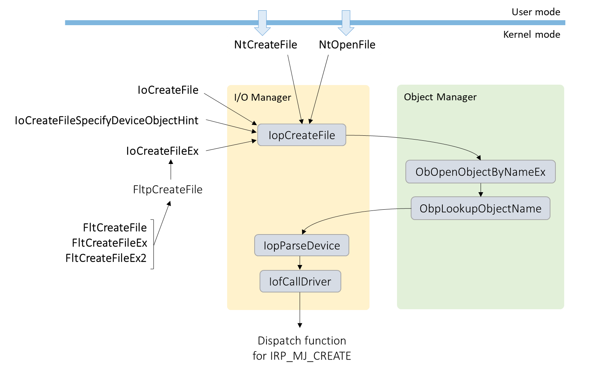
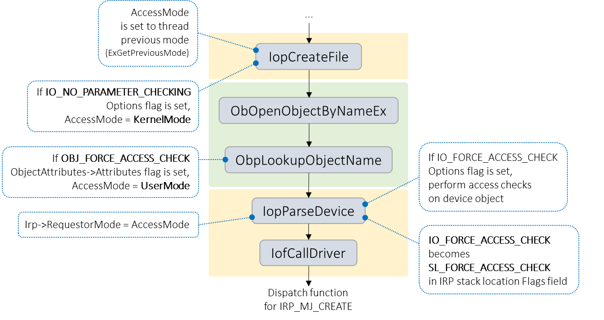
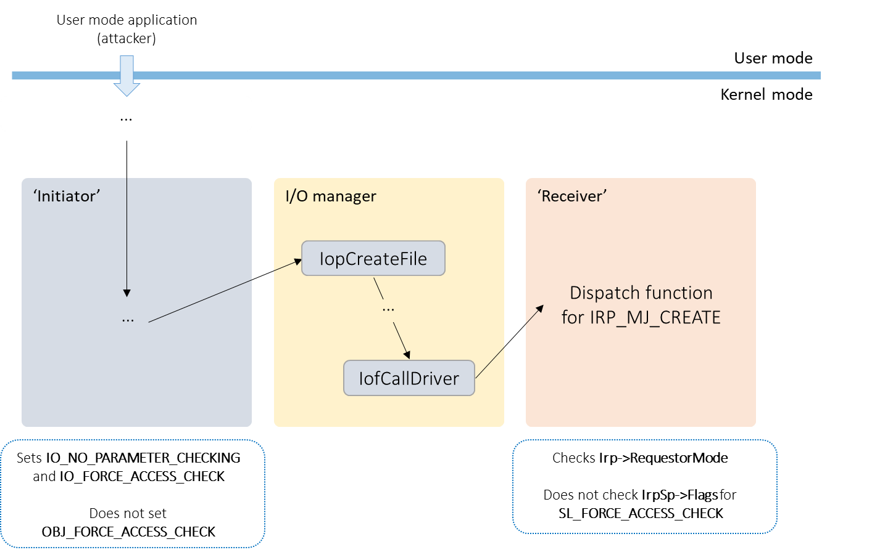

The Microsoft Security Response Center (MSRC) investigates all reports of security vulnerabilities affecting Microsoft products and services to help make our customers and the global online community more secure. We appreciate the excellent vulnerability research reported to us regularly from the security community, and we consider it a privilege to work with these researchers.

One researcher who consistently reports high-quality, interesting vulnerabilities to us is James Forshaw of Google Project Zero. Most of James’ work focuses on complex logic bugs in Windows internals, particularly in the area of privilege escalation and sandbox escapes.

This blog post covers a collaboration between James and the MSRC team on a novel bug class he discovered in the Windows kernel and some of its drivers, how Microsoft’s engineering teams fixed these bugs, and how third-party driver developers can avoid introducing similar bugs.

<!-- more -->

### Background

In Windows, when a system call is made from a user mode thread, the system call handler records this in the thread object by setting its PreviousMode field to UserMode. If instead the system call is made from kernel mode using a Zw-prefixed function, or from a system thread, the PreviousMode of the thread will be set to KernelMode. This method of distinguishing between user mode and kernel mode callers is used to help determine if the arguments of the call are from a trusted or untrusted source, and therefore to what extent they need to be validated by the kernel.

When a user mode application creates or opens a file, this causes a system call to be made to NtCreateFile or NtOpenFile. Kernel mode code has an broader set of API functions to choose from: NtCreateFile/NtOpenFile and their Zw-prefixed equivalents, the IoCreateFile\* functions from the I/O Manager, and the FltCreateFile\* functions from the Filter Manager.

As illustrated in the diagram above, all of these end up at the I/O Manager internal function IopCreateFile. The thread’s PreviousMode is assigned to a variable AccessMode, which in IopCreateFile is used to decide whether or not to check for valid parameters and buffers, before being passed to the Object Manager in a call to ObOpenObjectByNameEx. Later, in IopParseDevice, the AccessMode is used in access checking – if it is UserMode, then a privilege check is performed on the device object. Next, IopParseDevice constructs an I/O Request Packet (IRP), sets its RequestorMode field to the AccessMode, and uses IofCallDriver to pass control to the IRP_MJ_CREATE dispatch function of the device.

IopCreateFile has an Options parameter which is not exposed to callers of NtCreateFile and NtOpenFile, but is to the API functions only reachable from kernel mode. If the IO_NO_PARAMETER_CHECKING flag is set, it overrides the AccessMode so that it’s set to KernelMode rather than the thread’s previous mode, and thus bypasses parameter validation. This also causes the privilege checks later on in IopParseDevice to be waived.

Note that IoCreateFileEx always sets the IO_NO_PARAMETER_CHECKING flag. As FltCreateFile, FltCreateFileEx and FltCreateFile2 call into the I/O Manager via this function, these in turn also always have IO_NO_PARAMETER_CHECKING set.

However, sometimes it is essential to override this behaviour, and force the access checks to occur. For example, a kernel mode driver which (perhaps via an IOCTL) opens an object name specified by a user mode application.

If the Options parameter of IopCreateFile has the IO_FORCE_ACCESS_CHECK flag set, this has two effects: firstly, it causes the I/O Manager, in IopParseDevice, to perform the access checks as if the AccessMode was UserMode (but without setting it to UserMode). Secondly, in the IRP’s stack location for IRP_MJ_CREATE, it causes the SL_FORCE_ACCESS_CHECK to be set in the Flags field. Handlers of IRP_MJ_CREATE requests are expected to use this flag in their own access checks, to override the IRP’s RequestorMode.

During the development of Windows XP, it became apparent that other API functions operating in the object namespace (e.g. ZwOpenKey for \\Registry) needed some method of forcing an access check, so a new flag OBJ_FORCE_ACCESS_CHECK was introduced. This is set on the attributes of the object being requested and causes the Object Manager (rather than the I/O Manager) to set the requestor’s access mode to UserMode. This takes precedence over any access mode set already – in particular, it will override the effect of IO_NO_PARAMETER_CHECKING in setting KernelMode, back in IopCreateFile.

To summarise the above:

- in deciding whether to perform an access check, an IRP_MJ_CREATE handler must not only check if the IRP’s RequestorMode is UserMode or not, but also check if the SL_FORCE_ACCESS_CHECK flag is set

-

-

- a kernel mode caller to the IoCreateFile\* or FltCreateFile\* API functions has two possible methods of specifying that an access check should be performed:

  - via the I/O Manager, by setting the IO_FORCE_ACCESS_CHECK Options flag, which in turn sets the SL_FORCE_ACCESS_CHECK flag in the IRP stack location Flags
  - via the Object Manager, by setting the OBJ_FORCE_ACCESS_CHECK OptionAttributes->Attributes flag, which causes the IRP’s RequestorMode to be set to UserMode

### Vulnerability

In his research, James found that there were various kernel mode drivers shipped with Windows that, when handling IRP_MJ_CREATE requests, check the IRP’s RequestorMode, but do not check for SL_FORCE_ACCESS_CHECK. Furthermore, these are potentially exploitable via kernel mode code that, on the face of it, appears to be doing the correct thing in setting IO_FORCE_ACCESS_CHECK when creating or opening a file. An attacker obtaining sufficient control of the arguments of a file create/open call, via some request originating from user mode, could use this to send an IRP_MJ_CREATE request where the RequestorMode is KernelMode. If the RequestorMode check is used in a security decision, this may lead to a local privilege escalation vulnerability.

Further details, including how James discovered this vulnerability class and examples of where such code occurs in the Windows kernel and drivers, can be found in his [post on the Google Project Zero blog](https://googleprojectzero.blogspot.com/2019/03/windows-kernel-logic-bug-class-access.html).

James specified two kernel mode code patterns – the ‘initiator’, which makes a file create/open call, and the ‘receiver’, which handles IRP_MJ_CREATE requests. These are defined as follows:

1. The ‘initiator’ consists of:

   - A call to a file open API function (IoCreateFile\* or FltCreateFile\*) where:

     - the IO_NO_PARAMETER_CHECKING flag in Options is set (or alternatively, where the call is being made from a system thread)
     - - this will set the IRP’s RequestorMode to KernelMode
       - for IoCreateFileEx and FltCreateFile\*, IO_NO_PARAMETER_CHECKING is set implicitly
     - the IO_FORCE_ACCESS_CHECK flag is set in Options, indicating that an access check is intended
     - the OBJ_FORCE_ACCESS_CHECK attribute in ObjectAttributes is not set
     - - if this were set, it would override the IRP’s RequestorMode, setting it to UserMode
     - an attacker has some measure of control over this call

2) The ‘receiver’ consists of:

   - A handler for an IRP_MJ_CREATE request where:
   - - the IRP’s RequestorMode is used to make a security decision
     - in doing this, the Flags from its location in the IRP’s stack are not tested for SL_FORCE_ACCESS_CHECK

An attacker would need to be able to direct the initiator to open a device object that is handled by the receiver. The security check in the receiver is bypassed because the Irp->RequestorMode will be KernelMode, but the SL_FORCE_ACCESS_CHECK flag is not examined.

In his investigations, James had found instances of both initiators and receivers, but none that when chained together would directly lead to privilege escalation. We opted to partner with him on further research and see what we could find together.

### Variant finding

For first-party drivers shipped with Windows (drivers written by Microsoft) and the Windows kernel itself, we used Semmle QL (previously discussed on this blog [here](https://blogs.technet.microsoft.com/srd/2018/08/16/vulnerability-hunting-with-semmle-ql-part-1/)) to search the source code for the vulnerability code patterns described above.

To find initiator code patterns, we used a custom data flow analysis to track combinations of flags to Options and ObjectAttributes->Attributes when passed to the internal function IopCreateFile. As mentioned above, this is the point at which the various file open API functions eventually reach. This result set was filtered to show only the calls where IO_FORCE_ACCESS_CHECK and IO_NO_PARAMETER_CHECKING were set, but OBJ_FORCE_ACCESS_CHECK was not. We rejected initiators which offered no control to an attacker of the object name.

To discover receiver code patterns, we examined controlling expressions (that is, expressions used in control flow statements such as if and switch) that were influenced by the RequestorMode field of an IRP object, and were reachable from either an IRP_MJ_CREATE dispatch or filter function. These were filtered to exclude expressions that involved both the SL_FORCE_ACCESS_CHECK macro and some access to the Flags field of an IO_STACK_LOCATION object. A small number of RequestorMode checks were rejected in manual follow-up as having no security impact (for example, where they were being used to exclude kernel mode callers, rather than permit them).

This initial analysis found a total of 11 potential initiators and 16 potential receivers in the Windows source code, including those James had reported to us.

Windows also ships with many “inbox drivers” – third-party drivers that are critical for booting certain devices or that enable a fully functional install out of the box. We filtered on the import table of each driver binary to obtain a subset for further analysis. For the initiators these were imports of IoCreateFile\* or FltCreateFile\*, and for receivers this was IoCreateDevice or FltRegisterFilter, as we were only interested in code that is reachable via a device object or its filters. This remaining set of driver binaries were examined using IDA Pro. This analysis found no additional initiators or receivers.

Exploiting these potential vulnerabilities requires compatible initiators and receivers. In particular, the initiator must offer sufficient control to an attacker of the eventual IopCreateFile call, so that they can exploit the receiver.

We found that the receivers fell into two categories:

- requiring specific extended attributes to be supplied, either to reach a RequestorMode check, or to do something useful after bypassing it in terms of exploitation
-

* requiring the file handle to be passed back to the attacker to reach code in its other IRP dispatch functions that may be exploitable

Fortunately, none of the initiators detected in our analysis gave an attacker sufficient capability to do either of these.

In the next step of our analysis, we performed a broader search encompassing all calls to kernel mode file create/open APIs, including calls to ZwCreateFile and ZwOpenFile, and calls to IoCreateFile\* and FltCreateFile\* where IO_NO_PARAMETER_CHECKING is set (irrespective of whether or not IO_FORCE_ACCESS_CHECK was set). After excluding all calls where OBJ_FORCE_ACCESS_CHECK was set, there were still hundreds of results in kernel and driver code, so we filtered these down by focusing on the two receiver categories.

Firstly, we filtered for calls where the EaBuffer parameter was non-NULL, to show places where extended attributes could be passed in. Secondly, we filtered for calls where OBJ_KERNEL_HANDLE was not set, to see where it may be possible for a usable object handle to be passed back to user mode. This brought the results down to a manageable number for manual analysis. However, we did not find any code that could be used as a compatible initiator within this result set.

### Defence in depth security measures

To summarize James’ and MSRC’s combined investigations, there appeared to be no combination of initiator and receiver present in currently supported versions of Windows that could be used for local privilege escalation out of the box.

Nevertheless, we chose to address these in future versions of Windows as a defence-in-depth measure. Most of these fixes are on track for release in Windows 10 19H1, with a few held back for further compatibility testing and/or because the component they exist in is deprecated and disabled by default.

We did consider a broad fix to prevent instances of an initiator from occurring, in making an API change so that if IO_FORCE_ACCESS_CHECK is set in Options, the IRP’s RequestorMode is automatically set to UserMode, as if the OBJ_FORCE_ACCESS_CHECK attribute was set. However, the compatibility risk of breaking functionality of third-party drivers that may rely on the existing behaviour was deemed to be too high.

### Information for driver developers

There exists some risk of third-party drivers being susceptible to this vulnerability class, and we urge all kernel driver developers to review their code to ensure correct processing of IRP requests and defensive use of the file open APIs.

The recommended changes should be relatively simple.

In IRP_MJ_CREATE dispatch handlers, don’t rely on the value of the IRP’s RequestorMode without also checking for the SL_FORCE_ACCESS_CHECK flag. For example, instead of:

`if (Irp->RequestorMode != KernelMode) { // reject user mode requestors Status = STATUS_ACCESS_DENIED; }`

use something like this:

`PIO_STACK_LOCATION IrpSp = IoGetCurrentIrpStackLocation(Irp);

…

if ((Irp->RequestorMode != KernelMode) || (IrpSp->Flags & SL_FORCE_ACCESS_CHECK))
{
// reject user mode requestors
Status = STATUS_ACCESS_DENIED;
}
`

Secondly, where the IO_FORCE_ACCESS_CHECK flag is already set in Options, we strongly recommend also setting the OBJ_FORCE_ACCESS_CHECK flag in ObjectAttributes. For example:

`InitializeObjectAttributes(
&ObjectAttributes,
FileName,
(OBJ_CASE_INSENSITIVE | OBJ_FORCE_ACCESS_CHECK),
NULL,
NULL);

Status = IoCreateFileEx(
&ObjectHandle,
GENERIC_READ | SYNCHRONIZE,
&ObjectAttributes,
&IoStatusBlock,
NULL,
0,
0,
FILE_OPEN,
0,
NULL,
0,
CreateFileTypeNone,
NULL,
IO_FORCE_ACCESS_CHECK);
`

More generally, where a file create/open call may be made on behalf of a user-mode request, do not assume that the thread’s previous mode is UserMode or that this will be carried forward to the IRP’s requestor mode – set the OBJ_FORCE_ACCESS_CHECK flag in ObjectAttributes to make this explicit.

### Acknowledgements

We’d like to thank James Forshaw for partnering with us on this vulnerability investigation, and for the many other high-quality vulnerability reports he has shared with the MSRC.

Thanks also to Paul Brookes, Dileepa Kidambi Sudarsana, and Michelle Chen for their assistance in scaling the static analysis to the entire Windows codebase.

_Steven Hunter, MSRC Vulnerabilities & Mitigations team_
