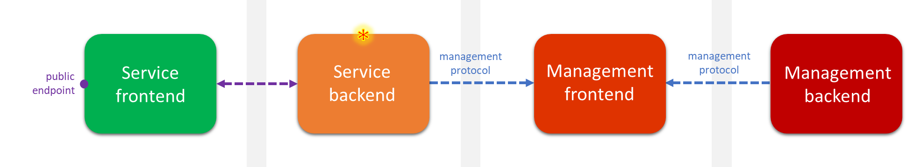
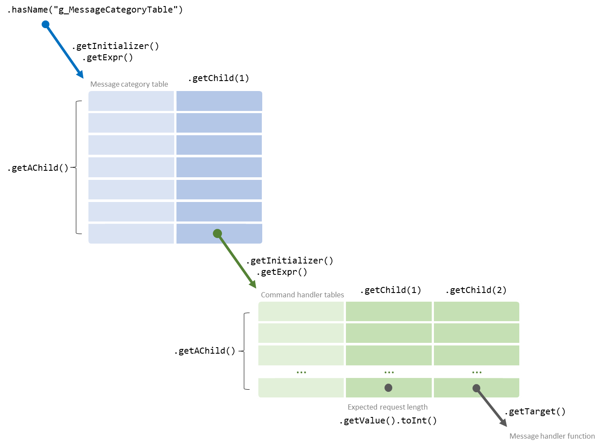
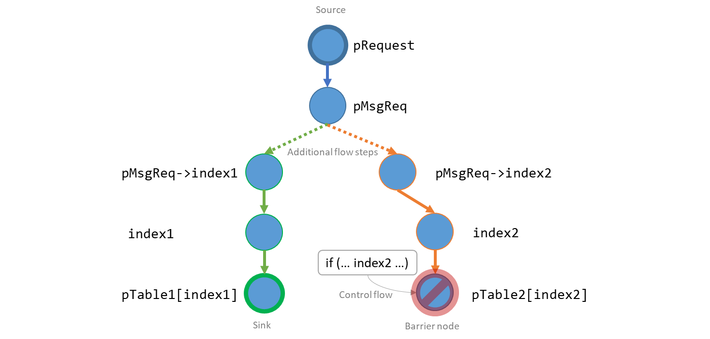

The [first part](https://blogs.technet.microsoft.com/srd/2018/08/16/vulnerability-hunting-with-semmle-ql-part-1/) of this series introduced [Semmle QL](https://github.com/Semmle/ql#semmle-ql), and how the Microsoft Security Response Center (MSRC) are using it to investigate variants of vulnerabilities reported to us. This post discusses an example of how we’ve been using it proactively, covering a security audit of an Azure firmware component.

This was part of a wider defense in depth security review of Azure services, exploring attack vectors from the point of view of a hypothetical adversary who has already penetrated at least one security boundary, and now sits in the operating environment of a service backend (marked with \* on the diagram below).

One of the targets of this review was a Linux-based embedded device that interfaces both with a service backend and a management backend, passing operational data between the two. The main attack surface of this device is a management protocol used on both interfaces.

An initial manual review of its firmware indicated that this management protocol is message-based, and there are over four hundred different message types, each with their own handler function. Manually auditing every single function would have been tedious and error-prone, so using Semmle to scale up our code review capabilities was an easy choice. We found 33 vulnerable message handler functions in total, using the static analysis techniques discussed in this post.

### Defining the attack surface

Our first step was to write some QL to model data that would be sourced from an attacker. The management protocol works on a request-response basis, where every message request type is identified with a category number and a command number. This is defined in the source code using arrays of structures such as this:

`MessageCategoryTable g_MessageCategoryTable[] =
{
{ CMD_CATEGORY_BASE, g_CommandHandlers_Base },
{ CMD_CATEGORY_APP0, g_CommandHandlers_App0 },
…
{ NULL, NULL }
};

CommandHandlerTable g_CommandHandlers_Base [] =
{
{ CMD_GET_COMPONENT_VER, sizeof(ComponentVerReq), GetComponentVer, … },
{ CMD_GET_GLOBAL_CONFIG, -1, GetGlobalConfig, … },
…
{ NULL, NULL, NULL, … }
};`

In the example above, a message with category type `CMD_CATEGORY_BASE` and command type `CMD_GET_COMPONENT_VER` would be routed to the `GetComponentVer` function. The command handler table also has information on the expected size of the request message, which is validated in the message dispatch routines prior to calling the handler function.

We defined the message handler table with the following QL:

`class CommandHandlerTable extends Variable { CommandHandlerTable() { exists(Variable v | v.hasName("g_MessageCategoryTable") andthis.getAnAccess() = v.getInitializer().getExpr().getAChild().getChild(1) ) } }`

This takes a variable named `g_MessageCategoryTable`, finds its initializing expression, and matches all children of this expression – each child expression corresponds to a row of the message category table. For each row, it takes the second column (this is `getChild(1)` because the parameter of the `getChild` predicate is zero-indexed), each of which are references to a command handler table, and matches on the variable referenced. In the example above, these would be `g_CommandHandlers_Base` and `g_CommandHandlers_App0`.

We defined the set of message handler functions using a similar approach:

`class`` MessageHandlerFunction extends Function {
Expr tableEntry;

MessageHandlerFunction() {
exists(CommandHandlerTable table |
tableEntry = table.getInitializer().getExpr().getAChild()
)
and this = tableEntry.getChild(2).(FunctionAccess).getTarget()
}

int getExpectedRequestLength() {
result = tableEntry.getChild(1).getValue().toInt()
}

…
}
`

This QL class uses a member variable tableEntry to hold the set of all rows in all command handler tables. This is so it can be referenced in both the characteristic predicate (`MessageHandlerFunction() { … }`) and `getExpectedRequestLength()`, without repeating the definition.

All of this maps to the code structure above as follows:

Each message handler function has the same signature:

`typedef unsigned char UINT8;

int ExampleMessageHandler(UINT8 *pRequest, int RequestLength, UINT8 *pResponse);`

And follows a general pattern where the request data is cast to a struct type representing the message layout, and accessed via its fields:

`int ExampleMessageHandler(UINT8 *pRequest, int RequestLength, UINT8 *pResponse)
{
ExampleMessageRequest* pMsgReq = (ExampleMessageRequest *)pRequest;

…

someFunction(pMsgReq->aaa.bbb)

…
}`

In this analysis, we were only interested in the request data. We defined two additional predicates in the `MessageHandlerFunction` QL class to model the request data and its length:

`class MessageHandlerFunction extends Function {
Expr tableEntry;

…

Parameter getRequestDataPointer() {
result = this.getParameter(0)
}

Parameter getRequestLength() {
result = this.getParameter(1)
}
}`

Having abstracted away the definition of a message handler function, it can be used as we would any other QL class. For example, this query lists all message handler functions in descending order of their [cyclomatic complexity](https://en.wikipedia.org/wiki/Cyclomatic_complexity):

`from MessageHandlerFunction mhf select mhf, mhf.getADeclarationEntry().getCyclomaticComplexity() as cc order by cc desc`

### Analyzing data flow

Now that we’d defined a set of entry points for untrusted data, the next step was to find where it may be used in an unsafe manner. To do this, we needed to follow the flow of such data through the codebase. QL provides a powerful global data flow library which abstracts away most of the tricky language-specific detail involved in this.

The `DataFlow` library is brought into the scope of the query with:

`import semmle.code.cpp.dataflow.DataFlow`

It is used by subclassing `DataFlow::Configuration` and overriding its predicates to define the data flow as it applies to `DataFlow::Node`, a QL class representing any program artefact that data can flow through:

| Configuration predicate              | Description                                    |
| ------------------------------------ | ---------------------------------------------- |
| `isSource(source)`                   | data must flow from _source_                   |
| `isSink(sink)`                       | data must flow to _sink_                       |
| `isAdditionalFlowStep(node1, node2)` | data can also flow between _node1_ and _node2_ |
| `isBarrier(node)`                    | data can not flow through _node_               |

Most data flow queries will look something like this:

`class RequestDataFlowConfiguration extends DataFlow::Configuration {
RequestDataFlowConfiguration() { this = "RequestDataFlowConfiguration" }

overridepredicate isSource(DataFlow::Node source) {
…
}

overridepredicate isSink(DataFlow::Node sink) {
…
}

overridepredicate isAdditionalFlowStep(DataFlow::Node node1, DataFlow::Node node2) {
…
}

overridepredicate isBarrier(DataFlow::Node node) {
…
}

}

from DataFlow::Node source, DataFlow::Node sink
whereany(RequestDataFlowConfiguration c).hasFlow(source, sink)
select
"Data flow from $@ to $@",
source, sink`

Note that the QL data flow library performs an interprocedural analysis – in addition to examining data flows local to a function, it will include data flowing through function call arguments. This was an essential feature for our security review, as although the vulnerable code patterns discussed below are shown in simple example functions for ease of demonstration, in the actual source code for our target, most of the results had data flows spanning multiple complex functions.

### Finding memory safety vulnerabilities

As this firmware component was a pure C codebase, we first decided to search for code patterns relating to memory safety.

One common source of such bugs is array indexing without performing a bounds check. Searching for this pattern in isolation would provide a large proportion of results that are most likely not security vulnerabilities, as what we are really interested in is where the attacker has some control over the index value. So in this case, we are looking for data flows where the sink is an array indexing expression, the source is the request data of a message handler function, and there is a barrier on any data flow node guarded by a relevant bounds check.

For example, we want to find data flows matching code like this:

`int ExampleMessageHandler(UINT8 *pRequest(1:source), int RequestLength, UINT8 *pResponse)
{
ExampleMessageRequest* pMsgReq(3) = (ExampleMessageRequest *) pRequest(2);
int index1(6) = pMsgReq(4)->index1(5);

pTable1[index1(7:sink)].field1 = pMsgReq->value1;
}`

But we also want to exclude data flows for code like this:

`int ExampleMessageHandler(UINT8 *pRequest(1:source), int RequestLength, UINT8 *pResponse)
{
ExampleMessageRequest* pMsgReq(3) = (ExampleMessageRequest *) pRequest(2);
int index2(6) = pMsgReq(4)->index2(5);

if (index2 >= 0 && index2 < PTABLE_SIZE)
{
pTable2[index2].field1 = pMsgReq->value2;
}
}`

The source is defined using the `MessageHandlerFunction` class discussed earlier, and we can use the `getArrayOffset` predicate of an `ArrayExpr` to define a suitable sink:

`overridepredicate isSource(DataFlow::Node source) {
any(MessageHandlerFunction mhf).getRequestDataPointer() = source.asParameter()
}

overridepredicate isSink(DataFlow::Node sink) {
exists(ArrayExpr ae | ae.getArrayOffset() = sink.asExpr())
}
`

By default, the `DataFlow` library only includes flows that preserve the value at each node, such as function call parameters, assignment expressions, and the like. But we also need data to flow from the request data pointer to the fields of the structure it was cast to. We’ll do that like this:

`overridepredicate isAdditionalFlowStep(DataFlow::Node node1, DataFlow::Node node2) { // any terminal field access on request packet // e.g. in expression a->b.c the data flows from a to c exists(Expr e, FieldAccess fa | node1.asExpr() = e and node2.asExpr() = fa | fa.getQualifier*() = e andnot (fa.getParent() instanceof FieldAccess) ) }`

To exclude flows with a bounds check, we place a barrier on any node with a variable or field that is used in some conditional statement earlier on in the control flow graph (for now, we make the assumption that any such bounds check is done correctly):

`overridepredicate isBarrier(DataFlow::Node node) { exists(ConditionalStmt condstmt | // dataflow node variable is used in expression of conditional statement // this includes fields (because FieldAccess extends VariableAccess) node.asExpr().(VariableAccess).getTarget().getAnAccess() = condstmt.getControllingExpr().getAChild*() // and that statement precedes the dataflow node in the control flow graph and condstmt.getASuccessor+() = node.asExpr() // and the dataflow node itself not part of the conditional statement expression andnot (node.asExpr() = cs.getControllingExpr().getAChild*()) ) }`

Applying this to the two examples above, the data flow through each node would be:

In our firmware codebase, this query located a total of 18 vulnerabilities across 15 message handler function, a mix of attacker-controlled out of bounds reads and writes.

We applied a similar analysis to find where arguments of function calls were taken from the message request data without first being validated. Firstly, we defined a QL class to define the function calls and arguments of interest, including the `size` argument of calls to `memcpy` and a similar function `_fmemcpy`, and the `length` argument of `CalculateChecksum`. `CalculateChecksum` is a function specific to this codebase that would return the CRC32 of a buffer, and could be potentially be used as an information disclosure primitive where the message handler function copied this value into its response buffer.

`class ArgumentMustBeCheckedFunctionCall extends FunctionCall {
int argToCheck;

ArgumentMustBeCheckedFunctionCall() {
( this.getTarget().hasName("memcpy") and argToCheck = 2 ) or
( this.getTarget().hasName("\_fmemcpy") and argToCheck = 2 ) or
( this.getTarget().hasName("CalculateChecksum") and argToCheck = 1 )
}

Expr getArgumentToCheck() { result = this.getArgument(argToCheck) }
}`

Next, we modified the sink of the previous query to match on `ArgumentMustBeCheckedFunctionCall` instead of an array index:

`overridepredicate isSink(DataFlow::Node sink) { // sink node is an argument to a function call that must be checked first exists (ArgumentMustBeCheckedFunctionCall fc | fc.getArgumentToCheck() = sink.asExpr()) }`

This query revealed a further 17 vulnerabilities in 13 message handlers, mostly attacker-controlled out of bounds reads (for which we later confirmed was disclosed in a response message), with one out of bounds write.

### Taint tracking

In the above queries, we overrode the `DataFlow` library’s `isAdditionalFlowStep` predicate to ensure that where data flowed to a pointer to a structure, the fields of that structure would be added as nodes in the data flow graph. We did this because by default, the data flow analysis only includes paths where the value of the data remains unmodified, but we wanted to keep track of a particular set of expressions that it may have affected too. That is, we defined a particular set of expressions that were tainted by untrusted data.

QL contains a built-in library to apply a more general approach to taint tracking. Developed on top of the `DataFlow` library, it overrides `isAdditionalFlowStep` with a much richer set of rules for value-modifying expressions. This is the `TaintTracking` library, and it is imported in a similar manner to `DataFlow`:

`import semmle.code.cpp.dataflow.TaintTracking`

It is used in almost the same way as the data flow library, except that the QL class to extend is `TaintTracking::Configuration`, with these configuration predicates:

| Configuration predicate               | Description                             |
| ------------------------------------- | --------------------------------------- |
| `isSource(source)`                    | data must flow from _source_            |
| `isSink(sink)`                        | data must flow to _sink_                |
| `isAdditionalTaintStep(node1, node2)` | data at _node1_ will also taint _node2_ |
| `isSanitizer(node)`                   | data can not flow through _node_        |

We re-ran the earlier queries with `isAdditionalFlowStep` removed (as we no longer need to define it) and `isBarrier` renamed to `isSanitizer`. As expected, it returned all the results mentioned above, but also uncovered some additional integer underflow flaws in array indexing. For example:

`int ExampleMessageHandler(UINT8 *pRequest(1:source), int RequestLength, UINT8 *pResponse)
{
ExampleMessageRequest* pMsgReq(3) = (ExampleMessageRequest *) pRequest(2);
int index1(6) = pMsgReq(4)->index1(5);

pTable1[(index1(7) - 2)(8:sink)].field1 = pMsgReq->value1;
}`

For our internal reporting of each vulnerability type, we were interested in classifying these separately from the earlier query results. This involved a simple modification to the sink, using the `SubExpr` QL class:

`overridepredicate isSink(DataFlow::Node sink) { // this sink is the left operand of a subtraction expression, // which is part of an array offset expression, e.g. x in a[x - 1] exists(ArrayExpr ae, SubExpr s | sink.asExpr() instanceof FieldAccess and ae.getArrayOffset().getAChild*() = s and s.getLeftOperand().getAChild*() = sink.asExpr()) }`

This gave us an additional 3 vulnerabilities in 2 message handler functions.

### Finding path traversal vulnerabilities

With the intent of finding potential path traversal vulnerabilities, we used QL to attempt to identify message handler functions which used an attacker-controlled filename in a file open function.

We used a slightly different approach to taint tracking this time, defining some additional taint steps that would flow through various string-processing C library functions:

`predicate isTaintedString(Expr expSrc, Expr expDest) {
exists(FunctionCall fc, Function f |
expSrc = fc.getArgument(1) and
expDest = fc.getArgument(0) and
f = fc.getTarget() and (
f.hasName("memcpy") or
f.hasName("\_fmemcpy") or
f.hasName("memmove") or
f.hasName("strcpy") or
f.hasName("strncpy") or
f.hasName("strcat") or
f.hasName("strncat")
)
)
orexists(FunctionCall fc, Function f, int n |
expSrc = fc.getArgument(n) and
expDest = fc.getArgument(0) and
f = fc.getTarget() and (
(f.hasName("sprintf") and n >= 1) or
(f.hasName("snprintf") and n >= 2)
)
)
}

…

overridepredicate isAdditionalTaintStep(DataFlow::Node node1, DataFlow::Node node2) {
isTaintedString(node1.asExpr(), node2.asExpr())
}`

And defined the sink as the path argument to a file open function:

`class FileOpenFunction extends Function {
FileOpenFunction() {
this.hasName("fopen") orthis.hasName("open")
}

int getPathParameter() { result = 0 } // filename parameter index
}

…

overridepredicate isSink(DataFlow::Node sink) {
exists(FunctionCall fc, FileOpenFunction fof |
fc.getTarget() = fof and fc.getArgument(fof.getPathParameter()) = sink.asExpr())
}`

With some foreknowledge of how our target device worked, observed from an initial review, we expected at least some results before we tackled the next problem of excluding flows where the data was validated, as with the earlier queries. However, the query returned nothing at all.

With no data flow paths to examine, we fell back on querying the function call graph to search for any path between the message handler functions and a call to a file open function, excluding calls where the path argument was a constant:

`// this recursive predicate defines a function call graph
predicate mayCallFunction(Function caller, FunctionCall fc) {
fc.getEnclosingFunction() = caller or mayCallFunction(fc.getTarget(), fc)
}

from MessageHandlerFunction mhf, FunctionCall fc, FileOpenFunction fof
where mayCallFunction(mhf, fc)
and fc.getTarget() = fof
andnot fc.getArgument(fof.getPathParameter()).isConstant()
select
mhf, "$@ may have a path to $@",
mhf, mhf.toString(),
fc, fc.toString()`

This query provided 5 results – sufficiently few to examine manually – and from this we uncovered 2 path traversal vulnerabilities, one in writing to a file and one in reading from a file, both with an attacker-supplied path. It turned out that the taint tracking didn’t flag these because it required two separate message types to be sent: the first to set the filename, and the second to read or write data to the file with that name. Fortunately, QL was flexible enough to permit an alternative route of exploration.

### Conclusions

At Microsoft, we take a defense in depth approach to securing the cloud and keeping our customers’ data safe. An important part of this is performing comprehensive security reviews of Azure internal attack surfaces. In this source code review of an embedded device, we applied the advanced static analysis techniques of Semmle QL to finding vulnerabilities in a message-based management protocol. This uncovered a total of 33 vulnerable message handlers, within a variety of bug classes. Using QL enabled us to automate the repetitive parts of what would otherwise be an entirely manual code review, while still applying an explorative approach.

_Steven Hunter and Christopher Ertl, MSRC Vulnerabilities & Mitigations team_
