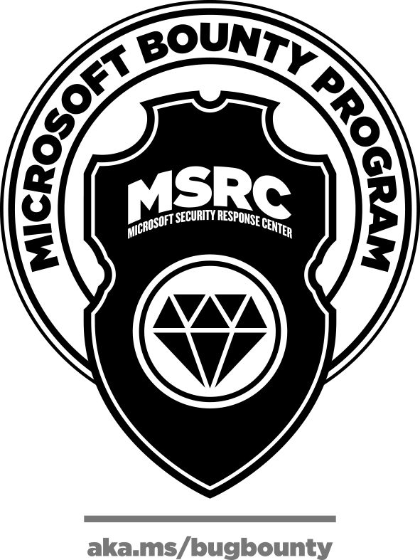

In 2018 The Microsoft Bounty Program awarded over \$2,000,000 to encourage and reward external security research in key technologies to protect our customers. Building on that success, we are excited to announce a number of improvements in our bounty programs to better serve the security research community.

**Faster bounty review** – As of January 2019, the [Cloud](https://www.microsoft.com/en-us/msrc/bounty-microsoft-cloud?rtc=1), [Windows](https://www.microsoft.com/en-us/msrc/bounty-windows-insider-preview?rtc=1), and [Azure DevOps](https://www.microsoft.com/en-us/msrc/bounty-azure-devops) programs now award bounties upon completion of reproduction and assessment of each submission, rather than waiting until the final fix has been determined. Shortening the time from submission to award determination is just one way we will get bounty rewards to researchers faster. \*\*\*\*

**Faster bounty payments, with more payment options** – Once a vulnerability submission has successfully qualified for bounty award, we want to ensure payments happen quickly. Microsoft is partnering with [HackerOne](https://www.hackerone.com/) for bounty [payment processing](https://docs.hackerone.com/hackers/payments.html) and support to deliver bounty awards efficiently and with more options like PayPal, crypto currency, or direct bank transfer in more than 30 currencies. HackerOne also supports award splitting and charity donations. Additionally, Microsoft bounty awards processed through HackerOne will contribute to your overall reputation score on the HackerOne platform. To find out more about our new partnership with HackerOne, check out our [FAQ](https://www.microsoft.com/en-us/msrc/faqs-bounty?rtc=1) page.

Vulnerability reports should still be sent to the Microsoft Security Response Center directly at secure@microsoft.com. Do not send reports of vulnerabilities in Microsoft products and services to HackerOne. As we accelerate our bounty assessments and rewards, we ask that researchers continue to work with us to protect customers and follow [Coordinated Vulnerability Disclosure](https://www.microsoft.com/en-us/msrc/cvd) guidelines.

**Increasing awards and scope** – Microsoft is rewarding more for vulnerability reports in multiple bounty programs; in January 2019 we raised top award levels from $15K to $50K for the [Windows Insider Preview](https://www.microsoft.com/en-us/msrc/bounty-windows-insider-preview?rtc=1) bounty and from $15K to $20K for the [Microsoft Cloud Bounty](https://www.microsoft.com/en-us/msrc/bounty-microsoft-cloud?rtc=1) program which includes Azure, O365, and other online services. We’ve also expanded the scope of the Cloud bounty and will continue to expand scope and rewards across our programs throughout the year. Check back regularly for new research areas and [follow us on Twitter](https://twitter.com/msftsecresponse) for bounty program announcements.

**New \*\***p\***\*olicy \*\***for\*\* **d\*\***uplicates\*\* – Historically, external reports of internally known vulnerabilities were rewarded 10% of the eligible bounty award as the report did not inform us of a new and previously unknown issue. But understanding what external researchers are capable of discovering is valuable insight, and we want to reward researchers for their contributions whenever we can. Therefore, we have updated our policy on duplicate submissions. The first researcher to report a bounty-eligible vulnerability will receive the full eligible bounty award, even if it is internally known. There is no change to our policy regarding duplicate external reports of the same vulnerability.

Microsoft is committed to enhancing our Bounty Programs and strengthening our partnership with the security research community, and I look forward to sharing more updates and improvements in the coming months. As always, if you ever have any questions or concerns about the process, you can reach us at msrclistens@microsoft.com.

Happy Hacking! Jarek Stanley, [@JarekMSFT ](https://twitter.com/JarekMsft?lang=en)Senior Program Manager MSRC

_All Microsoft Bug Bounty Programs are subject to the terms and conditions outlined _[_here_](https://www.microsoft.com/en-us/msrc/bounty-terms?rtc=1)_._

_The Microsoft Security Response Center is part of the defender community and on the front line of security response evolution. For more than twenty years, we have been engaged with security researchers working to protect customers and the global online community. For more information, please visit our website at _[_www.microsoft.com/msrc_](http://www.microsoft.com/msrc)_ and follow our Twitter page at _[@msftsecresponse*.*](https://twitter.com/msftsecresponse)
