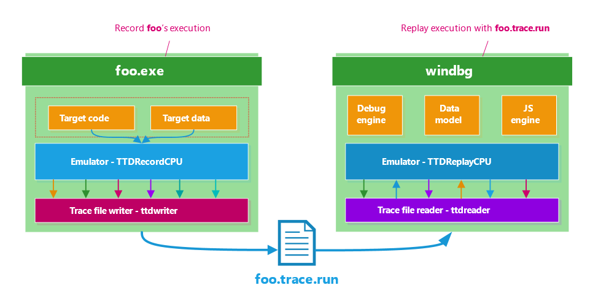
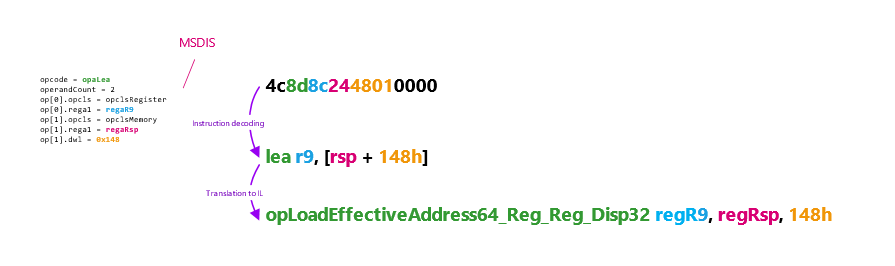
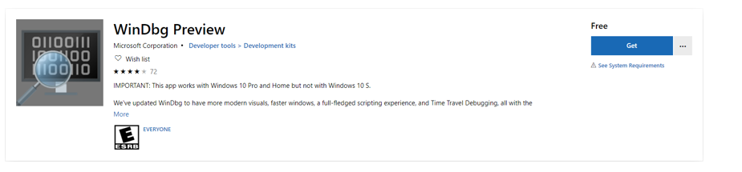
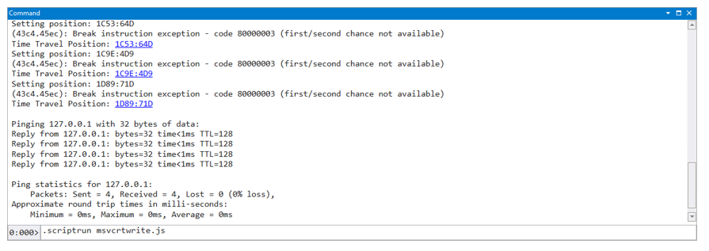
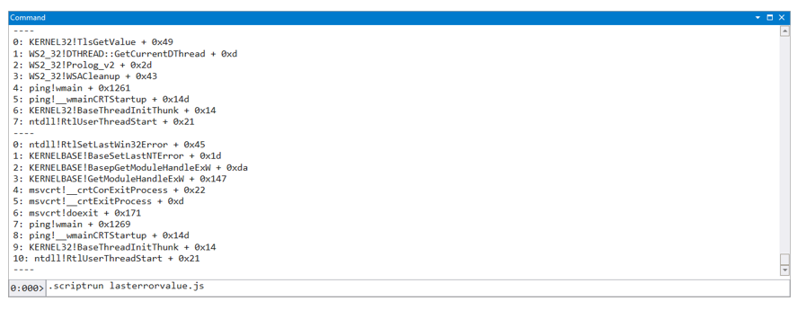

The Microsoft Security Response Center (MSRC) works to assess vulnerabilities that are externally reported to us as quickly as possible, but time can be lost if we have to confirm details of the repro steps or environment with the researcher to reproduce the vulnerability. Microsoft has made our “Time Travel Debugging” (TTD) tool [publicly available](https://docs.microsoft.com/en-us/windows-hardware/drivers/debugger/time-travel-debugging-overview) to make it easy for security researchers to provide full repro, shortening investigations and potentially contributing to higher bounties (see “[Report quality definitions for Microsoft’s Bug Bounty programs](https://www.microsoft.com/en-us/msrc/bounty-example-report-submission)”). We use it internally, too—it has allowed us to find root cause for complex software issues in half the time it would take with a regular debugger.

If you’re wondering where you can get the TTD tool and how to use it, this blogpost is for you.

## Understanding time travel debugging

Whether you call it “Timeless debugging”, “record-replay debugging”, “reverse-debugging”, or “time travel debugging”, it’s the same idea: the ability to record the execution of a program. Once you have this recording, you can navigate forward or backward, and you can share with colleagues. Even better, an execution trace is a deterministic recording; everybody looking at it sees **the same behavior** at the same time. When a developer receives a TTD trace, they do not even need to reproduce the issue to travel in the execution trace, they can just navigate through the trace file.

There are usually three key components associated to time travel debugging:

1. A recorder that you can picture as a video camera,
2. A trace file that you can picture as the recording file generated by the camera,
3. A replayer that you can picture as a movie player.

### Good ol’ debuggers

Debuggers aren’t new, and the process of debugging an issue has not drastically changed for decades. The process typically works like this:

1. **Observing the behavior under a debugger**. In this step, you recreate an environment like that of the finder of the bug. It can be as easy as running a simple proof-of-concept program on your machine and observing a bug-check, or it can be as complex as setting up an entire infrastructure with specific software configurations just to be able to exercise the code at fault. And that’s if the bug report is accurate and detailed enough to properly set up the environment.
2. **Understanding why the issue happened**. This is where the debugger comes in. What you expect of a debugger regardless of architectures and platforms is to be able to precisely control the execution of your target (stepping-over, stepping-in at various granularity level: instruction, source-code line), setting breakpoints, editing the memory as well as editing the processor context. This basic set of features enables you to get the job done. The cost is usually high though. A lot of reproducing the issue over and over, a lot of stepping-in and a lot of “Oops... I should not have stepped-over, let’s restart”. Wasteful and inefficient.

Whether you’re the researcher reporting a vulnerability or a member of the team confirming it, Time Travel Debugging can help the investigation to go quickly and with minimal back and forth to confirm details.

### High-level overview

The technology that Microsoft has developed is called “TTD” for time-travel debugging. Born out of Microsoft Research around 2006 (cf “[Framework for Instruction-level Tracing and Analysis of Program Executions](https://www.usenix.org/legacy/events/vee06/full_papers/p154-bhansali.pdf)”) it was later improved and productized by Microsoft’s debugging team. The project relies on code-emulation to record every event necessary that replay will need to reproduce the exact same execution. The exact same sequence of instructions with the exact same inputs and outputs. The data that the emulator tracks include memory reads, register values, thread creation, module loads, etc.

### Recording / Replaying

[](./img/wp-content-uploads-2019-05-xttd-img1.png)

The recording software CPU, _TTDRecordCPU.dll_, is injected into the target process and hijacks the control flow of the threads. The emulator decodes native instructions into an internal custom intermediate language (modeled after simple RISC instructions), caches block, and executes them. From now on, it carries the execution of those threads forward and dispatches callbacks whenever an event happens such as: , when an instruction has been translated, etc. Those callbacks allow the trace file writer component to collect information needed for the software CPU to replay the execution based off the trace file.

[](./img/wp-content-uploads-2019-05-xttd-img2.png)

The replay software CPU, _TTDReplayCPU.dll_ shares most of the same codebase than the record CPU, except that instead of reading the target memory it loads data directly from the trace file. This allows you to replay with full fidelity the execution of a program without needing to run the program.

### The trace file

The trace file is a regular file on your file system that ends with the ‘run’ extension. The file uses a custom file format and compression to optimize the file size. You can also view this file as a database filled with rich information. To access information that the debugger requires very fast, the “WinDbg Preview” creates an index file the first time you open a trace file. It usually takes a few minutes to create. Usually, this index is about one to two times as large as the original trace file. As an example, a tracing of the program ping.exe on my machine generates a trace file of 37MB and an index file of 41MB. There are about 1,973,647 instructions (about 132 bits per instruction). Note that, in this instance, the trace file is so small that the internal structures of the trace file accounts for most of the space overhead. A larger execution trace usually contains about 1 to 2 bits per instruction.

### Recording a trace with WinDbg Preview

Now that you’re familiar with the pieces of TTD, here’s how to use them.

**Get TTD:** TTD is currently available on Windows 10 through the “WinDbg Preview” app that you can find in the Microsoft store: <https://www.microsoft.com/en-us/p/windbg-preview/9pgjgd53tn86?activetab=pivot:overviewtab>.

[](./img/wp-content-uploads-2019-05-xttd-img3.png)

Once you install the application the “[Time Travel Debugging - Record a trace](https://docs.microsoft.com/en-us/windows-hardware/drivers/debugger/time-travel-debugging-record)” tutorial will walk you through recording your first execution trace.

## Building automations with TTD

A recent improvement to the Windows debugger is the addition of the debugger data model and the ability to interact with it via JavaScript (as well as C++). The details of the data model are out of scope for this blog, but you can think of it as a way to both consume and expose structured data to the user and debugger extensions. TTD extends the data model by introducing very powerful and unique features available under both the `@$cursession.TTD` and `@$curprocess.TTD` nodes.

[](./img/wp-content-uploads-2019-05-xttd-img4.png)

`TTD.Calls` is a function that allows you to answers questions like “Give me every position where `foo!bar` has been invoked” or “Is there a call to `foo!bar` that returned 10 in the trace”. Better yet, like every collection in the data-model, you can query them with LINQ operators. Here is what a `TTD.Calls` object look like:

```

0:000> dx @$cursession.TTD.Calls("msvcrt!write").First()
@$cursession.TTD.Calls("msvcrt!write").First()
    EventType        : Call
    ThreadId         : 0x194
    UniqueThreadId   : 0x2
    TimeStart        : 1310:A81 <u>[Time Travel]</u>
    TimeEnd          : 1345:14 <u>[Time Travel]</u>
    Function         : msvcrt!_write
    FunctionAddress  : 0x7ffec9bbfb50
    ReturnAddress    : 0x7ffec9be74a2
    ReturnValue      : 401
    Parameters
```

The API completely hides away ISA specific details, so you can build queries that are architecture independent.

### TTD.Calls: Reconstructing stdout

To demo how powerful and easy it is to leverage these features, we record the execution of “ping.exe 127.0.0.1” and from the recording rebuild the console output.

Building this in JavaScript is very easy:

1. Iterate over every call to `msvcrt!write` ordered by the time position,
2. Read several bytes (the amount is in the third argument) pointed by the second argument,
3. Display the accumulated results.

```

'use strict';
function initializeScript() {
    return [new host.apiVersionSupport(1, 3)];
}
function invokeScript() {
    const logln = p => host.diagnostics.debugLog(p + '\n');
    const CurrentSession = host.currentSession;
    const Memory = host.memory;
    const Bytes = [];
    for(const Call of CurrentSession.TTD.Calls('msvcrt!write').OrderBy(p => p.TimeStart)) {
        Call.TimeStart.SeekTo();
        const [_, Address, Count] = Call.Parameters;
        Bytes.push(...Memory.readMemoryValues(Address, Count, 1));
    }
    logln(Bytes.filter(p => p != 0).map(
        p => String.fromCharCode(p)
    ).join(''));
}
```

[](./img/wp-content-uploads-2019-05-xttd-img5.png)

### TTD.Memory: Finding every thread that touched the LastErrorValue

`TTD.Memory` is a powerful API that allows you to query the trace file for certain types (read, write, execute) of memory access over a range of memory. Every resulting object of a memory query looks like the sample below:

```

0:000> dx @$cursession.TTD.Memory(0x000007fffffde068, 0x000007fffffde070, "w").First()
@$cursession.TTD.Memory(0x000007fffffde068, 0x000007fffffde070, "w").First()
    EventType        : MemoryAccess
    ThreadId         : 0xb10
    UniqueThreadId   : 0x2
    TimeStart        : 215:27 [Time Travel]
    TimeEnd          : 215:27 [Time Travel]
    AccessType       : Write
    IP               : 0x76e6c8be
    Address          : 0x7fffffde068
    Size             : 0x4
    Value            : 0x0
```

This result identifies the type of memory access done, the time stamp for start and finish, the thread accessing the memory, the memory address accessed, where it has been accessed and what value has been read/written/executed.

To demonstrate its power, let’s create another script that collects the call-stack every time the application writes to the `LastErrorValue` in the current thread’s environment block:

1. Iterate over every memory write access to `&@$teb->LastErrorValue`,
2. Travel to the destination, dump the current call-stack,
3. Display the results.

```

'use strict';
function initializeScript() {
    return [new host.apiVersionSupport(1, 3)];
}
function invokeScript() {
    const logln = p => host.diagnostics.debugLog(p + '\n');
    const CurrentThread = host.currentThread;
    const CurrentSession = host.currentSession;
    const Teb = CurrentThread.Environment.EnvironmentBlock;
    const LastErrorValueOffset = Teb.targetType.fields.LastErrorValue.offset;
    const LastErrorValueAddress = Teb.address.add(LastErrorValueOffset);
    const Callstacks = new Set();
    for(const Access of CurrentSession.TTD.Memory(
        LastErrorValueAddress, LastErrorValueAddress.add(8), 'w'
    )) {
        Access.TimeStart.SeekTo();
        const Callstack = Array.from(CurrentThread.Stack.Frames);
        Callstacks.add(Callstack);
    }
    for(const Callstack of Callstacks) {
        for(const [Idx, Frame] of Callstack.entries()) {
            logln(Idx + ': ' + Frame);
        }
        logln('----');
    }
}
```

[](./img/wp-content-uploads-2019-05-xttd-img6.png)

Note that there are more TTD specific objects you can use to get information related to events that happened in a trace, the lifetime of threads, so on. All of those are documented on the “[Introduction to Time Travel Debugging objects](https://docs.microsoft.com/en-us/windows-hardware/drivers/debugger/time-travel-debugging-object-model)” page.

```

0:000> dx @$curprocess.TTD.Lifetime
@$curprocess.TTD.Lifetime                 : [F:0, 1F4B:0]
    MinPosition      : F:0 [Time Travel]
    MaxPosition      : 1F4B:0 [Time Travel]
0:000> dx @$curprocess.Threads.Select(p => p.TTD.Position)
@$curprocess.Threads.Select(p => p.TTD.Position)
    [0x194]          : 1E21:104 [Time Travel]
    [0x7e88]         : 717:1 [Time Travel]
    [0x5fa4]         : 723:1 [Time Travel]
    [0x176c]         : B58:1 [Time Travel]
    [0x76a0]         : 1938:1 [Time Travel]
```

## Wrapping up

Time Travel Debugging is a powerful tool for security software engineers and can also be beneficial for malware analysis, vulnerability hunting, and performance analysis. We hope you found this introduction to TTD useful and encourage you to use it to create execution traces for the security issues that you are finding. The trace files generated by TTD compress very well; we recommend to use [7zip](https://www.7-zip.org/7z.html) (usually shrinks the file to about 10% of the original size) before uploading it to your favorite file storage service.

Axel Souchet

Microsoft Security Response Center (MSRC)

## FAQ

### Can I edit memory during replay time?

No. As the recorder only saves what is needed to replay a **particular** execution path in your program, it doesn’t save enough information to be able to re-simulate a different execution.

### Why don’t I see the bytes when a file is read?

The recorder knows only what it has emulated. Which means that if another entity (the NT kernel here but it also could be another process writing into a shared memory section) writes data to memory, there is no way for the emulator to know about it. As a result, if the target program never reads those values back, they will never appear in the trace file. If they are read later, then their values will be available at that point when the emulator fetches the memory again. This is an area the team is planning on improving soon, so watch this space 😊.

### Do I need private symbols or source code?

You don’t need source code or private symbols to use TTD. The recorder consumes native code and doesn’t need anything extra to do its job. If private symbols and source codes are available, the debugger will consume them and provide the same experience as when debugging with source / symbols.

### Can I record kernel-mode execution?

TTD is for user-mode execution only.

### Does the recorder support self-modifying code?

Yes, it does!

### Are there any known incompatibilities?

There are some and you can read about them in “[Things to look out for](https://docs.microsoft.com/en-us/windows-hardware/drivers/debugger/time-travel-debugging-overview#things-to-look-out-for)”.

### Do I need WinDbg Preview to record traces?

Yes. As of today, the TTD recorder is shipping only as part of “[WinDbg Preview](https://www.microsoft.com/en-us/p/windbg-preview/9pgjgd53tn86#activetab=pivot:overviewtab)” which is only downloadable from the Microsoft Store.

## References

### Time travel debugging

1. Time Travel Debugging - Overview - <https://docs.microsoft.com/en-us/windows-hardware/drivers/debugger/time-travel-debugging-overview>
2. Time Travel Debugging: Root Causing Bugs in Commercial Scale Software -<https://www.youtube.com/watch?v=l1YJTg_A914>
3. Defrag Tools #185 - Time Travel Debugging – Introduction - <https://channel9.msdn.com/Shows/Defrag-Tools/Defrag-Tools-185-Time-Travel-Debugging-Introduction>
4. Defrag Tools #186 - Time Travel Debugging – Advanced - <https://channel9.msdn.com/Shows/Defrag-Tools/Defrag-Tools-186-Time-Travel-Debugging-Advanced>
5. Time Travel Debugging and Queries – <https://github.com/Microsoft/WinDbg-Samples/blob/master/TTDQueries/tutorial-instructions.md>
6. Framework for Instruction-level Tracing and Analysis of Program Executions - <https://www.usenix.org/legacy/events/vee06/full_papers/p154-bhansali.pdf>
7. VulnScan – Automated Triage and Root Cause Analysis of Memory Corruption Issues - <https://blogs.technet.microsoft.com/srd/2017/10/03/vulnscan-automated-triage-and-root-cause-analysis-of-memory-corruption-issues/>
8. What’s new in WinDbg Preview - <https://mybuild.techcommunity.microsoft.com/sessions/77266>

### Javascript / WinDbg / Data model

9. WinDbg Javascript examples - <https://github.com/Microsoft/WinDbg-Samples>
10. Introduction to Time Travel Debugging objects - <https://docs.microsoft.com/en-us/windows-hardware/drivers/debugger/time-travel-debugging-object-model>
11. WinDbg Preview - Data Model - <https://docs.microsoft.com/en-us/windows-hardware/drivers/debugger/windbg-data-model-preview>
