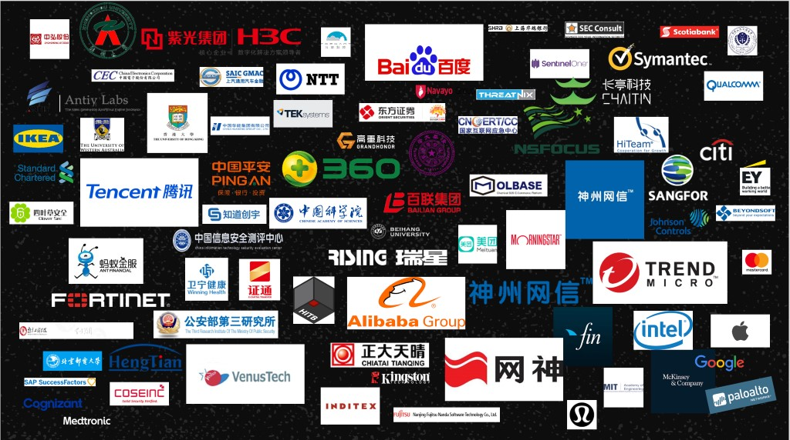

Earlier this week [BlueHat Shanghai](https://www.microsoft.com/china/bluehatshanghai/2019/#HOME) brought together security researchers and hundreds of cybersecurity professionals from China and across Asia to explore the latest topics in cybersecurity research. Including presentations from Qihoo 360, Baidu, Alibaba and the Chinese Academy of Sciences, BlueHat Shanghai highlighted incredibly talented Chinese researchers and focused on cutting edge topics including container and IoT security.

In the conference kick off, Eric Doerr (General Manager, MSRC) shared how researchers in China have helped protect Microsoft customers over the last year by reporting high impact vulnerabilities under [Coordinated Vulnerability Disclosure](https://www.microsoft.com/en-us/msrc/cvd). Many of these researchers qualified for bounty awards as well; Chinese researchers dominate the [Microsoft Edge bounty program](https://www.microsoft.com/en-us/msrc/bounty-edge?rtc=1), and report a substantial portion of submissions made to the [Windows Insider Preview bounty program](https://www.microsoft.com/en-us/msrc/bounty-windows-insider-preview?rtc=1).

Microsoft has long invested in security engineering and fortifying our products and services, while recognizing that partnerships with the worldwide research community plays an important role in securing Microsoft customers and the broader ecosystem. Expanding our BlueHat events to China is just one example of how we’re working to build and strengthen these partnerships and recognize the contributions of our community members. We’re also continuing to improve our security response and management operations to make it easier and more rewarding to work with the MSRC. In addition to the recent launch of the [MSRC submission portal](https://msrc.microsoft.com/create-report) and [increased bounty awards](https://blogs.technet.microsoft.com/msrc/2019/04/02/microsoft-bounty-program-updates-faster-bounty-review-faster-payments-and-higher-rewards/), we’re pleased to give researchers more choices in how they receive their bounty awards with the addition of [Bugcrowd](https://www.bugcrowd.com/) to Microsoft’s bounty payment provider options.

Eric highlighted some of the emerging areas of technology that are getting quick adoption by Microsoft customers like AI, GitHub and Dynamics, and the need for researchers around the world to increase their focus on these and other emerging areas of technology to continue to keep the world safe. As technology evolves, Microsoft’s security engineering practices keep pace to ensure our customers remain safe. And as we have done for two decades, we look forward to working with researchers around the world to tackle these new challenges.

Sylvie Liu & Jarek Stanley Security Program Managers Microsoft Security Response Center

BlueHat Shanghai brought together cybersecurity professionals from China and beyond!
