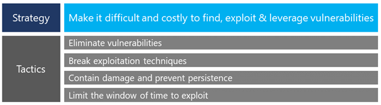

The [Microsoft Security Response Center (MSRC)](https://www.microsoft.com/en-us/msrc) is an integral part of Microsoft’s Cyber Defense Operations Center (CDOC) that brings together security response experts from across the company to help protect, detect, and respond to threats in real-time. Staffed with dedicated teams 24x7, the CDOC has direct access to thousands of security professionals, data scientists, and product engineers throughout Microsoft to ensure rapid response and resolution to security threats. This series of blog posts looks at an important slice of Microsoft’s security response, namely how MSRC responds to elevated threats to customers through our Software and Services Incident Response Plan (SSIRP). Over the coming week, we’ll discuss the anatomy of a SSIRP incident and give some recommendations for building your own security response process. Before discussing our incident response plan, this blog will show how we work to avoid these incidents from happening.

> In the wake of multiple worms, including _Blaster_ and _Sasser_, the SSIRP process was created in 2004 to formalize Microsoft's response to elevated threats against our customers.

Established in 1998, the MSRC works to protect customers from vulnerabilities in our products and services. Our team of dedicated security professionals comes from a variety of security backgrounds across international government, industry, and academia, including the defense and intelligence communities, government CERTs, and the telecommunications, energy, technology, and computer security industries. It was this team of responders that developed the original Secure Development Lifecycle (SDL) principles that are standard across the software development industry as a comprehensive approach to developing and maintaining secure products through [12 best practices](https://www.microsoft.com/en-us/securityengineering/sdl/practices). These principles were informed by our mission to ensure the vulnerabilities in our products are disclosed according to the principles of [Coordinated Vulnerability Disclosure (CVD](https://www.microsoft.com/en-us/msrc/cvd)), updates are released quickly, and our customers are protected from exploits. To do this, our strategy is to make it difficult and costly for attackers to find, exploit and leverage vulnerabilities by:

1. Eliminating vulnerabilities entirely by incorporating technologies that remove the opportunity for exploitation.
2. Breaking exploitation techniques with defense-in-depth technologies to make it difficult for an attacker to run arbitrary code, as well as technologies that help to contain any damage to a ‘sandboxed’ environment and prevent persistence.
3. Using technologies such as Windows Defender and signals provided by industry partners to ensure attackers have little incentive to invest their time and resources into developing exploits they know will be defended against in a timely manner.

\_\_

We are working to change the vulnerability economy – making it more expensive and time consuming for attackers to acquire and exploit software vulnerabilities, thus reducing the risk of exploitation for our customers. We aren’t doing it alone. Through our commitment to Coordinated Vulnerability Disclosure (CVD), security researchers and industry partners work together to help ensure updates are released before an issue is made public. This is win-win for all; customers are protected, and researchers are acknowledged through formal recognition for their work as well as through our [bug bounty programs](https://www.microsoft.com/en-us/msrc/bounty). The [Microsoft Active Partner Protections (MAPP) program](https://www.microsoft.com/en-us/msrc/mapp) also ensures member security organizations across the industry are ready to respond following a coordinated vulnerability disclosure.

Using this approach has led to a safer ecosystem for all. With more vulnerabilities being fixed year-over-year, the actual risk to customers from vulnerabilities is steadily declining and the number of known exploits is consistently trending downwards. In short, Microsoft and security researchers are identifying more vulnerabilities, and—as a result—attackers are using less.

While we have made a lot of progress through this approach, we are also prepared to activate our incident response process when things don’t go to plan. Our SSIRP crisis model was established in the early days of the MSRC as a means of mobilizing global resources to quickly defend customers against elevated security threats such as _Blaster_ and _Sasser_. Today this coordination is center-stage in the cross-industry response to _Spectre_ and _Meltdown_, or the immediate mobilization in the wake of the ShadowBrokers leaks that eventually led to _WannaCry_. Each year, the SSIRP team responds to dozens of incidents that threaten our customers, including imminent or actual public vulnerability or exploit disclosures, attacks against customers, or security threats to Microsoft’s cloud services – such as O365, Azure, and Dynamics.

In our next blog post, we’ll examine the anatomy of a SSIRP incident in more detail, and use a real-life example of how this process drives a whole-company security response to protect our customers.

_Simon Pope, Director of Incident Response, Microsoft Security Response Center (MSRC)_
