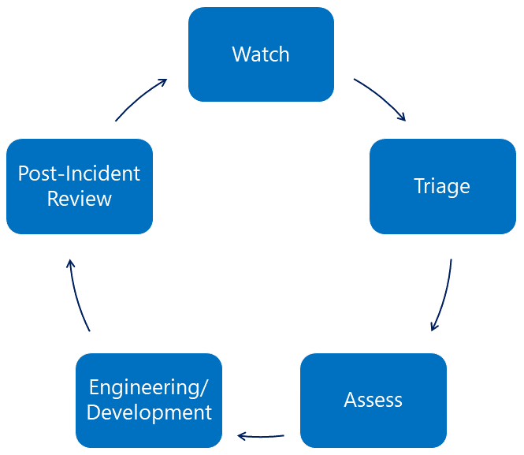

<!-- wp:paragraph -->

_This is the second in a series of blog posts that shares how the MSRC responds to elevated threats to customers through the Software and Services Incident Response Plan (SSIRP). _

<!-- /wp:paragraph -->

<!-- wp:paragraph -->

In our[ last blog post](https://msrc-blog.microsoft.com/2019/06/25/inside-the-msrc-customer-centric-incident-response/), we looked at the history of the Microsoft Security Response Center and SSIRP, and how Microsoft takes a holistic view to helping to protect and defend customers. Below, we will share some details on how our SSIRP teams coordinate our cross-company response to potential security threats to ensure our customers are protected.

<!-- /wp:paragraph -->

<!-- wp:paragraph -->

SSIRP is our incident response process for responding to major threats to our customers, including exploits in the wild that are being used to attack customers (‘zero days’), threats to the security of Microsoft’s services like Azure and O365, and the public disclosure of unpatched vulnerabilities that could be used to attack customers. Many teams across the company are mobilized during this response, including the Cyber Defense Operations Center (CDOC) response teams, enterprise security response, product and service security teams, and key security technology teams like Windows Defender. These security specialists are engaged every day as rapid responders on a range of threats to our products and services, as well as our internal network. While each team is an expert in their product or service, it is through the SSIRP process and the CDOC that they join in a cross-company coordinated effort to protect customers from serious security threats.

<!-- /wp:paragraph -->

<!-- wp:heading -->

## Anatomy of a SSIRP incident

<!-- /wp:heading -->

<!-- wp:paragraph -->

There are five phases to almost every product or service SSIRP incident, shown below.

<!-- /wp:paragraph -->

<!-- wp:image {"id":7274,"align":"center","width":499,"height":433} -->

_Figure 1: The five phases of a SSIRP incident_

<!-- /wp:image -->

<!-- wp:paragraph -->

<!-- /wp:paragraph -->

<!-- wp:heading {"level":3} -->

### Watch

<!-- /wp:heading -->

<!-- wp:paragraph -->

Microsoft keeps a continual state of watch for emerging incidents, and both internal and external partners are key players with specific insights into various parts of the Microsoft ecosystem. Together with the MSRC, ‘watch partners’ keep vigil over their areas of responsibility for signs of emerging threats.

<!-- /wp:paragraph -->

<!-- wp:heading {"level":3} -->

### Triage

<!-- /wp:heading -->

<!-- wp:paragraph -->

When an issue is found, it’s triaged by our team, and if there is a high risk to customers, a SSIRP is declared. This focuses extra resources to ensure timely variant analysis, mitigation, updates to services, and the release of updates to customers. Each SSIRP is assigned a severity level that measures the potential risk to customers. The severity is intended to be a living rating that changes as the situation develops, and it also drives the level of response.

<!-- /wp:paragraph -->

<!-- wp:paragraph -->

For example, earlier this year we were informed of a vulnerability in an Open Source Software (OSS) container runtime called _runc_ that affected all Linux systems using this component. The vulnerability was an Elevation of Privilege (EoP) that could allow an attacker to gain root-level code execution where the they already had malicious code executing in the container. While the underlying vulnerability was not in one of our products or services, we considered it to be a significant threat to our customers and declared a ‘Severity Level 2’ SSIRP to mobilize resources for a cross-company response.

<!-- /wp:paragraph -->

<!-- wp:heading {"level":3} -->

### Assess

<!-- /wp:heading -->

<!-- wp:paragraph -->

After we declare an incident, teams work to assess the extent of the issue and confirm a plan of record to protect our customers as soon as possible. This work includes representatives from engineering, communications, customer service and support, and other defenders. As well as scoping the issue, the team works to ensure customers are aware of any mitigations ahead of an update release. Coordination and collaboration with industry also happens through our MAPP program during the assess phase and—in the case of the _Spectre_ and _Meltdown_ class of vulnerabilities—with other major technology companies. Assessment is a time-critical function and one that has little room for mistakes. Our mantra is “Know – don’t guess.”

<!-- /wp:paragraph -->

<!-- wp:heading {"level":3} -->

### Engineering/Development

<!-- /wp:heading -->

<!-- wp:paragraph -->

With a Plan of Record established, the focus shifts to engineering, and ensuring there are enough resources mobilized to protect customers as soon as possible. In some cases, engineering will release engineering workarounds or adding protections to Microsoft Defender and communications such as security advisories, blog posts, and heads-up to Microsoft Active Protections Program (MAPP) partners as a complete fix is developed.

<!-- /wp:paragraph -->

<!-- wp:quote -->

> Microsoft's response to the _Meltdown \_and \_Spectre_ vulnerabilities affecting computer chips was known internally as _SSIRP Poncherello_ after the lead character from the TV show "CHiPS".

<!-- /wp:quote -->

<!-- wp:paragraph -->

At the same time, teams work on the ultimate goal: wide distribution of any security update, fixes to any affected services, and customer guidance when there are specific actions that customers need to take to protect themselves (security update guide advisories, blogs, field alerts).

<!-- /wp:paragraph -->

<!-- wp:paragraph -->

Updates to services are pushed to production as soon as they are tested. Security updates to products are typically released as part of our regular Update Tuesday schedule, along with the disclosure of fixed vulnerabilities that provide insights and learnings for the industry. The predictability of a monthly Update Tuesday allows customers to schedule updates to their systems in a timely manner, while reducing the economic cost of any downtime. In some rare cases of high risk, we may determine that an immediate, ‘out-of-band’ update is necessary, such as the updates we released during the _WannaCry_ outbreak.

<!-- /wp:paragraph -->

<!-- wp:paragraph -->

During the _runc \_vulnerability SSIRP, teams investigated all of Microsoft’s services to determine which, if any, were affected. During this investigation, Azure Moby and the Azure Kubernetes Service were identified as using \_runc_ but were not affected since they used a statically linked version of the component that was not vulnerable. Even so, both services updated their code to include the patch provided by the code maintainer and the changes pushed to production. When the code maintainer made the vulnerability publicly known, it was given a severity rating of ‘High’ (CVSS 3.0 score: 8.6) and it was assigned the unique identifier, [CVE-2019-5736](https://nvd.nist.gov/vuln/detail/CVE-2019-5736).

<!-- /wp:paragraph -->

<!-- wp:heading {"level":3} -->

### Post Incident Review

<!-- /wp:heading -->

<!-- wp:paragraph -->

In the Post Incident Review phase – after updates have been released and services are updated – the Crisis Lead confirms with watch partners that the incident was comprehensively resolved. Crisis response teams stand down and a post-incident review is held to formally capture any lessons learned and drive improvements across the company. This is critical to any response model, as the security landscape is always changing – what worked yesterday, may not be the best option for tomorrow’s incident. In the case of the\_ runc \_SSIRP, there were no additional learnings to glean – the case was typical for an Open Source Software (OSS) incident, and the team used some of the best practices that we will share in our next blog post. We’ll also provide some recommendations for building your own incident response process, drawing upon more than two decades of experience in security incident response.

<!-- /wp:paragraph -->

<!-- wp:paragraph -->

_Simon Pope, Director of Incident Response, Microsoft Security Response Center (MSRC)_

<!-- /wp:paragraph -->

<!-- wp:paragraph -->

**Related Posts**

<!-- /wp:paragraph -->

<!-- wp:list -->

- [Inside the MSRC – Customer-centric incident response](https://msrc-blog.microsoft.com/2019/06/25/inside-the-msrc-customer-centric-incident-response/)

<!-- /wp:list -->
