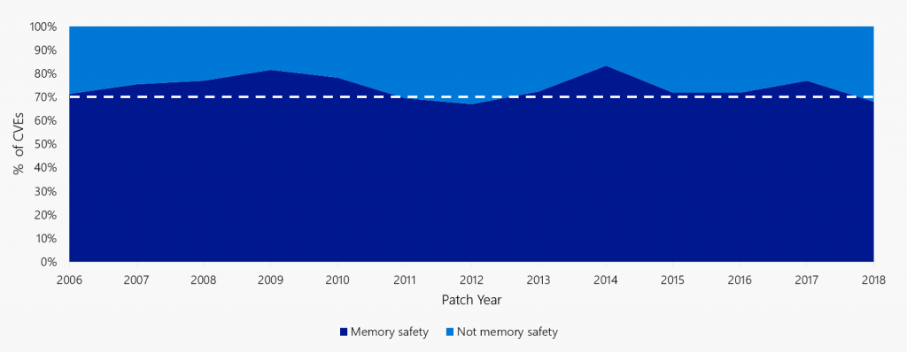

What if we could eliminate an entire class of vulnerabilities before they ever happened?

Since 2004, the Microsoft Security Response Centre (MSRC) has triaged every reported Microsoft security vulnerability. From all that triage one astonishing fact sticks out: as Matt Miller discussed in his 2019 [presentation](https://github.com/microsoft/MSRC-Security-Research/blob/master/presentations/2019_02_BlueHatIL/2019_01%20-%20BlueHatIL%20-%20Trends%2C%20challenge%2C%20and%20shifts%20in%20software%20vulnerability%20mitigation.pdf) at BlueHat IL, the majority of vulnerabilities fixed and with a CVE assigned are caused by developers inadvertently inserting memory corruption bugs into their C and C++ code. As Microsoft increases its code base and uses more Open Source Software in its code, this problem isn’t getting better, it’s getting worse. And Microsoft isn’t the only one exposed to memory corruption bugs—those are just the ones that come to MSRC.

Figure 1: ~70% of the vulnerabilities Microsoft assigns a CVE each year continue to be memory safety issues

# So many tools, so little time

It’s not that there are no tools to help developers write secure code. The developer has a plethora of tools at their disposal: amazingly complex static analysis tools (that take a month or two to learn), fuzzing at scale (that provides haystacks of crashes to triage), taint analysis, and constraint solvers. There is guidance to help developers adopt secure practices, too: the Secure Development Lifecycle to wade through, encyclopaedias of coding guidelines, hours of code review, plenty of training, and threat modelling guidance. We’ve changed the compilers and created mitigations to bail developers out of errors. Visual Studio even has squiggly red lines to highlight potential flaws!

That’s not all. When an internal or external reporter discovers a security flaw, we are there for the developer, ready to point it out, and ready to help them with their post-mortem. We cajole them from their feature writing to fix the issue, and then drive the release for Update Tuesday. What more could the developer want from security engineering?

For starters, they might want to have to spend less effort on learning tools and processes to build features without security flaws.

# A case for memory-safe languages

A developer’s core job is not to worry about security but to do feature work. Rather than investing in more and more tools and training and vulnerability fixes, what about a development language where they can’t introduce memory safety issues into their feature work in the first place? \__That would help both the feature developers \_and_ the security engineers—and the customers.

A language considered safe from memory corruption vulnerabilities removes the onus of software security from the feature developer and puts it on the language developer. Thankfully, there are several languages available that are regarded as “safe” from memory corruption vulnerabilities, such as C#. Many development teams at Microsoft have embraced the world of using these safe languages to write new customer related features.

C++ does have its virtues that make it attractive and in some cases essential: it is blisteringly fast, it has a small memory and disk footprint, it’s mature, it’s execution predictable, its platform applicably is almost unparalleled and you can use it without having to install additional components. If only the developers could have all the memory security guarantees of languages like .NET C# combined with all the efficiencies of C++. Maybe we can: One of the most promising newer systems programming languages that satisfy those requirements is the [Rust ](https://www.rust-lang.org/)programming language originally invented by Mozilla.

If as an industry we truly care about security, we should be focusing on the tools of the developer, and not be too blindsided by all the security paraphernalia, hype, non-data driven ideologies, and outdated methods and approaches. Rather than providing guidance and tools for addressing flaws, we should strive to prevent the developer from introducing the flaws in the first place.

# Improving security, one squirrel at a time

As I was driving to work today, a squirrel ran across the road in front of me. I braked quickly and had to swerve to avoid it. But I didn’t hit the squirrel, and I didn’t get hurt myself. Not because I took some complicated actions, but because the anti-lock braking system kept me from skidding into the other lane, and because my seatbelt kept me protected in my seat. The squirrel and I were both better off because of the safety features built into my car that helped me avoid both hitting it and causing another accident,

We can learn from the way the automotive industry continually evolves their technology to protect drivers and road users. The software security industry has a prerogative to protect the developer in a similar manner. Perhaps it’s time to scrap unsafe legacy languages and move on to a modern safer system programming language?

You’re probably used to thinking about the Microsoft Security Response Center as a group that responds to incidents and vulnerabilities. We _are_ a response organization, but we also have a proactive role, and in a new blog series we will highlight Microsoft’s exploration of safer system programming languages, starting with [Rust](https://www.rust-lang.org/). Please do join us on our journey.

_Gavin Thomas, Principal Security Engineering Manager, MSRC_
