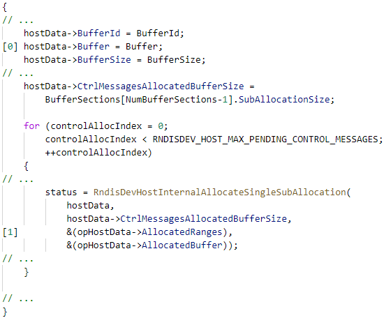

In our [first post in this series](https://msrc-blog.microsoft.com/2019/07/16/a-proactive-approach-to-more-secure-code/), we discussed the need for proactively addressing memory safety issues. Tools and guidance are demonstrably not preventing this class of vulnerabilities; memory safety issues have represented almost the same proportion of vulnerabilities assigned a CVE for over a decade. We feel that using memory-safe languages will mitigate this in ways that tools and training have not been able to.

In this post, we’ll explore some real-world examples of vulnerabilities found in Microsoft products (after testing and static analysis) that could be prevented by using a memory-safe language.

## Memory Safety

[Memory safety](https://en.wikipedia.org/wiki/Memory_safety) is a property of programming languages where all memory access is well defined. Most programming languages in use today _are_ memory-safe because they use some form of garbage collection. However, _systems-level languages_ (i.e., languages used to build the underlying systems other software depends on, like OS kernels, networking stacks, etc.) which cannot afford a heavy runtime like a garbage collector are usually not memory-safe.

As was pointed out in our [previous post](https://msrc-blog.microsoft.com/2019/07/16/a-proactive-approach-to-more-secure-code/), the root cause of approximately 70% of security vulnerabilities that Microsoft fixes and assigns a CVE (Common Vulnerabilities and Exposures) are due to memory safety issues. This is despite mitigations including intense code review, training, static analysis, and more.

~70% of the vulnerabilities Microsoft assigns a CVE each year continue to be memory safety issues

While many experienced programmers can write correct systems-level code, it’s clear that no matter the amount of mitigations put in place, it is near impossible to write memory-safe code using traditional systems-level programming languages _at scale_.

Let’s look at some real-life examples of security vulnerabilities that have been caused by the use of languages without a memory safety guarantee.

### Spatial memory safety

_Spatial memory safety_ refers to ensuring that all memory accesses are within bounds of the type that is being accessed. Doing this requires code to both track these sizes and correctly check all memory operations against these sizes.

Checks can either be absent for an edge case of control flow or can be implemented incorrectly due to not accounting for the intricacies of integer sign, integer promotion, or integer overflow. Let’s consider this example from Microsoft Edge, found by Alexandru Pitis (CVE-2018-8301):

The check at \[0] is correct. However, \[1] can modify the size of the string invalidating the retrieved offset. The function at \[2] calls a copy function which ends up being different than the expected offset, triggering an exploitable out of bounds write.

The fix for this vulnerability is easy: move the “offset check” closer to the time of use. The problem is that this is very error-prone in complex code bases and a simple refactor of the code could open this vulnerability again. Modern C++ offers [span](https://en.cppreference.com/w/cpp/container/span) to enforce bounds checked array accesses. Unfortunately, it is not the default, and so it is the responsibility of the developer to opt into using it. In practice, enforcing the usage of such constructs is difficult.

If the language could automatically track and verify sizes for us, we as programmers would no longer need to worry about having to implement these checks correctly, and we could be certain that none of these issues exist in our code.

### Temporal memory safety

_Temporal memory safety_ refers to ensuring that pointers still point to valid memory at the time of dereference.

A common use-after-free pattern comes from taking a reference to some memory in a local pointer, executing a complex series of operations that could result in freeing or moving the memory, making the local pointer become stale, and then dereferencing it when it is no longer valid. Consider this source code example from Edge found by Steven Hunter (CVE-2017-8596):

This bug is possible because of how many complex APIs interact with each other and the programmer not being able to enforce ownership of memory throughout the codebase. At \[0], the program gets a pointer to a buffer owned by a JavaScript object. Then at \[1], because of the language complexity, to get another variable, it might execute more JavaScript code. At \[2], it will use the buffer and width to create a new JavaScript object with the contents of that pointer.

The problems are:

1. The program uses a combination of garbage collection and manual memory management. The garbage collector tracks the JavaScript objects but it doesn’t know if there is a pointer to an internal part of the object
2. Because VarToInt reenters into JavaScript, the JS program can modify the state and clear the owner of the pointer it aliased at \[1]

The vulnerability is similar to an iterator invalidation bug where all the pointers to the internal state of JavaScript might become dangling if the state is modified. This issue can be solved in many ways. However, statically proving that this error does not happen again is nearly impossible in programs as complex as browsers. The root of the problem comes from aliasing pointers that point to mutable state. C and C++ do not have the tools to enforce the prevention of such errors. However, it's recommended to always use "_smart pointers"_ for tracking memory ownership.

### Data races

A _data race_ occurs when two or more threads in a single process concurrently access the same memory location, at least one of the accesses is for writing, and the threads are not using any exclusive locks to control their accesses to that memory. When considering shared data across multi-threaded execution, keeping spatial and temporal memory safety becomes even more difficult and error prone. Even small windows of time of unsynchronized memory sharing might allow another thread to modify data that can be used to reference memory. This allows, among other things, time-of-check vs time-of-use vulnerabilities that trigger spatial and temporal memory safety vulnerabilities

Jordan Rabet’s VMSwitch vulnerability, [presented](https://i.blackhat.com/us-18/Thu-August-9/us-18-Rabet-Hardening-Hyper-V-Through-Offensive-Security-Research.pdf) at Blackhat 2018, shows one potential impact of a data race. This code is called when a virtual machine sends a specific message to the host. This means that it can be called in parallel to the processing of other control messages and packets. This is problematic because the handlers for those control messages use information that is modified without any locking being done \[0].

Looking at the next snippet, which is used for several control message completion handlers, we can see how the information being updated is used:

Due to this unsynchronized access, it's possible for the new buffer base to be used with the old opHostData->AllocatedRanges \[1] values, leading to an out-of-bounds write \[3].

Preventing these types of vulnerabilities requires locking the data structures accessed by different threads for the time necessary to complete its processing. However, there is no easy way to statically enforce checks for these types of vulnerabilities in C++.

## What We Can Do About it

Addressing the issues highlighted above required taking several different measures. “Modern” constructs in C++ like [span&lt;T](https://docs.microsoft.com/en-us/dotnet/api/system.span-1?view=netstandard-2.1)> can prevent at least some classes of memory safety issues, and other modern C++ features such as smart pointers should be used wherever possible. However, modern C++ is still not completely memory-safe and data-race free. What’s more, usage of such features relies on programmers always “doing the right thing” which in large and ambiguous codebases may be impossible to enforce. C++ also lacks good tools for wrapping unsafe code in safe abstractions meaning while it might be possible to enforce correct coding practices on a local level, it can prove extremely difficult to build software components in C or C++ that compose safely.

Beyond this, whenever possible software should eventually be moved to a completely memory-safe language like C# or F# that ensure memory safety through runtime checks and garbage collection. After all, you should only incur the complexity of having to think about memory management when necessary.

If there are legitimate reasons for needing the speed, control and predictability of a language like C++, see if you can move to a systems-level programming language that is memory safe. In our next post, we’ll explore why we think [the Rust programming language](https://rust-lang.org/) is currently the best choice for the industry to adopt whenever possible due to its ability to write systems-level programs in a memory-safe way.

_Ryan Levick, Principal Cloud Developer Advocate_

_Sebastian Fernandez, Security Software Engineer_
