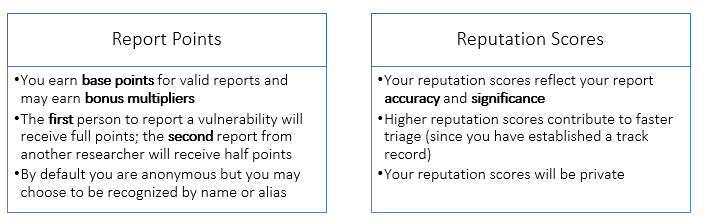

<!-- wp:paragraph -->

We deeply appreciate the partnership of the many talented security researchers who report vulnerabilities to Microsoft through [Coordinated Vulnerability Disclosure](https://www.microsoft.com/en-us/msrc/cvd). We pay bounties for research in key areas, and each year at Black Hat USA, we’ve recognized the most impactful researchers helping to protect the ecosystem. That’s not changing; we’re continuing to expand our bounty programs and will continue to recognize researchers with the greatest impact on the security ecosystem.

<!-- /wp:paragraph -->

<!-- wp:paragraph -->

What’s changing is that we’re making our recognition model more transparent and predictable and establishing a tier-based system of rewards.

<!-- /wp:paragraph -->

<!-- wp:paragraph -->

The new model is a standard points system to reflect the impact and reputation of all researchers who report to us, whether directly or through a program like Trend Micro’s [Zero Day Initiative (ZDI)](https://www.zerodayinitiative.com/) and [iDefense](https://www.accenture.com/us-en/blogs/blogs-accenture-idefense-default). This model has two aspects: the **points** you earn for each actionable report you make, and your **reputation score** you develop for the proportion of actionable reports you make.

<!-- /wp:paragraph -->

<!-- wp:image {"id":10803,"align":"center"} -->

<!-- /wp:image -->

<!-- wp:paragraph -->

For full details of how you earn report points (including bonus multipliers) and develop a reputation score, see our [program page](http://www.microsoft.com/en-us/msrc/researcher-recognition-program). You gain points not when your report is fixed, but when it is determined to be a valid security issue that meets the bar for servicing. This new model is independent of [our bounty program](https://www.microsoft.com/en-us/msrc/bounty). When you report bounty-eligible vulnerabilities, you’ll earn points _and_ get bounties.

<!-- /wp:paragraph -->

<!-- wp:paragraph -->

As a security researcher, this model provides you with a simple way to maximize your research for higher point values and develop a reputation for more accuracy. The more research points you have and the greater your reputation score, the more you’re eligible for, including but not limited to:

<!-- /wp:paragraph -->

<!-- wp:list -->

- Public recognition on our leaderboard and rankings
- Annual recognition on the MSRC’s Most Valuable Security Researcher list
- Special swag for each tier
- Access to invitation-only MSRC events and programs

<!-- /wp:list -->

<!-- wp:paragraph -->

We’ll announce more updates to public recognition and rewards structure as they become available. Stay tuned!\_\_

<!-- /wp:paragraph -->

<!-- wp:paragraph -->

_Sylvie Liu, Security Program Manager, MSRC Community Programs_

<!-- /wp:paragraph -->

<!-- wp:paragraph -->

<!-- /wp:paragraph -->

<!-- wp:paragraph -->

<!-- /wp:paragraph -->
