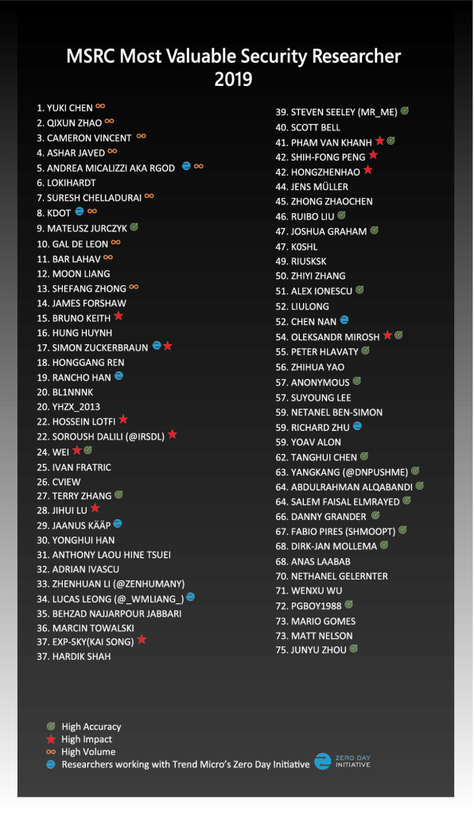

<!-- wp:paragraph -->

Earlier today we announced MSRC’s 2018-2019 Most Valuable Security Researchers at Black Hat. The following 75 researchers hail from all corners of the world and possess varied experience and skills, yet all of them have contributed to securing the Microsoft’s customers and the broader ecosystem.

<!-- /wp:paragraph -->

<!-- wp:image {"id":10905,"align":"center","width":680,"height":1168} -->

<!-- /wp:image -->

<!-- wp:paragraph -->

For over a decade, one of Microsoft’s partners in vulnerability research and disclosure has been Trend Micro’s [Zero Day Initiative](https://www.zerodayinitiative.com/). In addition to ZDI’s vulnerability rewards program, Trend Micro is a longstanding member of the [Microsoft Active Protections Program](https://www.microsoft.com/en-us/msrc/mapp?rtc=1) (MAPP). This year Trend Micro’s original security research was tracked with the community contributions of the ZDI program, and subsequently only recognized in our individual Most Valuable Researcher program. Moving forward, Trend Micro original research will also be recognized in our [MAPP Top Contributing Partners program](https://msrc-blog.microsoft.com/2019/07/25/microsoft-announces-top-contributing-partners-in-the-microsoft-active-protections-program-mapp/), better recognizing the substantial impact Trend Micro has in protecting Microsoft customers as well as the broader ecosystem.

<!-- /wp:paragraph -->

<!-- wp:paragraph -->

If you are interested in how we identified the Most Valuable Security Researchers this year, our [Recognizing Security Researchers in 2019](https://msrc-blog.microsoft.com/2019/07/30/recognizing-security-researchers-in-2019/) blog provides additional details on our points model.

<!-- /wp:paragraph -->

<!-- wp:paragraph -->

Looking forward to another great year working with all of you!

<!-- /wp:paragraph -->

<!-- wp:paragraph -->

_Sylvie Liu, Security Program Manager, MSRC Community Programs_

<!-- /wp:paragraph -->
