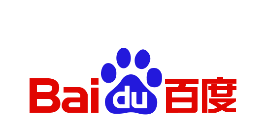

<!-- wp:paragraph -->

Today Microsoft announced the MAPP program Top Vulnerability Contributors, Top Threat Indicator Submitters, and Top Zero-Day Reporting for the period of July 1, 2018 – June 30, 2019.

<!-- /wp:paragraph -->

<!-- wp:paragraph -->

The [Microsoft Active Protections Program](https://www.microsoft.com/en-us/msrc/mapp) provides security and protection to customers through cooperation and collaboration with industry leading partners.

<!-- /wp:paragraph -->

<!-- wp:paragraph -->

While all MAPP partners have made a significant impact on the security ecosystem and are commended for their customer-first approach to security, these top contributors have gone above and beyond our expectations. Each partner shown here epitomizes the dedication and commitment to the security of our common customers.

<!-- /wp:paragraph -->

<!-- wp:heading -->

## Here are the top contributors in each category:

<!-- /wp:heading -->

<!-- wp:heading {"level":3} -->

### Vulnerability Top Contributors

<!-- /wp:heading -->

<!-- wp:paragraph -->

Total number of vulnerabilities in Microsoft products reported to Microsoft, ranked highest, second highest and third highest.

<!-- /wp:paragraph -->

<!-- wp:image {"id":10830,"align":"center","width":249,"height":79,"linkDestination":"custom"} -->

<!-- /wp:image -->

<!-- wp:image {"id":10831,"align":"center","width":285,"height":64,"linkDestination":"custom"} -->

<!-- /wp:image -->

<!-- wp:image {"id":10832,"align":"center","width":313,"height":199,"linkDestination":"custom"} -->

<!-- /wp:image -->

<!-- wp:paragraph -->

<!-- /wp:paragraph -->

<!-- wp:heading {"level":3} -->

### Threat Indicator Top Contributors

<!-- /wp:heading -->

<!-- wp:paragraph -->

The total number of threat indicators reported to Microsoft via our automated system, ranked highest, second highest and third highest.

<!-- /wp:paragraph -->

<!-- wp:image {"id":10827,"align":"center","width":318,"height":46,"linkDestination":"custom"} -->

<!-- /wp:image -->

<!-- wp:paragraph -->

<!-- /wp:paragraph -->

<!-- wp:image {"id":10828,"align":"center","width":277,"height":132,"linkDestination":"custom"} -->

<!-- /wp:image -->

<!-- wp:paragraph -->

<!-- /wp:paragraph -->

<!-- wp:image {"id":10829,"align":"center","width":339,"height":60,"linkDestination":"custom"} -->

<!-- /wp:image -->

<!-- wp:paragraph -->

<!-- /wp:paragraph -->

<!-- wp:heading {"level":3} -->

### Zero-Day Top Contributor

<!-- /wp:heading -->

<!-- wp:paragraph -->

The total number of vulnerabilities reported to Microsoft that are under active attack, ranked highest, second highest and third highest.

<!-- /wp:paragraph -->

<!-- wp:image {"id":10833,"align":"center","width":333,"height":212,"linkDestination":"custom"} -->

<!-- /wp:image -->

<!-- wp:paragraph -->

\_\_

<!-- /wp:paragraph -->

<!-- wp:image {"id":10834,"align":"center","width":214,"height":170,"linkDestination":"custom"} -->

<!-- /wp:image -->

<!-- wp:paragraph -->

[\_\_](http://www.mcafee.com/us/)\_\_

<!-- /wp:paragraph -->

<!-- wp:image {"id":10835,"align":"center","width":355,"height":55,"linkDestination":"custom"} -->

<!-- /wp:image -->

<!-- wp:paragraph -->

<!-- /wp:paragraph -->

<!-- wp:paragraph -->

Congratulations to these top partners, and thank you to all partners for helping protect the ecosystem!

<!-- /wp:paragraph -->

<!-- wp:paragraph -->

\*For over a decade, one of Microsoft’s partners in vulnerability research and disclosure has been Trend Micro’s [Zero Day Initiative](https://nam06.safelinks.protection.outlook.com/?url=https%3A%2F%2Fwww.zerodayinitiative.com%2F&data=02%7C01%7Calbrow%40microsoft.com%7C27e9c4f359ad4ed8165308d71b47576e%7C72f988bf86f141af91ab2d7cd011db47%7C1%7C0%7C637007865546185990&sdata=kYVsv9CEsIvJafqIiXwlQaDNJFnk6CVxsJx7u%2F6EUig%3D&reserved=0). In addition to ZDI’s vulnerability rewards program, Trend Micro is a longstanding member of the [Microsoft Active Protections Program](https://nam06.safelinks.protection.outlook.com/?url=https%3A%2F%2Fwww.microsoft.com%2Fen-us%2Fmsrc%2Fmapp%3Frtc%3D1&data=02%7C01%7Calbrow%40microsoft.com%7C27e9c4f359ad4ed8165308d71b47576e%7C72f988bf86f141af91ab2d7cd011db47%7C1%7C0%7C637007865546185990&sdata=wpajPmsRHAuxhODZQikBMygkmgZGg%2FCXmv7GEGwJWKs%3D&reserved=0) (MAPP). This year Trend Micro’s original security research was tracked with the community contributions of the ZDI program, and subsequently only recognized in our individual Most Valuable Researcher program. Moving forward, Trend Micro original research will also be included in our [MAPP Top Contributing Partners program](https://nam06.safelinks.protection.outlook.com/?url=https%3A%2F%2Fmsrc-blog.microsoft.com%2F2019%2F07%2F25%2Fmicrosoft-announces-top-contributing-partners-in-the-microsoft-active-protections-program-mapp%2F&data=02%7C01%7Calbrow%40microsoft.com%7C27e9c4f359ad4ed8165308d71b47576e%7C72f988bf86f141af91ab2d7cd011db47%7C1%7C0%7C637007865546195985&sdata=diA04kwRSEwUHLIPgzC%2FV20VsFo9%2BOBMoTM0pBTVnqk%3D&reserved=0), in recognition of the substantial impact Trend Micro has in protecting Microsoft customers as well as the broader ecosystem.

<!-- /wp:paragraph -->

<!-- wp:paragraph -->

_Al Brown, Senior Security Strategist, Microsoft Security Response Center_

<!-- /wp:paragraph -->

<!-- wp:paragraph -->

<!-- /wp:paragraph -->
