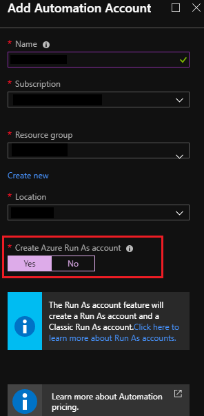
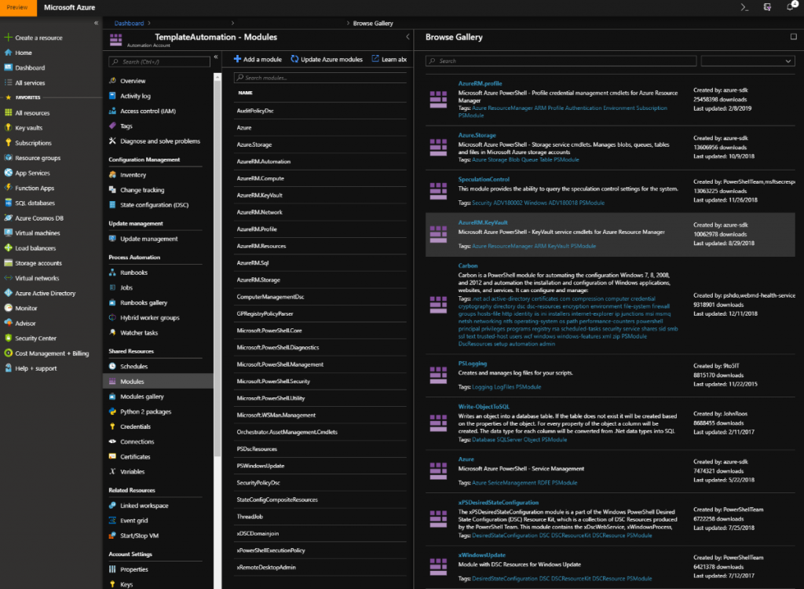
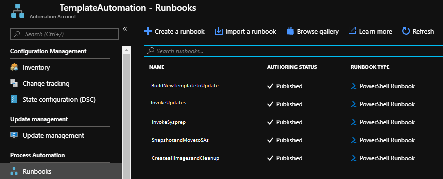
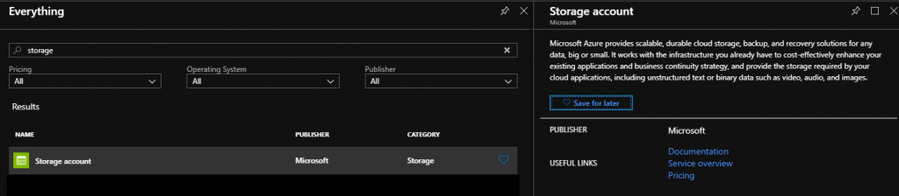
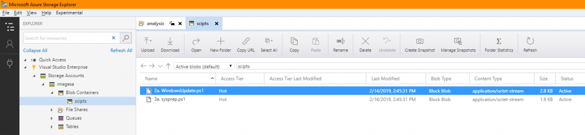
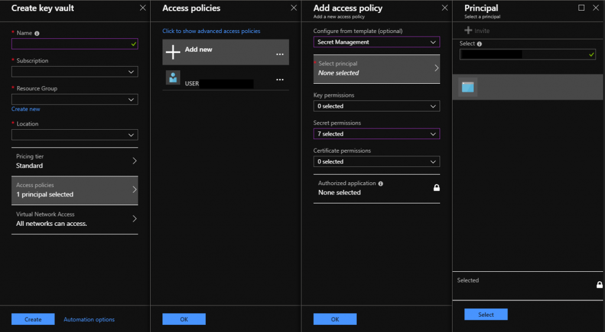
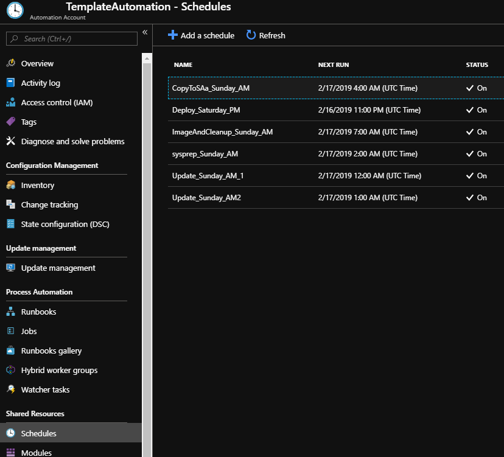

<!-- wp:paragraph -->

Traditional computer forensics and cyber investigations are as relevant in the cloud as they are in on-premise environments, but the methods in which to access and perform such investigations differ. This post will describe some of the challenges of bringing on-premises forensics techniques to the cloud and show one solution to overcome these challenges, using Azure functionality. The PowerShell files referred to in this blog are available in the [Scalable Infrastructure for Investigation and Incident Response](https://github.com/microsoft/Scalable-Infrastructure-for-Investigation-and-Incident-Response) [GitHub repo](https://github.com/Microsoft/Scalable-Infrastructure-for-Investigation-and-Incident-Response), including a readme.md containing a step-by-step on how to set up the environment:

<!-- /wp:paragraph -->

<!-- wp:paragraph -->

In this post we make the following assumptions:

<!-- /wp:paragraph -->

<!-- wp:list -->

- You are going to create an image of a Windows VM
- You have full permissions in your subscription
- You are going to have two resource groups within your subscription: one for templates and one for deployed VMs

<!-- /wp:list -->

<!-- wp:paragraph {"backgroundColor":"pale-cyan-blue"} -->

Note: This blog is focused on how to help you prepare for cloud forensics. Where applicable, we're linking to other documents providing background or more detail.

<!-- /wp:paragraph -->

<!-- wp:heading -->

## Why forensics is different in the cloud... and one way to adapt

<!-- /wp:heading -->

<!-- wp:paragraph -->

Investigators face some challenges when looking at transposing their traditional forensic investigative tools and capabilities into a cloud environment.

<!-- /wp:paragraph -->

<!-- wp:list -->

- **Working at scale. **Hardware required to perform on-premise and physical investigations cannot be applied easily in a cloud environment (at least without a great deal of time and bandwidth in downloading and uploading vast amounts of data).
- **Distance. **Having all your investigative assets in a single location is not conducive to a timely response. Even if the investigation capability is hosted in the cloud, there will still be a delay in acquiring evidence from machines hosted on the other side of the globe.
- **Greater exposure. **Investigative machines may become contaminated or infected during an investigation, especially when there is malware analysis involved. There is also a risk of aggregated data, where an investigation machine may itself become a target due to the amount of information it could contain.
- **Maintenance. **Finally, there’s maintenance. If there is a fleet of _always on_ machines; these require the operating system to be patched and updated along with all software updates and refreshes.

<!-- /wp:list -->

<!-- wp:paragraph -->

One solution to address these challenges is to create a VM Image for investigations and deploy as needed. We \_could c_reate several investigative VMs in multiple regions and leave them running for availability and for update management, but this is going to get expensive and will be harder to manage. A better option is to deploy an image of a prebuilt VM (up-to-date and with pre-deployed tools and apps) to every region you require. Then you can build multiple machines from each image as needed. The solution relies on the use of [Azure PowerShell cmdlets](https://azure.microsoft.com/en-us/downloads/), [Azure Automation](https://docs.microsoft.com/en-us/azure/automation/automation-create-standalone-account) and [Runbooks](https://docs.microsoft.com/en-us/azure/automation/automation-starting-a-runbook). We'll discuss the details in the next sections.

<!-- /wp:paragraph -->

<!-- wp:heading -->

## Setting up the investigations image

<!-- /wp:heading -->

<!-- wp:paragraph -->

Let's look at how to set up your forensic environment, from creating the Tools VM, creating an automation account, creating runbooks, preparing scripts and storage, protecting credentials, testing, and scheduling.

<!-- /wp:paragraph -->

<!-- wp:heading {"level":3} -->

### Step 1: Build and prepare a VM

<!-- /wp:heading -->

<!-- wp:paragraph -->

The first thing we need to do is create the initial VM image to be the template. To do this we will deploy a resource managed Windows 10 Virtual Machine. [Follow the standard creation process and deploy it to your templates resource group](https://docs.microsoft.com/en-us/azure/virtual-machines/windows/quick-create-portal). Ensure you have [Network Security Group applied, to lock down remote access](https://docs.microsoft.com/en-us/azure/virtual-network/manage-network-security-group) to only allowed endpoints

<!-- /wp:paragraph -->

<!-- wp:paragraph -->

Once deployed, we connect to the VM and configure it to the desired state. Next, we run [Sysprep](https://docs.microsoft.com/en-us/windows-hardware/manufacture/desktop/sysprep--generalize--a-windows-installation) to remove all user account and user-based customisation to make it a generalised image. (Note that if you are removing or updating Windows Store Apps, you may get errors when trying to run Sysprep. For more information, see this support article: [Sysprep fails after you remove or update Microsoft Store apps that include built-in Windows images](https://support.microsoft.com/en-us/help/2769827/sysprep-fails-after-you-remove-or-update-windows-store-apps-that-inclu)[.](https://support.microsoft.com/en-us/help/2769827/sysprep-fails-after-you-remove-or-update-windows-store-apps-that-inclu)

<!-- /wp:paragraph -->

<!-- wp:preformatted -->

```
C:\Windows\System32\Sysprep\sysprep.exe /generalize /oobe /shutdown /quiet 
```

<!-- /wp:preformatted -->

<!-- wp:paragraph {"backgroundColor":"pale-cyan-blue"} -->

Note: To prepare a Linux VM to be imaged, follow the documentation [here](https://docs.microsoft.com/en-us/azure/virtual-machines/linux/capture-image).

<!-- /wp:paragraph -->

<!-- wp:heading {"level":3} -->

### Step 2: Create an automation account

<!-- /wp:heading -->

<!-- wp:paragraph -->

To enable the automation aspect of this solution we need to add an automation account to the Resource Group ‘Templates’. Add an automation account, providing a relevant name, and ensure the 'Create Azure Run As Account' is set to 'yes'.

<!-- /wp:paragraph -->

<!-- wp:image {"id":10673,"align":"center"} -->



<!-- /wp:image -->

<!-- wp:paragraph {"backgroundColor":"pale-cyan-blue"} -->

For more details on automation accounts and creating them, see [Create an Azure Automation account](https://docs.microsoft.com/en-us/azure/automation/automation-quickstart-create-account).

<!-- /wp:paragraph -->

<!-- wp:paragraph -->

To enable the use of certain cmdlets in the runbooks we will create, first import/enable modules within the automation account that will be executing the scripts. Select the newly created automation account, then ensure the following modules are present. If they are not present; use the 'add a module' command to add them.

<!-- /wp:paragraph -->

<!-- wp:list -->

- Azure
- Azure.Storage
- AzureRM.Automation
- AzureRM.Compute
- AzureRM.KeyVault
- AzureRM.Network
- AzureRM.Profile
- AzureRM.Resources
- AzureRM.Sql
- AzureRM.Storage

<!-- /wp:list -->

<!-- wp:image {"id":10672,"align":"center"} -->



<!-- /wp:image -->

<!-- wp:heading {"level":3} -->

### Step 3: Create runbooks

<!-- /wp:heading -->

<!-- wp:paragraph -->

Now we need to create the runbooks, the PowerShell scripts the automation account will execute. To create a runbook, browse to the Runbooks section of the Automation Account. Resource Group > Automation Account > Runbooks and choose ‘Create a new runbook’.

<!-- /wp:paragraph -->

<!-- wp:paragraph -->

To execute these scripts you will need to create a PowerShell Runbook, however there are more types of runbooks that can be created. We need to create a total of five runbooks which will cover the actions we want automated. These scripts are all in our [GitHub Repository](https://github.com/Microsoft/Scalable-Infrastructure-for-Investigation-and-Incident-Response):

<!-- /wp:paragraph -->

<!-- wp:list {"ordered":true} -->

1. **Build New Template to Update.ps1**

   - This script will deploy a VM from one of our images, ready for updating.

2. **Invoke Updates.ps1**

   - This script will run a custom script extension on the deployed VM to make it download and execute “2a. WindowsUpdate.ps1”

3. **Invoke Sysprep.ps1**

   - This script will run a custom script extension on the deployed VM to make it download and execute “3a. sysprep.ps1”

4. **Snapshot and Move to SAs.ps1**

   - This script will take a snapshot of the updated and generalised VMs disk. It will create storage accounts in every available Azure region and copy the snapshot to each storage account. (This can be modified to limit the regions to those desired)

5. **Create all Images and Cleanup**

   - This script creates VM images from the snapshots copied to each region, then removes everything created during this process as it is no longer needed.

<!-- /wp:list -->

<!-- wp:image {"id":10671,"align":"center"} -->



<!-- /wp:image -->

<!-- wp:paragraph -->

Each of the scripts have been stripped of all variable names, so you will need to update them and save the runbooks before they can be run. The comments next to each variable should provide a description of what is needed for each.

<!-- /wp:paragraph -->

<!-- wp:paragraph {"backgroundColor":"pale-cyan-blue"} -->

For more information on creating runbooks and accessing the runbook tutorials see [Create an Azure Automation runbook](https://docs.microsoft.com/en-us/azure/automation/automation-quickstart-create-runbook).

<!-- /wp:paragraph -->

<!-- wp:heading {"level":3} -->

### Step 4: Create storage accounts and scripts

<!-- /wp:heading -->

<!-- wp:paragraph -->

To run scripts on the VM, we need to have the scripts available and in a location that can be updated independent of the VM. For this we will create a storage account which will be accessed by “2. Invoke Updates.ps1” and “3. Invoke Sysprep.ps1”.

<!-- /wp:paragraph -->

<!-- wp:image {"id":10670,"align":"center"} -->



<!-- /wp:image -->

<!-- wp:paragraph -->

In the Templates resource group, create a storage account, create a container within the ‘blobs’ section of this storage account, give it a name such as . “scripts” and upload the following two PowerShell files from GitHub:

<!-- /wp:paragraph -->

<!-- wp:list -->

- 2a. WindowsUpdate.ps1

  - This script will download all available Windows updates and reboot the VM if required (<https://social.technet.microsoft.com/Forums/en-US/52d9fe8d-936e-43c0-9707-51a55f97d59d/client-side-wsus-update-schedule#75c6e8b2-66c8-4ef1-a9a6-1853867999dc>)

<!-- /wp:list -->

<!-- wp:list -->

- 3a. sysprep.ps1

  - This script will execute Sysprep with the flags ‘generalize’ and ‘OOBE’ (Out Of the Box Experience) and then shut down the VM.

<!-- /wp:list -->

<!-- wp:paragraph -->

Because these scripts are within a storage account and not on the VM, you can update them whenever you wish to include new functionality, such as updating, installing or removing applications.

<!-- /wp:paragraph -->

<!-- wp:image {"id":10669,"align":"center"} -->



<!-- /wp:image -->

<!-- wp:heading {"level":3} -->

### Step 5: Store credentials securely

<!-- /wp:heading -->

<!-- wp:paragraph -->

To manage the secrets and credentials of the VMs deployed from these images, we will utilise the [Key Vault feature](https://docs.microsoft.com/en-us/azure/key-vault/) in Azure. We will need to create a Key Vault within both of the Resource Groups we are utilising: ‘Templates’ and ‘Deployed VMs’. During the creation process of both key vaults we need to ensure that the automation account created in Step 2 is added in the Access Policies as a principal with Secret Management as its permissions.

<!-- /wp:paragraph -->

<!-- wp:image {"id":10668,"align":"center"} -->



<!-- /wp:image -->

<!-- wp:heading {"level":3} -->

### Step 6: Test the process

<!-- /wp:heading -->

<!-- wp:paragraph -->

At this point you should have a VM built and sysprepped, an automation account with the relevant modules enabled, five runbooks containing all of the automation (with variables populated), a storage account with the PowerShell scripts you want to execute to update the template, and two key vaults to store the secrets.

<!-- /wp:paragraph -->

<!-- wp:paragraph -->

Before you go any further, it's time to test (and debug if needed) what you have done so far. Navigate to the templates resource group, and execute the following runbooks in order:

<!-- /wp:paragraph -->

<!-- wp:list {"ordered":true} -->

1. Start runbook ‘Snapshot and Move to SAs’

   - Check the ‘all logs’ for information regarding the execution

2. Wait 2-3 hours for the copy/move to complete.

3. Start runbook ‘Create all Images and Cleanup’

   - Check the ‘all logs’ for information regarding the execution

4. Wait for this to complete ~10 minutes

5. In the Azure Portal, select the Iiage you have just created and deploy a VM from the image, following the wizard to create the VM

6. Wait 5-10 minutes for the VM to deploy

7. Connect into the VM and verify that everything is working as expected.

8. Delete the VM and associated resources (NSG, vNet etc.) that you have created and tested

9. Start runbook ‘Build New Template to Update’

   1. Check the ‘all logs’ for information regarding the execution

10. Wait for the VM to deploy ~5 – 10 minutes

11. Start runbook ‘Invoke Updates’

    - Check the ‘all logs’ for information regarding the execution
    - If you want to check that this ran on the VM you can check and review the log file in C:\\UpdateLogs

12. Start runbook ‘Invoke sysprep’

    - Check the ‘all logs’ for information regarding the execution

13. Wait for Sysprep to complete ~15 – 20 minutes

    - Your VM should be shut down and you should see no activity in the VM graphs, this will confirm that Sysprep worked correctly

14. Finally delete the VM and associated resources (NSG, vNet etc.)

<!-- /wp:list -->

<!-- wp:paragraph -->

If you receive errors or failures, debug the runbook and re-test.

<!-- /wp:paragraph -->

<!-- wp:heading {"level":3} -->

### Step 7: Schedule the process

<!-- /wp:heading -->

<!-- wp:paragraph -->

Now you have a VM image deployed to all the regions you desire, you can set up the last part of the automation: configuring the schedule to run this process automatically. To do so, navigate to the automation account and schedules. Here, add multiple schedules to define the schedule for each task . To minimise disruption to end users, choose a time of low usage, such as Saturday night and Sunday morning. Whatever day you chose, we recommend that you keep the order and wait periods the same. For example:

<!-- /wp:paragraph -->

<!-- wp:table -->

| Name                   | Start Date / Time | Time Zone | Recurrence                   |
| ---------------------- | ----------------- | --------- | ---------------------------- |
| Deploy_Sat_PM          | 05/01/2019 23:00  | UTC       | Second Saturday of the month |
| Update_Sun_AM_1        | 06/01/2019 00:00  | UTC       | Second Sunday of the month   |
| Update_Sun_AM_2        | 06/01/2019 01:00  | UTC       | Second Saturday of the month |
| Sysprep_Sun_AM         | 06/01/2019 02:00  | UTC       | Second Saturday of the month |
| CopyToSAs_Sun_AM       | 06/01/2019 04:00  | UTC       | Second Saturday of the month |
| ImageAndCleanup_Sun_AM | 06/01/2019 07:00  | UTC       | Second Saturday of the month |

<!-- /wp:table -->

<!-- wp:image {"id":10667,"align":"center"} -->



<!-- /wp:image -->

<!-- wp:paragraph -->

Assign the relevant runbook to the schedules we have just created:

<!-- /wp:paragraph -->

<!-- wp:list -->

- `Schedule Name Associated Runbook`
- `Deploy_Saturday_PM DeployTemplateVM`
- `Update_Sunday_AM_1 InvokeUpdate`
- `Update_Sunday_AM_2 InvokeUpdate`
- `Sysprep_Sunday_AM InvokeSysprep`
- `CopyToSAs_Sunday_AM SnapshotAndCopy`
- `ImageAndCleanup_Sunday_AM ImageAndCleanup`

<!-- /wp:list -->

<!-- wp:heading -->

## Now investigate!

<!-- /wp:heading -->

<!-- wp:paragraph -->

The automation we have just created will ensure that the VM images that are deployed to all Azure regions are up to date and ready to be used.

<!-- /wp:paragraph -->

<!-- wp:paragraph -->

To build one of these VMs, run the PowerShell script ‘CreateVM.ps1’ (this will need variables configured before it is distributed). This will ask you for both the region you want to deploy it to and a unique ID for the VM. Once deployed, you can log in with the username configured in the script and the corresponding password in the ‘Deployed VMs’ Key Vault. When you are finished with your VM you can delete it (and its associated resources) using the DeleteVM.ps1 and the VM’s unique ID.

<!-- /wp:paragraph -->

<!-- wp:paragraph -->

You now have your VM toolbox set up and need something to do with it. In our next blog in this series, we'll explain how to get a VM for investigation.

<!-- /wp:paragraph -->

<!-- wp:paragraph -->

_Scott Miller, Senior Service Engineer, MSRC_

<!-- /wp:paragraph -->
