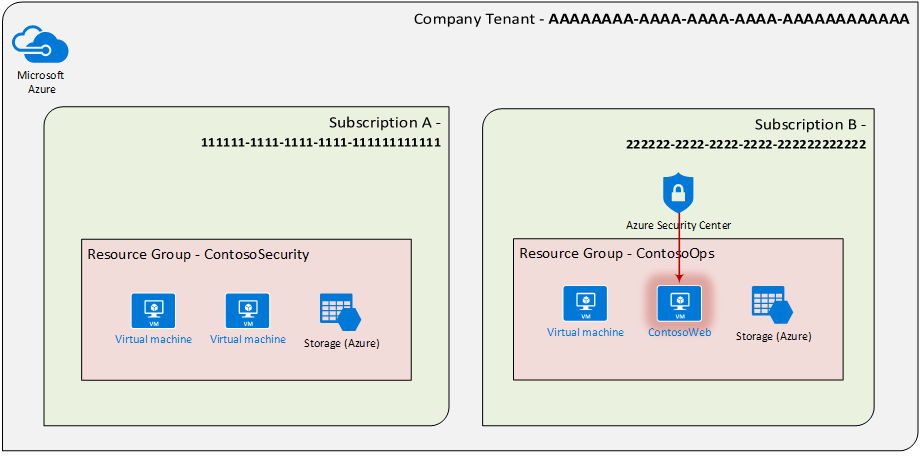
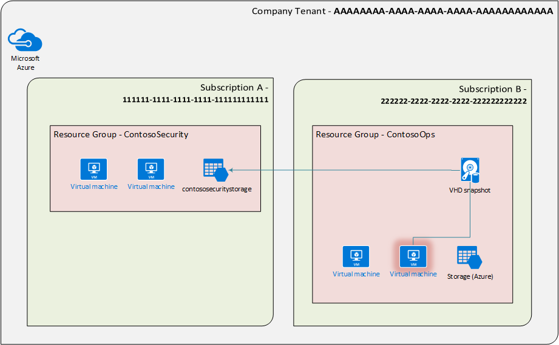
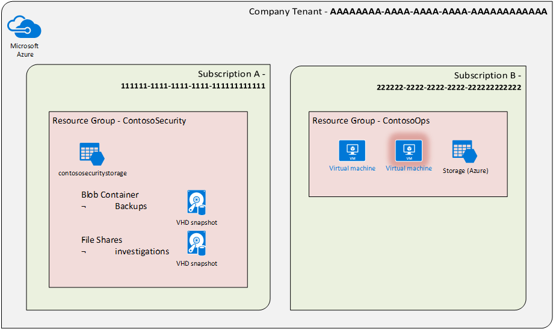

In a [previous post](https://msrc-blog.microsoft.com/2019/08/30/scalable-infrastructure-for-investigations-and-incident-response/) we described some of the differences between on-premises/physical forensics and cyber investigations and those performed in the cloud, and how this can make cloud forensics challenging. That blog post described a method of creating and maintaining a VM image which can be distributed to multiple regions, allowing you to deploy this pre-prepared machine to be used in an investigation in a matter of minutes. Now that you have your tools, this blog describes how you acquire and access a Virtual Hard Disk (VHD) from a VM which has been flagged for investigation.

## The scenario

Azure Security Center has alerted us to a potential security issue with a Virtual Machine in **Subscription B**, within resource group **ContosoOps**. A potential web shell exists on VM **“ContosoWeb”**. We will follow normal triage and investigative processes to determine the event’s confidence and gather further information. For our scenario we will assume there is a tenant which contains 2 subscriptions, and each of those subscriptions has several resource groups. We also assume that the IT Security team has permissions across the tenant.



## Acquiring the VM

Now we would like to acquire the VHD associated with the VM **“ContosoWeb”** so that we can perform analysis. For this we will need to acquire a [snapshot](https://docs.microsoft.com/en-us/azure/virtual-machines/windows/snapshot-copy-managed-disk) of the VHD for “**ContosoWeb**”, and transfer this snapshot to a storage account upon which it will be investigated.

### Step 1: Snapshot the disk

When creating the snapshot, we need to identify the type of storage container we are going to create the snapshot in. There are several storage containers which can be used for this purpose: [Azure Blobs, Azure Files and Azure Disks.](https://docs.microsoft.com/en-us/azure/storage/common/storage-decide-blobs-files-disks) Because we’re creating the snapshot to investigate it, we will choose a File container. This will allow us to connect to the container over the network and investigate the file, without having to copy it several times.



We can use Azure PowerShell Cmdlets to snapshot the disk and copy it to a file, as documented [here](https://docs.microsoft.com/en-us/azure/virtual-machines/scripts/virtual-machines-windows-powershell-sample-copy-snapshot-to-same-or-different-subscription) and described below:

```
######################################### Variables #########################################
$srcSubId = '222222-2222-2222-2222-222222222222' #the sub containing the VM
$destSubId = '111111-1111-1111-1111-111111111111' #the sub containing the storage account being copied to.
$srcRGName ='ContosoOps' #The Resource Group containing the VM
$destRGName = 'ContosoSecurity' # The Resource Group containing the storage account being copied to.
$vmName = 'ContosoWeb' #Name of the snapshot being created
$srcLocation = 'westus' #location/region of the VM being snapshot
$dstLocation = 'westus' #location/region of the storage account
$SnapshotName = 'ContosoWeb-Snapshot' #the name of the snapshot to be created
$destSA = 'contososecuritystorage' #name of the storage account
$destSAContainer = 'investigations' #name of the share within the storage account
#############################################################################################

####################################### Login to Azure ######################################
Login-AzureRmAccount -ErrorAction Stop
#############################################################################################

############################# Snapshot the OS Disk of target VM #############################
Select-AzureRmSubscription -SubscriptionId $srcSubId
$vm = Get-AzureRmVM -ResourceGroupName $srcRGName -Name $vmName
$disk = Get-AzureRmDisk -ResourceGroupName $srcRGName -DiskName $vm.StorageProfile.OsDisk.Name
$snapshot = New-AzureRmSnapshotConfig -SourceUri $disk.Id -CreateOption Copy -Location $srcLocation
New-AzureRmSnapshot -ResourceGroupName $srcRGName -Snapshot $snapshot -SnapshotName $SnapshotName
#############################################################################################

##################### Copy the snapshot from source to file container #######################
$snapSasUrl = Grant-AzureRmSnapshotAccess -ResourceGroupName $destRGName -SnapshotName $snapshotName -DurationInSecond 7200 -Access Read
Select-AzureRmSubscription -SubscriptionId $srcSubId
$targetStorageContext = (Get-AzureRmStorageAccount -ResourceGroupName $destRGName -Name $destSA).Context
Start-AzureStorageFileCopy -AbsoluteUri $snapSasUrl.AccessSAS -DestShareName $destSAContainer -DestContext $targetStorageContext -DestFilePath $SnapshotName  -Force
##############################################################################################
```

The snapshot will still exist in the originating Resource Group, in this case “ContosoOps”. If you want to keep your resource groups tidy, you can remove it using the following command:

```
Remove-AzureRmSnapshot -ResourceGroupName $srcRGName -SnapshotName $SnapshotName -Force
```

Finally, we can make a second copy of the VHD in another storage account, container or possibly in blob storage instead. To make a copy in blob as well as file, insert the following at line 31 in the script above (adding the corresponding variables):

```
Start-AzureStorageBlobCopy -AbsoluteUri $snapSasUrl.AccessSAS -DestContainer $destSAContainer -DestContext $targetStorageContext -DestBlob $SnapshotName -Force
```

Now we have a copy of the disk for the potentially compromised machine in both a file share so it can be accessed and investigated, and in a blob container as a backup. We have also deleted the snapshot in the original resource group.



### Step 2: Access the share containing the disk

Now we can mount the file share on the investigation machine, access and analyse the VHD of ‘**ContosoWeb**’. We can mount the share for [Windows](https://docs.microsoft.com/en-us/azure/storage/files/storage-how-to-use-files-windows), [Linux](https://docs.microsoft.com/en-us/azure/storage/files/storage-how-to-use-files-linux), and [macOS](https://docs.microsoft.com/en-us/azure/storage/files/storage-how-to-use-files-mac). One of the simplest ways is to connect to the share is to use the command line, like this:

```
Windows#> net use * \\contososecuritystorage.file.core.windows.net\investigations /u:contososecuritystorage

Linux#> sudo mount -t cifs \\ contososecuritystorage.file.core.windows.net\investigations\ -o username=contososecuritystorage
```

When prompted for a password, this is the key for the storage container in which the share resides, in this case **‘\*\***contososecuritystorage’\*\*. We can get this either [programmatically](https://docs.microsoft.com/en-us/powershell/module/azurerm.storage/get-azurermstorageaccountkey?view=azurermps-6.13.0) or by right clicking the storage account in [Azure Storage Explorer](https://azure.microsoft.com/en-us/features/storage-explorer/) and copying either the primary or secondary key.

## The result

We have identified a potentially infected VM, and taken a snapshot and transferred that snapshot to a file share in a storage account. We can now access this snapshot over the network to perform investigations using the tools in the Tools VM we created in the previous post. In the next blog in this series, we will see how we can automate some of the investigation process.

Related blog post:

- [Scalable infrastructure for investigations and incident response](https://msrc-blog.microsoft.com/2019/08/30/scalable-infrastructure-for-investigations-and-incident-response/)
