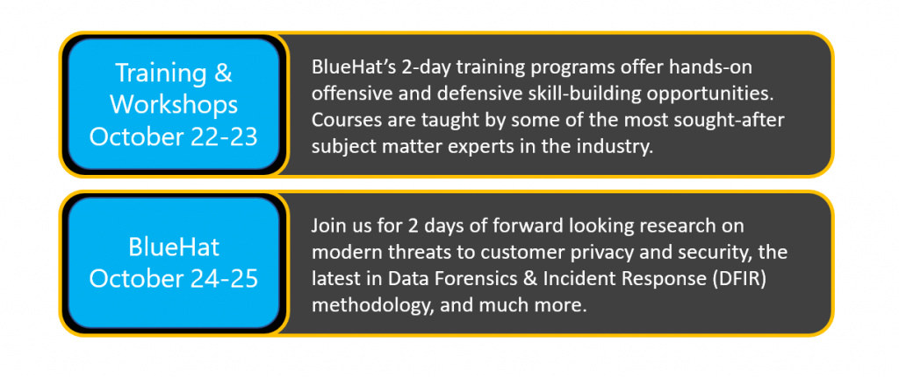

<!-- wp:paragraph -->

2019 has seen a phenomenal [BlueHatIL](https://www.bluehatil.com/) in February followed by a wildly successful [BlueHat Shanghai](https://www.microsoft.com/china/bluehatshanghai/2019/) in May… now it’s time to come back home for [BlueHat Seattle](https://www.microsoft.com/en-us/msrc/bluehat-conference)!

<!-- /wp:paragraph -->

<!-- wp:list -->

- 2 days of hands-on technical training (October 22-23, 2019)
- 2 days of conference talks from industry-leading security researchers and cyber defenders (October 24-25, 2019)
- great creative spaces ready to spark thought-provoking conversations and collaborative partnerships

<!-- /wp:list -->

<!-- wp:paragraph -->

The **Call for Papers (CFP)** for BlueHat Seattle 2019 is now open through **September 20, 2019**. Come share your new, innovative ideas and start a great conversation with fellow security researchers and defenders! Tell us about your experiments, successes, and failures. Here are some possible topics we have in mind. These are meant to be inspirations, not limitations.

<!-- /wp:paragraph -->

<!-- wp:list -->

- Cloud security
- AI/ML security
- Internet of Things security
- Supply chain security
- Digital Forensics/Incident Response themes
- Privacy issues
- Vulnerability and malware research

<!-- /wp:list -->

<!-- wp:paragraph -->

If you are interested in speaking at BlueHat Seattle, please review the CFP information and submit your talk via <https://aka.ms/bhcfp>. Speaker notification will occur by September 30th. Please see the CFP for details on speaker benefits.

<!-- /wp:paragraph -->

<!-- wp:heading -->

## **BlueHat at a glance**

<!-- /wp:heading -->

<!-- wp:paragraph -->

_Registration opens September 16, 2019_

<!-- /wp:paragraph -->

<!-- wp:image {"id":11016} -->

<!-- /wp:image -->

<!-- wp:heading -->

## **Wait, did you say _Seattle_?**

<!-- /wp:heading -->

<!-- wp:paragraph -->

That’s right, BlueHat is moving across the 520 bridge into the vibrant Emerald City! We can’t wait to see you at BlueHat _Seattle_ this fall!

<!-- /wp:paragraph -->

<!-- wp:paragraph -->

_Laura Wolf, Senior Program Manager, Microsoft Security Response Center (MSRC)_

<!-- /wp:paragraph -->
