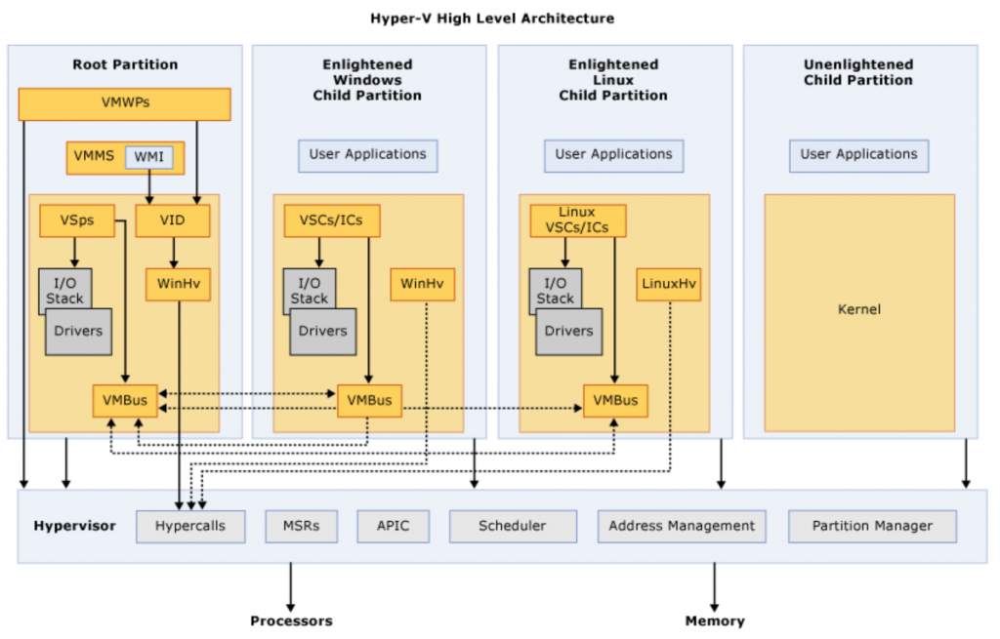
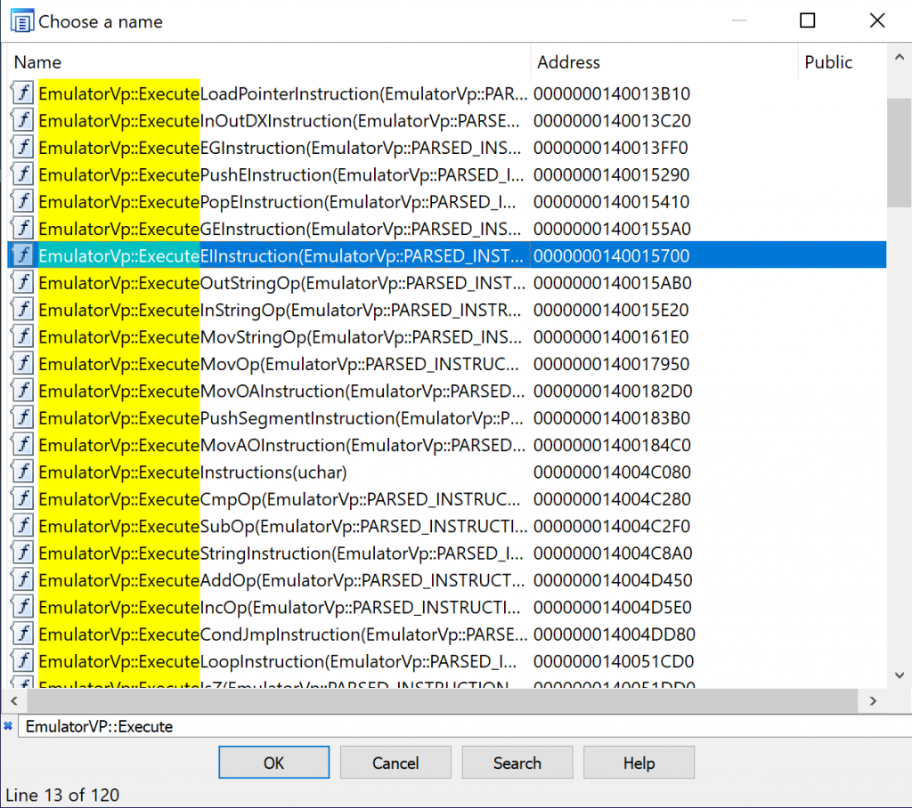
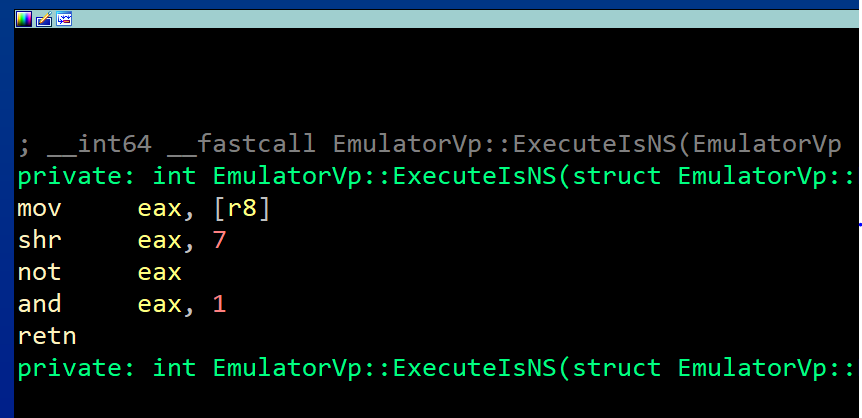
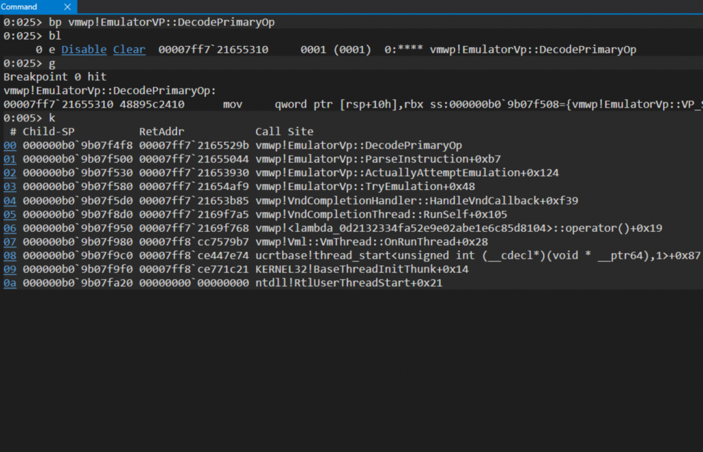
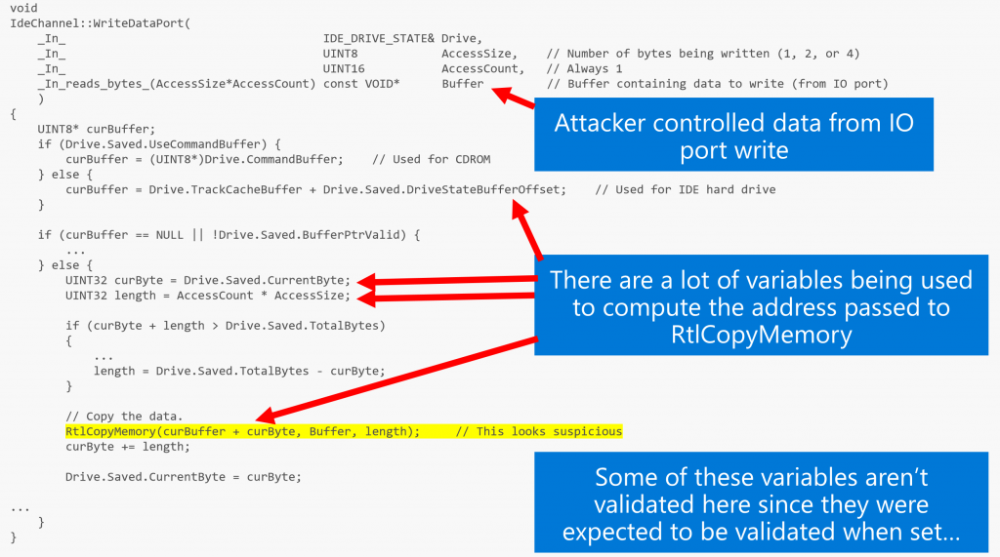
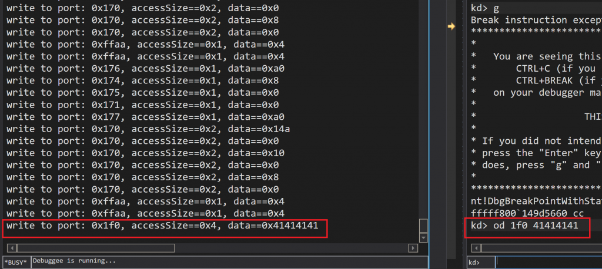
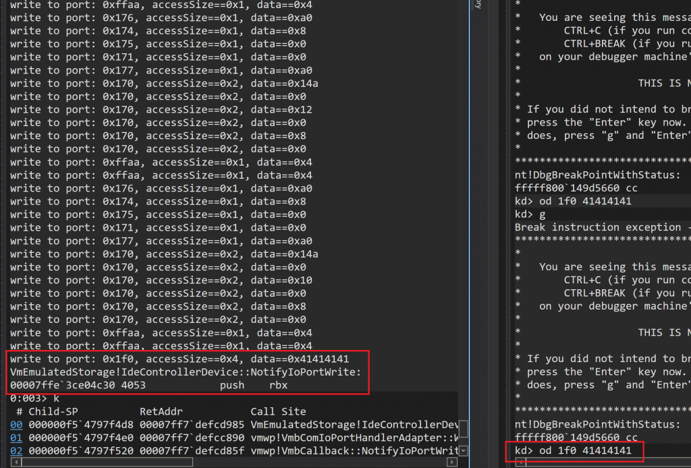
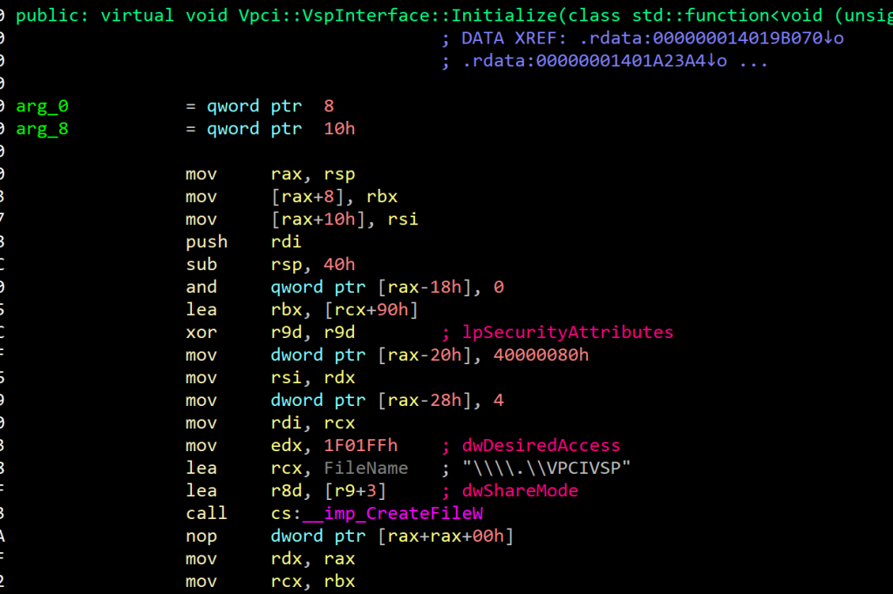

<!-- wp:paragraph -->

In the past year we invested a lot of time making Hyper-V research more accessible to everyone. Our first blog post, “[First Steps in Hyper-V Research](https://blogs.technet.microsoft.com/srd/2018/12/10/first-steps-in-hyper-v-research/)”, describes the tools and setup for debugging the hypervisor and examines the interesting attack surfaces of the virtualization stack components. We then published “[Fuzzing para-virtualized devices in Hyper-V](https://blogs.technet.microsoft.com/srd/2019/01/28/fuzzing-para-virtualized-devices-in-hyper-v/)”, which has been the focus of our friends at the Virtualization Security Team. In this blog they dig deep into the VSPs-VSCs communication via VMBus and describe an interesting guest-to-host vulnerability in vPCI VSP, which resides in the root partition’s kernel (vpcivsp.sys). In August, [Joe Bialek](https://twitter.com/JosephBialek) gave an amazing [talk](https://github.com/microsoft/MSRC-Security-Research/blob/master/presentations/2019_08_BlackHatUSA/BHUSA19_Exploiting_the_Hyper-V_IDE_Emulator_to_Escape_the_Virtual_Machine.pdf) at Black Hat, describing how he exploited another vulnerability in the IDE emulator, which resides in the Virtual Machine Worker Process (VMWP). With that, it’s time we dig deeper into the internals of VMWP, and consider what other vulnerabilities might be there.

<!-- /wp:paragraph -->

<!-- wp:heading {"level":1} -->

# What is the Virtual Machine Worker Process?

<!-- /wp:heading -->

<!-- wp:paragraph -->

One of the largest attack surfaces in our virtualization stack is implemented in the userspace of the root partition and resides in the Virtual Machine Worker Process (VMWP.exe). When running Hyper-V, there is one instance of VMWP.exe process for each of the virtual machines. As we stated in the first blog post, here are a few examples of components that reside in VMWP:

<!-- /wp:paragraph -->

<!-- wp:list -->

- vSMB Server
- Plan9FS
- IC (Integration components)
- Virtual Devices (Emulators, non-emulated devices)

<!-- /wp:list -->

<!-- wp:paragraph -->

You may think of the VMWP as our “[QEMU](https://www.qemu.org/)”-style process. We need a component to implement emulated/non-emulated devices, and we strongly prefer to implement it in userspace rather than kernelspace. Components like that are usually very complex, and complex things are hard to implement correctly… and that’s where you get into the picture. VMWP seems like a good place to look for vulnerabilities: it’s fairly easy to debug, it has a huge attack surface, and it implements complex drivers. Oh, and you’ve got [public symbols](https://docs.microsoft.com/en-us/virtualization/community/team-blog/2018/20180425-hyper-v-symbols-for-debugging) to work with.

<!-- /wp:paragraph -->

<!-- wp:paragraph -->

In this blog, I would like to talk a little bit about VMWP internals: classes, interfaces, responsibilities and the way it works.

<!-- /wp:paragraph -->

<!-- wp:heading {"level":1} -->

# VMWP internals

<!-- /wp:heading -->

<!-- wp:paragraph -->

Let’s dig into the internals of the worker process, looking at some of its components and the interesting flows for different operations. First, let’s look at the general virtualization architecture:

<!-- /wp:paragraph -->

<!-- wp:image {"id":11040} -->



<!-- /wp:image -->

<!-- wp:paragraph -->

The worker process runs in the root partition and communicates with the hypervisor through the Virtualization Infrastructure Driver (vid.sys). This driver also connects the hypervisor with the Virtual Machine Management Services (VMMS). VID sends management commands to the hypervisor using hypercalls, for operations such as:

<!-- /wp:paragraph -->

<!-- wp:list -->

- Create/delete partition
- Suspend/resume partition
- Dynamic memory
- Add/remove Virtual Processor

<!-- /wp:list -->

<!-- wp:paragraph -->

In addition, the VID also emulates MMIO (and ROMs).

<!-- /wp:paragraph -->

<!-- wp:paragraph -->

Since the worker process needs an interface to the VID, it uses a userspace library which has an interface to the driver, called vid.dll (as opposed to vid.sys). This interface is clear from the import table in VMWP.

<!-- /wp:paragraph -->

<!-- wp:paragraph -->

The VID Notification Dispatcher (VND) is a crucial component of this communication. The VND allows clients to register and receive VID notifications generated by actions performed by the guest. Most of the flows which end up in the worker process start with a VND notification. These are the possible VID notifications for x64:

<!-- /wp:paragraph -->

<!-- wp:preformatted -->

```
 typedef enum _VID_MESSAGE_TYPE
 {
        VidMessageInvalid = 0x0000,
  
        //
        // Message types corresponding to generic hypervisor intercepts.
        //
        VidMessageMbpAccess = 0x0001,
        VidMessageException = 0x0002 | VID_MESSAGE_TYPE_FLAG_INTERCEPT,
        VidMessageTripleFault = 0x0003 | VID_MESSAGE_TYPE_FLAG_INTERCEPT,
        VidMessageExecuteInstruction = 0x0004 | VID_MESSAGE_TYPE_FLAG_INTERCEPT,
        VidMessageMmio = 0x0005 | VID_MESSAGE_TYPE_FLAG_INTERCEPT,
        VidMessageRegister = 0x0006 | VID_MESSAGE_TYPE_FLAG_INTERCEPT,
  
        //
        // Message types corresponding to other monitored events.
        //
        VidMessageHandlerUnregistered = 0x0007,
        VidMessageStopRequestComplete = 0x0008,
        VidMessageMmioRangeDestroyed = 0x0009,
        VidMessageTerminateVm = 0x000A,
        VidMessageGuestControlForPageCopy = 0x000B,
  
        //
        // Message types for minimal partitions
        //
        VidMessagePassthroughIntercept = 0x000C | VID_MESSAGE_TYPE_FLAG_INTERCEPT,
        VidMessageStopRequestCompleteDirect = 0x000D | VID_MESSAGE_TYPE_FLAG_INTERCEPT,
  
        VidMessageApicEoi = 0x000E | VID_MESSAGE_TYPE_FLAG_INTERCEPT,
        VidMessageCpuid = 0x000F | VID_MESSAGE_TYPE_FLAG_INTERCEPT,
        VidMessageExecuteIoInstruction = 0x0010 | VID_MESSAGE_TYPE_FLAG_INTERCEPT,
        VidMessageMsr = 0x0011 | VID_MESSAGE_TYPE_FLAG_INTERCEPT,
  
        VidMessageTypeCount = 0x0012,
  
 } VID_MESSAGE_TYPE;
```

<!-- /wp:preformatted -->

<!-- wp:paragraph -->

Later in this post, we’ll see how important it is to understand those messages and their meaning. The VID is the glue that connects components in the virtualization stack, allowing components inside the guest to communicate with the worker process in the host. Another important interface to the worker process is the VMB (Virtual Mother Board) interface, used by VDEVs to communicate with the worker process.

<!-- /wp:paragraph -->

<!-- wp:paragraph {"backgroundColor":"pale-cyan-blue"} -->

Tip: You can find the names and values of this enum in _vmwp!TraceVidMessageDetails_. It’s nice to have tracers doing all the reversing for you sometimes (spoiler – not the only one in this area).

<!-- /wp:paragraph -->

<!-- wp:paragraph -->

Armed with some better understanding about how communication is done over VID messages, we can dig into some components and start setting breakpoints to inspect the notifications and data. We will see later how we trace the flow from VID to the logic that happens in a vmwp component and back.

<!-- /wp:paragraph -->

<!-- wp:heading {"level":1} -->

# Key components of the worker process

<!-- /wp:heading -->

<!-- wp:paragraph -->

Let’s start with an overview of some of the key components in the worker process.

<!-- /wp:paragraph -->

<!-- wp:heading -->

## Instruction Decoder

<!-- /wp:heading -->

<!-- wp:paragraph -->

There is an x86 emulator inside the worker process, implemented in a class called _EmulatorVP_. This class emulates execution of x86 and x64 instructions. Its purpose is to speed up cases of intercept-intensive code in a child partition by staying in the worker process context between intercepts, as vmentries/vmexits has a serious performance overhead. This class is not small (~250 functions), but some of the flows are easy to understand. Let’s discuss some of its subcomponents:

<!-- /wp:paragraph -->

<!-- wp:list -->

- _EmulatorVp::Execute\*Instruction_ and _EmulatorVP::Execute\*Op_. Both are collections of functions intended to emulate the execution of many instructions. The _Execute\*Instruction_ function family has different levels of abstractions. After performing basic general operations/checks, they call to _Execute\*Op_ functions family, which contains more specific functions.

<!-- /wp:list -->

<!-- wp:image {"id":11041} -->



<!-- /wp:image -->

<!-- wp:paragraph -->

_EmulatorVp::ExecuteIs\*_ is a collection of functions to retrieve values of the RFLAGS. Many instructions need to check some conditions (such as Overflow/Zero/Sign/Carry). All the flags are stored in a constant union _RFLAGS_, as can be viewed in one of those handlers:

<!-- /wp:paragraph -->

<!-- wp:image {"id":11066} -->



<!-- /wp:image -->

<!-- wp:list {"ordered":true} -->

1. _EmulatorVP::Decode\*_ - if we do emulation, we have to decode the instructions as well. For that, there are many functions in the form of _EmulatorVP::decode\*_, which is responsible for parsing the instructions and redirecting the flow to the relevant handlers of each emulated instruction.

<!-- /wp:list -->

<!-- wp:paragraph {"backgroundColor":"pale-cyan-blue"} -->

Note: There are more examples of that sort, I’ll leave it up to you to look them up!

<!-- /wp:paragraph -->

<!-- wp:paragraph -->

To get a better understanding of how that logic gets into the big picture, let’s look at a logic flow. For instance, here’s the call stack when _EmulatorVP::DecodePrimaryOp_ runs:

<!-- /wp:paragraph -->

<!-- wp:image {"id":11083} -->



<!-- /wp:image -->

<!-- wp:paragraph -->

The _VndCompletionThread_ pulls messages from a VID messages queue (now you see why we covered VID in the beginning of this post). Once _VndCompletionThread_ gets such a message, it handles it in the appropriate way. This flow is an example for the _VidMessageExecuteIoInstruction_ VID message type, which we saw earlier, in the _VID_MESSAGE_TYPE_ enum definition. The switchcase for all the messages is in _VndCompletionHandler::HandleVndCallback_, called from _VndCompletionThread::RunSelf_.

<!-- /wp:paragraph -->

<!-- wp:paragraph {"backgroundColor":"pale-cyan-blue"} -->

Note: remember those functions. Most of the interesting flows originate from them.

<!-- /wp:paragraph -->

<!-- wp:heading -->

## Devices

<!-- /wp:heading -->

<!-- wp:paragraph -->

Now that you’ve seen how intercepts end up in the VMWP instructions emulator, let’s talk about devices. Any virtualization platform needs to perform devices emulation. In KVM-based platforms on PCs, it is usually the QEMU process.

<!-- /wp:paragraph -->

<!-- wp:paragraph -->

You have probably heard of “emulated devices” and “para-virtualized devices". We can divide the virtualized devices into 3 categories, described below:

<!-- /wp:paragraph -->

<!-- wp:list -->

- **Emulated Devices:** Full software emulation of a hardware device. This is very useful in cases when we wish to run a guest without any modifications that make the guest aware that it is not running on physical hardware (for example, emulated e1000 NICs when the host NIC is different).
- **Para-virtualized:** Para-virtualization is the concept of modifying a guest so it is aware it’s running in a virtual environment, either to reduce virtualization complexity or to achieve higher performance. In the context of devices, hypervisors usually implement some virtual devices that don't emulate any real existing physical hardware but instead are designed to exist only in virtual form.
- **Direct access (passthrough):** as it sounds. The hypervisor simply lets the guest access and communicate directly with the device in hardware. This impacts performance, and virtualization platforms do this for certain devices. It sometimes required for hardware support, otherwise the device will be only available in a single guest partition.

<!-- /wp:list -->

<!-- wp:paragraph -->

All the VSPs described in the previous [post](https://blogs.technet.microsoft.com/srd/2019/01/28/fuzzing-para-virtualized-devices-in-hyper-v/) on vPCI are para-virtualized (PV). For storage, network and vPCI, there are drivers in the host kernel which serve requests from the guest kernel. Now, it’s time to see some emulated devices.

<!-- /wp:paragraph -->

<!-- wp:paragraph -->

Take for instance PCI-ISA bus. There is a class implemented in _vmemulateddevices.dll_, called _IsaBusDevice_. Start to reverse that class methods and logic, and you’ll see the actual implementation emulating an Intel chipset called PIIX (for PCI-to-ISA / IDE Xcelerator). Or, the class _EthernetCard_ implemented in _VmEmulatedNic.dll_, which implements the following PCI ethernet cards specs: DEC 21041, DEC 21140A and DEC 21143. The list goes on and on. There are many emulated/non-emulated devices implemented in the worker process binary or in the dlls it loads:

<!-- /wp:paragraph -->

<!-- wp:table {"hasFixedLayout":true,"align":"full","className":"is-style-stripes"} -->

|                       |                                                           |                                                                                                                                   |
| --------------------- | --------------------------------------------------------- | --------------------------------------------------------------------------------------------------------------------------------- |
| **DLLs**              | **Responsibility**                                        | **Devices/Logics in scope**                                                                                                       |
| VmEmulatedDevices.dll | Emulates many devices above 1250 and 1500 functions       | PitDevice PicDevice PciBusDevice SpeakerDevice IsaBusDevice Ps2Keyboard I8042Device VideoS3Device VideoDevice DmaControllerDevice |
| vmuidevices.dll       | Emulates many devices, over 1500 functions                | VideoDevice VideoDirt InputManager SynthMouseDevice SynthKeyboardDevice HidDevice SynthRdpServerConnection VideoSynthDevice       |
| vmEmulatedNic.dll     | Network card devices                                      | Class _EthernetDevice_, emulates the following cards: DEC 21041, DEC 21140A, DEC 21143                                            |
| VmEmulatedStorage.dll | Storage devices                                           | IdeControllerDevice IdeOpticalDrive IdeHardDrive IdeChannel DiskMetricDevice FloppyDrive                                          |
| winHvEmulation.dll    | x86 instructions emulation at UM (_EmulatorVP_ functions) | N/A                                                                                                                               |
| Vmchipset.dll         | Emulates many chipsets                                    | IoApicEmulator PowerManagementEmulator                                                                                            |

<!-- /wp:table -->

<!-- wp:paragraph -->

Let’s see how a full flow to that code area looks like. What happens from the moment a guest executes a certain instruction, which needs certain emulation, until the relevant function in one of the mentioned libraries handles the required emulation?

<!-- /wp:paragraph -->

<!-- wp:paragraph -->

First, let’s consider the generic design, which will help when exploring other components in this area. Consider the PCI config function _NotifyPciConfigAccess_:

<!-- /wp:paragraph -->

<!-- wp:preformatted -->

```
 STDMETHOD(NotifyPciConfigAccess)(
         _In_ PCI_BUS_NUMBER         Bus,
         _In_ PCI_DEVICE_NUMBER      DeviceNumber,
         _In_ PCI_FUNCTION_NUMBER    FunctionNumber,
         _In_ UINT16                 InRegAddress,
         _In_ BOOLEAN                InIsWrite,
         _Inout_ UINT32*             IoData
         );
```

<!-- /wp:preformatted -->

<!-- wp:paragraph -->

This is the definition of a function in an interface, used to describe devices that has PCI configuration access handlers (the worker process is written in C++). A few classes implement this interface and override that method with their own implementation:

<!-- /wp:paragraph -->

<!-- wp:preformatted -->

```
 0:035> x *!*NotifyPciConfigAccess
 00007ffc`1fdafeb0 vmchipset!VmEmu::WCL::PciHandler::NotifyPciConfigAccess
 00007ffc`477047c0 VmEmulatedStorage!IdeControllerDevice::NotifyPciConfigAccess
 00007ffc`4c56c5e0 vmemulateddevices!VideoS3Device::NotifyPciConfigAccess
 00007ffc`4c556300 vmemulateddevices!IsaBusDevice::NotifyPciConfigAccess

```

<!-- /wp:preformatted -->

<!-- wp:paragraph -->

That’s for the PCI config. We can also see the handlers for read/write access, which probably have more parsing of guest-controlled data. The handlers extract the bus number, device number, function number, register address and type code. All of that needs sanitization and bounds checks; check out _PciBusDevice::PciConfigIoWrite_ for an example. The code there should be fairly easy to reverse engineer, due to debug trace with strings explaining their purpose. For example:

<!-- /wp:paragraph -->

<!-- wp:preformatted -->

```
 if ((unsigned int)VmlIsDebugTraceEnabled(0xC0C5i64))
 VmlDebugTrace(
        0xC0C5i64,
        L"Write to PCI Data Port %04X [bus=%02X, unit=%02X, func=%02X, reg=%02X]: %08X",
        ioAddr, …);
```

<!-- /wp:preformatted -->

<!-- wp:paragraph -->

If you saw Joe Bialek’s [talk](https://github.com/microsoft/MSRC-Security-Research/blob/master/presentations/2019_08_BlackHatUSA/BHUSA19_Exploiting_the_Hyper-V_IDE_Emulator_to_Escape_the_Virtual_Machine.pdf) from Blackhat 2019, you saw how important it is to sanitize correctly the data that reaches through the WriteIOPort handler inside the IDE emulator (storage) - _IDEControllerDevice::NotifyIoPortWrite_. Let’s see how we can debug the entire flow from the guest partition into the worker process on the host.

<!-- /wp:paragraph -->

<!-- wp:paragraph -->

To set a baseline, let’s recap CVE-2018-0959. The vulnerability resides in a storage emulator, and the root cause is that the code which handles read/write IO ports lacks validation on guest-controlled data. See this picture from Joe’s talk for an illustration:

<!-- /wp:paragraph -->

<!-- wp:image {"id":11035} -->



<!-- /wp:image -->

<!-- wp:paragraph -->

Seeing the entire flow from the guest to that function in the worker process on the host will help with understanding the full picture, and might help you find new bugs! So let’s debug. Consider the following instruction, running in the guest partition:

<!-- /wp:paragraph -->

<!-- wp:preformatted -->

```
     out 0x1f0, 0x41414141
```

<!-- /wp:preformatted -->

<!-- wp:paragraph -->

This is a privileged instruction, so we can’t execute it directly from userspace. We have two options:

<!-- /wp:paragraph -->

<!-- wp:list {"ordered":true} -->

1. Write our own kernel driver which exposes an interface to userspace, and read/write from/to IO ports for us
2. Open a kernel debugger and execute it there

<!-- /wp:list -->

<!-- wp:paragraph -->

If we were going to write a full exploit we would choose the first option. For just running the instruction and debugging the worker process in usermode, the second option will work.

<!-- /wp:paragraph -->

<!-- wp:paragraph {"backgroundColor":"pale-cyan-blue"} -->

Note: In the following screenshots, the vmwp debugger is on the left and kd is on the right.

<!-- /wp:paragraph -->

<!-- wp:paragraph -->

Let’s say we would like to set a breakpoint on write to io port in the IDE storage emulator. The relevant function is _vmEmulatedStorage!IDEControllerDevice::NotifyIoPortWrite_. So, by setting the following breakpoint:

<!-- /wp:paragraph -->

<!-- wp:preformatted -->

```
bp vmemulatedstorage!IdeControllerDevice::NotifyIoPortWrite ".printf \"write to port: 0x%x, accessSize==0x%x, data==0x%x\r\n\", @rdx, @r8, @r9;g"
```

<!-- /wp:preformatted -->

<!-- wp:image {"id":11110} -->



<!-- /wp:image -->

<!-- wp:paragraph -->

We can get all writes to IO ports passing through the IDE emulator. Among all of them we can see ours, with controlled data, at the bottom left. Note that the traces stopped, since I break into the kernel debugger. Nothing is running at that moment in the guest's kernel, but the write we did via the debugger still passed to the host usermode, as the hypervisor and the host are still running.

<!-- /wp:paragraph -->

<!-- wp:paragraph -->

Now, let's say that we want to inspect and analyze the call stack to our specific flow. We can change our breakpoint as follows:

<!-- /wp:paragraph -->

<!-- wp:preformatted -->

```
bp vmemulatedstorage!IdeControllerDevice::NotifyIoPortWrite ".printf \"write to port: 0x%x, accessSize==0x%x, data==0x%x\\r\\n\", @rdx, @r8, @r9; .if(@r9 != 41414141) {g;};"
```

<!-- /wp:preformatted -->

<!-- wp:image {"id":11111} -->



<!-- /wp:image -->

<!-- wp:paragraph -->

Here we can see the call stack, which is similar to the instruction emulation example: through VND to the emulated storage device.

<!-- /wp:paragraph -->

<!-- wp:paragraph -->

This might be a good point to point out on some good targets to breakpoint on. Here is a list of interesting functions and their role in the game.

<!-- /wp:paragraph -->

<!-- wp:table {"hasFixedLayout":true,"align":"wide","className":"is-style-stripes"} -->

|                                                              |                                                                                                                                                                                                                                                                                        |
| ------------------------------------------------------------ | -------------------------------------------------------------------------------------------------------------------------------------------------------------------------------------------------------------------------------------------------------------------------------------- |
| **Function**                                                 | **Description**                                                                                                                                                                                                                                                                        |
| VndCompletionHandler::HandleVndCallback                      | Called when we receive an IO completion event. This is the root point of most flows handling requests/data coming from the guest                                                                                                                                                       |
| EmulatorVp::TryIoEmulation                                   | Emulates simple IO instruction (includes strings IO instructions)                                                                                                                                                                                                                      |
| VmbCallback::NotifyIoPortWrite                               | The general handler for IO port writes. It calls to the relevant device's handler                                                                                                                                                                                                      |
| EmulatorVp::Execute\*Instruction and EmulatorVP::Execute\*Op | Emulate the execution of many instructions                                                                                                                                                                                                                                             |
| EmulatorVp::GenerateEvent                                    | Generates an event in the guest. Events may be exceptions, guest nested page fault, etc. This function is important since most events injection into the guest goes through here. For instance, injecting page fault and protection fault into the guest are done using this function. |

<!-- /wp:table -->

<!-- wp:heading -->

## Para-virtualized devices

<!-- /wp:heading -->

<!-- wp:paragraph -->

Now, let’s talk about how the worker process can assign new PCI devices for the guest. The worker process implements an interface called _VpciBus_ for that. This code wraps the ioctl API that vPCI VSP exposes (we need to talk to the device somehow). As we discussed in the [previous blogpost](https://msrc-blog.microsoft.com/2019/01/28/fuzzing-para-virtualized-devices-in-hyper-v/), VSPs are drivers that run in the root’s kernelspace. They communicate over VMBus with Virtualization Service Consumers (VSCs) that run in the guest’s kernelspace. You can spot the code inside VMWP that opens a HANDLE to the exposed device by vpcivsp.sys:

<!-- /wp:paragraph -->

<!-- wp:image {"id":11064} -->



<!-- /wp:image -->

<!-- wp:paragraph -->

Using that HANDLE, VMWP issues ioctls asking from the vPCI VSP device to perform many tasks, exposed through ioctls to the vPCI VSP. One example of such is IOCTL*VPCI_ASSIGN_DEVICE, mapped to the function \_vpcivsp!VpciIoctlAssignDevice* inside the kernel driver vpcipvsp.sys, and responsible for assigning devices to a guest. We can see that call from the function _VMWP!VpciBus::AssignDevice_.

<!-- /wp:paragraph -->

<!-- wp:paragraph {"backgroundColor":"pale-cyan-blue"} -->

Note: This is for PCI devices. Another example is the emulation of the two [8237 DMA controllers](https://en.wikipedia.org/wiki/Intel_8237), found on a PC’s motherboard. Look for the class vmemulateddevices!DmaControllerDevice in the vmemulateddevices.dll, which implements both of them, if you want to learn more.

<!-- /wp:paragraph -->

<!-- wp:heading {"level":1} -->

# CVEs related to the Virtual Machine Worker Process

<!-- /wp:heading -->

<!-- wp:paragraph -->

Let’s look at an example of an actual CVE. Joe Bialek describes CVE-2018-0959 and an exploit in [Exploiting the Hyper-V IDE Emulator to Escape the Virtual Machine](https://github.com/microsoft/MSRC-Security-Research/blob/master/presentations/2019_08_BlackHatUSA/BHUSA19_Exploiting_the_Hyper-V_IDE_Emulator_to_Escape_the_Virtual_Machine.pdf), so we will discuss a different vulnerability here.

<!-- /wp:paragraph -->

<!-- wp:paragraph -->

CVE-2018-0888 was briefly mentioned in last year’s Blackhat talk - [A Dive into Hyper-V Architecture and Vulnerabilities](https://github.com/microsoft/MSRC-Security-Research/blob/master/presentations/2018_08_BlackHatUSA/A%20Dive%20in%20to%20Hyper-V%20Architecture%20and%20Vulnerabilities.pdf), by [Joe](https://twitter.com/JosephBialek) and [Nico](https://twitter.com/n_joly). The root cause of the vulnerability is uninitialized memory during MMIO emulation. The function _BatteryEmulator::MmioRead()_ should initialize ReadBuffer, and it looked like this:

<!-- /wp:paragraph -->

<!-- wp:preformatted -->

```
 void
 BatteryEmulator::MmioRead(
     std::uint64_t /* RangeBase */,
     std::uint64_t RangeOffset,
     std::uint64_t NumberOfBytes,
     _Out_writes_bytes_(NumberOfBytes) void* ReadBuffer
     ) noexcept
 {
     UINT32 readValue = 0;
  
     if (NumberOfBytes != 4)
     {
         // log illegal read size
         return;
     }
...
```

<!-- /wp:preformatted -->

<!-- wp:paragraph -->

Clearly, if NumberOfBytes==0, the buffer remained uninitialized. This was fixed by forcing initialization of the buffer before calling _BatteryEmulator ::MmioRead_.

<!-- /wp:paragraph -->

<!-- wp:paragraph -->

And, we may view the callstack:

<!-- /wp:paragraph -->

<!-- wp:preformatted -->

```

 0:001> kc
 Call Site
 vmchipset!BatteryEmulator::NotifyMmioRead
 vmwp!VmbComMmioHandlerAdapter::ReadCallback
 vmwp!VmbCallback::NotifyMmioRead
 vmwp!VND_HANDLER_CONTEXT::NotifyMmioRead
 vmwp!EmulatorVp::DispatchMmioOperation
 vmwp!EmulatorVp::FinishReadMemoryOperation
 vmwp!EmulatorVp::FinishReadModRmOperation
 vmwp!EmulatorVp::ExecuteGEInstruction
 vmwp!EmulatorVp::ExecuteInstructions
 vmwp!EmulatorVp::ActuallyAttemptEmulation
 vmwp!EmulatorVp::TryEmulation
 vmwp!VndIce::HandleExecutionRequest
 vmwp!VndCompletionHandler::HandleVndCallback
 vmwp!VndCompletionThread::RunSelf
 vmwp!<lambda_0d2132334fa52e9e02abe1e6c85d8104>::operator()
 vmwp!Vml::VmThread::Run
 vmwp!Vml::VmThread::OnRunThread
 ucrtbase!invoke_thread_procedure
 ucrtbase!thread_start<unsigned int (__cdecl*)(void * __ptr64)>
 KERNEL32!BaseThreadInitThunk ntdll!RtlUserThreadStart
```

<!-- /wp:preformatted -->

<!-- wp:heading {"level":1} -->

# Hardening VMWP

<!-- /wp:heading -->

<!-- wp:paragraph -->

Well, we can clearly agree on the fact that the worker process exposes a very good attack surface for guest-to-host vulnerabilities, so we invest time and effort in hardening it. We took the following steps:

<!-- /wp:paragraph -->

<!-- wp:list {"ordered":true} -->

1. CFG – we enabled both:

   - CFG export suppression (large reduction in number of valid CFG targets).
   - “Force CFG” – only CFG-enabled modules can be loaded.

2. Enabled ACG (Arbitrary Code Guard)

   - Doesn’t allow allocation/mapping of +X pages.
   - Doesn’t allow manipulation of +X pages’ protection.

3. Enabled CIG (Code Integrity Guard)

   - Doesn’t allow loading of unsigned DLLs.

4. Removed _SeImpersonatePrivilege_

<!-- /wp:list -->

<!-- wp:paragraph {"backgroundColor":"pale-cyan-blue"} -->

Note: CFG export suppression kills the exploit presented in Black Hat 2019, the concept of calling _VirtualProtect_ (which was allowed in the bitmap), in order to make _\_guard_check_icall_fptr_ writeable, and make it point to a no-op function.

<!-- /wp:paragraph -->

<!-- wp:paragraph -->

In general, we prefer to set up components in the worker process rather than the kernel as VSPs, However, given strong primitives, exploitation will always be possible (with hard work). Two approaches that immediately jump to mind are:

<!-- /wp:paragraph -->

<!-- wp:list -->

- Even with all the mitigations enabled, nothing validates the integrity of the return addresses on the stack. So arbitrary reads/writes could gain us code execution via ROP.
- There is still a large range of opportunities an attacker could turn to, even with memory corruption primitives. For example, you could refer to filesystem APIs and try to gain code execution in other services using CreateFile/WriteFile/etc. An attacker could take other approaches as well.

<!-- /wp:list -->

<!-- wp:paragraph -->

In this blog, you’ve seen how much attack surface is exposed in the worker process. We encourage anybody interested in attacking the virtualization stack have a look at it for [bounty](https://www.microsoft.com/en-us/msrc/bounty-hyper-v). We saw how communication between components works, analyzed key debugging scenarios, and listed the relevant mitigations to keep in mind. With those tools, I hope to see more researchers digging and finding interesting bugs!

<!-- /wp:paragraph -->

<!-- wp:paragraph -->

Feel free to DM me on Twitter ([@AmarSaar](https://twitter.com/AmarSaar)) with any questions you might have.

<!-- /wp:paragraph -->

<!-- wp:paragraph -->

_Saar Amar, MSRC-IL_

<!-- /wp:paragraph -->
