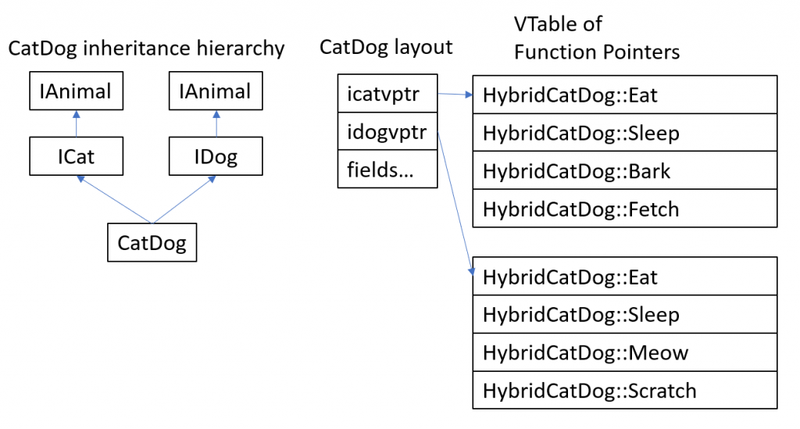

<!-- wp:paragraph -->

I interned with Microsoft as a Software Engineering Intern in the MSRC UK team in Cheltenham this past summer. I worked in the Safe Systems Programming Language (SSPL) group, which explores safe programming languages as a proactive measure against memory-safety related vulnerabilities.

<!-- /wp:paragraph -->

<!-- wp:paragraph -->

This blog post describes the project that I have been working on under the mentorship of the SSPL team. Hopefully, this provides additional insight into the work Microsoft interns do!

<!-- /wp:paragraph -->

<!-- wp:heading -->

## Project Overview

<!-- /wp:heading -->

<!-- wp:paragraph -->

My goal was to build an [open-sourced Rust library ](https://github.com/microsoft/com-rs/)that will allow developers to both consume and produce in-process [Component Object Model (COM)](https://docs.microsoft.com/en-us/windows/win32/com/component-object-model--com--portal) components in an idiomatic manner.

<!-- /wp:paragraph -->

<!-- wp:paragraph {"backgroundColor":"pale-cyan-blue"} -->

Note: There are existing Rust crates that provide COM support, including [winapi-rs](https://github.com/retep998/winapi-rs), [Intercom](https://github.com/Rantanen/intercom), [XPCOM](https://searchfox.org/mozilla-central/source/xpcom/rust/xpcom), [com-impl](https://github.com/Connicpu/com-impl), [com-impl-rs](https://github.com/GabrielMajeri/com-impl-rs) and [com-rs](https://github.com/Eljay/com-rs). Having these crates as references allowed us to make well-informed design decisions that laid the foundation for this library.

<!-- /wp:paragraph -->

<!-- wp:paragraph -->

For the uninitiated, COM is a language-agnostic, object-oriented standard for creating binaries. Thanks to COM having an extremely well-defined Application Binary Interface (ABI), binaries that support this standard can interoperate with each other, regardless of the language they are written in.

<!-- /wp:paragraph -->

<!-- wp:paragraph -->

A COM component exposes its data through a set of interfaces. For each interface, a Virtual Method Table (vtable) is defined, similar to a C++ object’s layout for virtual functions. These vtables contain function pointers to the actual function implementations. The COM component then stores pointers to these vtables, also known as vpointers. The picture below illustrates this.

<!-- /wp:paragraph -->

<!-- wp:image {"id":11165,"width":844,"height":169} -->

<!-- /wp:image -->

<!-- wp:image {"id":11166} -->

<!-- /wp:image -->

<!-- wp:paragraph -->

By enforcing the layout of function pointers in vtables, COM allows any language to map internal data types to that of a COM object’s vtable. This provides any language with the information they need to dereference the correct function pointer and thus call the corresponding exposed function on a COM object.

<!-- /wp:paragraph -->

<!-- wp:paragraph {"backgroundColor":"pale-cyan-blue"} -->

Note: There are other fundamental mechanisms behind COM (such as DLL entry points, COM object instantiation, etc.) that I won’t be covering here. For more details, I highly recommend COM reference on [MSDN](https://docs.microsoft.com/en-us/windows/win32/com/the-component-object-model) as well as [Essential COM by Don Box](https://books.google.com/books/about/Essential_COM.html?id=kfRWvKSePmAC).

<!-- /wp:paragraph -->

<!-- wp:heading -->

## Why enable Rust support for COM?

<!-- /wp:heading -->

<!-- wp:paragraph -->

As part of an attempt to eliminate a class of vulnerabilities, Microsoft is investigating the [adoption of safer systems programming language](https://msrc-blog.microsoft.com/2019/07/16/a-proactive-approach-to-more-secure-code/)s. As we discussed in an [earlier blog](https://msrc-blog.microsoft.com/2019/07/22/why-rust-for-safe-systems-programming/), one such language is Rust. One of the challenges of Rust adoption is interoperability with C++ and existing Microsoft tooling. COM is a standard used widely in Microsoft and supporting it is a necessary step towards interoperability with existing components.

<!-- /wp:paragraph -->

<!-- wp:paragraph -->

Outside of Microsoft, the aim of this library is also to allow COM developers to leverage the Rust compiler’s memory safety guarantees to create more secure COM components. We examine this impact and associated challenges in greater detail later, when we talk about writing safe wrappers for COM interactions.

<!-- /wp:paragraph -->

<!-- wp:heading -->

## Implementation/project design

<!-- /wp:heading -->

<!-- wp:paragraph -->

In this section, we will explain how our library will work in practice.

<!-- /wp:paragraph -->

<!-- wp:paragraph {"backgroundColor":"pale-cyan-blue"} -->

Note: Along the way, there will be snippets of behind-the-scenes design decisions, which we hope will help those joining the project.

<!-- /wp:paragraph -->

<!-- wp:paragraph -->

One of the primary goals of this project was to create an idiomatic library for Rust developers to consume and produce COM components. Much of writing COM interactions involve boilerplate code, which describes and generates the different vtable layouts. To make it idiomatic to use, we tried to abstract away the COM details as much as possible. Thankfully, Rust has an expressive macros system which allows us to achieve this abstraction!

<!-- /wp:paragraph -->

<!-- wp:paragraph -->

To consume a COM component, you must first describe the interface (here, IAnimal) in Rust.

<!-- /wp:paragraph -->

<!-- wp:image {"id":11167,"align":"center"} -->

<!-- /wp:image -->

<!-- wp:paragraph -->

To interact with a COM object that exposes the IAnimal interface, take two actions. First, instantiate the COM object, which returns you an interface pointer (a pointer to a vpointer). You do this through a Runtime struct, which controls the lifetime of the COM Library using CoInitializeEx/CoUninitialize.

<!-- /wp:paragraph -->

<!-- wp:image {"id":11168,"align":"center"} -->

<!-- /wp:image -->

<!-- wp:paragraph -->

Second, call methods through the interface pointer.

<!-- /wp:paragraph -->

<!-- wp:image {"id":11169} -->

<!-- /wp:image -->

<!-- wp:paragraph -->

Macro usage for the consumption side was relatively straightforward to implement, as COM abstracts the implementation details of COM components for consumers.

<!-- /wp:paragraph -->

<!-- wp:heading -->

## Create your own COM object

<!-- /wp:heading -->

<!-- wp:paragraph -->

On the production side of things, we spent most of the time trying to make the design both extensible and idiomatic. This wasn't easy. COM provides many implementation possibilities when creating a component, which we must be able to cover with our library. At first, we tried to completely abstract away the presence of the generated vtables that will make an object COM-compatible. We did this by wrapping the user-defined object in a struct we can term as ComBox. This ComBox holds the vpointers, which are then passed to consumers to interact with.

<!-- /wp:paragraph -->

<!-- wp:image {"id":11170,"align":"center"} -->

<!-- /wp:image -->

<!-- wp:paragraph -->

This worked well for basic COM. However, this solution was created under the assumption that users will never need to access their vpointers. This assumption proved to be wrong. There are many features that COM permits when creating a COM component. One of these features that enable code reuse is Aggregation, which allows you to expose another COM object’s interfaces as if it were your own. To enable aggregation at any point, users will need to explicitly provide the aggregated object with your own vpointer. Since this violates our original assumption, this affected our design decisions.

<!-- /wp:paragraph -->

<!-- wp:paragraph -->

We now know we need to hide the COM details, yet also provide experienced COM developers access to these details. Assume you want to create a COM component called CatDog which inherits from COM interfaces ICat and IDog. To do that, you would have to write something like this:

<!-- /wp:paragraph -->

<!-- wp:image {"id":11171,"align":"center"} -->

<!-- /wp:image -->

<!-- wp:image {"id":11172,"align":"center"} -->

<!-- /wp:image -->

<!-- wp:paragraph -->

Developers will define their user fields in the struct. The #\[co_class] macro then expands the struct to contain the COM fields (vpointers, ref_counts, etc.) A caveat here is that the user must implement a constructor “new”, within which it must initialise the COM fields through a macro-generated “allocate” function. The main difference here is that methods are defined on the wrapped struct containing the vpointers. This grants the user access to these fields since they are now within the same scope!

<!-- /wp:paragraph -->

<!-- wp:heading -->

## How safe is it, really?

<!-- /wp:heading -->

<!-- wp:paragraph -->

We’ve discussed how to use our library and some design decisions that we made. What’s the real impact of using Rust?

<!-- /wp:paragraph -->

<!-- wp:paragraph -->

Even though Rust provide memory safety guarantees, all bets are off when using the unsafe superset of the language. In this particular case, COM promotes interoperability between languages and these interactions will require frequent use of the unsafe superset of Rust. Here's why.

<!-- /wp:paragraph -->

<!-- wp:paragraph -->

The usual practice for Rust developers is to create safe wrappers around these interactions. These safe wrappers verify the raw pointers and convert them to safe types. A nullable pointer would be checked and converted to an Option, so developers must explicitly handle the null case, etc. Unfortunately, we couldn’t replicate this solution for our library. These wrappers are not foolproof. We can force users to handle null pointers explicitly, but what about dangling references? There is no way of verifying that the pointers passed to us don’t point to garbage or invalid memory. How can any of these wrappers be marked safe in Rust standards?

<!-- /wp:paragraph -->

<!-- wp:paragraph -->

A key difference between the above scenario and our library, is that they are wrapping around a specific **Library/API**. We are attempting to wrap around a **Standard/Protocol**. In their case, they can refer to documentation, inspect codebase, etc, before generating a safe wrapper specific to that library. This would be a valid case for marking the wrappers as safe as they have checked the unsafe code they are wrapping, making sure they return valid pointers. Since we are making a wrapper for a standard, not a specific library or API, we cannot guarantee that every single COM component will be implemented properly. Since we know nothing about the code we are wrapping, we can’t automatically mark these generated wrappers as safe. What we _can_ do is provide users with an option to mark interactions as safe, once they have done their due diligence.

<!-- /wp:paragraph -->

<!-- wp:image {"id":11173,"align":"center"} -->

@matthewhenry, Unsplash

<!-- /wp:image -->

<!-- wp:paragraph -->

If we can’t assume that wrappers are safe, where does that leave us in terms of impact? Using Rust will make it much easier for developers to write secure COM components compared to their C/C++ system languages counterparts. First, unsafe code is mostly written surrounding [Foreign Function Interface (FFI)](https://en.wikipedia.org/wiki/Foreign_function_interface) interactions. Developers can still write safe Rust code for logic flows independent from these FFI interactions. This is especially important when writing a new COM component. For example, multi-threaded data structures are often used for performant code. Logic flows behind these data structures are susceptible to data races. Due to compiler optimisations, these data races may in turn lead to memory-safety vulnerabilities that are hard to track down. Rust’s ownership model persists across threads, which eliminates the possibility of data races.

<!-- /wp:paragraph -->

<!-- wp:paragraph {"backgroundColor":"pale-cyan-blue"} -->

Note: This is just one example, but the point remains: there are many such logic flows that we can write safe Rust for, which will yield safer code.

<!-- /wp:paragraph -->

<!-- wp:paragraph -->

Second, Rust forces developers to take a conscientious and proactive approach towards handling memory safety. For example, developers must mark the above mentioned FFI interactions as unsafe, using the unsafe keyword in Rust. This signals the library users to investigate these FFI interactions and do due diligence on the COM objects they are interacting with. Having this signaling mechanism baked directly into the compiler is harder to miss than detailing these in code comments or documentation. As maintainers of the library, we are also forced to be diligent about memory safety. We need to be able to accurately assess code as safe or unsafe when exposing them, to conform to the safety standards of Rust.

<!-- /wp:paragraph -->

<!-- wp:paragraph -->

Lastly, it would be a shame if I worked in MSRC UK and didn’t include the perspective of the security engineers I have worked with! Having these explicit unsafe blocks drastically reduces the surface area that security engineers must comb through to identify memory safety vulnerabilities, as memory-safety vulnerabilities can only originate from unsafe code.

<!-- /wp:paragraph -->

<!-- wp:paragraph -->

As you can see, Rust developers have many tools at their disposal to write secure code, as well as to ensure safe usage of their code. Having these tools directly in the compiler instead of having to pick up external complex tooling helps increase productivity and security across the board.

<!-- /wp:paragraph -->

<!-- wp:heading -->

## What next?

<!-- /wp:heading -->

<!-- wp:paragraph -->

We explored the motivations behind this project. We have seen how it currently works, as well as examined the impact that it will have. What next?

<!-- /wp:paragraph -->

<!-- wp:paragraph -->

This project is now open-sourced and available on [GitHub](https://github.com/microsoft/com-rs/)! Whether you are interested in contributing or just curious about the project, we welcome you to check it out. We want to get as much feedback from the community as possible, since this is a library designed with user experience in mind. There are also many features of COM that we were not able to cover yet with this library. These include out-of-process interactions amongst other things. We can look at these once we have established a stable foundation based on the community’s feedback.

<!-- /wp:paragraph -->

<!-- wp:heading -->

## A final word

<!-- /wp:heading -->

<!-- wp:paragraph -->

This project challenged me from the first day till the last. Having to both pick up Rust and learn about COM pushed me far outside my comfort zone. However, the struggle has been met by an even greater extent of gratification from having seen the project through and learning so much.

<!-- /wp:paragraph -->

<!-- wp:paragraph -->

Through this internship at Microsoft, I got to work with and look through the lenses of some of the brightest minds I have seen. Thank you to the MSRC UK team for your hospitality and for empowering me as a team member. To my team members Ryan and Sebastian, thank you for being such a pleasure to work with on this project and for bailing me out of many obstacles. Finally, thank you to my mentor Sebastian for taking a leap of faith when entrusting me with this project, and for your patient guidance throughout.

<!-- /wp:paragraph -->

<!-- wp:paragraph -->

_Hadrian Wei Heng Lim, Software Engineer Intern\_\_, MSRC_

<!-- /wp:paragraph -->
