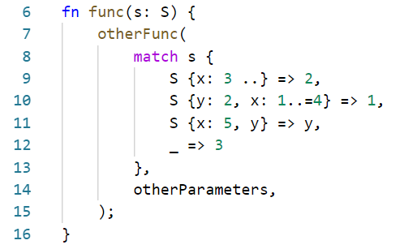

Over the course of my internship at the Microsoft Security Response Center (MSRC), I worked on the safe systems programming languages (SSPL) team to promote safer languages for systems programming where runtime overhead is important, as outlined in this [blog](https://msrc-blog.microsoft.com/2019/07/16/a-proactive-approach-to-more-secure-code/). My job was to port a security critical network processing agent into Rust to eliminate the memory safety bugs that had plagued it. I had never used Rust prior to this project, so here are my experiences learning the language while working on the port. I hope this is helpful to anyone else who’s learning the language.

## First lesson: Rust isn’t as hard as I expected

Rust has been touted as a difficult language to learn, but I didn’t find it that difficult, and certainly easier than C++. That may sound surprising, but we need to talk about comparing languages. It is easier to write a compiled program in C++ than Rust, but it is also easier for this program to be incorrect and unsafe. When comparing the difficulty of languages, we need to consider them in context of what code can be feasibly written as both a beginner and an experienced user of the language.

Learning Rust was great. It took me less than a month to be confident with the language (of course you are never done learning a language, but this was where I was confident to write anything required in Rust). I learned through the many [great resources](https://www.rust-lang.org/learn) and my strict teacher, the compiler. The compiler’s error messages are justly famous for how useful they are. Through the error messages, Rust enforces safe programming concepts by telling you exactly why the code isn’t correct, while providing possible suggestions on how to fix it. There is also a great community offering of tools and resources to learn and use Rust. I used the [Rust book](https://doc.rust-lang.org/stable/book/) and [Rust by example](https://doc.rust-lang.org/stable/rust-by-example/) (which I contributed back to), but there are many great unofficial resources out there such as [Rust for systems programmers](https://github.com/nrc/r4cppp) or [learning Rust with entirely too many linked lists](https://rust-unofficial.github.io/too-many-lists/index.html). The tooling is also very useful, with [Clippy](https://github.com/rust-lang/rust-clippy) for linting, [Rustfmt](https://github.com/rust-lang/rustfmt) for formatting, and [crates.io](https://crates.io/) with many packages for most problems that you may face.

Note: For my project I used a packet parsing crate to which I contributed with code to parse an extra packet type.

## Rust helped me grasp concepts I should have known when writing C++

I’ve programmed C++ for some time, starting out in the Arduino ecosystem, moving on to learn C and C++ formally at university. While at university I also worked on several C & C++ projects. Lots of the code that I wrote during this time was not good. However, I didn’t realise just _how_ bad it may have been until I started learning Rust.

I found that I hadn’t really grasped some key concepts. For example, lifetimes, often cited as the most difficult concept to learn when writing Rust, is something I should have formally known in C++. I _understood_ objects having a period where they are valid to be accessed, but I had not formalised this in my mind. I could (and did) write code that could have used these objects outside of those lifetimes and had no idea that I was doing things wrong. Of course, if the code seg-faults then I’d see that something is wrong, but if it is only down one uncommon code path I am far less likely to notice it. Rust, in contrast, is always explicit at compile time when you are using a resource in an incorrect way.

It wasn’t just lifetimes that Rust taught me, but other concepts like ownership and Resource Acquisition Is Initialisation (RAII). Again, these weren’t concepts that I thought about when I was writing C++. Even knowing these concepts now, C++ expects me to manage their usage myself, which leads code to be far more error-prone.

## Rust code is wonderful to write and read

When learning the language, I fell in love with so many programming concepts in Rust. I want to look at two idioms in Rust to see why I think Rust is so nice to write and read.

To look at idiomatic Rust code let’s take an equivalent C++ program, directly convert it into Rust, and then see how Rust concepts can improve its readability. Here’s an example manufactured C++ snippet:

Which in unidiomatic, directly copied Rust is:

Using these if-else statements does not look clean, and certainly would not be the way to do it in Rust. Rust provides the match statement, a more powerful switch statement that provides pattern matching:

You can see the safety measures that Rust enforces, helping to prevent mistakes in the code. However, this still isn’t how it would be done in idiomatic Rust. Earlier I said that this was a match statement, well that isn’t entirely true. Match is really an expression that can return values. This allows us to rewrite it as this:

This is far more concise and allows us to see all the logic in one place. RAII is also easier to enforce (if _n_ was a type we were creating on the heap for example). As a further example of using match as an expression, this code can be optionally rewritten to not need the _n_:

It also isn’t just match that is an expression, this extends to most items in Rust, such as ifs and loops.

These are only two of the many programming concepts that make Rust wonderful to use. There are many more that I love such as [traits](https://doc.rust-lang.org/rust-by-example/trait.html) (particularly From/Into and the ability to derive them), [enums](https://doc.rust-lang.org/book/ch06-01-defining-an-enum.html) that hold data, the Result type and [error handling](https://doc.rust-lang.org/book/ch09-02-recoverable-errors-with-result.html) through the ‘?’ operator, the [newtype idiom](https://doc.rust-lang.org/rust-by-example/generics/new_types.html), and more. Hopefully, seeing these examples here will interest people enough to explore the other features that the language offers.

## In summary

Learning Rust has been a great experience for my Rust port, and I hope that through this blog post you can see why. The community resources make learning the language an enjoyable experience. Also, thanks to its strict compiler, correctness and better programming techniques can be better enforced, while the syntax of the language allows for clearer code.

_Alexander Clarke, Software Engineer Intern, MSRC_
