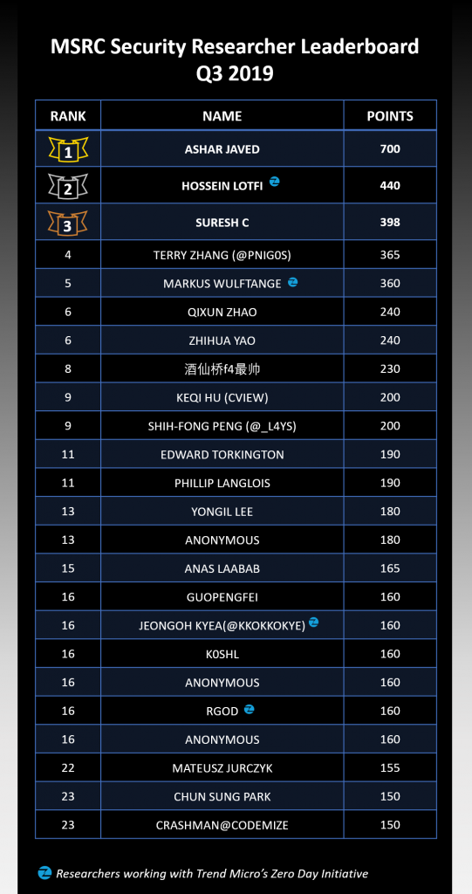

<!-- wp:paragraph -->

Right before Black Hat USA 2019, we [announced our new researcher recognition program](https://msrc-blog.microsoft.com/2019/07/30/recognizing-security-researchers-in-2019/), and at Black Hat we [announced the top researchers from the previous twelve months](https://msrc-blog.microsoft.com/2019/08/07/announcing-2019-msrc-most-valuable-security-researchers/). Since it’s easier to track your progress with regular updates than with just an annual report, we are excited to announce the MSRC Q3 2019 Security Researcher Leaderboard, which shows the current standings for each quarter. The leaderboard rankings are determined by the total [points](https://www.microsoft.com/en-us/msrc/researcher-recognition-program) each researcher earned during the program period while participating in the [MSRC Researcher Recognition Program](https://www.microsoft.com/en-us/msrc/researcher-recognition-program).

<!-- /wp:paragraph -->

<!-- wp:paragraph -->

The Q3 2019 leaderboard reflects point values for cases that are:

<!-- /wp:paragraph -->

<!-- wp:list -->

- Submitted and assessed by the MSRC team between July 1, 2019 and September 30, 2019
- OR Submitted between July 1, 2018 and June 30, 2019 ([last program period](https://msrc-blog.microsoft.com/2019/07/30/recognizing-security-researchers-in-2019/)), but assessed after July 15, 2019

<!-- /wp:list -->

<!-- wp:paragraph -->

We want to give a special shout out to our top three researchers **Ashar Javed** (700 points), **Hossein Lotfi** of [Trend Micro’s Zero Day Initiative](https://www.zerodayinitiative.com/) (440 points), and **Suresh C** (398 points). A big thank you to all the following top performing security researchers for their excellent work and contributions during Q3 2019!

<!-- /wp:paragraph -->

<!-- wp:image {"id":11290} -->

<!-- /wp:image -->

<!-- wp:paragraph -->

Challenging yourself to be on the board for the 2020 [MSRC Most Valuable Security Researchers](https://msrc-blog.microsoft.com/2019/08/07/announcing-2019-msrc-most-valuable-security-researchers/)? Keep in mind that in addition to the total points, we also take multiple factors into consideration while identifying the top tier researchers. Check out the [program page](https://www.microsoft.com/en-us/msrc/researcher-recognition-program) for full details on how to use multipliers and high-value targets to maximize the points you get for each case.

<!-- /wp:paragraph -->

<!-- wp:paragraph -->

Keep up the great work! We look forward to seeing you in the next quarterly leaderboard!

<!-- /wp:paragraph -->

<!-- wp:paragraph -->

_Sylvie Liu, Security Program Manager, MSRC Community Programs_

<!-- /wp:paragraph -->
