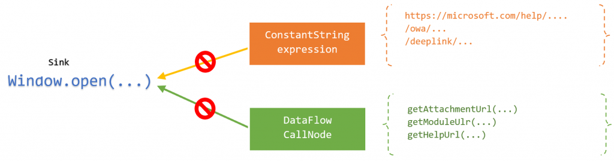

In two previous blog posts ( [part 1](https://msrc-blog.microsoft.com/2018/08/16/vulnerability-hunting-with-semmle-ql-part-1/) and [part 2](https://msrc-blog.microsoft.com/2019/03/19/vulnerability-hunting-with-semmle-ql-part-2/)), we talked about using Semmle QL in C and C++ codebases to find vulnerabilities such as integer overflow, path traversal, and those leading to memory corruption. In this post, we will explore applying Semmle QL to web security by hunting for one of­­­ the most common type of client-side vulnerabilities: DOM-based cross-site scripting (XSS).

You may already know that an XSS attack can be either server-side or client-side. Most Microsoft services are built on top of ASP.NET, while client-side is heavily based on TypeScript and JavaScript. This blog will go through the process of determining sources (the starting point of an input) and sinks (where the input would land at, perhaps to be leveraged into a vulnerability) o­n the target and how to eliminate a false positive/unexploitable case to reduce the time investment in code auditing. Our target is Outlook Web (outlook.office.com), a part of Office 365.

Note: Before reading this, I suggest you read the previous parts of this series to understand some of the underlying concepts, especially data flow analysis and taint tracking.

## Defining the source

_Source_ is where application receives data provided by a user. From an attacker’s point of view, an interesting source is a place where they could easily control it on the victim’s side. For example, it’s unlikely for an attacker to control the User-Agent field in a HTTP request by merely luring a victim to a malicious page (where an exploit chain gets started with), making it a non-interesting source.

In an initial review, we observe that the source on this situation can be coming from several places, such as HTML element properties, HTTP request headers, API responses, cross-origin message channels or the URL itself (location.search, location.href, location.hash, location.pathname), etc.


Narrowing the source is pretty hard, expensive and has potential for mistakenly losing false negative cases. Instead, we can evaluate and then eliminate an unexploitable path later by overwriting the Dataflow library’s `isSanitizer` predicate.

Moreover, Taint Tracking will be used to track the flow here since our data probably flows through some places which eventually would taint other nodes ([part 2](https://msrc-blog.microsoft.com/2019/03/19/vulnerability-hunting-with-semmle-ql-part-2/) mentions it). For example, the dataflow node corresponding to the string “Hello World” should taint the `res` variable.

```
<p style="margin:0in;margin-bottom:.0001pt;font-size:12px;font-family:Consolas;"><span style="font-size:11px;color:#D73A49;">var</span><span style="font-size:11px;color:#24292E;"> res </span><span style="font-size:11px;color:#D73A49;">=</span><span style="font-size:11px;color:#24292E;"> </span><span style="font-size:11px;color:#032F62;">"</span><span style="font-size:11px;color:#032F62;">Hello world!</span><span style="font-size:11px;color:#032F62;">"</span><span style="font-size:11px;color:#24292E;">.</span><span style="font-size:11px;color:#005CC5;">substr</span><span style="font-size:11px;color:#24292E;">(</span><span style="font-size:11px;color:#005CC5;">1</span><span style="font-size:11px;color:#24292E;">, </span><span style="font-size:11px;color:#005CC5;">4</span><span style="font-size:11px;color:#24292E;">);</span></p>
```

Let’s make it simple and widely open by defining the source in TaintTracking configuration with the following model:

```
<p style="margin-top:0in;margin-right:0in;margin-bottom:.0001pt;margin-left:0in;line-height:normal;font-size:12px;font-family:"Calibri",sans-serif;"><span style="font-size:10px;font-family:Consolas;color:#2020C4;">class</span><span style="font-size:10px;font-family:Consolas;color:black;"> Cfg </span><span style="font-size:10px;font-family:Consolas;color:#2020C4;">extends</span><span style="font-size:10px;font-family:Consolas;color:black;"> TaintTracking<strong>::</strong>Configuration {</span></p><p style="margin-top:0in;margin-right:0in;margin-bottom:.0001pt;margin-left:0in;line-height:normal;font-size:12px;font-family:"Calibri",sans-serif;"><span style="font-size:10px;font-family:Consolas;color:black;">  Cfg() { </span><span style="font-size:10px;font-family:Consolas;color:#2020C4;">this</span><span style="font-size:10px;font-family:Consolas;color:black;"> <strong>=</strong> </span><span style="font-size:10px;font-family:Consolas;color:#20C420;">"Track data flows to XSS sink"</span><span style="font-size:10px;font-family:Consolas;color:black;"> }</span></p><p style="margin-top:0in;margin-right:0in;margin-bottom:.0001pt;margin-left:0in;line-height:normal;font-size:12px;font-family:"Calibri",sans-serif;"><span style="font-size:10px;font-family:Consolas;color:black;">  override </span><span style="font-size:10px;font-family:Consolas;color:#2020C4;">predicate</span><span style="font-size:10px;font-family:Consolas;color:black;"> isSource(DataFlow<strong>::</strong>Node source) { </span><span style="font-size:10px;font-family:Consolas;color:#2020C4;">any</span><span style="font-size:10px;font-family:Consolas;color:black;">() }</span></p><p style="margin-top:0in;margin-right:0in;margin-bottom:.0001pt;margin-left:0in;line-height:normal;font-size:12px;font-family:"Calibri",sans-serif;"><span style="font-size:10px;font-family:Consolas;color:black;">..<strong>.</strong></span></p><p style="margin-top:0in;margin-right:0in;margin-bottom:.0001pt;margin-left:0in;line-height:normal;font-size:12px;font-family:"Calibri",sans-serif;"><span style="font-size:10px;font-family:Consolas;color:black;">}</span></p>
```

## Defining the sink

XSS sinks are extremely abundant because of the complexity of the Web world. As usual, we need to manually review and gain some knowledge of our target prior to getting started to writing a query. After a while, we should be ready to list some promising sinks to perform our analysis. In this post, we are focusing on the three biggest and well known sinks: Location, Document, and ReactJS.

### Location Sink

Location Sink is where the user’s browser will be navigating to somewhere else by various ways (see the figure below). It’s possible that these could be vulnerable to XSS due to one of the common vector around injecting `javascript:` URI scheme, which makes browser execute a JavaScript code.

|                                                                                                                                                                                                                   |                                                                                                                                                                                                          |
| ----------------------------------------------------------------------------------------------------------------------------------------------------------------------------------------------------------------- | -------------------------------------------------------------------------------------------------------------------------------------------------------------------------------------------------------- |
| Assignment                                                                                                                                                                                                        | Method Call                                                                                                                                                                                              |
| location = "javascript:alert(document.domain)" window .location = "javascript:alert(document.domain)" document.location = "javascript:alert(document.domain)" location.href = "javascript:alert(document.domain)" | open ("javascript:alert(document.domain)") window.open("javascript:alert(document.domain)") location. assign("javascript:alert(document.domain)") location. replace("javascript:alert(document.domain)") |

Note: Sinks related to HTML element and others are beyond the scope of this post.

Let’s get started.

First, we look for an assignment having the left side as the global object `location` and the right side value being the sink node of our interest. `location` object references can be predicated to `DataFlow::globalVarRef(string name)` which gets an access to a global object with name as `name`.

The following query uncovers `window.location=...` and `location=...` since both of them are exposed as global object.

```
<p style="margin-top:0in;margin-right:0in;margin-bottom:.0001pt;margin-left:0in;line-height:normal;font-size:12px;font-family:"Calibri",sans-serif;"><span style="font-size:10px;font-family:Consolas;color:#2020C4;">class</span><span style="font-size:10px;font-family:Consolas;color:black;"> LocationXSS_Sink </span><span style="font-size:10px;font-family:Consolas;color:#2020C4;">extends</span><span style="font-size:10px;font-family:Consolas;color:black;"> DataFlow<strong>::</strong>Node {</span></p><p style="margin-top:0in;margin-right:0in;margin-bottom:.0001pt;margin-left:0in;line-height:normal;font-size:12px;font-family:"Calibri",sans-serif;"><span style="font-size:10px;font-family:Consolas;color:black;">  LocationXSS_Sink() {</span></p><p style="margin-top:0in;margin-right:0in;margin-bottom:.0001pt;margin-left:0in;line-height:normal;font-size:12px;font-family:"Calibri",sans-serif;"><span style="font-size:10px;font-family:Consolas;color:black;">    </span><span style="font-size:10px;font-family:Consolas;color:#2020C4;">exists</span><span style="font-size:10px;font-family:Consolas;color:black;">(Assignment m <strong>|</strong> m<strong>.</strong>getLhs() <strong>=</strong> DataFlow<strong>::</strong>globalVarRef(</span><span style="font-size:10px;font-family:Consolas;color:#20C420;">"location"</span><span style="font-size:10px;font-family:Consolas;color:black;">)<strong>.</strong>asExpr() <strong>|</strong></span></p><p style="margin-top:0in;margin-right:0in;margin-bottom:.0001pt;margin-left:0in;line-height:normal;font-size:12px;font-family:"Calibri",sans-serif;"><span style="font-size:10px;font-family:Consolas;color:black;">      </span><span style="font-size:10px;font-family:Consolas;color:#2020C4;">this</span><strong><span style="font-size:10px;font-family:Consolas;color:black;">.</span></strong><span style="font-size:10px;font-family:Consolas;color:black;">asExpr() <strong>=</strong> m<strong>.</strong>getRhs()</span></p><p style="margin-top:0in;margin-right:0in;margin-bottom:.0001pt;margin-left:0in;line-height:normal;font-size:12px;font-family:"Calibri",sans-serif;"><span style="font-size:10px;font-family:Consolas;color:black;">    )</span></p><p style="margin-top:0in;margin-right:0in;margin-bottom:.0001pt;margin-left:0in;line-height:normal;font-size:12px;font-family:"Calibri",sans-serif;"><span style="font-size:10px;font-family:Consolas;color:black;">     ..<strong>.</strong></span></p><p style="margin-top:0in;margin-right:0in;margin-bottom:.0001pt;margin-left:0in;line-height:normal;font-size:12px;font-family:"Calibri",sans-serif;"><span style="font-size:10px;font-family:Consolas;color:black;">  }</span></p><p style="margin-top:0in;margin-right:0in;margin-bottom:.0001pt;margin-left:0in;line-height:normal;font-size:12px;font-family:"Calibri",sans-serif;"><span style="font-size:10px;font-family:Consolas;color:black;">}</span></p>
```

The next step is to find the two remaining assignments: `document.location=...` and `location.href=...`

As evident, both of these are expression writing a value to an object property. `DataFlow::SourceNode` offers a predicate to help us with this named `getAPropertyWrite(string prop_name)`, we can use it to track down all the nodes writing to the property `prop_name`. The predicate `getAPropertyWrite` returns a `DataFlow::PropWrite`, hence we need to define one to grab it then let the sink node be the right side of this assignment.

By adding one more set of sink nodes, as in the following QL, we’re able to identify all location sinks which are formed in an assignment statement.

```
<p style="margin-top:0in;margin-right:0in;margin-bottom:.0001pt;margin-left:0in;line-height:normal;font-size:12px;font-family:"Calibri",sans-serif;"><span style="font-size:10px;font-family:Consolas;color:#2020C4;">exists</span><span style="font-size:10px;font-family:Consolas;color:black;">(DataFlow<strong>::</strong>PropWrite pw <strong>|</strong></span></p><p style="margin-top:0in;margin-right:0in;margin-bottom:.0001pt;margin-left:0in;line-height:normal;font-size:12px;font-family:"Calibri",sans-serif;"><span style="font-size:10px;font-family:Consolas;color:black;">      DataFlow<strong>::</strong>globalVarRef(</span><span style="font-size:10px;font-family:Consolas;color:#20C420;">"document"</span><span style="font-size:10px;font-family:Consolas;color:black;">)<strong>.</strong>getAPropertyWrite(</span><span style="font-size:10px;font-family:Consolas;color:#20C420;">"location"</span><span style="font-size:10px;font-family:Consolas;color:black;">) <strong>=</strong> pw </span><em><span style="font-size:10px;font-family:Consolas;color:#3F805F;">//document.location = ...</span></em></p><p style="margin-top:0in;margin-right:0in;margin-bottom:.0001pt;margin-left:0in;line-height:normal;font-size:12px;font-family:"Calibri",sans-serif;"><span style="font-size:10px;font-family:Consolas;color:black;">      </span><span style="font-size:10px;font-family:Consolas;color:#2020C4;">or</span></p><p style="margin-top:0in;margin-right:0in;margin-bottom:.0001pt;margin-left:0in;line-height:normal;font-size:12px;font-family:"Calibri",sans-serif;"><span style="font-size:10px;font-family:Consolas;color:black;">      DataFlow<strong>::</strong>globalVarRef(</span><span style="font-size:10px;font-family:Consolas;color:#20C420;">"location"</span><span style="font-size:10px;font-family:Consolas;color:black;">)<strong>.</strong>getAPropertyWrite(</span><span style="font-size:10px;font-family:Consolas;color:#20C420;">"href"</span><span style="font-size:10px;font-family:Consolas;color:black;">) <strong>=</strong> pw </span><em><span style="font-size:10px;font-family:Consolas;color:#3F805F;">//location.href = ...</span></em></p><p style="margin-top:0in;margin-right:0in;margin-bottom:.0001pt;margin-left:0in;line-height:normal;font-size:12px;font-family:"Calibri",sans-serif;"><span style="font-size:10px;font-family:Consolas;color:black;">    <strong>|</strong></span></p><p style="margin-top:0in;margin-right:0in;margin-bottom:.0001pt;margin-left:0in;line-height:normal;font-size:12px;font-family:"Calibri",sans-serif;"><span style="font-size:10px;font-family:Consolas;color:black;">      </span><span style="font-size:10px;font-family:Consolas;color:#2020C4;">this</span><span style="font-size:10px;font-family:Consolas;color:black;"> <strong>=</strong> pw<strong>.</strong>getRhs()</span></p><p style="margin-top:0in;margin-right:0in;margin-bottom:.0001pt;margin-left:0in;line-height:normal;font-size:12px;font-family:"Calibri",sans-serif;"><span style="font-size:10px;font-family:Consolas;color:black;">)</span></p>
```

The next step is to identify the location sinks that form a function call. We’re getting a data flow node references to the global object whose name is open. In particular, the following QL query lists the calls which have the target as both `open(...)` and `window.open(...)`

```
<p style="margin-top:0in;margin-right:0in;margin-bottom:.0001pt;margin-left:0in;line-height:normal;font-size:12px;font-family:"Calibri",sans-serif;"><span style="font-size:10px;font-family:Consolas;color:#2020C4;">import</span><span style="font-size:10px;font-family:Consolas;color:black;"> javascript</span></p><p style="margin-top:0in;margin-right:0in;margin-bottom:.0001pt;margin-left:0in;line-height:normal;font-size:12px;font-family:"Calibri",sans-serif;"><span style="font-size:10px;font-family:Consolas;color:#2020C4;">select</span><span style="font-size:10px;font-family:Consolas;color:black;"> DataFlow<strong>::</strong>globalVarRef(</span><span style="font-size:10px;font-family:Consolas;color:#20C420;">"open"</span><span style="font-size:10px;font-family:Consolas;color:black;">)<strong>.</strong>getACall()</span></p>
```

Besides `getAPropertyWrite`, the DataFlow library also provides us the predicate named `getAMethodCall`that finds all method calls on a SourceNode (which is the supertype of `GlobalVarRefNode`). Here is a query that locates any call to either `location.assign` or `location.replace`.

```
<p style="margin-top:0in;margin-right:0in;margin-bottom:.0001pt;margin-left:0in;line-height:normal;font-size:15px;font-family:"Calibri",sans-serif;"><span style="font-size:10px;font-family:Consolas;color:#2020C4;">import</span><span style="font-size:10px;font-family:Consolas;color:black;"> javascript</span></p><p style="margin-top:0in;margin-right:0in;margin-bottom:.0001pt;margin-left:0in;line-height:normal;font-size:15px;font-family:"Calibri",sans-serif;"><span style="font-size:10px;font-family:Consolas;"> </span></p><p style="margin-top:0in;margin-right:0in;margin-bottom:.0001pt;margin-left:0in;line-height:normal;font-size:15px;font-family:"Calibri",sans-serif;"><span style="font-size:10px;font-family:Consolas;color:#2020C4;">from</span><span style="font-size:10px;font-family:Consolas;color:black;"> DataFlow<strong>::</strong>MethodCallNode call</span></p><p style="margin-top:0in;margin-right:0in;margin-bottom:.0001pt;margin-left:0in;line-height:normal;font-size:15px;font-family:"Calibri",sans-serif;"><span style="font-size:10px;font-family:Consolas;color:#2020C4;">where</span></p><p style="margin-top:0in;margin-right:0in;margin-bottom:.0001pt;margin-left:0in;line-height:normal;font-size:15px;font-family:"Calibri",sans-serif;"><span style="font-size:10px;font-family:Consolas;color:black;">  call <strong>=</strong> DataFlow<strong>::</strong>globalVarRef(</span><span style="font-size:10px;font-family:Consolas;color:#20C420;">"location"</span><span style="font-size:10px;font-family:Consolas;color:black;">)<strong>.</strong>getAMethodCall(</span><span style="font-size:10px;font-family:Consolas;color:#20C420;">"assign"</span><span style="font-size:10px;font-family:Consolas;color:black;">) </span><span style="font-size:10px;font-family:Consolas;color:#2020C4;">or</span></p><p style="margin-top:0in;margin-right:0in;margin-bottom:.0001pt;margin-left:0in;line-height:normal;font-size:15px;font-family:"Calibri",sans-serif;"><span style="font-size:10px;font-family:Consolas;color:black;">  call <strong>=</strong> DataFlow<strong>::</strong>globalVarRef(</span><span style="font-size:10px;font-family:Consolas;color:#20C420;">"location"</span><span style="font-size:10px;font-family:Consolas;color:black;">)<strong>.</strong>getAMethodCall(</span><span style="font-size:10px;font-family:Consolas;color:#20C420;">"replace"</span><span style="font-size:10px;font-family:Consolas;color:black;">)</span></p><p style="margin-top:0in;margin-right:0in;margin-bottom:.0001pt;margin-left:0in;line-height:normal;font-size:15px;font-family:"Calibri",sans-serif;"><span style="font-size:10px;font-family:Consolas;color:#2020C4;">select</span><span style="font-size:10px;font-family:Consolas;color:black;"> call</span></p>
```

Putting all of these together, the final query to identify this type of sink looks like this:

```
<p style="margin-top:0in;margin-right:0in;margin-bottom:.0001pt;margin-left:0in;line-height:normal;font-size:12px;font-family:"Calibri",sans-serif;"><span style="font-size:10px;font-family:Consolas;color:#2020C4;">class</span><span style="font-size:10px;font-family:Consolas;color:black;"> LocationXSS_Sink </span><span style="font-size:10px;font-family:Consolas;color:#2020C4;">extends</span><span style="font-size:10px;font-family:Consolas;color:black;"> DataFlow<strong>::</strong>Node {</span></p><p style="margin-top:0in;margin-right:0in;margin-bottom:.0001pt;margin-left:0in;line-height:normal;font-size:12px;font-family:"Calibri",sans-serif;"><span style="font-size:10px;font-family:Consolas;color:black;">  LocationXSS_Sink() {</span></p><p style="margin-top:0in;margin-right:0in;margin-bottom:.0001pt;margin-left:0in;line-height:normal;font-size:12px;font-family:"Calibri",sans-serif;"><span style="font-size:10px;font-family:Consolas;color:black;">    </span><span style="font-size:10px;font-family:Consolas;color:#2020C4;">exists</span><span style="font-size:10px;font-family:Consolas;color:black;">(DataFlow<strong>::</strong>CallNode call <strong>|</strong></span></p><p style="margin-top:0in;margin-right:0in;margin-bottom:.0001pt;margin-left:0in;line-height:normal;font-size:12px;font-family:"Calibri",sans-serif;"><span style="font-size:10px;font-family:Consolas;color:black;">      call <strong>=</strong> DataFlow<strong>::</strong>globalVarRef(</span><span style="font-size:10px;font-family:Consolas;color:#20C420;">"open"</span><span style="font-size:10px;font-family:Consolas;color:black;">)<strong>.</strong>getACall() </span><em><span style="font-size:10px;font-family:Consolas;color:#3F805F;">// window.open(...) and open(...)</span></em></p><p style="margin-top:0in;margin-right:0in;margin-bottom:.0001pt;margin-left:0in;line-height:normal;font-size:12px;font-family:"Calibri",sans-serif;"><span style="font-size:10px;font-family:Consolas;color:black;">      </span><span style="font-size:10px;font-family:Consolas;color:#2020C4;">or</span></p><p style="margin-top:0in;margin-right:0in;margin-bottom:.0001pt;margin-left:0in;line-height:normal;font-size:12px;font-family:"Calibri",sans-serif;"><span style="font-size:10px;font-family:Consolas;color:black;">      call <strong>=</strong> DataFlow<strong>::</strong>globalVarRef(</span><span style="font-size:10px;font-family:Consolas;color:#20C420;">"location"</span><span style="font-size:10px;font-family:Consolas;color:black;">)<strong>.</strong>getAMethodCall(</span><span style="font-size:10px;font-family:Consolas;color:#20C420;">"assign"</span><span style="font-size:10px;font-family:Consolas;color:black;">)</span></p><p style="margin-top:0in;margin-right:0in;margin-bottom:.0001pt;margin-left:0in;line-height:normal;font-size:12px;font-family:"Calibri",sans-serif;"><span style="font-size:10px;font-family:Consolas;color:black;">      </span><span style="font-size:10px;font-family:Consolas;color:#2020C4;">or</span></p><p style="margin-top:0in;margin-right:0in;margin-bottom:.0001pt;margin-left:0in;line-height:normal;font-size:12px;font-family:"Calibri",sans-serif;"><span style="font-size:10px;font-family:Consolas;color:black;">      call <strong>=</strong> DataFlow<strong>::</strong>globalVarRef(</span><span style="font-size:10px;font-family:Consolas;color:#20C420;">"location"</span><span style="font-size:10px;font-family:Consolas;color:black;">)<strong>.</strong>getAMethodCall(</span><span style="font-size:10px;font-family:Consolas;color:#20C420;">"replace"</span><span style="font-size:10px;font-family:Consolas;color:black;">)</span></p><p style="margin-top:0in;margin-right:0in;margin-bottom:.0001pt;margin-left:0in;line-height:normal;font-size:12px;font-family:"Calibri",sans-serif;"><span style="font-size:10px;font-family:Consolas;color:black;">    <strong>|</strong></span></p><p style="margin-top:0in;margin-right:0in;margin-bottom:.0001pt;margin-left:0in;line-height:normal;font-size:12px;font-family:"Calibri",sans-serif;"><span style="font-size:10px;font-family:Consolas;color:black;">      </span><span style="font-size:10px;font-family:Consolas;color:#2020C4;">this</span><span style="font-size:10px;font-family:Consolas;color:black;"> <strong>=</strong> call<strong>.</strong>getArgument(</span><span style="font-size:10px;font-family:Consolas;color:#C42020;">0</span><span style="font-size:10px;font-family:Consolas;color:black;">)</span></p><p style="margin-top:0in;margin-right:0in;margin-bottom:.0001pt;margin-left:0in;line-height:normal;font-size:12px;font-family:"Calibri",sans-serif;"><span style="font-size:10px;font-family:Consolas;color:black;">    )</span></p><p style="margin-top:0in;margin-right:0in;margin-bottom:.0001pt;margin-left:0in;line-height:normal;font-size:12px;font-family:"Calibri",sans-serif;"><span style="font-size:10px;font-family:Consolas;color:black;">    </span><span style="font-size:10px;font-family:Consolas;color:#2020C4;">or</span></p><p style="margin-top:0in;margin-right:0in;margin-bottom:.0001pt;margin-left:0in;line-height:normal;font-size:12px;font-family:"Calibri",sans-serif;"><span style="font-size:10px;font-family:Consolas;color:black;">    </span><span style="font-size:10px;font-family:Consolas;color:#2020C4;">exists</span><span style="font-size:10px;font-family:Consolas;color:black;">(Assignment m <strong>|</strong> m<strong>.</strong>getLhs() <strong>=</strong> DataFlow<strong>::</strong>globalVarRef(</span><span style="font-size:10px;font-family:Consolas;color:#20C420;">"location"</span><span style="font-size:10px;font-family:Consolas;color:black;">)<strong>.</strong>asExpr() <strong>|</strong></span></p><p style="margin-top:0in;margin-right:0in;margin-bottom:.0001pt;margin-left:0in;line-height:normal;font-size:12px;font-family:"Calibri",sans-serif;"><span style="font-size:10px;font-family:Consolas;color:black;">      </span><span style="font-size:10px;font-family:Consolas;color:#2020C4;">this</span><strong><span style="font-size:10px;font-family:Consolas;color:black;">.</span></strong><span style="font-size:10px;font-family:Consolas;color:black;">asExpr() <strong>=</strong> m<strong>.</strong>getRhs() </span><em><span style="font-size:10px;font-family:Consolas;color:#3F805F;">// this uncovers `location=...` and `window.location=...`</span></em></p><p style="margin-top:0in;margin-right:0in;margin-bottom:.0001pt;margin-left:0in;line-height:normal;font-size:12px;font-family:"Calibri",sans-serif;"><span style="font-size:10px;font-family:Consolas;color:black;">    )</span></p><p style="margin-top:0in;margin-right:0in;margin-bottom:.0001pt;margin-left:0in;line-height:normal;font-size:12px;font-family:"Calibri",sans-serif;"><span style="font-size:10px;font-family:Consolas;color:black;">    </span><span style="font-size:10px;font-family:Consolas;color:#2020C4;">or</span></p><p style="margin-top:0in;margin-right:0in;margin-bottom:.0001pt;margin-left:0in;line-height:normal;font-size:12px;font-family:"Calibri",sans-serif;"><span style="font-size:10px;font-family:Consolas;color:black;">    </span><span style="font-size:10px;font-family:Consolas;color:#2020C4;">exists</span><span style="font-size:10px;font-family:Consolas;color:black;">(DataFlow<strong>::</strong>PropWrite pw <strong>|</strong></span></p><p style="margin-top:0in;margin-right:0in;margin-bottom:.0001pt;margin-left:0in;line-height:normal;font-size:12px;font-family:"Calibri",sans-serif;"><span style="font-size:10px;font-family:Consolas;color:black;">      DataFlow<strong>::</strong>globalVarRef(</span><span style="font-size:10px;font-family:Consolas;color:#20C420;">"document"</span><span style="font-size:10px;font-family:Consolas;color:black;">)<strong>.</strong>getAPropertyWrite(</span><span style="font-size:10px;font-family:Consolas;color:#20C420;">"location"</span><span style="font-size:10px;font-family:Consolas;color:black;">) <strong>=</strong> pw </span><em><span style="font-size:10px;font-family:Consolas;color:#3F805F;">//document.location = ...</span></em></p><p style="margin-top:0in;margin-right:0in;margin-bottom:.0001pt;margin-left:0in;line-height:normal;font-size:12px;font-family:"Calibri",sans-serif;"><span style="font-size:10px;font-family:Consolas;color:black;">      </span><span style="font-size:10px;font-family:Consolas;color:#2020C4;">or</span></p><p style="margin-top:0in;margin-right:0in;margin-bottom:.0001pt;margin-left:0in;line-height:normal;font-size:12px;font-family:"Calibri",sans-serif;"><span style="font-size:10px;font-family:Consolas;color:black;">      DataFlow<strong>::</strong>globalVarRef(</span><span style="font-size:10px;font-family:Consolas;color:#20C420;">"location"</span><span style="font-size:10px;font-family:Consolas;color:black;">)<strong>.</strong>getAPropertyWrite(</span><span style="font-size:10px;font-family:Consolas;color:#20C420;">"href"</span><span style="font-size:10px;font-family:Consolas;color:black;">) <strong>=</strong> pw </span><em><span style="font-size:10px;font-family:Consolas;color:#3F805F;">//location.href = ...</span></em></p><p style="margin-top:0in;margin-right:0in;margin-bottom:.0001pt;margin-left:0in;line-height:normal;font-size:12px;font-family:"Calibri",sans-serif;"><span style="font-size:10px;font-family:Consolas;color:black;">    <strong>|</strong></span></p><p style="margin-top:0in;margin-right:0in;margin-bottom:.0001pt;margin-left:0in;line-height:normal;font-size:12px;font-family:"Calibri",sans-serif;"><span style="font-size:10px;font-family:Consolas;color:black;">      </span><span style="font-size:10px;font-family:Consolas;color:#2020C4;">this</span><span style="font-size:10px;font-family:Consolas;color:black;"> <strong>=</strong> pw<strong>.</strong>getRhs()</span></p><p style="margin-top:0in;margin-right:0in;margin-bottom:.0001pt;margin-left:0in;line-height:normal;font-size:12px;font-family:"Calibri",sans-serif;"><span style="font-size:10px;font-family:Consolas;color:black;">    )</span></p><p style="margin-top:0in;margin-right:0in;margin-bottom:.0001pt;margin-left:0in;line-height:normal;font-size:12px;font-family:"Calibri",sans-serif;"><span style="font-size:10px;font-family:Consolas;color:black;">  }</span></p>
```

### Document Sinks

Like the previous one, let’s divide this type of sink into two separate forms as below,

|                                                                                                             |                                                                                                                                                                                                                                          |
| ----------------------------------------------------------------------------------------------------------- | ---------------------------------------------------------------------------------------------------------------------------------------------------------------------------------------------------------------------------------------- |
| Assignment                                                                                                  | Method Call                                                                                                                                                                                                                              |
| element.innerHTML = "&lt;img src=a onerror=alert(1)>" element.outerHTML = "&lt;img src=a onerror=alert(1)>" | document.write("&lt;img src=a onerror=","alert(1)>") document.writeln("&lt;img src=a onerror=","alert(1)>") node. insertAdjacentHTML("afterend","&lt;img src=a onerror=alert(1)>") jquery_method.html("&lt;img src=a onerror=alert(1)>") |

Note: there are many jQuery methods other than .html() that accept a HTML string. However, in this codebase, I didn’t observe much usage of those methods, and they don’t look vulnerable.

Firstly, we’re seeking any dataflow node which writes a value to the object’s `innerHTML` or `outerHTML`properties. This can be done by a simple query:

```
<p style="margin-top:0in;margin-right:0in;margin-bottom:.0001pt;margin-left:0in;line-height:normal;font-size:12px;font-family:"Calibri",sans-serif;"><span style="font-size:10px;font-family:Consolas;color:#2020C4;">import</span><span style="font-size:10px;font-family:Consolas;color:black;"> javascript</span></p><p style="margin-top:0in;margin-right:0in;margin-bottom:.0001pt;margin-left:0in;line-height:normal;font-size:12px;font-family:"Calibri",sans-serif;"><span style="font-size:10px;font-family:Consolas;color:#2020C4;">from</span><span style="font-size:10px;font-family:Consolas;color:black;"> DataFlow<strong>::</strong>PropWrite pw</span></p><p style="margin-top:0in;margin-right:0in;margin-bottom:.0001pt;margin-left:0in;line-height:normal;font-size:12px;font-family:"Calibri",sans-serif;"><span style="font-size:10px;font-family:Consolas;color:#2020C4;">where</span><span style="font-size:10px;font-family:Consolas;color:black;"> pw<strong>.</strong>getPropertyName()<strong>.</strong>regexpMatch(</span><span style="font-size:10px;font-family:Consolas;color:#20C420;">"(innerHTML|outerHTML)"</span><span style="font-size:10px;font-family:Consolas;color:black;">)</span></p><p style="margin-top:0in;margin-right:0in;margin-bottom:.0001pt;margin-left:0in;line-height:normal;font-size:12px;font-family:"Calibri",sans-serif;"><span style="font-size:10px;font-family:Consolas;color:#2020C4;">select</span><span style="font-size:10px;font-family:Consolas;color:black;"> pw</span></p>
```

On “method call” part, with a similar approach to the previous sink, the ones we’re interested in is the first argument to a call to methods `write` and `writeln` from the global DOM object document. On the other hand, the `insertAdjacentHTML`and `html` calls got second and first argument respectively as a sink node we’re looking for.

Finally, we define a sink following the above conditionals with a query:

```
<p style="margin-top:0in;margin-right:0in;margin-bottom:.0001pt;margin-left:0in;line-height:normal;font-size:15px;font-family:"Calibri",sans-serif;"><span style="font-size:9.0pt !msorm;"><span style="font-size:11px;font-family:Consolas;color:#2020C4;">class</span></span><span style="font-size:9.0pt !msorm;"><span style="font-size:11px;font-family:Consolas;color:black;"> Document_Sinks </span></span><span style="font-size:9.0pt !msorm;"><span style="font-size:11px;font-family:Consolas;color:#2020C4;">extends</span></span><span style="font-size:9.0pt !msorm;"><span style="font-size:11px;font-family:Consolas;color:black;"> DataFlow</span></span><span style="font-size:9.0pt !msorm;"><strong><span style="font-size:11px;font-family:Consolas;color:black;">::</span></strong></span><span style="font-size:9.0pt !msorm;"><span style="font-size:11px;font-family:Consolas;color:black;">Node {</span></span></p><p style="margin-top:0in;margin-right:0in;margin-bottom:.0001pt;margin-left:0in;line-height:normal;font-size:15px;font-family:"Calibri",sans-serif;"><span style="font-size:9.0pt !msorm;"><span style="font-size:11px;font-family:Consolas;color:black;">  Document_Sinks() {</span></span></p><p style="margin-top:0in;margin-right:0in;margin-bottom:.0001pt;margin-left:0in;line-height:normal;font-size:15px;font-family:"Calibri",sans-serif;"><span style="font-size:9.0pt !msorm;"><span style="font-size:11px;font-family:Consolas;color:black;">    </span></span><span style="font-size:9.0pt !msorm;"><span style="font-size:11px;font-family:Consolas;color:#2020C4;">exists</span></span><span style="font-size:9.0pt !msorm;"><span style="font-size:11px;font-family:Consolas;color:black;">(DataFlow</span></span><span style="font-size:9.0pt !msorm;"><strong><span style="font-size:11px;font-family:Consolas;color:black;">::</span></strong></span><span style="font-size:9.0pt !msorm;"><span style="font-size:11px;font-family:Consolas;color:black;">MethodCallNode call</span></span><span style="font-size:9.0pt !msorm;"><strong><span style="font-size:11px;font-family:Consolas;color:black;">,</span></strong></span><span style="font-size:9.0pt !msorm;"><span style="font-size:11px;font-family:Consolas;color:black;"> </span></span><span style="font-size:9.0pt !msorm;"><span style="font-size:11px;font-family:Consolas;color:#2020C4;">int</span></span><span style="font-size:9.0pt !msorm;"><span style="font-size:11px;font-family:Consolas;color:black;"> argPos </span></span><span style="font-size:9.0pt !msorm;"><strong><span style="font-size:11px;font-family:Consolas;color:black;">|</span></strong></span></p><p style="margin-top:0in;margin-right:0in;margin-bottom:.0001pt;margin-left:0in;line-height:normal;font-size:15px;font-family:"Calibri",sans-serif;"><span style="font-size:9.0pt !msorm;"><span style="font-size:11px;font-family:Consolas;color:black;">      call </span></span><span style="font-size:9.0pt !msorm;"><strong><span style="font-size:11px;font-family:Consolas;color:black;">=</span></strong></span><span style="font-size:9.0pt !msorm;"><span style="font-size:11px;font-family:Consolas;color:black;"> DataFlow</span></span><span style="font-size:9.0pt !msorm;"><strong><span style="font-size:11px;font-family:Consolas;color:black;">::</span></strong></span><span style="font-size:9.0pt !msorm;"><span style="font-size:11px;font-family:Consolas;color:black;">globalVarRef(</span></span><span style="font-size:9.0pt !msorm;"><span style="font-size:11px;font-family:Consolas;color:#20C420;">"document"</span></span><span style="font-size:9.0pt !msorm;"><span style="font-size:11px;font-family:Consolas;color:black;">)</span></span><span style="font-size:9.0pt !msorm;"><strong><span style="font-size:11px;font-family:Consolas;color:black;">.</span></strong></span><span style="font-size:9.0pt !msorm;"><span style="font-size:11px;font-family:Consolas;color:black;">getAMethodCall(</span></span><span style="font-size:9.0pt !msorm;"><span style="font-size:11px;font-family:Consolas;color:#20C420;">"write"</span></span><span style="font-size:9.0pt !msorm;"><span style="font-size:11px;font-family:Consolas;color:black;">)</span></span></p><p style="margin-top:0in;margin-right:0in;margin-bottom:.0001pt;margin-left:0in;line-height:normal;font-size:15px;font-family:"Calibri",sans-serif;"><span style="font-size:9.0pt !msorm;"><span style="font-size:11px;font-family:Consolas;color:black;">      </span></span><span style="font-size:9.0pt !msorm;"><span style="font-size:11px;font-family:Consolas;color:#2020C4;">or</span></span></p><p style="margin-top:0in;margin-right:0in;margin-bottom:.0001pt;margin-left:0in;line-height:normal;font-size:15px;font-family:"Calibri",sans-serif;"><span style="font-size:9.0pt !msorm;"><span style="font-size:11px;font-family:Consolas;color:black;">      call </span></span><span style="font-size:9.0pt !msorm;"><strong><span style="font-size:11px;font-family:Consolas;color:black;">=</span></strong></span><span style="font-size:9.0pt !msorm;"><span style="font-size:11px;font-family:Consolas;color:black;"> DataFlow</span></span><span style="font-size:9.0pt !msorm;"><strong><span style="font-size:11px;font-family:Consolas;color:black;">::</span></strong></span><span style="font-size:9.0pt !msorm;"><span style="font-size:11px;font-family:Consolas;color:black;">globalVarRef(</span></span><span style="font-size:9.0pt !msorm;"><span style="font-size:11px;font-family:Consolas;color:#20C420;">"document"</span></span><span style="font-size:9.0pt !msorm;"><span style="font-size:11px;font-family:Consolas;color:black;">)</span></span><span style="font-size:9.0pt !msorm;"><strong><span style="font-size:11px;font-family:Consolas;color:black;">.</span></strong></span><span style="font-size:9.0pt !msorm;"><span style="font-size:11px;font-family:Consolas;color:black;">getAMethodCall(</span></span><span style="font-size:9.0pt !msorm;"><span style="font-size:11px;font-family:Consolas;color:#20C420;">"writeln"</span></span><span style="font-size:9.0pt !msorm;"><span style="font-size:11px;font-family:Consolas;color:black;">)</span></span></p><p style="margin-top:0in;margin-right:0in;margin-bottom:.0001pt;margin-left:0in;line-height:normal;font-size:15px;font-family:"Calibri",sans-serif;"><span style="font-size:9.0pt !msorm;"><span style="font-size:11px;font-family:Consolas;color:black;">      </span></span><span style="font-size:9.0pt !msorm;"><span style="font-size:11px;font-family:Consolas;color:#2020C4;">or</span></span></p><p style="margin-top:0in;margin-right:0in;margin-bottom:.0001pt;margin-left:0in;line-height:normal;font-size:15px;font-family:"Calibri",sans-serif;"><span style="font-size:9.0pt !msorm;"><span style="font-size:11px;font-family:Consolas;color:black;">      call</span></span><span style="font-size:9.0pt !msorm;"><strong><span style="font-size:11px;font-family:Consolas;color:black;">.</span></strong></span><span style="font-size:9.0pt !msorm;"><span style="font-size:11px;font-family:Consolas;color:black;">getCalleeName() </span></span><span style="font-size:9.0pt !msorm;"><strong><span style="font-size:11px;font-family:Consolas;color:black;">=</span></strong></span><span style="font-size:9.0pt !msorm;"><span style="font-size:11px;font-family:Consolas;color:black;"> </span></span><span style="font-size:9.0pt !msorm;"><span style="font-size:11px;font-family:Consolas;color:#20C420;">"insertAdjacentHTML"</span></span><span style="font-size:9.0pt !msorm;"><span style="font-size:11px;font-family:Consolas;color:black;"> </span></span><span style="font-size:9.0pt !msorm;"><span style="font-size:11px;font-family:Consolas;color:#2020C4;">and</span></span><span style="font-size:9.0pt !msorm;"><span style="font-size:11px;font-family:Consolas;color:black;"> argPos </span></span><span style="font-size:9.0pt !msorm;"><strong><span style="font-size:11px;font-family:Consolas;color:black;">=</span></strong></span><span style="font-size:9.0pt !msorm;"><span style="font-size:11px;font-family:Consolas;color:black;"> </span></span><span style="font-size:9.0pt !msorm;"><span style="font-size:11px;font-family:Consolas;color:#C42020;">1</span></span></p><p style="margin-top:0in;margin-right:0in;margin-bottom:.0001pt;margin-left:0in;line-height:normal;font-size:15px;font-family:"Calibri",sans-serif;"><span style="font-size:9.0pt !msorm;"><span style="font-size:11px;font-family:Consolas;color:black;">      </span></span><span style="font-size:9.0pt !msorm;"><span style="font-size:11px;font-family:Consolas;color:#2020C4;">or</span></span></p><p style="margin-top:0in;margin-right:0in;margin-bottom:.0001pt;margin-left:0in;line-height:normal;font-size:15px;font-family:"Calibri",sans-serif;"><span style="font-size:9.0pt !msorm;"><span style="font-size:11px;font-family:Consolas;color:black;">      call</span></span><span style="font-size:9.0pt !msorm;"><strong><span style="font-size:11px;font-family:Consolas;color:black;">.</span></strong></span><span style="font-size:9.0pt !msorm;"><span style="font-size:11px;font-family:Consolas;">asExpr().(</span></span><span style="font-size:9.0pt !msorm;"><span style="font-size:11px;font-family:Consolas;color:black;">JQueryMethodCall).getCalleeName() </span></span><span style="font-size:9.0pt !msorm;"><strong><span style="font-size:11px;font-family:Consolas;color:black;">=</span></strong></span><span style="font-size:9.0pt !msorm;"><span style="font-size:11px;font-family:Consolas;color:black;"> </span></span><span style="font-size:9.0pt !msorm;"><span style="font-size:11px;font-family:Consolas;color:#20C420;">"html"</span></span><span style="font-size:9.0pt !msorm;"><span style="font-size:11px;font-family:Consolas;color:black;"> </span></span><span style="font-size:9.0pt !msorm;"><span style="font-size:11px;font-family:Consolas;color:#2020C4;">and</span></span><span style="font-size:9.0pt !msorm;"><span style="font-size:11px;font-family:Consolas;color:black;"> argPos </span></span><span style="font-size:9.0pt !msorm;"><strong><span style="font-size:11px;font-family:Consolas;color:black;">=</span></strong></span><span style="font-size:9.0pt !msorm;"><span style="font-size:11px;font-family:Consolas;color:black;"> </span></span><span style="font-size:9.0pt !msorm;"><span style="font-size:11px;font-family:Consolas;color:#C42020;">0</span></span></p><p style="margin-top:0in;margin-right:0in;margin-bottom:.0001pt;margin-left:0in;line-height:normal;font-size:15px;font-family:"Calibri",sans-serif;"><span style="font-size:9.0pt !msorm;"><span style="font-size:11px;font-family:Consolas;color:black;">    </span></span><span style="font-size:9.0pt !msorm;"><strong><span style="font-size:11px;font-family:Consolas;color:black;">|</span></strong></span></p><p style="margin-top:0in;margin-right:0in;margin-bottom:.0001pt;margin-left:0in;line-height:normal;font-size:15px;font-family:"Calibri",sans-serif;"><span style="font-size:9.0pt !msorm;"><span style="font-size:11px;font-family:Consolas;color:black;">      </span></span><span style="font-size:9.0pt !msorm;"><span style="font-size:11px;font-family:Consolas;color:#2020C4;">this</span></span><span style="font-size:9.0pt !msorm;"><span style="font-size:11px;font-family:Consolas;color:black;"> </span></span><span style="font-size:9.0pt !msorm;"><strong><span style="font-size:11px;font-family:Consolas;color:black;">=</span></strong></span><span style="font-size:9.0pt !msorm;"><span style="font-size:11px;font-family:Consolas;color:black;"> call</span></span><span style="font-size:9.0pt !msorm;"><strong><span style="font-size:11px;font-family:Consolas;color:black;">.</span></strong></span><span style="font-size:9.0pt !msorm;"><span style="font-size:11px;font-family:Consolas;color:black;">getArgument(argPos)</span></span></p><p style="margin-top:0in;margin-right:0in;margin-bottom:.0001pt;margin-left:0in;line-height:normal;font-size:15px;font-family:"Calibri",sans-serif;"><span style="font-size:9.0pt !msorm;"><span style="font-size:11px;font-family:Consolas;color:black;">    )</span></span></p><p style="margin-top:0in;margin-right:0in;margin-bottom:.0001pt;margin-left:0in;line-height:normal;font-size:15px;font-family:"Calibri",sans-serif;"><span style="font-size:9.0pt !msorm;"><span style="font-size:11px;font-family:Consolas;color:black;">  }</span></span></p><p style="margin-top:0in;margin-right:0in;margin-bottom:8.0pt;margin-left:0in;line-height:107%;font-size:15px;font-family:"Calibri",sans-serif;"><span style="font-size:11.0pt !msorm;line-height:107% !msorm;font-family:"Calibri",sans-serif !msorm;"><span style="font-size:11px;line-height:107%;font-family:Consolas;">}</span></span></p>
```

Note: we are using inline cast `.(JqueryMethodCall)`, built-in on top of the javascript library, to neatly cut down any call node not corresponding to JQuery method. Because `JQueryMethodCall` is an expression, prior to doing the cast, we need to expose the expression of the dataflow node call. Also because write and writeln can accept multiple arguments as an HTML string, we are letting `argPos` be unspecified for the document methods , to make `getArgument` catch all of them.

### ReactJS XSS sinks

In the OWA codebase, the developers are also adopting ReactJS which is fast and a convenient way to build user interfaces. So, for such instances there is another sink to be taken care of.

`dangerouslySetInnerHTML` is a prop to let a developer push an HTML string directly to React element when it’s been rendering (which called `JSX`). It looks something like this in the codebase:

```
<p style="margin-top:0in;margin-right:0in;margin-bottom:.0001pt;margin-left:0in;line-height:normal;font-size:12px;font-family:"Calibri",sans-serif;"><span style="font-size:10px;font-family:Consolas;color:black;">export default </span><span style="font-size:10px;font-family:Consolas;color:#2020C4;">class</span><span style="font-size:10px;font-family:Consolas;color:black;"> HtmlContent </span><span style="font-size:10px;font-family:Consolas;color:#2020C4;">extends</span><span style="font-size:10px;font-family:Consolas;color:black;"> React<strong>.</strong>Component<strong><</strong>HtmlContentProps<strong>,</strong> {}<strong>></strong> {</span></p><p style="margin-top:0in;margin-right:0in;margin-bottom:.0001pt;margin-left:0in;line-height:normal;font-size:12px;font-family:"Calibri",sans-serif;"><span style="font-size:10px;font-family:Consolas;color:black;">..<strong>.</strong></span></p><p style="margin-top:0in;margin-right:0in;margin-bottom:.0001pt;margin-left:0in;line-height:normal;font-size:12px;font-family:"Calibri",sans-serif;"><span style="font-size:10px;font-family:Consolas;color:black;">    render() {</span></p><p style="margin-top:0in;margin-right:0in;margin-bottom:.0001pt;margin-left:0in;line-height:normal;font-size:12px;font-family:"Calibri",sans-serif;"><span style="font-size:10px;font-family:Consolas;color:black;">        </span><em><span style="font-size:10px;font-family:Consolas;color:#3F805F;">/* tslint:disable:react-no-dangerous-html */</span></em></p><p style="margin-top:0in;margin-right:0in;margin-bottom:.0001pt;margin-left:0in;line-height:normal;font-size:12px;font-family:"Calibri",sans-serif;"><span style="font-size:10px;font-family:Consolas;color:black;">        return (</span></p><p style="margin-top:0in;margin-right:0in;margin-bottom:.0001pt;margin-left:0in;line-height:normal;font-size:12px;font-family:"Calibri",sans-serif;"><span style="font-size:10px;font-family:Consolas;color:black;">            <strong><</strong>div</span></p><p style="margin-top:0in;margin-right:0in;margin-bottom:.0001pt;margin-left:0in;line-height:normal;font-size:12px;font-family:"Calibri",sans-serif;"><span style="font-size:10px;font-family:Consolas;color:black;">                ref<strong>=</strong>{ref <strong>=></strong> (</span><span style="font-size:10px;font-family:Consolas;color:#2020C4;">this</span><strong><span style="font-size:10px;font-family:Consolas;color:black;">.</span></strong><span style="font-size:10px;font-family:Consolas;color:black;">htmlContentRef <strong>=</strong> ref)}</span></p><p style="margin-top:0in;margin-right:0in;margin-bottom:.0001pt;margin-left:0in;line-height:normal;font-size:12px;font-family:"Calibri",sans-serif;"><span style="font-size:10px;font-family:Consolas;color:black;">                dangerouslySetInnerHTML<strong>=</strong>{{ __html</span><span style="font-size:10px;font-family:Consolas;">: <span style="color:#2020C4;">this</span><strong><span style="color:black;">.</span></strong><span style="color:black;">props<strong>.</strong>html }}</span></span></p><p style="margin-top:0in;margin-right:0in;margin-bottom:.0001pt;margin-left:0in;line-height:normal;font-size:12px;font-family:"Calibri",sans-serif;"><span style="font-size:10px;font-family:Consolas;color:black;">            <strong>/></strong></span></p><p style="margin-top:0in;margin-right:0in;margin-bottom:.0001pt;margin-left:0in;line-height:normal;font-size:12px;font-family:"Calibri",sans-serif;"><span style="font-size:10px;font-family:Consolas;color:black;">        )<strong>;</strong></span></p><p style="margin-top:0in;margin-right:0in;margin-bottom:.0001pt;margin-left:0in;line-height:normal;font-size:12px;font-family:"Calibri",sans-serif;"><span style="font-size:10px;font-family:Consolas;color:black;">        </span><em><span style="font-size:10px;font-family:Consolas;color:#3F805F;">/* tslint:enable:react-no-dangerous-html */</span></em></p><p style="margin-top:0in;margin-right:0in;margin-bottom:.0001pt;margin-left:0in;line-height:normal;font-size:12px;font-family:"Calibri",sans-serif;"><span style="font-size:10px;font-family:Consolas;color:black;">    }</span></p>
```

As noted in the code, developers are using `tslint` to ensure the code quality and also potentially avoiding some well-known issues. This React component is responsible for writing HTML expressions out to a document, after the content got sanitized carefully since it may have untrusted data.

Now, let’s get back to QL. Fortunately, the built-in library has a module `semmle.javascript.JSX` to provide us classes and predicates to work on JSX code. For example, the following query indicates places where `HtmlContent` has been used:

```
<p style="margin-top:0in;margin-right:0in;margin-bottom:.0001pt;margin-left:0in;line-height:normal;font-size:12px;font-family:"Calibri",sans-serif;"><span style="font-size:10px;font-family:Consolas;color:#2020C4;">import</span><span style="font-size:10px;font-family:Consolas;color:black;"> javascript</span></p><p style="margin-top:0in;margin-right:0in;margin-bottom:.0001pt;margin-left:0in;line-height:normal;font-size:12px;font-family:"Calibri",sans-serif;"><span style="font-size:10px;font-family:Consolas;"> </span></p><p style="margin-top:0in;margin-right:0in;margin-bottom:.0001pt;margin-left:0in;line-height:normal;font-size:12px;font-family:"Calibri",sans-serif;"><span style="font-size:10px;font-family:Consolas;color:#2020C4;">from</span><span style="font-size:10px;font-family:Consolas;color:black;"> JSXElement jsx</span></p><p style="margin-top:0in;margin-right:0in;margin-bottom:.0001pt;margin-left:0in;line-height:normal;font-size:12px;font-family:"Calibri",sans-serif;"><span style="font-size:10px;font-family:Consolas;color:#2020C4;">where</span><span style="font-size:10px;font-family:Consolas;color:black;"> jsx<strong>.</strong>getName() <strong>=</strong> </span><span style="font-size:10px;font-family:Consolas;color:#20C420;">"HtmlContent"</span></p><p style="margin-top:0in;margin-right:0in;margin-bottom:.0001pt;margin-left:0in;line-height:normal;font-size:12px;font-family:"Calibri",sans-serif;"><span style="font-size:10px;font-family:Consolas;color:#2020C4;">select</span><span style="font-size:10px;font-family:Consolas;color:black;"> jsx </span></p>
```

Moreover, `JSXAttribute` class helps us identify properties/attributes among JSX code, the target sink here is the value of the property `__html` inside an object which is passed as value of JSX’s attribute named `dangerouslySetInnerHTML`. Relate them as sink as follows:

```
<p style="margin-top:0in;margin-right:0in;margin-bottom:.0001pt;margin-left:0in;line-height:normal;font-size:12px;font-family:"Calibri",sans-serif;"><span style="font-size:10px;font-family:Consolas;color:#2020C4;">class</span><span style="font-size:10px;font-family:Consolas;color:black;"> ReactDangerousSetInnerHTMLSinks </span><span style="font-size:10px;font-family:Consolas;color:#2020C4;">extends</span><span style="font-size:10px;font-family:Consolas;color:black;"> DataFlow<strong>::</strong>Node {</span></p><p style="margin-top:0in;margin-right:0in;margin-bottom:.0001pt;margin-left:0in;line-height:normal;font-size:12px;font-family:"Calibri",sans-serif;"><span style="font-size:10px;font-family:Consolas;color:black;">  ReactDangerousSetInnerHTMLSinks() {</span></p><p style="margin-top:0in;margin-right:0in;margin-bottom:.0001pt;margin-left:0in;line-height:normal;font-size:12px;font-family:"Calibri",sans-serif;"><span style="font-size:10px;font-family:Consolas;color:black;">    </span><span style="font-size:10px;font-family:Consolas;color:#2020C4;">exists</span><span style="font-size:10px;font-family:Consolas;color:black;">(JSXAttribute attr<strong>,</strong> DataFlow<strong>::</strong>ObjectLiteralNode obj <strong>|</strong></span></p><p style="margin-top:0in;margin-right:0in;margin-bottom:.0001pt;margin-left:0in;line-height:normal;font-size:12px;font-family:"Calibri",sans-serif;"><span style="font-size:10px;font-family:Consolas;color:black;">      attr<strong>.</strong>getName() <strong>=</strong> </span><span style="font-size:10px;font-family:Consolas;color:#20C420;">"dangerouslySetInnerHTML"</span><span style="font-size:10px;font-family:Consolas;color:black;"> </span><span style="font-size:10px;font-family:Consolas;color:#2020C4;">and</span></p><p style="margin-top:0in;margin-right:0in;margin-bottom:.0001pt;margin-left:0in;line-height:normal;font-size:12px;font-family:"Calibri",sans-serif;"><span style="font-size:10px;font-family:Consolas;color:black;">      attr<strong>.</strong>getValue() <strong>=</strong> obj<strong>.</strong>asExpr() </span><span style="font-size:10px;font-family:Consolas;color:#2020C4;">and</span></p><p style="margin-top:0in;margin-right:0in;margin-bottom:.0001pt;margin-left:0in;line-height:normal;font-size:12px;font-family:"Calibri",sans-serif;"><span style="font-size:10px;font-family:Consolas;color:black;">      obj<strong>.</strong>hasPropertyWrite(</span><span style="font-size:10px;font-family:Consolas;color:#20C420;">"__html"</span><strong><span style="font-size:10px;font-family:Consolas;color:black;">,</span></strong><span style="font-size:10px;font-family:Consolas;color:black;"> </span><span style="font-size:10px;font-family:Consolas;color:#2020C4;">this</span><span style="font-size:10px;font-family:Consolas;color:black;">)</span></p><p style="margin-top:0in;margin-right:0in;margin-bottom:.0001pt;margin-left:0in;line-height:normal;font-size:12px;font-family:"Calibri",sans-serif;"><span style="font-size:10px;font-family:Consolas;color:black;">    )</span></p><p style="margin-top:0in;margin-right:0in;margin-bottom:.0001pt;margin-left:0in;line-height:normal;font-size:12px;font-family:"Calibri",sans-serif;"><span style="font-size:10px;font-family:Consolas;color:black;">  }</span></p><p style="margin-top:0in;margin-right:0in;margin-bottom:.0001pt;margin-left:0in;line-height:normal;font-size:12px;font-family:"Calibri",sans-serif;"><span style="font-size:10px;font-family:Consolas;color:black;">}</span></p>
```

While trying to make sure everything works with this approach, I figured out that there was a missing case with has a different code pattern (see the example below). Here the value is a return value of function call. Hence, the above query is not capable of handling this unique situation. The flow analysis fails where the function `prepareForInnerHTML` is being called:

```
<p style="margin-top:0in;margin-right:0in;margin-bottom:.0001pt;margin-left:0in;line-height:normal;font-size:12px;font-family:"Calibri",sans-serif;"><span style="font-size:11px;font-family:Consolas;color:black;"><div</span></p><p style="margin-top:0in;margin-right:0in;margin-bottom:.0001pt;margin-left:0in;line-height:normal;font-size:12px;font-family:"Calibri",sans-serif;text-indent:.5in;"><span style="font-size:11px;font-family:Consolas;color:black;">className={</span><span style="font-size:11px;font-family:Consolas;color:#2020C4;">this</span><span style="font-size:11px;font-family:Consolas;color:black;">.props.className}</span></p><p style="margin-top:0in;margin-right:0in;margin-bottom:.0001pt;margin-left:0in;line-height:normal;font-size:12px;font-family:"Calibri",sans-serif;text-indent:.5in;"><span style="font-size:11px;font-family:Consolas;color:black;">id={</span><span style="font-size:11px;font-family:Consolas;color:#20C420;">'Example'</span><span style="font-size:11px;font-family:Consolas;color:black;"> + </span><span style="font-size:11px;font-family:Consolas;color:#2020C4;">this</span><span style="font-size:11px;font-family:Consolas;color:black;">.props.id}</span></p><p style="margin-top:0in;margin-right:0in;margin-bottom:.0001pt;margin-left:0in;line-height:normal;font-size:12px;font-family:"Calibri",sans-serif;text-indent:.5in;"><span style="font-size:11px;font-family:Consolas;color:black;">dangerouslySetInnerHTML={</span><span style="font-size:11px;font-family:Consolas;color:#2020C4;">this</span><span style="font-size:11px;font-family:Consolas;color:black;">.prepareForInnerHTML()}</span></p><p style="margin-top:0in;margin-right:0in;margin-bottom:8.0pt;margin-left:0in;line-height:107%;font-size:15px;font-family:"Calibri",sans-serif;"><span style="font-size:11px;line-height:107%;font-family:Consolas;color:black;"> /></span></p><p style="margin-top:0in;margin-right:0in;margin-bottom:8.0pt;margin-left:0in;line-height:107%;font-size:15px;font-family:"Calibri",sans-serif;"><span style="font-size:11px;line-height:107%;font-family:Consolas;color:black;">...<snip>...</span></p><p style="margin-top:0in;margin-right:0in;margin-bottom:.0001pt;margin-left:0in;line-height:12.0pt;font-size:15px;font-family:"Calibri",sans-serif;"><span style="font-size:11px;font-family:Consolas;color:black;">    </span><span style="font-size:11px;font-family:Consolas;color:blue;">private</span><span style="font-size:11px;font-family:Consolas;color:black;"> </span><span style="font-size:11px;font-family:Consolas;color:black;">prepareForInnerHTML</span><span style="font-size:11px;font-family:Consolas;color:black;"> = () => {</span></p><p style="margin-top:0in;margin-right:0in;margin-bottom:.0001pt;margin-left:0in;line-height:12.0pt;font-size:15px;font-family:"Calibri",sans-serif;"><span style="font-size:11px;font-family:Consolas;color:black;">        </span><span style="font-size:11px;font-family:Consolas;color:blue;">let</span><span style="font-size:11px;font-family:Consolas;color:black;"> text = </span><span style="font-size:11px;font-family:Consolas;color:blue;">this</span><span style="font-size:11px;font-family:Consolas;color:black;">.processData();</span></p><p style="margin-top:0in;margin-right:0in;margin-bottom:.0001pt;margin-left:0in;line-height:12.0pt;font-size:15px;font-family:"Calibri",sans-serif;"><span style="font-size:11px;font-family:Consolas;color:black;">        </span><span style="font-size:11px;font-family:Consolas;color:blue;">return</span><span style="font-size:11px;font-family:Consolas;color:black;"> { __html: text };</span></p><p style="margin-top:0in;margin-right:0in;margin-bottom:.0001pt;margin-left:0in;line-height:12.0pt;font-size:15px;font-family:"Calibri",sans-serif;"><span style="font-size:11px;font-family:Consolas;color:black;">    };</span></p>
```

To solve this, we can take a slightly different approach by modifying the sink to make it more general:

```
<p style="margin-top:0in;margin-right:0in;margin-bottom:.0001pt;margin-left:0in;line-height:normal;font-size:12px;font-family:"Calibri",sans-serif;"><span style="font-size:10px;font-family:Consolas;color:#2020C4;">class</span><span style="font-size:10px;font-family:Consolas;color:black;"> ReactDangerousSetInnerHTMLSinks </span><span style="font-size:10px;font-family:Consolas;color:#2020C4;">extends</span><span style="font-size:10px;font-family:Consolas;color:black;"> DataFlow<strong>::</strong>Node {</span></p><p style="margin-top:0in;margin-right:0in;margin-bottom:.0001pt;margin-left:0in;line-height:normal;font-size:12px;font-family:"Calibri",sans-serif;"><span style="font-size:10px;font-family:Consolas;color:black;">  ReactDangerousSetInnerHTMLSinks() {</span></p><p style="margin-top:0in;margin-right:0in;margin-bottom:.0001pt;margin-left:0in;line-height:normal;font-size:12px;font-family:"Calibri",sans-serif;"><span style="font-size:10px;font-family:Consolas;color:black;">    </span><span style="font-size:10px;font-family:Consolas;color:#2020C4;">exists</span><span style="font-size:10px;font-family:Consolas;color:black;">(JSXAttribute attr <strong>|</strong></span></p><p style="margin-top:0in;margin-right:0in;margin-bottom:.0001pt;margin-left:0in;line-height:normal;font-size:12px;font-family:"Calibri",sans-serif;"><span style="font-size:10px;font-family:Consolas;color:black;">      attr<strong>.</strong>getName() <strong>=</strong> </span><span style="font-size:10px;font-family:Consolas;color:#20C420;">"dangerouslySetInnerHTML"</span><span style="font-size:10px;font-family:Consolas;color:black;"> </span><span style="font-size:10px;font-family:Consolas;color:#2020C4;">and</span><span style="font-size:10px;font-family:Consolas;color:black;"> attr<strong>.</strong>getValue() <strong>=</strong> </span><span style="font-size:10px;font-family:Consolas;color:#2020C4;">this</span><strong><span style="font-size:10px;font-family:Consolas;color:black;">.</span></strong><span style="font-size:10px;font-family:Consolas;color:black;">asExpr()</span></p><p style="margin-top:0in;margin-right:0in;margin-bottom:.0001pt;margin-left:0in;line-height:normal;font-size:12px;font-family:"Calibri",sans-serif;"><span style="font-size:10px;font-family:Consolas;color:black;">    )</span></p><p style="margin-top:0in;margin-right:0in;margin-bottom:.0001pt;margin-left:0in;line-height:normal;font-size:12px;font-family:"Calibri",sans-serif;"><span style="font-size:10px;font-family:Consolas;color:black;">  }</span></p><p style="margin-top:0in;margin-right:0in;margin-bottom:.0001pt;margin-left:0in;line-height:normal;font-size:12px;font-family:"Calibri",sans-serif;"><span style="font-size:10px;font-family:Consolas;color:black;">}</span></p>
```

Thereafter, we can make an additional taint step that would flow through a data flow node corresponding to an object that is inside of it. Here is a data flow node writing a value to property `__html`.

```
<p style="margin-top:0in;margin-right:0in;margin-bottom:.0001pt;margin-left:0in;line-height:normal;font-size:12px;font-family:"Calibri",sans-serif;"><span style="font-size:10px;font-family:Consolas;color:black;">override </span><span style="font-size:10px;font-family:Consolas;color:#2020C4;">predicate</span><span style="font-size:10px;font-family:Consolas;color:black;"> isAdditionalTaintStep(DataFlow<strong>::</strong>Node pred<strong>,</strong> DataFlow<strong>::</strong>Node succ) {</span></p><p style="margin-top:0in;margin-right:0in;margin-bottom:.0001pt;margin-left:0in;line-height:normal;font-size:12px;font-family:"Calibri",sans-serif;"><span style="font-size:10px;font-family:Consolas;color:black;">    </span><span style="font-size:10px;font-family:Consolas;color:#2020C4;">exists</span><span style="font-size:10px;font-family:Consolas;color:black;">(DataFlow<strong>::</strong>ObjectLiteralNode obj<strong>,</strong> DataFlow<strong>::</strong>Node html_value <strong>|</strong></span></p><p style="margin-top:0in;margin-right:0in;margin-bottom:.0001pt;margin-left:0in;line-height:normal;font-size:12px;font-family:"Calibri",sans-serif;"><span style="font-size:10px;font-family:Consolas;color:black;">      obj<strong>.</strong>hasPropertyWrite(</span><span style="font-size:10px;font-family:Consolas;color:#20C420;">"__html"</span><strong><span style="font-size:10px;font-family:Consolas;color:black;">,</span></strong><span style="font-size:10px;font-family:Consolas;color:black;"> html_value) </span><span style="font-size:10px;font-family:Consolas;color:#2020C4;">and</span></p><p style="margin-top:0in;margin-right:0in;margin-bottom:.0001pt;margin-left:0in;line-height:normal;font-size:12px;font-family:"Calibri",sans-serif;"><span style="font-size:10px;font-family:Consolas;color:black;">      succ <strong>=</strong> obj </span><span style="font-size:10px;font-family:Consolas;color:#2020C4;">and</span></p><p style="margin-top:0in;margin-right:0in;margin-bottom:.0001pt;margin-left:0in;line-height:normal;font-size:12px;font-family:"Calibri",sans-serif;"><span style="font-size:10px;font-family:Consolas;color:black;">      pred <strong>=</strong> html_value</span></p><p style="margin-top:0in;margin-right:0in;margin-bottom:.0001pt;margin-left:0in;line-height:normal;font-size:12px;font-family:"Calibri",sans-serif;"><span style="font-size:10px;font-family:Consolas;color:black;">    )</span></p><p style="margin-top:0in;margin-right:0in;margin-bottom:.0001pt;margin-left:0in;line-height:normal;font-size:12px;font-family:"Calibri",sans-serif;"><span style="font-size:10px;font-family:Consolas;color:black;"> }</span></p>
```

With this QL, we should be able to cover all cases.

## Sorting it out

So far so good. However, the queries reveal too many records including risk-free/unexploitable places where we don’t want to spend too much time. It leads us to the next problem; how could we avoid wasting time on safe results? Consider location sinks as an example. For any normal site if we walk through the records against our query, we observe that a large number of the source nodes are a constant string, and so totally uncontrollable by an attacker. There is no reason to display them on the table. As the last part of this blog post series mentioned, predicate `isSanitizer` can be used to eliminate a path that we’re not interested in, by placing a sanitizer on any node that meets our conditions.

```
<p style="margin-top:0in;margin-right:0in;margin-bottom:.0001pt;margin-left:0in;line-height:normal;font-size:12px;font-family:"Calibri",sans-serif;"><span style="font-size:10px;font-family:Consolas;color:black;">override </span><span style="font-size:10px;font-family:Consolas;color:#2020C4;">predicate</span><span style="font-size:10px;font-family:Consolas;color:black;"> isSanitizer(DataFlow<strong>::</strong>Node node) {</span></p><p style="margin-top:0in;margin-right:0in;margin-bottom:.0001pt;margin-left:0in;line-height:normal;font-size:12px;font-family:"Calibri",sans-serif;"><span style="font-size:10px;font-family:Consolas;color:black;">    node<strong>.</strong>asExpr() </span><span style="font-size:10px;font-family:Consolas;color:#2020C4;">instanceof</span><span style="font-size:10px;font-family:Consolas;color:black;"> ConstantString</span></p><p style="margin-top:0in;margin-right:0in;margin-bottom:.0001pt;margin-left:0in;line-height:normal;font-size:12px;font-family:"Calibri",sans-serif;"><span style="font-size:10px;font-family:Consolas;color:black;">}</span></p>
```

A bunch of nodes are excluded when we rerun the analysis with the above definition.

As we keep manually reviewing remaining records, we can notice many nodes calling these functions: `getAttachmentUrl`, `getModuleUrl`, `getHelpUrl`, etc. They are unlikely to be exploitable because their return values always have a prefix looking something like `/some_path/...{controlled value}...` This prefix means that it’s impossible to inject the `javascript:` URI scheme at the head of a URL. Moreover, all of them are in the same pattern: `get...Url` Here is the final model for these characteristics:

```
<p style="margin-top:0in;margin-right:0in;margin-bottom:.0001pt;margin-left:0in;line-height:normal;font-size:12px;font-family:"Calibri",sans-serif;"><span style="font-size:10px;font-family:Consolas;color:black;">override </span><span style="font-size:10px;font-family:Consolas;color:#2020C4;">predicate</span><span style="font-size:10px;font-family:Consolas;color:black;"> isSanitizer(DataFlow<strong>::</strong>Node node) {</span></p><p style="margin-top:0in;margin-right:0in;margin-bottom:.0001pt;margin-left:0in;line-height:normal;font-size:12px;font-family:"Calibri",sans-serif;"><span style="font-size:10px;font-family:Consolas;color:black;">    node<strong>.</strong>asExpr() </span><span style="font-size:10px;font-family:Consolas;color:#2020C4;">instanceof</span><span style="font-size:10px;font-family:Consolas;color:black;"> ConstantString</span></p><p style="margin-top:0in;margin-right:0in;margin-bottom:.0001pt;margin-left:0in;line-height:normal;font-size:12px;font-family:"Calibri",sans-serif;"><span style="font-size:10px;font-family:Consolas;color:black;">    </span><span style="font-size:10px;font-family:Consolas;color:#2020C4;">or</span></p><p style="margin-top:0in;margin-right:0in;margin-bottom:.0001pt;margin-left:0in;line-height:normal;font-size:12px;font-family:"Calibri",sans-serif;"><span style="font-size:10px;font-family:Consolas;color:black;">    node<strong>.</strong>(DataFlow<strong>::</strong>CallNode)<strong>.</strong>getCalleeName()<strong>.</strong>regexpMatch(</span><span style="font-size:10px;font-family:Consolas;color:#20C420;">"get.*Url"</span><span style="font-size:10px;font-family:Consolas;color:black;">)</span></p><p style="margin-top:0in;margin-right:0in;margin-bottom:.0001pt;margin-left:0in;line-height:normal;font-size:12px;font-family:"Calibri",sans-serif;"><span style="font-size:10px;font-family:Consolas;color:black;">}</span></p>
```



Repeat the same strategy that we used with the other sinks, figure out the pattern of non vulnerable codes, then remove uninteresting nodes by defining a sanitizer. It would make a security engineer’s life easier, resulting in scaling up code review capabilities and less effort on a target that has huge codebases.

## Conclusions

One great advantage of this methodology is that we can apply most of the work to other targets. There are plenty of classes/predicates in QL that we can also use to investigate other components such as HTML element, AngularJS, Electron, and others. There are even some existing configuration/queries provided by Semmle for identifying DOM-Based XSS [issues](https://help.semmle.com/wiki/display/JS/Client+side+cross-site+scripting). However, in this post, I wanted to show you how could we build one from scratch so you can make your own.

As security engineers trying to adopt Semmle QL, we should keep improving the quality of queries to make it more accurate and smarter. Also do not forget to keep learning from clever vulnerabilities identified by white-hat security researchers. These can help us discover new potential threats and sinks.

Finally, Semmle QL is a very promising tool. Using Semmle QL to analyze the Outlook Web App codebase then manually trace the data flows, led me to two important severity cross-site scripting vulnerabilities among 88 Location Sinks, 50 Document Sinks and 11 ReactJS sinks. Isn’t it cool when you could find security vulnerabilities with a query? There is a chance to develop creative solutions to a problem. The only limit here may be our imagination.

_Luật Nguyễn, MSRC Vulnerabilities & Mitigations team._
