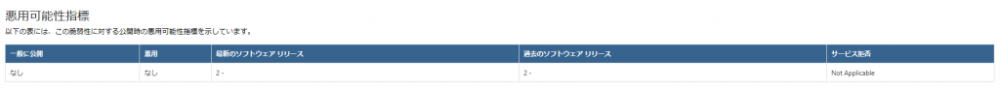
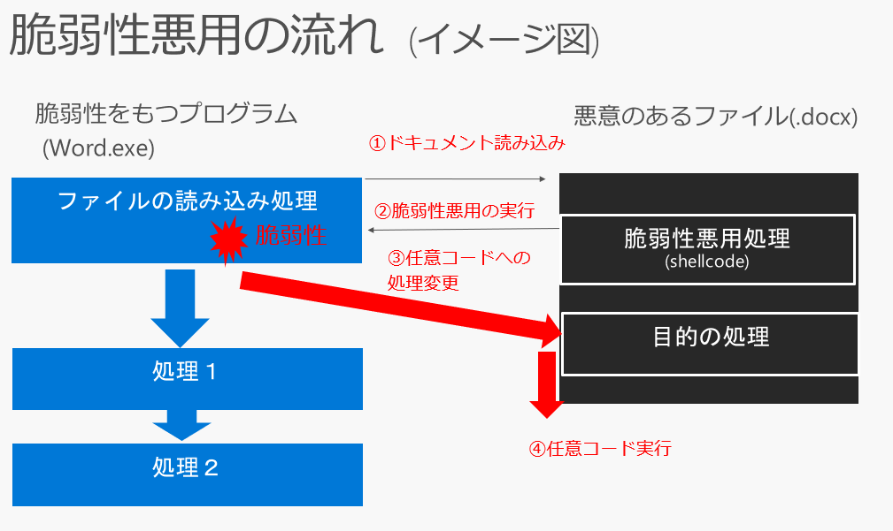
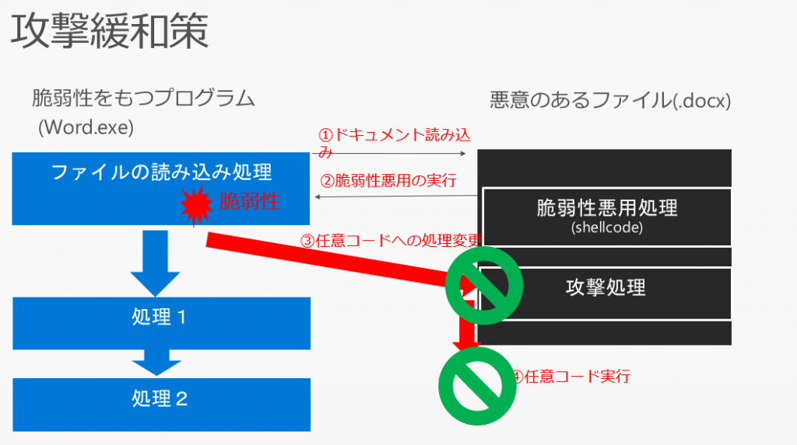
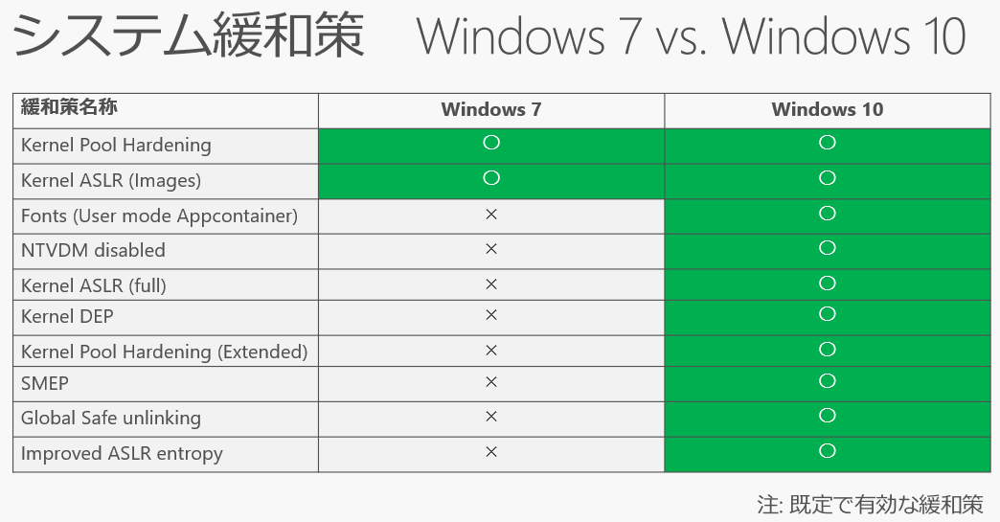
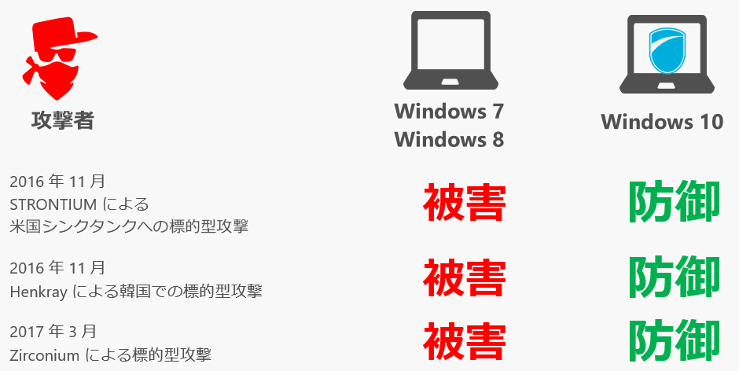

マイクロソフトでは毎月第二火曜日 (米国時間) に定例のセキュリティ更新プログラムを公開し、修正した脆弱性の概要を [Security Update Guide ポータルサイト](https://portal.msrc.microsoft.com/en-us/security-guidance)で公開しています。

時々、IT 管理者の方などから、「この脆弱性の悪用方法を教えてください」と質問されることがあります。セキュリティ更新プログラムを適用するまでの間の回避策を検討したい、正確に内容を知って悪用に備えたい、という理由などからです。

脆弱性を悪用する具体的な手順 (proof-of-concept など) は、安全性の理由から公開していません。公開できるすべての情報は[Security Update Guide ポータルサイト](https://portal.msrc.microsoft.com/en-us/security-guidance)の各脆弱性情報のページに記載されています。これ以外の情報は、たとえマイクロソフト社の社員であっても、当該の脆弱性の対応にかかわる最小限の社員以外は、知り得ることはできません。

脆弱性の詳細は明かすことができませんが、脆弱性のリスク評価やセキュリティ更新プログラムを適用するまでのリスク低減策をおこなうために、、[Security Update Guide ポータルサイト](https://portal.msrc.microsoft.com/en-us/security-guidance)では、様々な情報を掲載するよう努めています。たとえば、リスク評価に役立つよう、脆弱性の緊急度 (Severity Rating)、CVSS スコア、セキュリティ更新プログラム以外の回避策やリスクを低減するための緩和策を記載しています。また、セキュリティ更新プログラムを適用する際に有用な、脆弱性が含まれているコンポーネントや修正対象のモジュール、再起動の必要性などの情報も公開しています。

[Security Update Guide ポータルサイト](https://portal.msrc.microsoft.com/en-us/security-guidance)では、公開しているすべての脆弱性の情報をウェブサイト上で検索したり Excel ファイルとしてダウンロードしたりすることが可能です。また、Powershell や API 経由でデータを取得し、効率よく管理することもできます。（参考：[セキュリティ更新プログラム ガイド (Security Update Guide) を使ってみよう](https://msrc-blog.microsoft.com/2017/04/14/sug/)）

**現実的に発生するリスクの評価は悪用可能性指標を参考に**

Security Update Guide で公開している様々な情報のなかでも、脆弱性の緊急度や CVSS スコアを活用されている方も多いと思いますが、「悪用性可能性指標」 ([Microsoft Exploitability Index ](https://www.microsoft.com/en-us/msrc/exploitability-index?rtc=1)) にもぜひ注目してみてください。

悪用可能性指標は、脆弱性の悪用コードの開発の難易度や、悪用コードによる攻撃が成功する可能性を示した、マイクロソフトが独自に提供している指標です。以下のような観点から、マイクロソフトのセキュリティ専門エンジニアチームが総合的に判断をしています。

・脆弱性を悪用する攻撃コード (Exploit Code) の開発のしやすさ

・同種の脆弱性の悪用が行われた過去の実績

・攻撃者が好む脆弱性の悪用トレンド

・脆弱性を悪用する攻撃コードが実行された場合、攻撃が成功する可能性

・脆弱性を悪用する攻撃コードが実行された場合に攻撃者が得られる内容

緊急度や CVSS が脆弱性の一般的な技術的性質を基に評価しているのに対し、悪用可能性指標は、それぞれの脆弱性の悪用手順を基に、実際のシステムへ与えるインパクトを 4 段階で評価しています。

|                              |                                                                                                                                                                                                                                                                                                                                                                                                                                                                                                                                                                |
| ---------------------------- | -------------------------------------------------------------------------------------------------------------------------------------------------------------------------------------------------------------------------------------------------------------------------------------------------------------------------------------------------------------------------------------------------------------------------------------------------------------------------------------------------------------------------------------------------------------- |
| 評価値                       | 概要                                                                                                                                                                                                                                                                                                                                                                                                                                                                                                                                                           |
| 0 – Exploitation Detected    | 既に脆弱性を悪用した攻撃を確認済みであることを示します。 最優先のセキュリティ更新プログラムとして早急に適用することを推奨します。                                                                                                                                                                                                                                                                                                                                                                                                                              |
| 1 – Exploitation More Likely | 成功率の高い脆弱性を悪用した攻撃コードは攻撃者によって開発される可能性が高いことを示します。また、過去に、同種の脆弱性が悪用された例もあり、攻撃者はこの種の脆弱性を悪用に好むことを示しています。 優先度の高いセキュリティ更新プログラムとして早急に適用することを推奨します。                                                                                                                                                                                                                                                                                |
| 2 – Exploitation Less Likely | 脆弱性を悪用する攻撃コードの開発は可能ですが、高度な知識を要する、あるいは/また、特定の実行タイミング必要である、特定の環境構成が必要であるなど、成功率の高い攻撃コードの作成が困難であることを示します。また、同種の脆弱性の悪用がひろまっているなどのトレンドがみられないなど、攻撃者が悪用を好む傾向にはないことを示しています。 セキュリティ更新プログラムの適用を推奨しますが、その他の緊急度の高い更新プログラムを優先させる必要がある場合などは、適用の優先度を下げ組織において適切なタイミングでセキュリティ更新プログラムの適用をすることも可能です。 |
| 3 – Exploitation Unlikely    | 現実的な攻撃において脆弱性を悪用する攻撃コードは開発されにくいことを示します。攻撃コードが開発される可能性はありますが、攻撃者の目的を果たす成果を得る効果は限定的だと考えられます。よって、実際のシステム環境におけるリスクは低いと判断します。 セキュリティ更新プログラムの適用を推奨しますが、その他のセキュリティ更新プログラムを優先させる必要がある場合などは、適用の優先度を下げ組織において適切なタイミングでセキュリティ更新プログラムの適用をすることも可能です。                                                                                    |

**同じ脆弱性でも、悪用のしやすさは製品バージョンによって異なる**

ひとつの脆弱性が、複数の製品バージョンにわたって影響することはよくあります。例えば、Windows 10 に存在している脆弱性はそれ以前の Windows 8 や Window 7 に存在していることが多くあります。

悪用可能性指標は、最新のバージョンと、それ以前のバージョンに分けて、それぞれに評価値を算出しています。これは、同じ脆弱性であっても、製品のバージョンによって、実際に攻撃が発生した場合の影響度が異なる場合があるからです。そのため脆弱性によっては、最新バージョンとそれ以前のバージョンで、悪用可能性指標の値が異なることがあります。これは主に、新しい製品には、脆弱性があったとしても攻撃が成功しにくくする「緩和策」の技術が多く搭載されているためです。

**緩和策とは？**

セキュリティ技術は日々進化し、あらたな攻撃手法が次々に生まれています。このため、製品開発時には知られていなかった技術に基づく脆弱性が、製品のリリース後に見つかり、対応が必要になることもあります。このため、マイクロソフトでは、製品リリース時に脆弱性をより少なくするよう努めるだけではなく、たとえ製品に脆弱性があったとしても、その脆弱性を悪用する攻撃を成功しにくくする「緩和策」の技術の開発に力をいれています。

脆弱性に対する対策としては、まず、「セキュリティ更新プログラムを適用する」対策があげられます。プログラムに存在している脆弱性を修正することで、悪用する脆弱性がなくなるため、攻撃や悪用は成功しません。

その他の対策としては、「緩和策を適用する」という対策があります。「緩和策」を適用しても、脆弱性自体は存在したままですが、脆弱性を悪用する手法をあらかじめブロックしておくことで、攻撃を失敗させ、被害を防ぐことを目的としています。また、緩和策が実装されていることにより、攻撃者にとって、脆弱性の悪用がより困難になり、攻撃コードの開発コストがより高いものにします。

以前、緩和策は、無償のツール EMET によって追加で提供していましたが、Windows 10 からは、緩和策の重要性が高まってきたことから、Windows 10 の標準機能として実装されています。(参考：[EMET サポート終了 – Windows Defender Exploitation Guard へ移行を](https://msrc-blog.microsoft.com/2018/07/19/emeteos/))

こうした緩和策は、脆弱性を修正する更新プログラムが提供される前に攻撃が行われる、いわゆるゼロデイ攻撃に対する防御に役立ちます。実際、Windows 7 では実際に稼働しなかったゼロデイ攻撃の発生例もあります。

企業環境においては、セキュリティ更新プログラムが提供開始されていたとしても、適用のための検証などに時間を要するため、その間のリスク対策に苦慮する場合があります。より充実した緩和策が実装されている、より新しい製品を利用することにより、こうしたリスクを低減することができます。(参考：[パッチ待ちはもう古い！Windows 10 最新セキュリティ技術とゼロデイ攻撃攻防の実例)](https://www.slideshare.net/decode2017/sc09-windows-10)

マイクロソフトでは、より安全・安心な製品づくりに努めるとともに、より IT 管理者が運用しやすい環境づくりに努めています。特に企業環境では、利用しているシステムの脆弱性を把握し、リスクを評価し、セキュリティ更新プログラムの適用を行うために多くの労力を要します。今回ご紹介した、[Security Update Guide ポータルサイト](https://portal.msrc.microsoft.com/en-us/security-guidance)や悪用可能性指標、より新しい製品に搭載されている緩和策などを充実させることにより、より脆弱性対応やセキュリティ更新プログラム適用をしやすい環境づくりをつづけていきます。ぜひ、みなさまもこのような情報を活用してみてください。

マイクロソフト セキュリティレスポンスチーム セキュリティ プログラム マネージャ 垣内 由梨香
