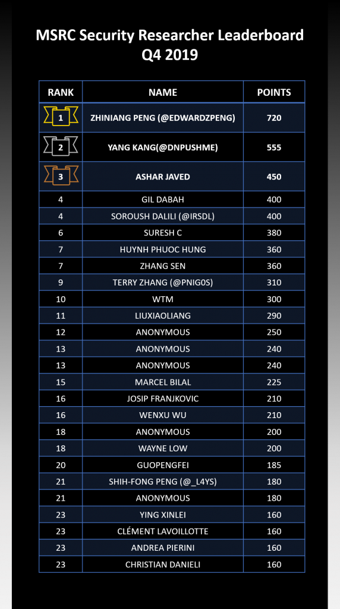

Following the first [Security Researcher Quarterly Leaderboard](https://msrc-blog.microsoft.com/2019/10/17/msrc-q3-2019-leaderboard/) we published in October 2019, we are excited to announce the MSRC Q4 2019 Security Researcher Leaderboard, which shows the top contributing researchers for the last quarter.

In each quarterly leaderboard, we recognize the security researchers who ranked at or above the 95th percentile line based on the total points. The Q4 2019 leaderboard reflects point values for cases that are:

- Submitted and assessed by the MSRC team between October 1, 2019 and December 31, 2019
- Submitted between July 1, 2019 and September 30, 2019 ([last program period](https://msrc-blog.microsoft.com/2019/10/17/msrc-q3-2019-leaderboard/)), but assessed after October 1, 2019

The top three researchers of 2019 Q4 are:** Zhiniang Peng **(720 points), **Yang Kang **(555 points), and **Ashar Javed** (450 points). Thank you everyone for your contribution in 2019 and congratulations on what you have achieved. We look forward to another great year working with all of you!

Challenging yourself to be on the board for the 2020 [MSRC Most Valuable Security Researchers](https://msrc-blog.microsoft.com/2019/08/07/announcing-2019-msrc-most-valuable-security-researchers/)? Check out the [program page](https://www.microsoft.com/en-us/msrc/researcher-recognition-program) for full details on the multipliers and high-value targets that can maximize the points you get for each case.

Keep up the great work! We look forward to seeing you in the next quarterly leaderboard!

_Sylvie Liu, Security Program Manager, Microsoft Security Response Center_
