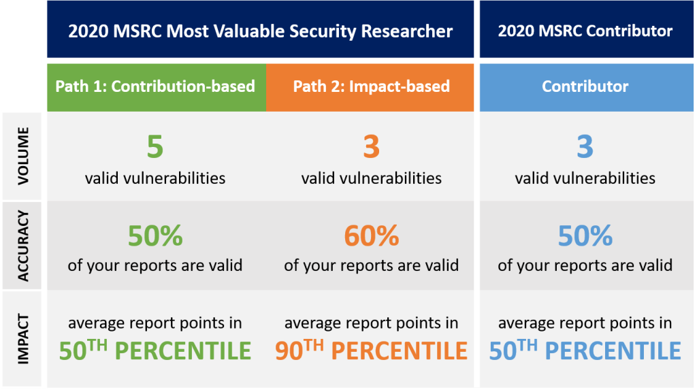

<!-- wp:paragraph -->

Is it too early to talk about the 2020 MSRC Most Valuable Security Researchers? Five months from now, at the end of June, the program period closes for researchers to be considered for inclusion in the Most Valuable Researchers list. The top researcher list will be revealed at Black Hat North America in August.

<!-- /wp:paragraph -->

<!-- wp:paragraph -->

For now, we want to explain who will get recognized as a **MSRC Most Valuable Security Researcher **for 2020, introduce the new **MSRC Contributor** tier in our [researcher recognition program](https://msrc-blog.microsoft.com/2019/07/29/the-way-we-recognize-our-security-researchers/), and share some tips that can help you get into our top researcher tiers.

<!-- /wp:paragraph -->

<!-- wp:image {"id":11650,"sizeSlug":"large"} -->

<!-- /wp:image -->

<!-- wp:paragraph -->

<!-- /wp:paragraph -->

<!-- wp:heading -->

## 2020 Most Valuable Security Researcher

<!-- /wp:heading -->

<!-- wp:paragraph -->

**How do I get in?**

<!-- /wp:paragraph -->

<!-- wp:paragraph -->

Similar to [last year](https://msrc-blog.microsoft.com/2019/07/30/recognizing-security-researchers-in-2019/), we take report volume, accuracy and impact into consideration. Here are the two paths to get into this top tier for reporting over the program period:

<!-- /wp:paragraph -->

<!-- wp:list -->

- Path One: Contribution-based (recognizes a larger body of work)

  - **Volume:** you reported at least five valid vulnerabilities during the evaluation period
  - **Accuracy:** at least 50% of your reports are valid ([your accuracy score](https://www.microsoft.com/en-us/msrc/researcher-recognition-program))
  - **Impact:** the average points of your valid vulnerability reports put you at or above the 50th percentile for report impact

<!-- /wp:list -->

<!-- wp:list -->

- Path Two: Impact-based (recognizes a smaller body of higher-impact work)

  - **Volume**: You reported at least three valid vulnerabilities during the evaluation period
  - **Accuracy:** at least 50% of your reports are valid ([your accuracy score](https://www.microsoft.com/en-us/msrc/researcher-recognition-program))
  - **Impact**: the average points of your valid vulnerability reports put you at or above the 90th percentile for report impact

<!-- /wp:list -->

<!-- wp:paragraph -->

**What do I get?**

<!-- /wp:paragraph -->

<!-- wp:paragraph -->

If you are identified as a 2020 MSRC Most Valuable Security Researcher, you’re eligible for benefits, including but not limited to:

<!-- /wp:paragraph -->

<!-- wp:list -->

- Annual recognition on the MSRC’s Most Valuable Security Researcher list
- Special SWAG box for Most Valuable Researchers
- Access to Microsoft products and services for research purposes
- Access to invitation-only MSRC events
- Invitation to private MSRC programs

<!-- /wp:list -->

<!-- wp:paragraph -->

**How about the ranking?**

<!-- /wp:paragraph -->

<!-- wp:paragraph -->

Either the contribution-based or impact-based model can get you into the top tier. Once you’re in, your rank within that tier will depend on the total number of points you’ve received.

<!-- /wp:paragraph -->

<!-- wp:heading -->

## 2020 MSRC Contributor

<!-- /wp:heading -->

<!-- wp:paragraph -->

**How do I get in?**

<!-- /wp:paragraph -->

<!-- wp:paragraph -->

MSRC Contributor is the next tier in our [researcher recognition program](https://msrc-blog.microsoft.com/2019/07/29/the-way-we-recognize-our-security-researchers/). The criteria for getting into this tier are:

<!-- /wp:paragraph -->

<!-- wp:list -->

- **Volume**: you reported at least three valid vulnerabilities during the evaluation period
- **Accuracy**: at least 50% of your reports are valid ([your accuracy score](https://www.microsoft.com/en-us/msrc/researcher-recognition-program))
- **Impact:** the average points of your valid vulnerability reports put you at or above the 50th percentile for report impact

<!-- /wp:list -->

<!-- wp:paragraph -->

**What do I get?**

<!-- /wp:paragraph -->

<!-- wp:paragraph -->

If you are identified as a 2020 MSRC Contributor, you’re eligible for, including but not limited to:

<!-- /wp:paragraph -->

<!-- wp:list -->

- Special SWAG box for MSRC Contributors
- Access to invitation-only MSRC events

<!-- /wp:list -->

<!-- wp:heading -->

## When do I need to report by to be considered?

<!-- /wp:heading -->

<!-- wp:paragraph -->

The program period for the 2020 Most Valuable Security Researcher and MSRC Contributor includes cases that fall into either of these categories:

<!-- /wp:paragraph -->

<!-- wp:list -->

- Reported and assessed by the MSRC team between July 1, 2019 and June 30, 2020
- Submitted between July 1, 2018 and June 30, 2019 ([last program period](https://msrc-blog.microsoft.com/2019/07/30/recognizing-security-researchers-in-2019/)), but assessed after July 1, 2019

<!-- /wp:list -->

<!-- wp:heading -->

## What’s next?

<!-- /wp:heading -->

<!-- wp:paragraph -->

We are five months away until the end of the program period. Here are some tips to help you get into the top tier:

<!-- /wp:paragraph -->

<!-- wp:list -->

- Research in certain areas (e.g. [Azure](https://azure.microsoft.com/en-us/services/) and [Identity](https://www.microsoft.com/en-us/msrc/bounty-microsoft-identity)) can help you earn additional research multipliers. Check out [our MSRC Recognition Program page](http://www.microsoft.com/en-us/msrc/researcher-recognition-program) showing you where you can find additional multipliers to improve your standings.

- Focus your reach on critical and high impact vulnerabilities to get higher base points. Here are some useful readings:

  - [Security Update Severity Rating System](https://www.microsoft.com/en-us/msrc/security-update-severity-rating-system)

  - [Directory of Azure Services](https://azure.microsoft.com/en-us/services/)

  - [Example of High Quality Reports](https://www.microsoft.com/en-us/msrc/bounty-example-report-submission?rtc=1)

  - [Microsoft Security Servicing Criteria for Windows](https://www.microsoft.com/en-us/msrc/windows-security-servicing-criteria?rtc=1)

  - [Microsoft Documentation for end users, developers, and IT professionals](https://docs.microsoft.com/en-us/)

  - [Microsoft Security Research & Defense Blog](https://blogs.technet.microsoft.com/srd/)

  - [HackerOne’s Hacker101 training](https://www.hackerone.com/hacker101)

  - [Bugcrowd University](https://www.bugcrowd.com/hackers/bugcrowd-university/)

<!-- /wp:list -->

<!-- wp:paragraph -->

Ready to submit your next vulnerability report? Submit it today via our researcher portal [aka.ms/secure-at](https://msrc.microsoft.com/create-report).

<!-- /wp:paragraph -->

<!-- wp:paragraph -->

_Sylvie Liu, Security Program Manager, Microsoft Security Response Center_

<!-- /wp:paragraph -->
