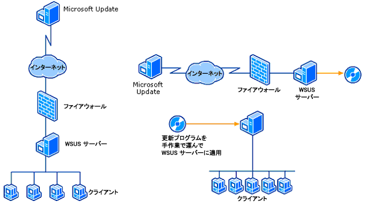
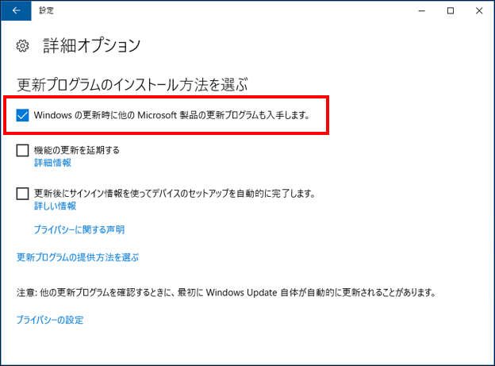

マイクロソフト製品に存在するセキュリティの脆弱性に関しては、脆弱性情報を公開しセキュリティ更新プログラムを提供しています。今回は、マイクロソフトの脆弱性、セキュリティ更新プログラムの基本を解説したいと思います。

**マイクロソフト製品の脆弱性情報はどこにあるの？**

マイクロソフト製品の脆弱性情報は、[セキュリティ更新プログラム ガイド](https://aka.ms/SUG) (Security Update Guide) に集約されています。

セキュリティ更新プログラム ガイドでは、各脆弱性の詳細、脆弱性を修正しているセキュリティ更新プログラムや製品バージョンなどの情報がまとめて公開されています。

セキュリティ更新プログラム ガイドのポータルサイトでは、対象となる製品や公開日の期間を絞って該当する脆弱性を検索することができます。また、PowerShell スクリプトなどを利用して、必要な情報だけを簡単に取得することもできます。セキュリティ更新プログラム ガイドの詳細は、以前に公開した記事「[セキュリティ更新プログラム ガイド (Security Update Guide) を使ってみよう](https://msrc-blog.microsoft.com/2017/04/14/sug/)」を参照してください。

脆弱性が修正されている更新プログラムの情報は、セキュリティ更新プログラム ガイドの各脆弱性の詳細ページ (CVE から始まる CVE-ID ごとに詳細ページを公開しています) にリンクがはってあるサポート技術情報から確認することができます。マイクロソフトが提供する更新プログラムには “KB” から始まるサポート技術情報番号が付与されています。(例: 2020 年 1 月 14 日公開の Windows 10 Version 1803 向けの更新プログラムは、[KB4534293](https://support.microsoft.com/ja-jp/help/4534293/windows-10-update-kb4534293) になります)

**脆弱性を修正するセキュリティ更新プログラムはいつリリースされるの？**

マイクロソフトでは、ユーザーの負担を考慮し、更新プログラムを計画された日程で提供しています。

セキュリティに関する修正は、米国時間の毎月第二火曜日に月例のセキュリティ更新プログラムを公開しています。このため米国では、この公開日を Patch Tuesday (パッチの火曜日)と呼ぶこともあります。日本では時差があるため、「毎月第二火曜日の翌日の水曜日」に提供が開始となります。ちなみに、水曜日から始まる月もあるので、日本では必ず第二水曜日となるわけではないのでご注意ください。

なお、緊急で脆弱性を修正する必要がある場合や、Adobe Flash Player や Edge Chromium (Chromium project のセキュリティ修正を含む) など他の組織と連携して脆弱性を修正する場合などは、マイクロソフトの月例のセキュリティ更新日以外の日程でセキュリティ更新プログラムの提供が開始される場合もあります。

**セキュリティ更新プログラムに関する通知を受け取るには？**

セキュリティ更新プログラムが公開になった場合や、すでに公開している情報に変更があった場合は、電子メールによる通知を行うサービスを無償提供しています。なお、このサービスは英語での配信のみ行っています。

配信を希望される方は、[Microsoft Technical Security Notifications ](https://www.microsoft.com/en-us/msrc/technical-security-notifications)から登録できます。ここでは 3 つの通知サービスを提供しています。

- Security Update Email Alerts : 新規の脆弱性情報、セキュリティ アドバイザリ、セキュリティ更新プログラムの公開がある場合、および、既存の公開情報に大きな更新 (Major Revision) がある場合に通知が行われます。
- Security Advisories Alerts : 既存の公開情報に小さな更新 (Minor Revision） がある場合に通知が行われます。
- Microsoft Security Response Center Blog Alerts : [Microsoft Security Response Center ブログ](https://msrc-blog.microsoft.com/) (英語情報) の公開があった場合に通知が行われます。

**セキュリティ更新プログラムはどこから入手できるの？**

Windows の既定の設定では、マイクロソフトの製品やサービスは、Windows Update/Microsoft Update を通じて、自動的にセキュリティ更新プログラムがインストールされる設定になっています。

Windows Update/Microsoft Update では、セキュリティ更新プログラムをはじめ様々な更新プログラムが配信されています。Windows Update/Microsoft Update で配信されている更新プログラムは、 [Microsoft Update Catalog](http://catalog.update.microsoft.com/v7/site/Search.aspx?q=KB4520007) で公開されており、更新プログラムのインストーラをダウンロードすることも可能です。

企業環境などで、多くの Windows 端末を一括で更新プログラムの管理を行いたい場合は、Windows Server Update Services (WSUS) または Windows Update for Business を利用して管理することも可能です。

詳細は [Microsoft Windows Server Update Services の概要](https://docs.microsoft.com/ja-jp/security-updates/windowsupdateservices/18128322)、[Windows Update for Business を使った更新プログラムの展開](https://docs.microsoft.com/ja-jp/windows/deployment/update/waas-manage-updates-wufb)を参照してください。

**Windows Update と Microsoft Update は何が違うの？**

ところで、Windows の更新を Windows Update と呼んだり Microsoft Update と呼んだりすることがあります。これらの違いはご存じでしょうか？ Windows Update は、その名前の通り Windows の機能を自動的に更新する機能のことです。Microsoft Office など、その他のマイクロソフト製品は、それぞれ製品自身で更新する機能を備えています。このため、Windows だけではなく、その他のマイクロソフト製品を含めて、漏れなくすべてアップデートする機能を Microsoft Update と呼んでいます。Windows Update の設定には、「Windows の更新時に他の Microsoft 製品の更新プログラムも入手します」という設定がありますので、必ずチェックが入っていることを確認してください (既定ではチェックが入っています）。

更新プログラムの利用手順は、[Windows Update の利用手順 – Windows 10 の場合](https://msrc-blog.microsoft.com/2018/10/18/wumusteps_win10/) を参考にしてくださいね。

\[サイバーセキュリティ月間 2020] シリーズの連載記事は[こちら](https://aka.ms/secmonth2020)を参照してください。

セキュリティ レスポンス チーム セキュリティ プログラム マネージャ 垣内 由梨香
