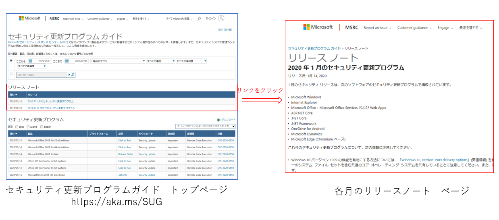
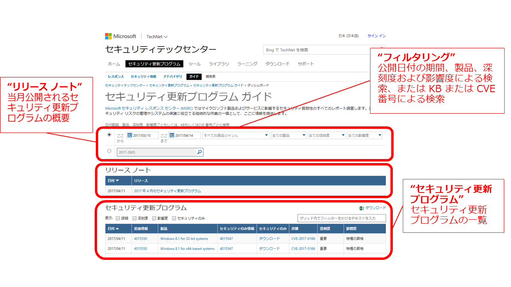
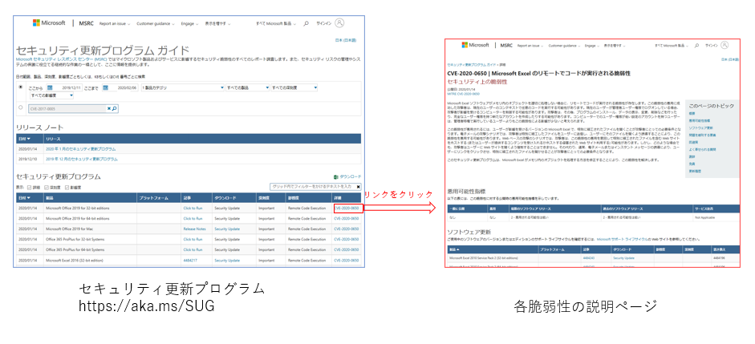

※ 2020 年 11 月に、セキュリティ更新プログラム ガイドがリニューアルしています。新しいセキュリティ更新プログラムの使い方は[「新しいセキュリティ更新プログラム ガイド (Security Update Guide) を使ってみよう](https://msrc-blog.microsoft.com/2020/12/02/20201203_sugv2_howto/)」をご参照ください。

マイクロソフトでは、毎月第二火曜日を月例のセキュリティ更新日とし、さまざまな製品の脆弱性情報を公開しセキュリティ更新プログラムを提供しています。既定では、セキュリティ更新プログラムは自動でインストールされる設定になっていますが、企業や組織環境では更新プログラムの適用テストを行った後で展開するなどの管理が行われているため IT 管理者が情報を確認しリスク評価を行うことが多いと思います。今回は、IT 管理者のみなさんに参考となるような、月例のセキュリティ更新日に公開される情報を紹介します。

###### **1. \*\***月例セキュリティ情報の概要を把握する\*\*

まずは、月例セキュリティ更新日にどのようなセキュリティ更新プログラムやセキュリティの脆弱性の修正が行われたか、[セキュリティ更新プログラム ガイド](https://aka.ms/SUG) (Security Update Guide) で概要を把握しましょう。

**リリース ノート**には、月例セキュリティ更新日に公開したセキュリティ更新プログラムの概要を紹介しています。このページでは、更新プログラムを公開した製品、更新プログラムに関する主な注意事項、追加情報が記載された脆弱性情報 (CVE) の一覧、そして、既知の問題が確認されているセキュリティ更新プログラムの一覧が記載されています。

- 脆弱性の一覧をダウンロード

セキュリティ更新プログラム ガイドのダッシュボードのページでは、月例のセキュリティ リリースに関連するリリース ノートを確認することができます。また、製品や公開日付の期間でフィルタリングと並び替えができ、CVE または KB 番号で更新プログラムを検索することが可能です。表示されたセキュリティ更新プログラムの一覧は Excel にダウンロードすることが可能です。利用方法の詳細は、以前のブログ「[セキュリティ更新プログラム ガイド (Security Update Guide) を使ってみよう](https://msrc-blog.microsoft.com/2017/04/14/sug/)」を参照してください。

- より詳細な情報を含んだ一覧を取得するには？

上記で紹介したようにセキュリティ更新プログラムガイドのウェブサイト上で情報をダウンロードする場合、各脆弱性の深刻度や影響度、修正したセキュリティ更新プログラムの KB 番号は一覧に含まれます。しかしながら、各脆弱性の CVSS スコアや、悪用性可能指標、脆弱性がゼロデイで攻撃されたかどうかなどのより詳細な情報は含まれていません。これらの情報を取得し、より詳細にリスク分析を実施したい場合は、API を利用してセキュリティ更新プログラム ガイド上のデータを取得してください。

API を使用してセキュリティ更新プログラムのデータを取得する方法や、取得したデータを Excel ファイルに取り込んで加工する方法を動画で説明する Microsoft Security Update API デモ ビデオのシリーズを作成し、YouTube 上に公開していますので、下記のリンクから参照してください。

・[GitHub 上のセキュリティ更新プログラム API の情報の見方](https://aka.ms/SUGAPIdemo1_J) ・[セキュリティ更新プログラム API のアクセス方法](https://aka.ms/SUGAPIdemo2_J) ・[月例のセキュリティ更新プログラムの概要を HTML ファイルで取得す方法](https://aka.ms/SUGAPIdemo3_J) ・[セキュリティ更新プログラムの情報を Excel ファイルへエクスポートする方法](https://aka.ms/SUGAPIdemo4_J) ・[Excel で CVE リストを取得する方法](https://aka.ms/SUGAPIdemo5_J) [・Excel で KB リストを取得する方法](https://aka.ms/SUGAPIdemo6_J)

**2. 各脆弱性の詳細を確認する**

リリースノートや脆弱性/セキュリティ更新プログラムの一覧を取得し、全体を把握したら、次は、特に注意が必要な脆弱性の詳細を把握しましょう。各脆弱性の説明は、セキュリティ更新プログラムの脆弱性のページに記載されています。

各脆弱性のページには、その脆弱性に関してマイクロフトが公表している情報がすべて記載されています。

|                                                                              |                                                                                                                                                                                                                                |
| ---------------------------------------------------------------------------- | ------------------------------------------------------------------------------------------------------------------------------------------------------------------------------------------------------------------------------ |
| **項目**                                                                     | **内容の概要**                                                                                                                                                                                                                 |
| CVE                                                                          | 脆弱性に付与されている共通脆弱性識別子 CVE (Common Vulnerabilities and Exposures)                                                                                                                                              |
| 脆弱性のタイトル                                                             | 脆弱性を表す名前                                                                                                                                                                                                               |
| 脆弱性の公開日、更新日                                                       | 脆弱性を公開した日、および内容に更新があった場合は更新日                                                                                                                                                                       |
| 脆弱性の概要                                                                 | 脆弱性が存在している動作、脆弱性が悪用されるシナリオと影響、セキュリティ修正の概要                                                                                                                                             |
| 悪用可能性指標                                                               | 脆弱性が悪用される可能性を示す指標関連ブログ「[\[IT 管理者向け\] 脆弱性の悪用のしやすさを知る～悪用可能性指標と緩和策](https://msrc-blog.microsoft.com/2020/01/09/exploitabilityindex/)」                                      |
| セキュリティ更新プログラムが公開前の脆弱性の悪用有無・脆弱性の詳細の公開有無 | セキュリティ更新プログラムが公開されるよりも前に、第三者による脆弱性の公開の有無、脆弱性の悪用の有無                                                                                                                           |
| 影響を受ける製品・バージョンとセキュリティ更新プログラム                     | 脆弱性が存在する製品およびバージョンと、脆弱性を修正するセキュリティ更新プログラムへのリンク脆弱性が最初に公開された時点でサポート対象内および拡張セキュリティ更新プログラム (ESU) の対象製品/バージョンのみ掲載されています。 |
| 問題を緩和する要素                                                           | セキュリティ更新プログラムを適用する以外の方法で、脆弱性の悪用による影響を軽減する策                                                                                                                                           |
| 影響を受ける製品・バージョンとセキュリティ更新プログラム                     | セキュリティ更新プログラムを適用する以外の方法で、脆弱性の悪用による影響を回避する策                                                                                                                                           |
| よく寄せられる質問                                                           | 脆弱性やセキュリティ更新プログラムの適用に関してよく寄せられる質問と回答                                                                                                                                                       |
| 謝辞                                                                         | 脆弱性の発見や調査に協力してくださった組織や個人                                                                                                                                                                               |
| 更新履歴                                                                     | 脆弱性の情報に更新があった場合の更新履歴                                                                                                                                                                                       |

表 1 : 各脆弱性ページに記載されている項目とその概要

このように各脆弱性のページには、脆弱性によるリスクを分析、評価するために役立つ情報が掲載されています。また、特に企業環境では、セキュリティ更新プログラムが公開されたあと、セキュリティ更新プログラムの適用を実施するまでの間、脆弱性からシステムを守るための緩和策や回避策を検討する必要があります。特定のサービスや機能が実行されている場合のみ脆弱性の影響を受けるといった情報や、特定の機能が脆弱性の悪用の影響を緩和するといったように、緩和策や回避策、よく寄せられる質問には、IT 管理者にとって参考になる情報が記載されていますので、ぜひ確認してください。例えば、次のような情報がよく掲載されています。

・例：Microsoft Office ファイルの脆弱性の場合、プレビュー ウィンドウを利用してファイルを閲覧しただけで悪用が可能か否か。([CVE-2020-0651](https://portal.msrc.microsoft.com/ja-jp/security-guidance/advisory/CVE-2020-0651)) ・例：ネットワーク経由の攻撃の場合、影響を受けるポート番号やプロトコル。([CVE-2020-0609](https://portal.msrc.microsoft.com/ja-jp/security-guidance/advisory/CVE-2020-0609)) ・例：悪用が行われていることをイベントログから検出する方法。([CVE-2020-0601](https://portal.msrc.microsoft.com/ja-jp/security-guidance/advisory/CVE-2020-0601))

少なくとも、すでに悪用が確認されている脆弱性、CVSS スコアや悪用可能性指標が高い脆弱性、そして注意事項が記載されている脆弱性 (リリースノート上で ＊ マークが記載されている脆弱性) については、必ず脆弱性の詳細を確認することをお勧めします。

###### **3. \*\***セキュリティ更新プログラム適用に関する情報を収集する\*\*

再起動の必要性や既知の不具合情報など、セキュリティ更新プログラムの適用を計画する際に必要な情報は、各更新プログラムのサポート技術情報 (KB)、Microsoft Update カタログ、あるいはリリースノートに記載されています。

|                                                                                          |                                                                                                                                                                                          |
| ---------------------------------------------------------------------------------------- | ---------------------------------------------------------------------------------------------------------------------------------------------------------------------------------------- |
| 項目                                                                                     | 参照先                                                                                                                                                                                   |
| 更新プログラムに含まれる機能追加および修正                                               | 各更新プログラムのサポート技術情報 (KB)                                                                                                                                                  |
| 更新プログラムの既知の問題                                                               | ・各更新プログラムのサポート技術情報 (KB)・Windows の場合は、Windows リリース情報ページ ([aka.ms/WRI](https://docs.microsoft.com/en-us/windows/release-information/)) に集約されています |
| 更新プログラムの入手方法                                                                 | 各更新プログラムのサポート技術情報 (KB)                                                                                                                                                  |
| この更新プログラムを提供することにより置き換わるファイルの一覧とファイルのバージョン番号 | 各更新プログラムのサポート技術情報 (KB)(CSV ファイルで提供)                                                                                                                              |
| 更新プログラムのパッケージ名                                                             | ・[Microsoft Update Catalog](https://www.catalog.update.microsoft.com/Home.aspx)・Security update deployment サポート技術情報 (KB)\*                                                     |
| 更新プログラムが置き換える以前の更新プログラム                                           | ・[Microsoft Update Catalog](https://www.catalog.update.microsoft.com/Home.aspx)・Security update deployment サポート技術情報 (KB) \*                                                    |
| 更新プログラム適用時の再起動の必要性                                                     | ・[Microsoft Update Catalog](https://www.catalog.update.microsoft.com/Home.aspx)・Security update deployment サポート技術情報 (KB) \*                                                    |
| 更新プログラムのアンインストール可否                                                     | ・[Microsoft Update Catalog](https://www.catalog.update.microsoft.com/Home.aspx)・Security update deployment サポート技術情報(KB) \*                                                     |

\*各月の月例セキュリティ更新日に公開された更新プログラムのパッケージ名、再起動の必要性、既知の問題有無の項目とともに一覧にした表を、「セキュリティ更新プログラムの展開に関する情報」というタイトルのサポート技術情報 (KB) に掲載しています。（この KB の URL は、[https://support.microsoft.com/ja-jp/help/&lt;月例セキュリティ公開日の年月日](https://support.microsoft.com/ja-jp/help/%3c月例セキュリティ公開日の年月日) (米国時間)>/security-update-deployment です）

表 2 : セキュリティ更新プログラムの適用に関する主な情報と入手先

2020 年 2 月の月例セキュリティ公開日は、今週水曜日の予定です。

ぜひ、今回ご紹介した情報を参考に脆弱性や更新プログラムの情報を確認してみてください。

\[サイバーセキュリティ月間 2020] シリーズの連載記事は[こちら](https://aka.ms/secmonth2020)を参照してください。

セキュリティ レスポンス チーム セキュリティ プログラム マネージャ 垣内 由梨香
