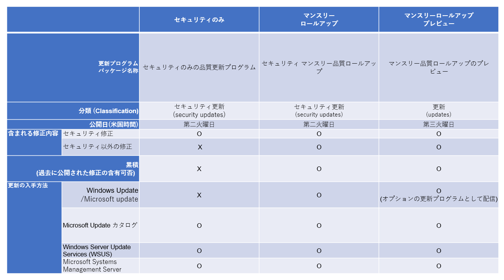

マイクロソフトでは、セキュリティ更新プログラムの適用を、よりシンプルに、より効率よくすることで、更新プログラムのインストールに関わる作業を削減できるよう努めています。また更新プログラムの品質を向上することに適した更新プログラムの提供方法を模索しています。

Windows 10 の登場にともない、特に Windows では新しいセキュリティ更新プログラムの提供方法を導入しました。新しい提供方法が開始されてから数年経っていますので、すでにこの提供方法に慣れている方も多い一方で、内容を把握しきれていない IT 管理者の方の声も聴かれます。そこで、今回は、特に質問を受けることの多い Windows とブラウザにおけるセキュリティ更新プログラムの提供モデルについて紹介します。

**■Windows の更新プログラム**

**・Windows 10, Windows Server 2019, Windows Server 2016**

Windows 10 では、新しい機能や問題点の修正を、継続的なサービスとして提供するという「Windows as a Service (WaaS) 」と呼ばれる新しい概念を導入しています。毎月提供しているセキュリティの修正も、この WaaS のモデルに従い、より分かりやすい更新プログラムの提供を行っています。Windows 10, Windows Server 2019, Windows Server 2016 では、セキュリティの修正もセキュリティ以外の修正も単一の更新プログラムパッケージとしてまとめ、「最新の累積更新プログラム (LCU: Latest Cumulative Update)」として提供しています。LCU は、過去に公開されたすべての修正を含んでいます。このため、Windows 10 をしばらく更新していない場合や最新バージョンではない Windows 10 のイメージを展開した場合でも、最新の LCU を適用するだけで最新の状態にすることができます。

毎月、月例のセキュリティ更新日 (米国時間の第二火曜日) に、新しい LCU を公開しています。LCU は「セキュリティ更新」として Windows Update/Microsoft Update を通じて提供され、既定では自動でインストールされます。LCU には、セキュリティの修正、セキュリティ以外の修正、そして Internet Explorer 11 の累積的な修正が含まれています。

Windows 10/Server 2016 以降における更新プログラムの提供の仕組みは、従来の Windows バージョンにおける更新モデルとは大きく異なっています。このため、最初は戸惑うこともあるかもしれません。しかしながら、この新しい仕組みでは、さまざまな更新プログラムの依存関係の問題、利用ユーザー側における更新プログラムの検証の複雑化など、過去の更新プログラムの提供の仕組みで課題となっていた問題点の多くを解決しています。詳細は、過去のブログ「[Windows 7 および Windows 8.1 のサービス モデルをさらにシンプルに](https://msrc-blog.microsoft.com/2016/08/16/further-simplifying-servicing-model-for-windows-7-and-windows-8-1/)」や「[Windows 7 および Windows 8.1 のサービス モデル変更についての追加情報](https://msrc-blog.microsoft.com/2016/10/11/more-on-windows-7-and-windows-8-1-servicing-changes/)」もぜひご参照ください。

**・Windows 8, Windows RT 8.1, Windows 7, Windows Server 2012 R2, Windows Server 2012, Windows Server 2008 R2, Windows Server 2008**

2016 年以前、マイクロソフトは、Windows におけるセキュリティに関する修正を、個々の機能・コンポーネントごとに、個別のセキュリティ更新プログラムパッケージで提供していました。このため、毎月、複数のセキュリティ更新プログラムをインストールする必要がありました。複数の更新プログラムをインストールする場合、特定の更新プログラムを先にインストールする必要があるなどの依存関係があり、インストール時の作業は非常に複雑なものでした。

このような問題を解決するために、2016 年 10 月以降、Windows では、新しいセキュリティ更新プログラムの提供方法へと変更しました。Windows 8.1/Windows Server 2012 R2 以前の OS では、すでに多くの企業にて管理モデルが確立されていることや、Windows の利用環境や PC のスペックなどを考慮し、Windows 10 と似た更新モデルを採用することで、この変更によるユーザーへの負担を最小限にしながらも、新しい更新モデルによるメリットを最大化しています。

現在、セキュリティの修正は以下の 3 つのパッケージで提供しています。

・**セキュリティのみの更新プログラム**：当月のセキュリティの修正のみを含む更新プログラム。累積ではないため、過去の修正は含まれていません。Windows Update/Microsoft Update では提供されておらず自動でインストールされません。Windows Server Update Services (WSUS)、System Center Configuration Manager、および Microsoft Update Catalog を通じて提供しています。

・**マンスリー ロールアップ**：セキュリティの修正およびセキュリティ以外の修正を含む更新プログラム。累積のため、過去のマンスリー ロールアップの修正が含まれています。Windows Update/Microsoft Update を通じて自動でインストールされます。Windows Server Update Services (WSUS)、System Center Configuration Manager、および Microsoft Update Catalog でも提供しています。

・**マンスリー ロールアップのプレビュー**：次の月で提供予定のマンスリー ロールアップのプレビュー版。事前にプレビュー版を一般に公開することで、問題の早期把握を行い、翌月に公開される正式版のマンスリー ロールアップの品質を高めています。Windows Update/Microsoft Update で提供されていますが「オプション」の更新プログラムとして提供しています。オプションの更新プログラムのインストールを行う設定をしている場合のみインストールされます。Windows Server Update Services (WSUS)、System Center Configuration Manager および Microsoft Update Catalog でも提供しています。

補足：Windows 7/Windows Server 2008 R2/Windows Server 2008 向けのセキュリティ更新プログラムを適用するには、Extended Security Update (ESU) が必要となります。詳細はサポート技術情報 [4522133](https://support.microsoft.com/ja-jp/help/4522133) をご参照ください。

**・サービス スタック更新プログラム**

最近の Windows のセキュリティ更新プログラムをインストールするには、「サービス スタック更新プログラム (Servicing Stack Update)」と呼ばれる特別な更新プログラムをインストール必要があります。サービス スタック更新プログラムとは、Windows の更新プログラムをインストールするためのコンポーネントである「サービス スタック」を更新するための更新プログラムです。サービス スタック更新プログラムは、すべてのバージョンの Windows にインストールが必要です。

より良い更新プログラムのインストール動作を提供するため、またインストール動作に関する既知の不具合を修正するために、都度新しいバージョンのサービス スタックを公開しています。このため、セキュリティ更新プログラムをインストールする前には、セキュリティ更新プログラムが公開された時点で最も新しいバージョンのサービス スタック更新プログラムをインストールしておく必要があります。

新たなサービス スタック更新プログラムが公開された場合は、[セキュリティアドバイザリ ADV990001](https://portal.msrc.microsoft.com/ja-jp/security-guidance/advisory/ADV990001) を更新し、新しいバージョンのサービス スタック更新プログラムをインストールするようお知らせしています。セキュリティアドバイザリ ADV99000 1 には、最新のサービス スタック更新プログラムの一覧も記載していますので、セキュリティ更新プログラムをインストールする前は、このアドバイザリも確認することをお勧めします。

なおサービス スタック更新プログラムは、“セキュリティ更新" の分類として Windows Update/Microsoft Update の自動更新で配布されています。このため Windows Update/Microsoft Update で、自動で Windows を更新している場合は、サービス スタック更新プログラムも自動でインストールし、その後、セキュリティ更新プログラムを自動でインストールしますので、利用しているユーザーが実施する作業はありません。ただし企業や組織環境で更新プログラムの展開を管理している場合は、サービス スタック更新プログラムの適用とセキュリティ更新プログラムの適用順序に注意が必要です。

**■ ブラウザの更新プログラム**

Windows に既定でインストールされている Internet Explorer, Microsoft Edge は、利用している Windows のバージョンや公開時期によって、セキュリティの修正の提供方法が異なります。

**・Internet Explorer**

Windows 10 を利用している場合、Internet Explorer のセキュリティに関する修正は、すべて Windows10 の最新の累積更新 (LCU) に含まれています。

Windows 8.1/Server 2012 R2 以前を利用している場合は、「マンスリー ロールアップ」には、Internet Explorer の修正は含まれていますが、「セキュリティのみの更新プログラム」には含まれていません。現在「セキュリティのみの更新プログラム」には、Internet Explorer の更新は含まれていませんので (補足 1)、Windows 8.1/Server 2012 R2 以前の環境で、「セキュリティのみの更新プログラム」を適用する場合は、別途 Internet Explorer 用の累積的な更新プログラムを適用する必要があります。なお、Windows の既定の設定では Windows Update/Microsoft Update を通じて「マンスリー ロールアップ」が自動的にインストールされます。

(補足 1) 2017 年 2 月の月例の更新以前は、Internet Explorer の修正は 「セキュリティのみの更新プログラム」に含まれていました。しかしながら、ユーザーのみなさまからのフィードバックに基づき、Internet Explorer 用の更新プログラムを Windows とは別の更新プログラムとして提供するように変更した経緯があります。詳細は、「[シンプル化された Windows 7 および Windows 8.1 のサービス モデル: 最新の改善点について](https://msrc-blog.microsoft.com/2017/01/17/simplified-servicing-for-windows-7-and-windows-8-1-the-latest-improvements/)」を参照してください。

**・Microsoft Edge**

Microsoft Edge のセキュリティに関する修正は、すべて Windows 向けの更新プログラムに含まれています。

Chromium ベースの Microsoft Edge のセキュリティに関する修正は、Chromium プロジェクトの修正に基づいて実施されます。このため、通常のマイクロソフトのセキュリティ更新サイクルとは別のタイミングで更新されます。これは、毎月第二火曜日のセキュリティ更新日に定例で公開するのではなく、Chromium プロジェクトの更新タイミングに基づいて行われることを意味しています。

Chromium ベースの Microsoft Edge のセキュリティに関する修正に関する情報はすべて [セキュリティアドバイザリ ADV200002](https://portal.msrc.microsoft.com/ja-jp/security-guidance/advisory/ADV200002) (2020 年) で公開しています。Chromium プロジェクトから一般に公開されたセキュリティ更新プログラムを組み込んだ Microsoft Edge のバージョンがマイクロソフトからリリースされると、このアドバイザリも更新されます。

現在の Windows の更新プログラムの提供方法は、過去の更新モデルに比べるとシンプルになると同時に、スキャンやインストールにかかる時間が減少し、Windows の更新プログラムの管理が非常に柔軟に対応できるようになっています。ぜひ、今回ご紹介した情報を参考に脆弱性や更新プログラムの情報を確認してみてください。

参考情報 [Windows 7 および Windows 8.1 のサービス モデルをさらにシンプルに](https://msrc-blog.microsoft.com/2016/08/16/further-simplifying-servicing-model-for-windows-7-and-windows-8-1/) [Windows 7 および Windows 8.1 のサービス モデル変更についての追加情報](https://msrc-blog.microsoft.com/2016/10/11/more-on-windows-7-and-windows-8-1-servicing-changes/) [マイクロソフトのソフトウェアの更新で使用される一般的な用語の説明](https://support.microsoft.com/ja-jp/help/824684/description-of-the-standard-terminology-that-is-used-to-describe-micro)

\[サイバーセキュリティ月間 2020] シリーズの連載記事は[こちら](https://aka.ms/secmonth2020)を参照してください。

セキュリティ レスポンス チーム セキュリティ プログラム マネージャ 垣内 由梨香
