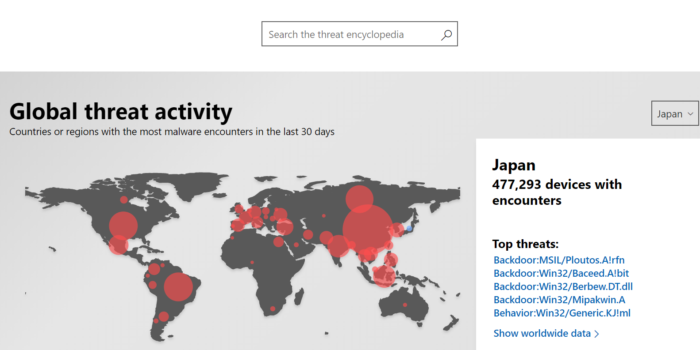

セキュリティ管理をしている時やセキュリティのインシデントを調査している時など、マイクロソフトのどこに相談したらいいのか、迷うこともあると思います。

今回は、IT 管理者の皆さんが今後困った際にお役に立てるよう、セキュリティに関するマイクロソフトの問い合わせ先を、まとめてご紹介します。

##### **1. マルウェア対策の情報**

マイクロソフトではマルウェア対策に関する情報を、[Malware Protection Center](https://www.microsoft.com/en-us/wdsi) にまとめて掲載しています。このサイトに掲載されている情報のうち、代表的な参照先を下記に紹介します。

**最新のマルウェア定義ファイルを入手したい**

Microsoft Defender などマイクロソフトのマルウェア対策製品を利用している場合、既定では自動的に最新の定義ファイルに更新されます。手動で定義ファイルを入手したい、定義ファイルの詳細を知りたい場合は、[Security intelligence updates for Windows Defender Antivirus and other Microsoft antimalware](https://www.microsoft.com/en-us/wdsi/defenderupdates) から入手可能です。

**マルウェアの詳細を知りたい**

現在どのようなマルウェアが流行しているか、マルウェアの動作詳細などを知りたい場合は、[Threat Encyclopedia](https://www.microsoft.com/en-us/wdsi/threats) を参照してください。地域ごとの脅威の傾向や、攻撃手法の解説、それぞれのマルウェアの動作の詳細などを解説しています。また検索もできますので、特定の脅威がどの検出名で検出可能かなどを確認することもできます。

#####

##### **2. マイクロソフトに脅威を報告する**

\*\*\*\*フィッシング サイトやマルウェアなど、セキュリティの脅威と思われる事象を発見した場合は、マイクロソフトにぜひ報告をお願いいたします。マイクロソフトアカウントや企業アカウントでサインインをして報告をした場合は、調査が完了次第、調査結果を返答しています。報告を行う前には、[報告のガイドライン](https://docs.microsoft.com/en-us/windows/security/threat-protection/intelligence/submission-guide) (英語情報) をご確認ください。

**マルウェアなどの疑わしいファイルの報告**

ウイルスなど、悪意のあるソフトウェア (マルウェア） と思われるファイルがある場合は、[疑わしいファイルの報告フォーム](https://www.microsoft.com/en-us/wdsi/filesubmission)から報告してください。「Home customer (ご家庭で利用のユーザー向け)」を選択した場合は匿名で報告するか、マイクロソフトアカウントでサインインしたうえで報告することが可能です。マイクロソフトセキュリティソリューションを利用している企業ユーザーの場合は、「Enterprise customer (企業ユーザー向け)」を選択することで利用しているソリューションと連携することが可能です。マイクロソフトアカウントや企業アカウントでサインインをして報告をした場合は、調査が完了次第、報告されたファイルがマルウェアであるか、マルウェアである場合は Microsoft Defender などのマイクロソフト製品やサービスでの検出名などを調査結果として返答します。

**安全ではないウェブサイトの報告**

フィッシングやマルウェアなど悪意のあるファイルを含むサイトなど、安全ではないウェブサイトがある場合は、[Report unsafe site](https://www.microsoft.com/en-us/wdsi/support/report-unsafe-site) から該当の URL を報告してください。マイクロソフトアカウントでサインインしたうえで報告するか、匿名で報告することが可能です。

**テクニカル サポート詐欺の報告**

マイクロソフトの社員であると主張する誰かから連絡を受け、それが詐欺だと感じた場合は [テクニカル サポート詐欺を報告する](https://www.microsoft.com/ja-jp/concern/scam?rtc=1)から報告してください。

##### **3. マイクロソフト製品・サービスの悪用を報告する**

マイクロソフトの製品が、悪意のある者によって、攻撃のツールとして悪用される場合もあります。マイクロソフトでは 24 時間体制で、そのような悪用を監視し対応をおこなっています。もし、マイクロソフト製品やサービスが悪用されていることを発見した場合は、ぜひご報告をお願いいたします。

**マイクロソフトクラウド、オンラインサービス上の疑わしいコンテンツ**

マイクロソフトのクラウドやオンラインサービスが、悪用されていると思われる場合は、[Submit Abuse Report (CERT)](https://portal.msrc.microsoft.com/en-us/engage/cars) から報告してください。

例: マイクロソフトが保有する IP アドレス空間が発信元となっている疑わしい通信 マイクロソフトクラウドサービス上から配布されているマルウェアなどの疑わしいファイル マイクロソフトが管理するドメイン上にあるフィッシングなどの疑わしいサイト

**マイクロソフト製品やサービスの脆弱性を報告する**

マイクロソフトでは、より安全・安心な製品やサービスを提供するため、脆弱性報告窓口および脆弱性報奨金プログラムを展開し、マイクロソフト製品に影響を及ぼすセキュリティの脆弱性に関する報告を調査しています。脆弱性と疑われる製品やサービスの動作を発見した場合は、[Microsoft Security Response Center – Report Security Vulnerability](https://msrc.microsoft.com/create-report) に報告してください。なお、報告は日本語でも受け付けています。日本語での報告の方法は、以前のブログ記事「[日本語でマイクロソフトに脆弱性を報告する方法](https://msrc-blog.microsoft.com/2019/10/30/vulnerabilityresponsecenter/)」を参考にしてください。

##### **4. サポートへ問い合わせたい**

製品の利用方法が分からない場合やエラーが出ている場合など、トラブルの解決を支援するためにサポート窓口を利用することもできます。[Microsoft サポート](https://support.microsoft.com/ja-jp)でサポート技術情報を検索したり、サポートに問い合わせをしたりすることができます。また IT プロフェッショナルの方々を対象とした [TechNet フォーラム](https://social.technet.microsoft.com/Forums/ja-jp/home) では、企業内でのシステムの運用・管理に関するトラブルシューティングの情報を確認することができます。

なお、マイクロソフトの法人向け (中堅企業、大企業) のサポート サービスでは、障害対応から IT 資産の安全で効率的な運用管理まで、より幅広いサポートをご提供しています。詳細は [法人向けサポートサービス](https://www.microsoft.com/ja-jp/services/support.aspx) をご参照ください。

\[サイバーセキュリティ月間 2020] シリーズの連載記事は[こちら](https://aka.ms/secmonth2020)を参照してください。

セキュリティ レスポンス チーム セキュリティ プログラム マネージャ 垣内 由梨香
