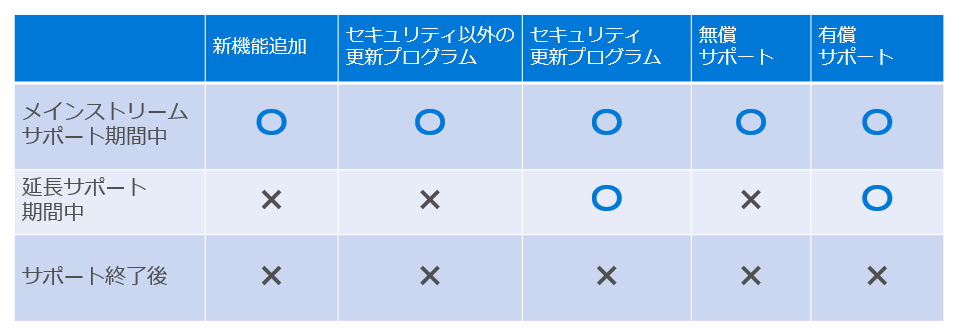
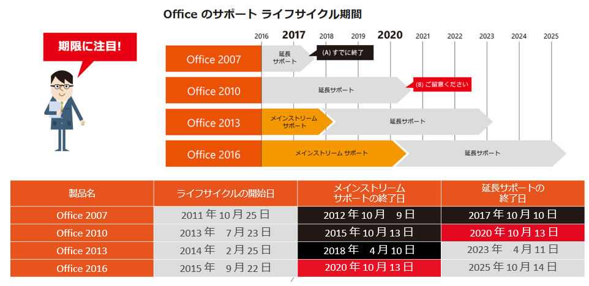
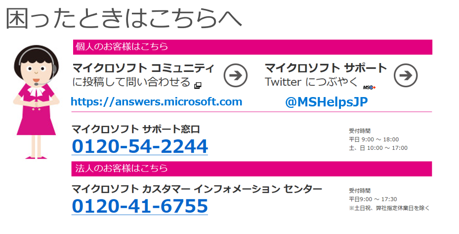

2020 年 1 月に、広く利用されてきた Windows 7, Windows Server 2008/2008R2 のサポートが終了して既に数か月が過ぎました。サポートが終了すると「セキュリティ更新プログラムを入手できない」ということは知っているが、細かい話はよく分からない、という方もいらっしゃるのではないでしょうか。

今回は、マイクロソフトの製品サポートポリシーについて、いま一度整理してお伝えしたいと思います。

##### **マイクロソフトの製品サポートポリシー 概要**

多様な形でマイクロソフト製品を利用しているユーザーのみなさんへのサポートが行き渡るように、マイクロソフトのサポートの範囲も多岐に渡っています。主に提供しているサポートとしては次のようなものがあります。

- セキュリティ更新プログラムの提供
- セキュリティ以外の更新プログラムの提供
- サポート窓口での問い合わせ対応：無償サポート、有償サポート
- オンライン上での製品情報の提供

マイクロソフトでは、製品サポートの期間を「メインストリームサポート」と「延長サポート」のふたつの期間に分けて、段階的にサポートを終了するようにしています (最初の最短 5 年間のメインストリーム サポートと、これに続いて最短 5 年間の延長サポート)。

- **メインストリーム サポート期間 \*\***(最短 5 年間)\*\*: すべてのサポートを提供しています。
- **延長サポート期間 \*\***(最短 5 年間)\*\*: メインストリームサポート期間の終了後、最短 5 年間はサポート終了に向けて、セキュリティ更新プログラムと有償サポートのみを提供しています。

延長サポート期間が終了すると、製品のサポート期間が終了となり、これ以降、製品に関するセキュリティ更新プログラムや有償サポート、技術情報のアップデートなどすべてのサポートの提供が終了します。

補足 1: Windows 7, Windows Server 2008/2008R2 向けは、拡張セキュリティ更新プログラム「Windows 7 Extended Security Update (ESU）」を用意し、延長サポート期間終了後の特別なサポートを提供しています。ESU は最新バージョンへのアップグレード支援を目的としているため、提供しているサポートの範囲は、メインストリームサポートおよび延長サポート期間で提供されるサポート範囲とは大きく異なります。詳細は、「[Windows 7 のサポート終了についての IT プロフェッショナルに関するよくあるご質問](https://support.microsoft.com/ja-jp/help/4527873)」をご参照ください。

補足 2: 製品サポート以外にも、様々な法人向けのサポート サービスをご用意しています。例えば、マイクロソフトの法人向け (中堅企業、大企業) のサポート サービスでは、障害対応から IT 資産の安全で効率的な運用管理まで、より幅広いサポートを提供しています。詳細は [法人向けサポートサービス](https://www.microsoft.com/ja-jp/services/support.aspx) をご参照ください。

##### **サポートが終了するとセキュリティへの影響は？**

サポート期間が終了すると、すべてのサポートの提供が終了します。これにより製品自体が利用できなくなるわけではありませんが、使い続けた場合、例えば、新たに脆弱性が発見された場合でも、それに対応するためのセキュリティ更新プログラムの提供は行われないなど、セキュリティのリスクが高まります。マイクロソフトは、セキュリティを強化した製品を提供するよう取り組んでいます。製品やサービスの開発中に脆弱性を除去するよう努めていますが、今日、ソフトウェアの脆弱性は依然として現実に存在するため、発見された時点で対応する準備が必要になります。このため、サポート期間が終了する前までに、セキュリティ更新プログラムが提供される最新環境に移行することをお勧めしています。

また最新のマイクロソフト製品では、開発段階からセキュリティを念頭に置き、より最新のセキュリティを構造的に実装するだけではなく、モバイル ワークスタイルや生産性の向上、マルチデバイスへの対応など利便性も向上しています。より高い生産性やより効率的な総保有コスト (TCO) などの利点なども考慮し、最新環境への移行を検討いただきたいと考えています。

##### **サポート終了日を調べるには？**

<https://aka.ms/lifecycle> にアクセスして調べることができます。

ただし一部の製品において、上記で説明した期間が固定されたライフサイクル ポリシーが適用されません。利用している製品のサポート種別やサポート サービスの開始日と終了日を確認するには、「[製品のライフサイクルの検索](https://support.microsoft.com/lifecycle/search)」ページをご利用ください。

##### **サポート終了日は月例セキュリティ更新日**

サポート終了時点においても最新の更新プログラムを展開できるよう、多くの製品にてサポート終了日は月例のセキュリティ更新日となっています。その月例リリースに対応すべき脆弱性が含まれている場合、サポート終了日にも最新のセキュリティ更新プログラムを提供します。最新のセキュリティ更新プログラムを適用するためには、前提として過去にリリースした更新プログラムやサービスパックの展開が必要になる場合があります。

上述したように、マイクロソフトはセキュリティを強化した製品を提供するよう取り組んでいます。新たに脆弱性が発見された時点でお客様も対応する準備が必要になります。できる限りのセキュリティを確保するためにも、最新の製品リリース、セキュリティ更新プログラム、サービス パックが公開されたら可能な限り早期にインストールし、最新のセキュリティ更新プログラムがスムーズに展開できるよう準備しておくことを推奨します。

##### **終了直前に慌てないために、余裕をもったご準備を**

上記のとおり、製品のサポート期間は、メインストリームサポート期間、延長サポート期間と段階的になっており、製品の更新や最新製品の導入計画の立案、そのための予算確保などを計画しやすくなっています。例えば、Office 2010 のサポートは 2020 年 10 月に終了しますが、現在すでに延長サポート期間に入っており、限定的なサポートのみを提供している状態になっています。Office 2010 を利用している場合は、サポート終了直前に慌てないために、いまから計画を立てて余裕をもったご準備をお願いします。

[マイクロソフト コミュニティ](https://answers.microsoft.com/)

[@MSHelpsJP](https://twitter.com/MSHelpsJP)

サイバーセキュリティ月間 2020] シリーズの連載記事は[こちら](https://aka.ms/secmonth2020)を参照してください。

セキュリティ レスポンス チーム セキュリティ プログラム マネージャ 垣内 由梨香
