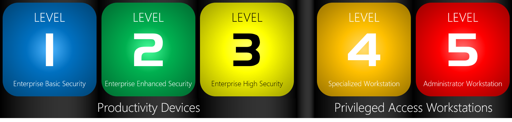

マイクロソフトによく寄せられる質問のひとつに、「マイクロソフトが推奨するセキュリティ構成や各設定項目の推奨値は何ですか？」というものがあります。たとえば、Windows のこの設定は、どの値に設定するのが良いのでしょうか？この設定は有効にしておくべきですか？などです。

Windows には、きめ細かなセキュリティ管理を実現させるために、数多くのセキュリティに関する構成があり、多くのグループポリシー項目を用意しています。しかし、この多くの設定を調査し、良い構成を導き出すことは容易なことではありません。このため、マイクロソフトでは、各バージョンの Windows に対して、業界のスタンダードに沿い互換性テストを行ったセキュリティの推奨構成をまとめ、Windows セキュリティベースライン ([Windows security baselines](https://docs.microsoft.com/windows/security/threat-protection/windows-security-baselines)) として公開してきました。しかしながら、求められる推奨の構成は、Windows を利用している環境や組織、求められるセキュリティレベルによって異なるため、Windows セキュリティベースラインは少し要件が厳しすぎる、組織に合わない、といったご意見をいただくこともありました。

このようなご要望に応え、より柔軟な Windows の堅牢化を手助けするために、新たな推奨構成のフレームワーク 「[**セキュリティ構成フレームワーク \*\***(Security Configuration Framewor: SecCon)\*\*](https://github.com/microsoft/SecCon-Framework/blob/master/windows-security-configuration-framework.md)」 を開発しました。

このセキュリティ構成フレームワークは、セキュリティ、生産性、そして利便性のバランスを考慮した ５ つのレベルを用意しています。レベルを分けることで、さまざまな利用シナリオに対応しており、ユーザーは必要に応じたレベルで組織内の端末を構成できるようになっています。また、セキュリティ構成フレームワークの開発にあたっては、マイクロソフトの開発部門だけではなく日々顧客と接している顧客対応部門、営業部門が連携し、また、パイロットユーザーによる協力もいただくことで、よりユーザーにとって使いやすいフレームワークとなることを目指しました。

**セキュリティ構成フレームワーク \*\***(Security Configuration Framework: SecCon): 5 つのレベル\*\*

セキュリティ構成フレームワークでは、１ から ５ までのレベルのセキュリティ構成設定を展開しています。数値が大きいほどセキュリティが強化されていることを示しています。

**レベル \*\***1: エンタープライズ基本セキュリティ (Level 1: Enterprise Basic Security)\*\*

レベル 1 は、企業や組織で利用する場合の最小セキュリティ構成として推奨している構成です。レベル 1 で推奨されている構成は展開が比較的容易な設定で構成されており、30 日以内に展開できるように設計されています。

**レベル \*\***2: エンタープライズ 強化されたセキュリティ (Level 2: Enterprise Enhanced Security)\*\*

レベル 2 の構成は、ユーザーが企業や組織の機密情報にアクセスする際に利用する端末のセキュリティ構成として推奨している構成です。一部のコントロールはアプリの互換性に影響を与える可能性があるため、構成を組織に展開する際には、段階的な展開 (詳細は後述) することを推奨しています。このレベルの推奨事項は、大多数の組織で利用可能な設定で構成されており、90 日以内に展開できるように設計されています。

**レベル \*\***3: エンタープライズ 高セキュリティ (Level 3: Enterprise High Security)\*\*

レベル 3 の構成は、大規模または高度なセキュリティチームを持つ組織が管理する端末、または、非常にリスクの高い特定のユーザーまたはグループが利用する端末のセキュリティ構成として推奨している構成です。標的型攻撃を受ける可能性のある組織は、この構成を目指すべきだと考えています。このレベルの推奨事項は、例えばローカル管理者権限の制限など、設定や組織内での展開が複雑になる可能性があり、多くの場合 90 日を超えることがあります。

**レベル \*\***4: DevOps ワークステーション (Level 4/ Specialized Workstation)\*\*

レベル 4 の構成は、高機密データを含むサーバーやシステムへのアクセス、または重要なビジネス機能が中断される可能性のあるシステムに従事し、サプライチェーン攻撃などの攻撃の標的になり得る開発者とテスターが利用する端末に利用するセキュリティ構成として推奨しています。

**レベル \*\***5: 管理者ワークステーション (Level 5: Administrator Workstation)\*\*

レベル 5 の構成は、管理者 (セキュリティシステムを管理する管理者) が利用する端末の構成として推奨しています。管理者アカウントは、データの盗難や企業組織のサービスの中断をもたらすなど組織にとって非常に高いリスクを保持していますので、高レベルのセキュリティで端末を堅牢化することを推奨しています。

レベル 1 から ３ は「生産性向上デバイス」のための構成と位置付けており、端末のセキュリティを高めながらも、端末を利用するための利便性やビジネスの生産性を阻害しないよう構成しています。

レベル ４ 及び ５ は、「特権アクセスワークステーション」のための構成と位置づけ、高いセキュリティを保つことを焦点にあてた構成です。特権アクセスワークステーションの構成は、マイクロソフトが提唱している「特権アクセスの保護ロードマップ ([Securing Privileged Access roadmap](https://aka.ms/privsec))」 の一部となっており、マイクロソフトとして統一されたガイダンスを提供しています。

**セキュリティ構成フレームワーク \*\***(Security Configuration Framework: SecCon) : 組織に最適な構成の選択\*\*

端末に必要とされるセキュリティ構成のレベルは、各組織によって異なり、また、同一組織においても端末の利用用途によって異なります。各組織で利用されている端末を確認および分類し、必要に応じたレベルで端末を構成することをお勧めします。レベル 1 を企業や組織で必要となる最小ベースラインと考え、脅威の状況とリスクに応じて、保護を強化するために、より高レベルなセキュリティ構成を採用していくことをお勧めしています。

従来の Windows セキュリティベースライン ([Windows security baselines](https://docs.microsoft.com/windows/security/threat-protection/windows-security-baselines)) は、セキュリティ構成フレームワークのレベル ３ に該当します。Windows セキュリティベースラインをすでに展開している、あるいは採用を検討している場合は、セキュリティ構成フレームワークのレベル 3 を基調に、組織への展開を検討することを推奨します。

**セキュリティ構成フレームワーク \*\***(Security Configuration Framework: SecCon) : カテゴリ\*\*

セキュリティ構成フレームワークでは、それぞれのレベルで、推奨事項を 4 つのグループに分けています。

**ハードウェア \*\***(Hardware)** Windows セキュリティ機能をサポートするために必要となるハードウェア機能をサポートするハードウェア **ポリシー \***\*(policies)** 指定されたセキュリティレベルに適した保護を提供するため有効化するべきポリシーや構成 **コントロール \*\***(Controls)** 指定されたセキュリティレベルに適した保護を提供するために、有効化するべきセキュリティコントロール **組織の動作 \***\*(Behavior)** 構成対象の端末を正しく運用管理をおこなうために推奨する組織の動作

**セキュリティ構成フレームワーク \*\***(Security Configuration Framework: SecCon) : 展開\*\*

セキュリティ構成フレームワークの各レベルで推奨されているコントロールを実装し展開していく方法として、次のような方法を推奨しています。

&lt;監査モードをサポートしていないコントロール>

監査モードをサポートしないセキュリティ管理策は、徐々に導入する必要があります。

典型的な導入方法:

1. テストリング: 検証環境で構成を確認し、組織で利用している主要なアプリケーションとの互換性のテストなど必須のテストを実施
2. パイロットリング: 組織環境の 2〜5％ の代表的な端末に構成を展開
3. 高速リング: 組織環境の 25％の端末に構成を展開
4. スローリング: 組織環境の残りの端末に構成を展開

&lt;監査モードをサポートしているコントロール>

監査モードをサポートするセキュリティコントロールは、次の方法で展開できます。

1. 監査: 監査モードで制御を有効にし、一元化された場所で監査データを収集します。
2. レビュー: 監査データをレビューして潜在的な影響 (プラスとマイナスの両方) を評価し、構成する必要があるセキュリティ管理からの免除を構成します。
3. 強制: 免除の構成を展開し、コントロールを強制モードに変換します。

**フィードバック**

セキュリティ構成フレームワークは、GitHub 上で公開されており、フィードバックやコントリビューションを歓迎しています。詳細は [SecCon-Framework/README.md](https://github.com/microsoft/SecCon-Framework/blob/master/README.md) を参照してください。

**参考情報**

Introducing the security configuration framework: A prioritized guide to hardening Windows 10 <https://www.microsoft.com/security/blog/2019/04/11/introducing-the-security-configuration-framework-a-prioritized-guide-to-hardening-windows-10/>

Introducing the security configuration framework <https://github.com/microsoft/SecCon-Framework/blob/master/windows-security-configuration-framework.md>

垣内 由梨香 セキュリティ プログラム マネージャ セキュリティ レスポンス チーム マイクロソフト
