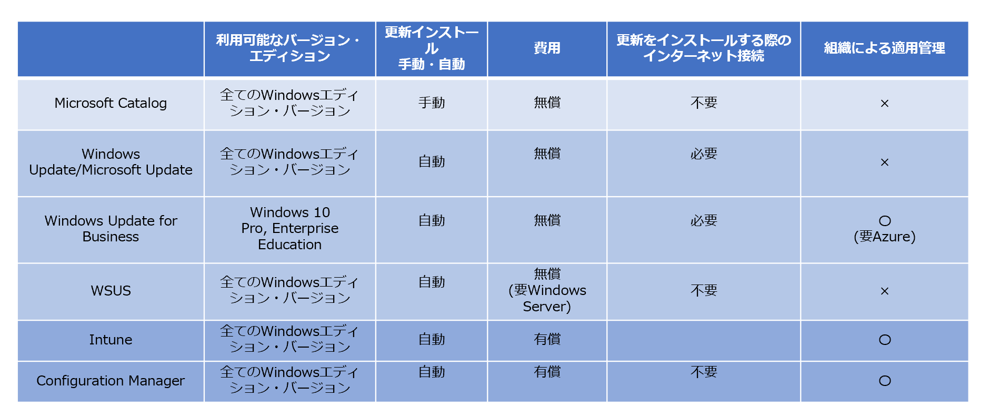

**マイクロソフトは通常通り、\*\***4 月の月例セキュリティ更新日 (2020 年 4 月 15 日 日本時間) に、定例のセキュリティ更新プログラム・品質更新プログラムを配信しました。\*\*

セキュリティ更新プログラムを適用し、利用端末を最新の状態を保つことは、重要なセキュリティ対策のひとつです。必ずセキュリティ更新プログラムを適用いただけますようお願いいたします。

現在、リモート環境から自社組織に接続する端末や BYOD 端末を利用した業務の必要性が増加しています。これにより、VPN 接続環境やネットワーク帯域が狭い環境で更新プログラムを適用する必要性が生じたり、組織によって管理する必要のある端末が増加したりするなど、企業 IT 環境において更新プログラムの適用環境の変更に迫られている状況も見受けられます。

そこで、IT 環境の変更への対応をお手伝いするために、マイクロソフト製品のアップデートに関する特別措置、リモート環境への更新プログラムの適用における注意点・よく寄せられる質問をまとめて紹介いたします。

**(1) マイクロソフト製品のセキュリティ更新プログラムについて**

マイクロソフトは、通常通り、月例セキュリティ更新日に、定例のセキュリティ更新プログラム・品質更新プログラムを配信します。

**&lt;マイクロソフト 脆弱性およびセキュリティ更新プログラム情報の公開場所>**

マイクロソフト製品の脆弱性およびセキュリティ更新プログラムに関する情報は、次の場所で公開しています。

**・**[Security Update Guide](https://aka.ms/sug): マイクロソフト製品の脆弱性の情報、およびセキュリティ更新プログラムの情報

・[Microsoft Security Response Center ブログ](https://msrc-blog.microsoft.com/category/msrc/)、[Twitter](https://twitter.com/msftsecresponse) (@msftsecresponse) (英語情報): マイクロソフト製品のセキュリティ更新プログラムリリースのお知らせ

・[マイクロソフト セキュリティ チーム ブログ](https://aka.ms/jpsecurity/) (本ブログ)、[Twitter](https://twitter.com/jsecteam) (@jsecteam): 日本語でのマイクロソフト製品のセキュリティ更新プログラムリリースのお知らせ

・[Microsoft Technical Security Notifications](https://www.microsoft.com/en-us/msrc/technical-security-notifications) (英語情報): マイクロソフト製品の脆弱性の情報、およびセキュリティ更新プログラムの情報のメール通知

**&lt;重要: 更新プログラム詐欺、サポート詐欺に注意してください！>**

マイクロソフトを騙り、悪意のあるプログラムをインストールさせようとする詐欺やフィッシングに注意してください。

・マイクロソフト製品・サービスで表示するエラー メッセージや警告メッセージに電話番号が記載されていることはありません。電話番号が記載された通知が表示された場合は、電話しないでください。

・サポートを提供するために、マイクロソフトから、個人情報、クレジットカード番号やギフトカード番号の入力を求めるメール送信したり、電話をかけたりすることはありません。また、ビットコインやギフト カードの形式でサポート料金を請求することはありません。

・マイクロソフトのセキュリティ脆弱性、更新に関する情報は、必ずマイクロソフト公式のポータル サイト [Security Update Guide](https://portal.msrc.microsoft.com/) で情報を確認してください。

・マイクロソフトのセキュリティ更新に関するメールでの通知は、すべて PGP で署名 ([PGP 鍵](https://www.microsoft.com/en-us/msrc/pgp-key-security-notifications?rtc=1)) されています。署名がないメール通知を受け取った場合は、信用せず、メールを破棄してください。

・報告が寄せられている詐欺について注意喚起をご覧ください。「[マイクロソフトのサポートを装った詐欺にご注意ください](https://news.microsoft.com/ja-jp/2017/04/26/170426-information-support/)」「[テクニカル サポート詐欺から身を守る](https://support.microsoft.com/ja-jp/help/4013405/windows-protect-from-tech-support-scams)」

**(2) マイクロソフト製品のアップデートに関する特別措置について**

IT 環境への影響を鑑み、製品のアップデート配信、製品サポートライフサイクルに特別措置を実施することを決定しています。

**・Windows 10 バージョン 1709/1809、Windows Server バージョン 1809、Configuration Manager** **(Current branch) バージョン 1810、SharePoint/Project Server 2010、Dynamics 365 クラウド サービス、Exchange Online の基本認証のサポート期間延長**

Windows 10 バージョン 1709 (Enterprise, Education, IoT Enterprise)

変更前: 2020 年 4 月 14 日 変更後: 2020 年 10 月 13 日

Windows 10 バージョン 1809 (Home, Pro, Pro Education, Pro for Workstations, IoT Core)

変更前: 2020 年 5 月 12 日 変更後: 2020 年 11 月 10 日

Windows Server バージョン 1809 (Datacenter, Standard)

変更前: 2020 年 5 月 12 日 変更後: 2020 年 11 月 10 日

Configuration Manager (current branch) バージョン 1810

変更前: 2020 年 5 月 27 日 変更後: 2020 年 12 月 1 日

SharePoint Server 2010, SharePoint Foundation 2010, and Project Server 2010

変更前: 2020 年 10 月 13 日 変更後: 2021 年 4 月 13 日

Dynamics クラウド サービス

詳細は、[Dynamics 365 Blog](https://cloudblogs.microsoft.com/dynamics365/bdm/2020/03/23/our-commitment-to-customers-to-help-ensure-business-continuity/) を参照してください。

Exchange Online の基本認証

詳細は、[Exchange Team Blog](https://techcommunity.microsoft.com/t5/exchange-team-blog/basic-authentication-and-exchange-online-april-2020-update/) を参照してください。

対象環境を利用している場合、変更後の日付までセキュリティ更新プログラムを、現在と同じように受け取ることが可能です。詳細は、「[Lifecycle changes to end of support and servicing dates](https://support.microsoft.com/ja-jp/help/4557164/)」を参照してください。

**・セキュリティ以外のオプショナル アップデートの配信停止 \*\***(2020 年 5 月以降)\*\*

マイクロソフトでは毎月、第 3 週および第 4 週に「オプショナル」のアップデートを配信しています。5 月の配信から、すべての Windows 製品を対象とし、「オプショナル」のアップデートの更新の配信を停止します。

なお、毎月第 2 週に配信している、セキュリティ更新プログラムおよび・品質更新プログラムに変更はありません。詳細は「[Timing for upcoming Windows optional C and D releases](https://docs.microsoft.com/en-us/windows/release-information/windows-message-center)」を参照してください。

**(3) マイクロソフト製品のアップデート管理ツール・サービス**

**(3-1) 管理ツールまとめ**

リモート環境を新たに整備した場合など、新たにマイクロソフト製品のアップデートを集中管理する必要性が生じている、または新たな管理の方法を模索している組織もあるかと思います。マイクロソフト製品のアップデートを実施する方法、管理するツールをまとめて紹介します。

**(3-2) Microsoft Update Catalog**

基本的に、マイクロソフト製品のアップデートは、インターネット上の Windows Update/Microsoft Update サーバーに接続し、更新プログラムをダウンロード・インストールします。インターネット接続を行うことができない端末に更新プログラムをインストールする場合は、[Microsoft Update Catalog](https://www.catalog.update.microsoft.com/Home.aspx) から更新プログラムのパッケージをダウンロードしてインストールすることが可能です。

基本的な手順:

1. インターネット接続を行うことが可能な端末で [Microsoft Update Catalog](https://www.catalog.update.microsoft.com/Home.aspx) にアクセスし更新プログラムのパッケージをダウンロードします。必要となる更新プログラムの番号 (KB 番号) は、[Security Update Guide](https://portal.msrc.microsoft.com/) (マイクロソフト製品の脆弱性の情報、およびセキュリティ更新プログラムの情報サイト) で確認することができます。
2. ダウンロードした更新プログラムを、インターネット接続を行うことができない端末にコピーします。
3. コピーした更新プログラムを、インターネット接続を行うことができない端末でインストールします。

**(3-3) Windows Update/Microsoft update**

Windows Update は Windows 標準機能で、すべての Windows で既定で有効になっています。マイクロソフト製品のアップデートをインターネット上の Windows Update/Microsoft Update サーバーに接続し、自動的に更新プログラムをダウンロード・インストールします。

**・\*\***Windows Update/Microsoft Update の接続先\*\*

プロキシ サーバーやファイアウォールを設置して通信を制御している場合は事前に Windows Update サイト、Microsoft Update サイトへの通信を許可する必要があります。通信を許可する URL は、「[Windows Update/Microsoft Update の 接続先 URL 一覧](https://social.msdn.microsoft.com/Forums/ja-JP/7b2bf53d-e88f-431b-9efc-9b37ba57a543/windows-update-microsoft-update-12398255093215420808-url?forum=jpsccmwsus)」を参照してください。

**・\*\***VPN 環境を利用した場合の考慮事項\*\*

スプリットトンネルを利用している場合は、Windows Update への接続は影響がなく、組織へのネットワーク負荷を増加させることはありません。スプリットトンネル以外を利用している場合は、組織のネットワーク構成を変更し適切に Windows Update/Microsoft Update の通信が行えるようにする、あるいは組織内で WSUS などのツールを利用して更新プログラムが漏れなく適用されるように管理してください。

**(3-4) Windows Update for Business**

Windows Update for Business は、Windows 10 から搭載されている標準機能です。

Windows Update for Business は Windows Update と基本機能は一緒です。各 Windows 端末に既定で備わっている Windows Update の機能を利用して、マイクロソフト製品のアップデートをインターネット上の Windows Update/Microsoft Update サーバーに接続し、自動的に更新プログラムをダウンロード・インストールします。

Windows Update for Business が Windows Update と異なる点は、次のようなビジネス利用を想定した管理機能が追加されているという点です。

・利用する機能更新プログラムサービスチャネルの設定、適用を行うまでの猶予期間の設定

・品質更新プログラムの適用を行うまでの猶予期間の設定、一時的な適用停止

・グループポリシー、MDM ポリシーによる設定の一括管理

・Microsoft Azure の [Update Management](https://docs.microsoft.com/ja-jp/azure/automation/automation-update-management) 機能を併用することで、組織内の更新プログラムの状況把握が可能

**・\*\***Windows Update for Business の接続先\*\*

Windows Update/Microsoft Update と同様の接続先を利用しています。プロキシ サーバーやファイアウォールを設置して通信を制御している場合は事前に Windows Update サイト、Microsoft Update サイトへの通信を許可する必要があります。通信を許可する URL は、「[Windows Update/Microsoft Update の 接続先 URL 一覧](https://social.msdn.microsoft.com/Forums/ja-JP/7b2bf53d-e88f-431b-9efc-9b37ba57a543/windows-update-microsoft-update-12398255093215420808-url?forum=jpsccmwsus)」を参照してください。

**・\*\***VPN 環境を利用した場合の考慮事項\*\*

スプリットトンネルを利用している場合は、Windows Update への接続は影響がなく、組織へのネットワーク負荷を増加させることはありません。スプリットトンネルを利用していない場合は、組織のネットワーク構成を変更し適切に Windows Update/Microsoft Update の通信が行えるようにする、あるいは組織内で WSUS などのツールを利用して更新プログラムが漏れなく適用されるように管理してください。

**(3-5) Windows Server Update Service (WSUS)**

[Windows Server Update Services (WSUS)](https://docs.microsoft.com/ja-jp/security-updates/windowsupdateservices/18128322) は、Windows Server に標準搭載されている機能で、組織内の端末への更新プログラム管理を行うことが可能です。WSUS のサーバーを、インターネット経由あるいは手動で Windows Update サーバーと同期させることで、組織内の端末をインターネット上の Windows Update に接続させることなく、更新をインストールさせることができます。また、WSUS サーバーにて、組織に展開する更新プログラムを選択し、配信を行うことが可能です。現在、オンプレミス環境を主とする多くの小規模・中規模をはじめとした幅広い組織に利用されています。WSUS の構成や管理、トラブルシューティングに役立つ情報は、[日本マイクロソフト SCCM＆WSUS サポートチームのブログ](https://social.msdn.microsoft.com/Forums/ja-JP/home?forum=jpsccmwsus)をご参考ください。

**・\*\***WSUS が必要とする接続先\*\*

WSUS サーバーを Windows Update サーバーと同期させる場合、プロキシ サーバーやファイアウォールを設置して通信を制御している場合は Windows Update サイト、Microsoft Update サイトへの通信を許可する必要があります。詳細は「[2.1.1. Connection from the WSUS server to the Internet](https://docs.microsoft.com/en-us/windows-server/administration/windows-server-update-services/deploy/2-configure-wsus#BKM_ConfigurenetworkConnections)」(英語情報) をご参考ください。

**・リモート環境を利用している場合の考慮事項**

VPN (スプリットトンネル) を利用している場合や、遠隔地などネットワークへの負荷が懸念される場合、「各クライアント端末は、更新プログラムをインターネット上の Windows Update から取得し、管理状況のレポートのみ WSUS に送信する」といった構成も可能です。設定は「[更新プログラムの格納場所の指定](https://docs.microsoft.com/ja-jp/security-updates/windowsupdateservices/18111600)」をご参考ください。

**(3-6) Configuration Manager**

[Configuration Manager](https://docs.microsoft.com/ja-jp/configmgr/) は、端末管理するためのシステム管理製品で、組織内の更新プログラムの管理だけではなく、Windows 以外の OS も含め、多種多様な端末の構成管理、資産管理など幅広い機能を備えています。

**・リモート環境を利用している場合の考慮事項**

リモート環境で Configuration Manager を利用している場合の考慮事項は以下のブログ (英語情報) をご参考ください。

[Mastering Configuration Manager Bandwidth limitations for VPN connected Clients](https://techcommunity.microsoft.com/t5/premier-field-engineering/mastering-configuration-manager-bandwidth-limitations-for-vpn/ba-p/1280002)

[Managing Patch Tuesday with Configuration Manager in a remote work world](https://techcommunity.microsoft.com/t5/configuration-manager-blog/managing-patch-tuesday-with-configuration-manager-in-a-remote/ba-p/1269444)

[Helping businesses rapidly set up to work securely from personal PCs and mobiles](https://nam06.safelinks.protection.outlook.com/?url=https%3A%2F%2Ftechcommunity.microsoft.com%2Ft5%2Fenterprise-mobility-security%2Fhelping-businesses-rapidly-set-up-to-work-securely-from-personal%2Fba-p%2F1239830&data=02%7C01%7Cyurikam%40microsoft.com%7C2a7a4f373cc84051317608d7db0e6356%7C72f988bf86f141af91ab2d7cd011db47%7C1%7C0%7C637218728310237841&sdata=9oHw7appo6lCocWp3KyArp3euAa%2FO0fOaXvSQg%2FGqhw%3D&reserved=0)

[Helping IT send and provision business PCs at home to work securely during COVID-19](https://nam06.safelinks.protection.outlook.com/?url=https%3A%2F%2Ftechcommunity.microsoft.com%2Ft5%2Fenterprise-mobility-security%2Fhelping-it-send-and-provision-business-pcs-at-home-to-work%2Fba-p%2F1262022&data=02%7C01%7Cyurikam%40microsoft.com%7C2a7a4f373cc84051317608d7db0e6356%7C72f988bf86f141af91ab2d7cd011db47%7C1%7C0%7C637218728310237841&sdata=z3gXVE4JwK8X8VLcgqchmIlILpxQUEec20o5mge%2BPEo%3D&reserved=0)

[Manage work devices at home during Covid-19 using Configuration Manager](https://nam06.safelinks.protection.outlook.com/?url=https%3A%2F%2Ftechcommunity.microsoft.com%2Ft5%2Fenterprise-mobility-security%2Fmanage-work-devices-at-home-during-covid-19-using-configuration%2Fba-p%2F1262052&data=02%7C01%7Cyurikam%40microsoft.com%7C2a7a4f373cc84051317608d7db0e6356%7C72f988bf86f141af91ab2d7cd011db47%7C1%7C0%7C637218728310247838&sdata=SJ9IKRZNhE%2B1eWB%2BfyG5AQReXTeOPtZ0HkSDvxJQmWo%3D&reserved=0)

[Managing remote machines with cloud management gateway (CMG)](https://nam06.safelinks.protection.outlook.com/?url=https%3A%2F%2Ftechcommunity.microsoft.com%2Ft5%2Fconfiguration-manager-blog%2Fmanaging-remote-machines-with-cloud-management-gateway-in%2Fba-p%2F1233895&data=02%7C01%7Cyurikam%40microsoft.com%7C2a7a4f373cc84051317608d7db0e6356%7C72f988bf86f141af91ab2d7cd011db47%7C1%7C0%7C637218728310247838&sdata=wplvcGmUSTcLmDlFpR4pzAGNcTN%2B1i4yxIVBoDCdgno%3D&reserved=0)

[Manage Patch Tuesday with Configuration Manager without overloading your VPNs](https://nam06.safelinks.protection.outlook.com/?url=https%3A%2F%2Ftechcommunity.microsoft.com%2Ft5%2Fconfiguration-manager-blog%2Fmanaging-patch-tuesday-with-configuration-manager-in-a-remote%2Fba-p%2F1269444&data=02%7C01%7Cyurikam%40microsoft.com%7C2a7a4f373cc84051317608d7db0e6356%7C72f988bf86f141af91ab2d7cd011db47%7C1%7C0%7C637218728310257831&sdata=9EyNOQWE9Zqr6ukpnFF3IVo4ni75WZaGStxuaFokJKI%3D&reserved=0)

**(3-7) Microsoft Intune**

[Microsoft Intune](https://www.microsoft.com/ja-jp/microsoft-365/enterprise-mobility-security/microsoft-intune)は、クラウドベースのモバイル デバイス管理 (MDM) とモバイル アプリ管理 (MAM) を提供するサービスです。管理する端末は、Azure AD および Intune へリンクする必要があります。管理対象の端末は、Windows Update/Microsoft Update に接続し直接更新プログラムをダウンロード・インストールします。Intune を単体で利用する場合は、WSUS や Config Manager と比較すると、更新プログラムの展開や管理に関しては構成可能な設定が少なめですが、Intune はオンプレミスの構成が一切必要なくクラウドベースのみの管理が可能であるため、構築が容易で短時間での展開が可能となります。また Intune と Configuration Manager と併用しすることで柔軟な管理が可能です。

**・\*\***VPN 環境を利用した場合の考慮事項\*\*

スプリットトンネルを利用している場合は、Windows Update への接続は影響がなく、組織へのネットワーク負荷を増加させることはありません。スプリットトンネル以外を利用している場合は、組織のネットワーク構成を変更し適切に Windows Update/Microsoft Update の通信が行えるようにする、あるいは組織内で別の管理ツールを利用して漏れなく更新プログラムが適用されるように管理してください。

**(4) 更新プログラム配信の負荷関する考慮事項**

更新プログラムをインストールする端末のネットワーク帯域に制限がある場合、企業の VPN への負荷、サーバーへの負荷を分散させる必要がある場合、更新プログラムの配信や展開を調整する機能を活用してください。

**(4-1) 組織に段階的に更新プログラムを展開する**

組織内の端末に一斉に更新プログラムを配信する場合、ネットワークの負荷や管理サーバへの負荷が集中する恐れがあります。また更新プログラムを適用することにより、組織で利用しているアプリやシステムに互換性の問題が発生することを想定し、それに備えることも重要です。

Windows Update for Business: グループポリシーを利用した管理の場合は OU 等の単位、MDM を利用した管理の場合は Intune や Azure AD のグループ単位でグループ分けが可能 ([構成方法](https://docs.microsoft.com/ja-jp/windows/deployment/update/waas-wufb-group-policy))

WSUS: WSUS コンソール上のコンピュータグループ単位でグループ分けが可能 ([構成方法](https://docs.microsoft.com/ja-jp/security-updates/windowsupdateservices/18128121))

Configuration Manager: SCCM コンソール上でコレクションを作成しグループ分けが可能 ([構成方法](https://docs.microsoft.com/ja-jp/configmgr/core/servers/deploy/configure/install-and-configure-distribution-points))

**(4-2) 配信する更新プログラムのファイルサイズを削減する**

累積的な更新プログラムを配信・インストールする場合、前月までの変更点だけを配信することで、ファイルサイズを削減しネットワークへの負荷を軽減することが可能です。

Windows Update for Business: [高速インストールファイル機能](https://docs.microsoft.com/ja-jp/configmgr/sum/deploy-use/manage-express-installation-files-for-windows-10-updates)を利用可能

WSUS: [高速インストールファイル機能](https://docs.microsoft.com/ja-jp/security-updates/windowsupdateservices/18128186)を利用可能 (注: WSUS サーバーで必要となるファイルサイズが増大します)

Configuration Manager: [高速インストールファイル機能](https://docs.microsoft.com/ja-jp/configmgr/sum/deploy-use/manage-express-installation-files-for-windows-10-updates)を利用可能

**(4-3) \*\***ピア ツー ピアー配布で\***\*負荷を分散する**

ピア ツー ピアー技術などを利用することで、組織内のクライアント同士でキャッシュを共有し、ネットワークの負荷やサーバーの負荷を分散させることが可能です。主に以下の 2 つの機能があります。

・BranchCache: すべての Windows で利用可能な帯域最適化機能

・配信の最適化: Windows 10 以上のみで利用可能な新しい配信機能

Windows Update for Business: グループポリシーで[配信の最適化](https://docs.microsoft.com/ja-jp/windows/deployment/update/waas-optimize-windows-10-updates)、または BITS による帯域制御を設定可能

WSUS: [BranchCache 機能](https://docs.microsoft.com/ja-jp/windows/deployment/update/waas-branchcache)、または[配信の最適化](https://docs.microsoft.com/ja-jp/windows/deployment/update/waas-delivery-optimization)機能を利用可能

Configuration Manager: [BranchCache 機能](https://docs.microsoft.com/ja-jp/windows/deployment/update/waas-branchcache)、または[クライアントのピアキャッシュ機能](https://docs.microsoft.com/ja-jp/configmgr/core/plan-design/hierarchy/client-peer-cache)を利用可能

**(4-4) \*\***ネットワーク帯域制限でネットワーク負荷を分散する\*\*

更新プログラムを端末にダウンロードする際に、どの程度ネットワーク帯域を利用するか制御することで、ネットワークへの負荷を分散させることができます。主に以下の 2 つの機能で制御が可能です。

・BITS による帯域制御: 更新プログラムのダウンロードは Windows 標準の BITS を利用しています。BITS による帯域制御はすべての Windows で利用可能です。

・配信の最適化: Windows 10 以上のみで利用可能な新しい配信機能による帯域制御です

Windows Update for Business: グループポリシーで[配信の最適化](https://docs.microsoft.com/ja-jp/windows/deployment/update/waas-optimize-windows-10-updates)、またはグループポリシー”BITS バックグラウンド転送の最大ネットワーク帯域幅を制限する” を設定可能

WSUS: [配信の最適化](https://docs.microsoft.com/ja-jp/windows/deployment/update/waas-optimize-windows-10-updates)、または[BITS による帯域制御](https://docs.microsoft.com/ja-jp/security-updates/windowsupdateservices/18128186)を設定可能

Configuration Manager: [BITS による帯域制御](https://docs.microsoft.com/ja-jp/configmgr/core/clients/deploy/about-client-settings)、または[SCCM サイトサーバー間の帯域制御機能](https://docs.microsoft.com/ja-jp/configmgr/core/plan-design/hierarchy/manage-network-bandwidth)を設定可能

**(補足) Microsoft Teams の更新プログラム**

リモート環境にいるメンバー同士で会議を開催するために、オンライン会議を利用する機会が増えています。マイクロソフトでは Microsoft Teams を使うことで、より安全に、かつより使いやすいオンライン会議を開催できる環境を提供しています。その Microsoft Teams のデスクトップ向けクライアントの更新プログラムはアプリケーションが自動で更新する仕組みを持っています。そのため利用者が意識することなく、最新のバージョンを利用することができるようになっています ([Microsoft Teams を更新する](https://support.microsoft.com/ja-jp/office/microsoft-teams-を更新する-535a8e4b-45f0-4f6c-8b3d-91bca7a51db1))。またモバイル向けクライアントは iOS App Store または Google Play ストアから入手します。更新漏れを防ぐために、各ストアにおいて自動でアプリが更新されるように設定されているかをご確認ください。

Microsoft Teams のセキュリティやプライバシーに関する詳細は下記の Microsoft 365 ブログを参照してください。

一般利用者向け: [Microsoft Teams におけるプライバシーとセキュリティへの取り組みについて](https://aka.ms/security-teams-blog)

IT 管理者向け: [IT プロフェッショナル向け: Microsoft Teams のプライバシーとセキュリティ](https://aka.ms/security-teams-blog-ITpro)

垣内 由梨香 セキュリティプログラムマネージャー セキュリティレスポンスチーム マイクロソフト
