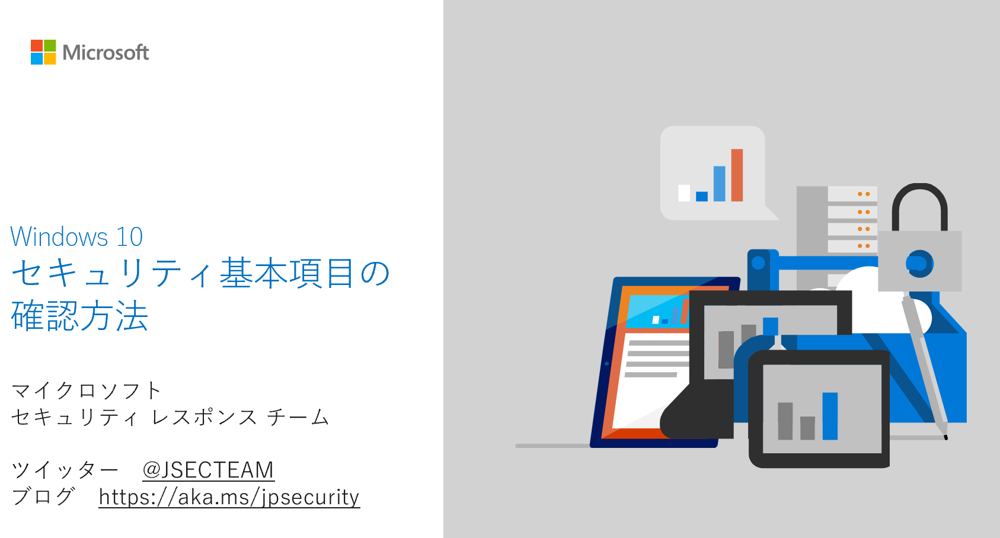

昨今は、リモートワークのために、企業や組織で新たに持ち出し用デバイスを展開したり、あるいは、個人で所有しているデバイスを業務に利用するケースも増えています。また、ご家庭でも、オンライン学習のために、PC やタブレットを利用するケースが増えているかと思います。

どのような利用シナリオにおいていも、安心・安全に IT 環境を利活用するためには、まずは、利用しているデバイスのセキュリティが正しく構成され、有効な状態に保たれていることが重要です。しかしながら、Windows 10 を安全に利用するには、具体的にどの項目をどう確認すればよいのかわからない、という悩みの声も聞かれます。

そこで、安心・安全に Windows デバイスを利用するには、最低限確認しておくべき Windows 10 のセキュリティの設定をまとめて紹介いたします。設定するセキュリティ項目を画像付きで紹介した PDF 資料も用意していますので、ぜひご活用ください。

**&lt;資料のダウンロードはこちらから \[[ダウンロード](https://download.microsoft.com/download/2/9/5/295b78a4-7051-4873-a00c-4beaf416ccec/BasicWin10SecuritySettings.pdf)] >**

**Windows 10 セキュリティ基本項目**

1. **デバイスのセキュリティ : **Windows 10 のセキュリティ設定を有効に保ちましょう。

1-1. **更新プログラムを適用し、最新の状態で利用する** : Windows や Microsoft Office 等のマイクロソフト製品をはじめ、利用しているすべてのソフトウェアやアプリの更新プログラムを適用し、最新の状態で利用しましょう。

1-2. **\[Windows セキュリティ] で基本的な設定を有効に保つ** : マルウェア対策ソフトやファイアウォールなど、基本のセキュリティ機能を有効にしましょう。

1-3. **デバイスの暗号化を設定する** : 紛失や盗難に備え、デバイスの暗号化を利用しましょう。

1-4. **(補足) VPN を利用する : **仮想プライベートネットワーク (VPN) を利用することでプライベートなネットワーク接続を利用することができます。

2. **ユーザーアカウントの管理** : Windows のサインインに利用しているユーザーのアカウントを適切に管理しましょう。

2-1. **適切なパスワードを設定する : **長く複雑なパスワードを適切に管理しましょう。

2-2. 多**要素認証を有効にする\*\*** : \*\*多要素認証を利用することで、使用しているアカウントに他のユーザーがサインインしづらくしましょう。

2-3. **サインインオプション (Windows Hello) を有効化する : **生体認証やセキュリティキーを利用した安全なサインインなど、より安全なサインイン オプションが利用しましょう。

3-3. **ユーザーアカウントを他人と共有しない : **共有で利用するデバイスを利用する場合でも、ユーザーアカウントは共有せず、各自のユーザーアカウントで利用しましょう。

3-4. **身に覚えのない利用がないか確認する : **利用しているユーザーアカウントが不正に利用されていないか定期的に確認し、万が一被害にあった場合でも、迅速に対処を行うことができるようにしましょう。

**企業・組織でのさらなる堅牢化のために**

今回紹介している Windows10 セキュリティ基本項目は、どの組織やどのような利用状況の場合にでも、かならず遵守しておくべき事項をまとめています。しかし企業や組織においては、個々の情報セキュリティポリシーに応じて追加のセキュリティコントロールを設定する必要がある場合もあるかと思います。その場合は、今回の設定に加えて、「[Windows 堅牢化のためのセキュリティ構成フレームワーク (Security Configuration Framework: SecCon)](https://msrc-blog.microsoft.com/2020/03/30/secconjp/)」を、ぜひご活用ください。

また安全なリモートワーク環境の実現のために、マイクロソフトでは、「[セキュア リモートワーク相談窓口](https://www.microsoft.com/ja-jp/biz/security/remote-work.aspx)」を開設していますので、ぜひご相談ください。

サイバー攻撃の手法は、専門的な観点からみると日々変化しており、必要とされる対策も変化しています。しかしながら、それぞれのユーザーが、デバイスを安全に利用するために実施するべき基本的な項目を確実に実行しておくことが、重要なことには変わりがありません。弊社に寄せられる被害事例においても、マルウェア対策ソフトが正しく実行されていなかった、といったような基本的なセキュリティ事項やベストプラクティスが実行されていなかったことが要因となっているケースが散見されます。「うっかり」「つい」基本的な項目が守られていないこともあります。ぜひ、この機会に、みなさんのデバイスの設定を見直してみてください。

垣内由梨香 セキュリティ プログラム マネージャ セキュリティ レスポンス チーム マイクロソフト

---

補足

今回ご紹介したデバイスのセキュリティを保つ以外にも、リモートワーク実施時やインターネット利用時に気を付けておくべきセキュリティ事項や注意点があります。次の参考情報を参照してください。

\- NISC 内閣サイバーセキュリティセンター 「[テレワーク実施者の方へ\[みんなでしっかりサイバーセキュリティ\]](https://www.nisc.go.jp/security-site/telework/index.html)」, 「[インターネットの安全・安心ハンドブック](https://www.nisc.go.jp/security-site/handbook/index.html)」 - IPA 独立行政法人 情報処理推進機構 「[情報セキュリティ対策](https://www.ipa.go.jp/security/measures/index.html)」 - IPA 独立行政法人 情報処理推進機構 「[テレワークを行う際のセキュリティ上の注意事項](https://www.ipa.go.jp/security/announce/telework.html?fbclid=IwAR2KPIgonNlUdypYrJ4MP4RPJu6CG0CcrkmSdloZ-oDIiKNNyrOkbiEKc6M)」 - CSAJ 一般社団法人 コンピュータソフトウェア協会 「[在宅勤務での家庭内 PC の取り扱いについて（テレワーク推進）](https://www.csaj.jp/NEWS/important/business_support_corona2.html)」
