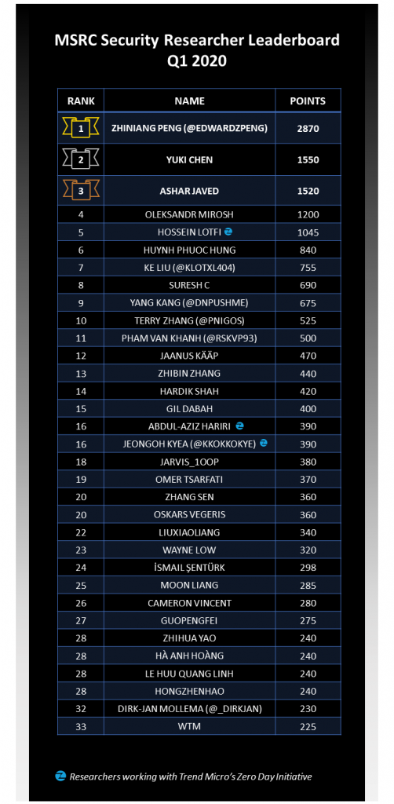

<!-- wp:paragraph -->

Following the second [Security Researcher Quarterly Leaderboard](https://msrc-blog.microsoft.com/2020/01/15/msrc-q4-2019-leaderboard/) and the [2020 MSRC Most Valuable Security Researchers criteria](https://msrc-blog.microsoft.com/2020/02/03/recognizing-security-researchers-in-2020/) we published in February 2020, we are excited to announce the 2020 First Quarter (Q1) Security Researcher Leaderboard, listing our top contributing researchers for the last quarter.

<!-- /wp:paragraph -->

<!-- wp:paragraph -->

The top three researchers of the last quarter are: Zhiniang Peng (2870 points), Yuki Chen (1550 points), and Ashar Javed (1520 points).

<!-- /wp:paragraph -->

<!-- wp:paragraph -->

**Thank you to everyone – not just our top three – for your significant contributions this past quarter, and congratulations on your achievement!**

<!-- /wp:paragraph -->

<!-- wp:image {"align":"center","id":11845,"width":659,"height":1344,"sizeSlug":"large"} -->

<!-- /wp:image -->

<!-- wp:paragraph -->

Each quarterly leaderboard recognizes the security researchers who ranked at or above the 95th percentile based on their total points. This Q1 2020 leaderboard reflects point values for cases that are:

<!-- /wp:paragraph -->

<!-- wp:list -->

- Submitted and assessed by the MSRC team between January 1, 2020 and March 31, 2020
- Submitted between October 1, 2019 and December 31, 2019 ([last program period](https://msrc-blog.microsoft.com/2020/01/15/msrc-q4-2019-leaderboard/)), but assessed after January 1, 2020

<!-- /wp:list -->

<!-- wp:paragraph -->

With just over two months until the end of the program period, there’s still an opportunity to work toward becoming one of this year’s **Most Valuable Security Researchers**! Check out our [blog post](https://msrc-blog.microsoft.com/2020/02/03/recognizing-security-researchers-in-2020/) for full details on the multipliers and high value targets that can maximize the points you receive for each case.

<!-- /wp:paragraph -->

<!-- wp:paragraph -->

**Keep up the great work! We look forward to seeing you in the next quarterly leaderboard!**

<!-- /wp:paragraph -->

<!-- wp:paragraph -->

_Sylvie Liu, Security Program Manager, Microsoft Security Response Center_

<!-- /wp:paragraph -->

<!-- wp:separator -->

---

<!-- /wp:separator -->
