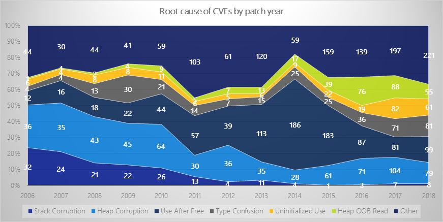
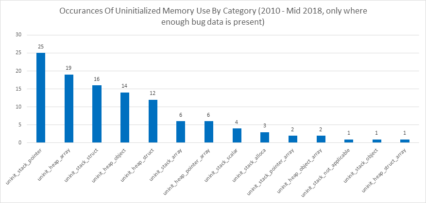
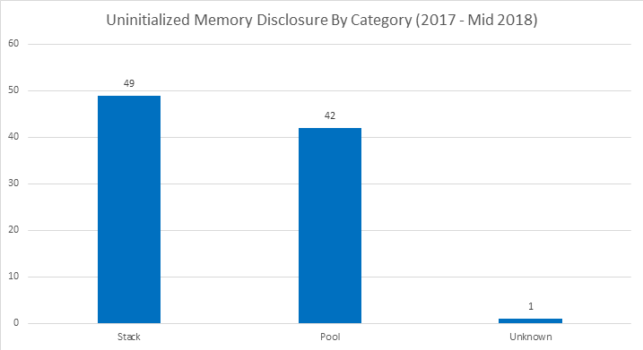
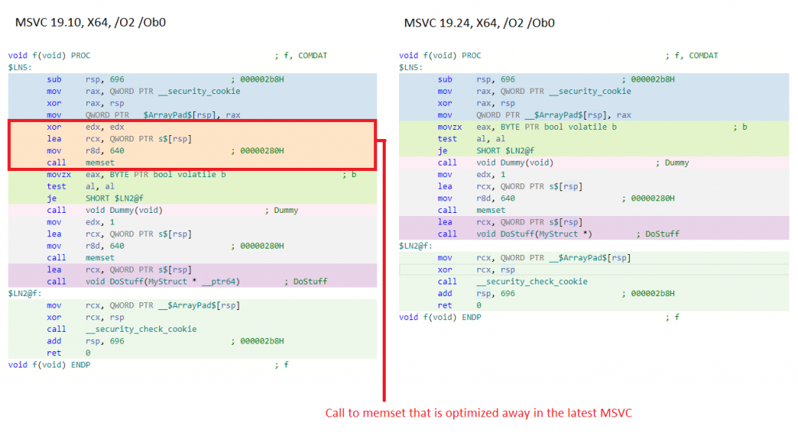
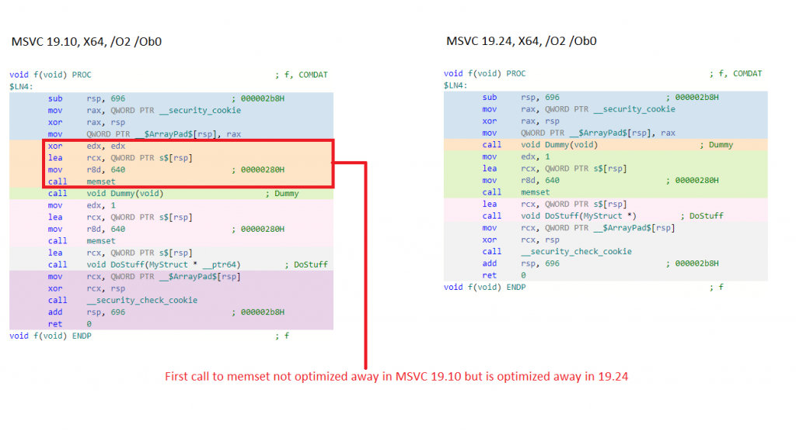
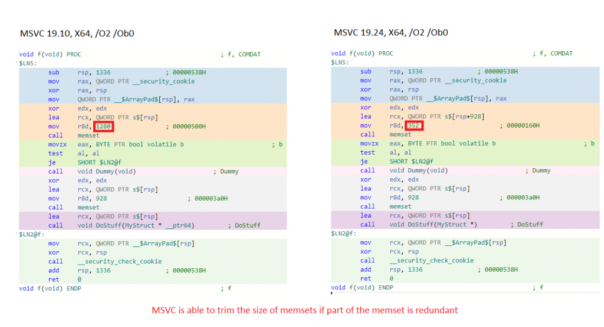
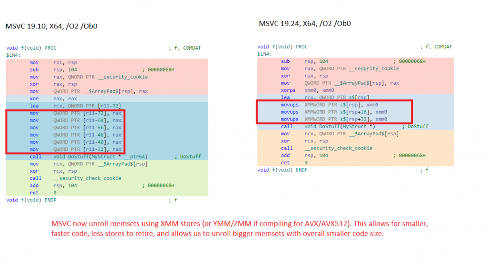

<!-- wp:paragraph -->

This blog post outlines the work that Microsoft is doing to eliminate uninitialized stack memory vulnerabilities from Windows and why we’re on this path.

<!-- /wp:paragraph -->

<!-- wp:paragraph -->

This blog post will be broken down into a few parts that folks can jump to:

<!-- /wp:paragraph -->

<!-- wp:list {"ordered":true,"type":"1"} -->

1. Uninitialized Memory Background
2. Potential Solutions to Uninitialized Memory Vulnerabilities
3. InitAll – Automatic Initialization
4. Interesting Findings with InitAll
5. Performance Optimizations
6. Impact for Customers
7. Forward Looking Plans

<!-- /wp:list -->

<!-- wp:paragraph -->

None of this work would have been possible without close partnership between the Visual Studio organization, the Windows organization, and MSRC.

<!-- /wp:paragraph -->

<!-- wp:heading {"level":1} -->

# Uninitialized Memory Background

<!-- /wp:heading -->

<!-- wp:paragraph -->

The C and C++ programming language were designed with performance and developer control top of mind. As part of this, the language has no enforcement around variable initialization. Using uninitialized variables is undefined behavior. Developers must initialize variables before they are used and it’s up to them to get this right.

<!-- /wp:paragraph -->

<!-- wp:paragraph -->

There are really two distinct classes of vulnerabilities here:

<!-- /wp:paragraph -->

<!-- wp:list {"ordered":true,"type":"1"} -->

1. Uninitialized Memory Disclosure – Uninitialized memory is copied across a trust boundary and its contents are disclosed to a less privileged entity.
2. Uninitialized Memory Use – Uninitialized memory is directly used. For example, an uninitialized pointer is written through.

<!-- /wp:list -->

<!-- wp:paragraph -->

It’s also important to realize that uninitialized memory problems occur for both stack allocations and heap allocations. This blog is focusing on stack memory and a follow up blog will address heap memory.

<!-- /wp:paragraph -->

<!-- wp:heading -->

## Uninitialized Memory Use Example

<!-- /wp:heading -->

<!-- wp:group -->

<!-- wp:group -->

<!-- wp:group -->

<!-- wp:group -->

<!-- wp:preformatted -->

```
int size;
GetSize(&size); // what if this function forgets to set size?
memcpy(dest, src, size); // mempcy using an uninitialized size
```

<!-- /wp:preformatted -->

<!-- /wp:group -->

<!-- /wp:group -->

<!-- /wp:group -->

<!-- /wp:group -->

<!-- wp:paragraph -->

The issue with this code is if the function GetSize doesn’t actually set “size” along all paths, we will end up calling memcpy with an uninitialized size. This could lead to an out-of-bounds read or write if the value of “size” happens to be larger than the size of the “src” or “dest” buffer.

<!-- /wp:paragraph -->

<!-- wp:heading -->

## Uninitialized Memory Disclosure Example

<!-- /wp:heading -->

<!-- wp:preformatted -->

```
struct mystruct {
      uint8_t field1;
      uint64_t field2;
};
mystruct s {1, 5};
memcpy(dest, &s, sizeof(s));
```

<!-- /wp:preformatted -->

<!-- wp:paragraph -->

In this example, let us assume that the memcpy copies the structure across a trust boundary (i.e. from kernel-mode to user-mode). It looks like the structure is fully initialized, however, there are compiler inserted padding bytes between “field1” and “field2” and these padding bytes have not been explicitly initialized.

<!-- /wp:paragraph -->

<!-- wp:paragraph -->

The call to memcpy will result in these padding bytes being copied across the trust boundary along with the uninitialized data. The value of the padding bytes will be whatever was previously written to that virtual address. This could be part of a cryptographic private key (thus disclosing key material to user-mode), a pointer (thus breaking ASLR), or something else. In some cases, it may be easy to prove nothing sensitive is disclosed and in other cases it can be extremely challenging. It’s not particularly fun work regardless and we’d all rather spend our time doing something other than figuring out how bad an uninitialized memory bug is.

<!-- /wp:paragraph -->

<!-- wp:heading -->

## Uninitialized Memory Bug Numbers

<!-- /wp:heading -->

<!-- wp:image {"id":11871,"sizeSlug":"large"} -->



<!-- /wp:image -->

<!-- wp:paragraph -->

Note: Uninitialized use includes both uninitialized memory use and uninitialized memory disclosures.

<!-- /wp:paragraph -->

<!-- wp:paragraph -->

In recent years, uninitialized memory use bugs have been trending up. This is likely partially attributed to more researchers being interested in this vulnerability class and writing great tools to help identify these issues.

<!-- /wp:paragraph -->

<!-- wp:paragraph -->

When we break out these bugs in a bit more detail some other interesting trends emerge.

<!-- /wp:paragraph -->

<!-- wp:image {"id":11872,"sizeSlug":"large"} -->



<!-- /wp:image -->

<!-- wp:paragraph -->

Note: in the above graph, uninitialized memory use does NOT include uninitialized memory disclosures.

<!-- /wp:paragraph -->

<!-- wp:image {"id":11873,"sizeSlug":"large"} -->



<!-- /wp:image -->

<!-- wp:paragraph -->

What these graphs illustrate is that:

<!-- /wp:paragraph -->

<!-- wp:list {"ordered":true,"type":"1"} -->

1. Between 2017 and 2018, uninitialized memory vulnerabilities have accounted for roughly 5-10% of the CVE’s issued by Microsoft.
2. There is a near equal split between stack based vulnerabilities and heap/pool based vulnerabilities.
3. Uninitialized memory disclosures outweigh uninitialized memory use bugs.

<!-- /wp:list -->

<!-- wp:heading -->

## Further Reading

<!-- /wp:heading -->

<!-- wp:paragraph -->

For additional resources, check out the following:

<!-- /wp:paragraph -->

<!-- wp:list -->

- <https://github.com/microsoft/MSRC-Security-Research/blob/master/presentations/2019_09_CppCon/CppCon2019%20-%20Killing%20Uninitialized%20Memory.pdf>
- <https://j00ru.vexillium.org/papers/2018/bochspwn_reloaded.pdf>
- <https://www.blackhat.com/presentations/bh-europe-06/bh-eu-06-Flake.pdf>

<!-- /wp:list -->

<!-- wp:heading {"level":1} -->

# Potential Solutions to Uninitialized Memory Vulnerabilities

<!-- /wp:heading -->

<!-- wp:paragraph -->

There are many ways that folks have attempted to solve these sorts of issues.

<!-- /wp:paragraph -->

<!-- wp:list {"ordered":true,"type":"1"} -->

1. Static Analysis (both compile-time and post-compile)
2. Fuzzing
3. Code Review
4. Automatic initialization

<!-- /wp:list -->

<!-- wp:heading -->

## Static Analysis

<!-- /wp:heading -->

<!-- wp:paragraph -->

Microsoft already has numerous static analysis warnings to catch uninitialized variables (including C4700, C4701, C4703, C6001, C26494, and C26495). They are conservative, meaning that some coding patterns that could result in uninitialized memory are ignored by these warnings in order to reduce noise.

<!-- /wp:paragraph -->

<!-- wp:paragraph -->

Microsoft has also written aggressive [Semmle](https://semmle.com/) static analysis rules and run them across certain code bases in Windows. These rules generate a lot of noise and are difficult to run across massive code bases. They also require effort to maintain the rules and fix the bugs. These rules ended up being somewhat high friction and high cost for developers to fix.

<!-- /wp:paragraph -->

<!-- wp:heading -->

## Fuzzing

<!-- /wp:heading -->

<!-- wp:paragraph -->

Fuzzing once again hits scaling issues. Good fuzzers take work to maintain and need to be customized for whatever they are targeting. It is very challenging to get perfect fuzzing coverage across the entirety of a code base as large as Microsoft’s.

<!-- /wp:paragraph -->

<!-- wp:paragraph -->

Even if we could fuzz everything with perfect coverage, fuzzers have a difficult time detecting uninitialized memory disclosures because these issues don’t result in crashes. To detect this sort of issue with a fuzzer you either need:

<!-- /wp:paragraph -->

<!-- wp:list {"ordered":true,"type":"1"} -->

1. A fuzzer that understands the protocol and can detect when uninitialized memory is returned to it (or rather, unexpected data is returned).
2. Dynamic analysis that can determine when uninitialized memory is accessed.

<!-- /wp:list -->

<!-- wp:heading -->

## Code Review

<!-- /wp:heading -->

<!-- wp:paragraph -->

Code review doesn’t scale and is very error prone. Many of these vulnerable code paths undergo code review but the issues are so subtle that they are missed.

<!-- /wp:paragraph -->

<!-- wp:paragraph -->

Some of the code that has suffered from uninitialized memory disclosures was written when Windows only ran on 32-bit architectures and was correct at the time. When Windows moved to 64-bit architectures, pointer sizes increased from 32-bits to 64-bits. This introduced padding fields to certain structures that did not used to exist. Structures that previously had all of their fields correctly initialized now had padding fields that were not initialized.

<!-- /wp:paragraph -->

<!-- wp:heading {"level":1} -->

# InitAll - Automatic Initialization

<!-- /wp:heading -->

<!-- wp:paragraph -->

In addition to the previously mentioned approaches, Microsoft is now using a feature known as InitAll which performs automatic compile-time initialization of stack variables.

<!-- /wp:paragraph -->

<!-- wp:paragraph -->

This section documents how Windows is using this technology and the rationale for why.

<!-- /wp:paragraph -->

<!-- wp:heading -->

## Current Windows Settings:

<!-- /wp:heading -->

<!-- wp:paragraph -->

The following types are automatically initialized:

<!-- /wp:paragraph -->

<!-- wp:list {"ordered":true,"type":"1"} -->

1. Scalars (arrays, pointers, floats)
2. Arrays of pointers
3. Structures (plain-old-data structures)

<!-- /wp:list -->

<!-- wp:paragraph -->

The following are not automatically initialized:

<!-- /wp:paragraph -->

<!-- wp:list {"ordered":true,"type":"1"} -->

1. Volatile variables
2. Arrays of anything other than pointers (i.e. array of int, array of structures, etc.)
3. Classes that are not plain-old-data

<!-- /wp:list -->

<!-- wp:paragraph -->

For optimized retail builds, the fill pattern is zero. For floats the fill pattern is 0.0.

<!-- /wp:paragraph -->

<!-- wp:paragraph -->

For CHK builds or developer builds (i.e. unoptimized retail builds), the fill pattern is 0xE2. For floats the fill pattern is 1.0.

<!-- /wp:paragraph -->

<!-- wp:paragraph -->

InitAll is enabled for the following components:

<!-- /wp:paragraph -->

<!-- wp:list {"ordered":true,"type":"1"} -->

1. All kernel-mode code (i.e. anything compiled with /KERNEL) in the Windows code repository
2. All Hyper-V code (hypervisor, kernel-mode components, user-mode components)
3. A variety of other projects such as networking related user-mode services

<!-- /wp:list -->

<!-- wp:paragraph -->

InitAll is implemented in the front-end of the compiler. Any variables that meet the criteria listed above and which are not initialized at declaration will be initialized at declaration by the front-end. One benefit of this approach is that from the optimizer’s perspective, this looks identical to the developer having initialized at declaration in the source code. This means that any optimizations we build to improve performance with InitAll enabled are not InitAll specific, they benefit anyone that initializes at declaration (or before use).

<!-- /wp:paragraph -->

<!-- wp:heading -->

## How We Avoid “Forking the Language”

<!-- /wp:heading -->

<!-- wp:paragraph -->

One legitimate concern raised regarding “zero initialization” is that zero is a special value in the language, specifically for pointers. Zero is also probably the most common individual value that things are initialized to.

<!-- /wp:paragraph -->

<!-- wp:paragraph -->

By doing zero initialization, a pointer that is not correctly initialized might end up just going down the “NULL pointer” branch that a program has. This results in a program that doesn’t crash but might not be giving you the results you want. If you initialize a pointer to a garbage value, it will not go down the “NULL pointer” path of a program, and if the program actually tries to use it the program will crash.

<!-- /wp:paragraph -->

<!-- wp:paragraph -->

The way that we are tackling this problem is by using a non-zero pattern (0xE2) for CHK builds, and for what we refer to as “developer builds” which are often unoptimized release builds. This allows us to retain performance in the code we ship to our customers while giving the builds our developers test a behavior that is more likely to highlight missing initialization.

<!-- /wp:paragraph -->

<!-- wp:paragraph -->

It’s worth noting that C++ already requires automatic zero-initialization for anything that has a static storage duration. Developers can and do rely on these semantics. For example, if a static variable has a value of zero the developer may know “I need to initialize this variable, this is the first time it’s been used”. In some ways, the InitAll project is bringing similar semantics to automatic (stack) variables with the important caveat that we are trying to prevent developers from explicitly depending on the specific initialization value.

<!-- /wp:paragraph -->

<!-- wp:heading -->

## How We Chose What Components to Enable InitAll For

<!-- /wp:heading -->

<!-- wp:paragraph -->

Our initial target for InitAll was:

<!-- /wp:paragraph -->

<!-- wp:list {"ordered":true,"type":"1"} -->

1. Kernel-mode code, primarily due to the large number of vulnerabilities that we observed related to uninitialized kernel memory.
2. Hyper-V code, primarily due to its importance to Azure and recent history of stack information disclosure bugs.

<!-- /wp:list -->

<!-- wp:paragraph -->

A number of other folks inside Microsoft heard about InitAll and decided to enable it proactively on their own components.

<!-- /wp:paragraph -->

<!-- wp:paragraph -->

The reason we did not immediately roll InitAll out for all code was to ensure we could succeed in doing something rather than fail at trying to do everything. The more code we apply InitAll to at once, the harder it is to debug any performance regressions that pop up, deal with application compatibility issues, etc. Now that we’ve successfully rolled the technology out to the highest priority targets, we can shift our focus to the rest of our code.

<!-- /wp:paragraph -->

<!-- wp:heading -->

## Does InitAll Break Static Analysis?

<!-- /wp:heading -->

<!-- wp:paragraph -->

Static analysis is incredibly useful at letting developers know they forgot to initialize before use.

<!-- /wp:paragraph -->

<!-- wp:paragraph -->

The InitAll feature indicates if a variable assignment was caused by InitAll to both PREfast and the compiler backend (both of which have uninitialized warnings). This allows the analysis tools to ignore InitAll variable assignments for the purposes of these warnings. With InitAll enabled, a developer will still receive static analysis warnings if they forget to initialize a variable even if InitAll forcibly initializes it for them.

<!-- /wp:paragraph -->

<!-- wp:heading -->

## Why We Don’t Initialize All Types

<!-- /wp:heading -->

<!-- wp:paragraph -->

During initial testing where we forcibly initialized all types of data on the stack we saw performance regressions of over 10% in several key scenarios.

<!-- /wp:paragraph -->

<!-- wp:paragraph -->

With POD structures only, performance was more reasonable. Compiler optimizations to eliminate redundant stores (both inside basic blocks and between basic blocks) were able to further drop the regression caused by POD structures from observable to noise-level for most tests.

<!-- /wp:paragraph -->

<!-- wp:paragraph -->

We plan on revisiting zero initializing all types (especially now that our optimizer has more powerful optimizations), we just haven't gotten to it yet.

<!-- /wp:paragraph -->

<!-- wp:heading -->

## Why We Zero Initialize

<!-- /wp:heading -->

<!-- wp:paragraph -->

Zero initialization has the best performance characteristics (both runtime performance and code size) as well as the best security properties.

<!-- /wp:paragraph -->

<!-- wp:heading {"level":3} -->

### Security Properties

<!-- /wp:heading -->

<!-- wp:paragraph -->

A zero initialization results in:

<!-- /wp:paragraph -->

<!-- wp:list -->

- NULL pointer, will throw an SEH exception if you dereference it on Windows (i.e., denial of service at worst instead of remote code execution) which will typically crash the program.
- A zero size, or zero index, if that is what the variable is being used to track. This is expected to minimize the impact of an uninitialized size being passed to a function like memcpy that operates on a buffer based on the size passed.
- A zero pointer, when tested in a NULL check, will take the path of “the pointer is NULL” and not attempt to use the pointer. This at least gives the program the chance of correctly handling the developer forgetting to initialize the pointer (since following a pattern-initialization pointer will always crash).
- A zero Boolean is false which may indicate “failure”.

<!-- /wp:list -->

<!-- wp:paragraph -->

Zero initialization also has some negative effects:

<!-- /wp:paragraph -->

<!-- wp:list -->

- An NTSTATUS value of STATUS_SUCCESS
- An HRESULT value of S_OK

<!-- /wp:list -->

<!-- wp:paragraph -->

But because return values are all different, there is no universal “good” value to initialize a return value to. Especially considering that this would also be used as the initialization value for sizes, indexes, pointers, etc.

<!-- /wp:paragraph -->

<!-- wp:heading {"level":3} -->

### Performance Properties

<!-- /wp:heading -->

<!-- wp:paragraph -->

The pattern that is used for automatic initialization matters in both runtime performance costs and code size. We never measured the delta across Windows in performance or code size using a non-zero pattern. We wanted the security benefits of using a zero pattern and we know the performance and code size would be better with it. Our peers at Google have done some measurements and proven that on Clang, zero initialization is currently measurably better in code size and runtime performance than pattern initialization.

<!-- /wp:paragraph -->

<!-- wp:paragraph -->

The below data illustrates why zero initializing is better for code size.

<!-- /wp:paragraph -->

<!-- wp:heading {"level":3} -->

### Example 1: Initializing using general-purpose registers

<!-- /wp:heading -->

<!-- wp:paragraph -->

**Zero Initialization:**

<!-- /wp:paragraph -->

<!-- wp:preformatted -->

```
31 c0                            xor    eax,eax
48 89 01                         mov    QWORD PTR [rcx],rax
```

<!-- /wp:preformatted -->

<!-- wp:paragraph -->

**Pattern initialization:**

<!-- /wp:paragraph -->

<!-- wp:preformatted -->

```
48 b8 e2 e2 e2 e2 e2 e2 e2 e2    movabs rax,0xe2e2e2e2e2e2e2e2<br>48 89 01                         mov    QWORD PTR [rcx],rax
```

<!-- /wp:preformatted -->

<!-- wp:paragraph -->

There are two interesting things to note in this example:

<!-- /wp:paragraph -->

<!-- wp:paragraph -->

First, setting the RAX register to zero takes up two bytes of code, versus setting it to a pattern which takes up 10 bytes. This costs code size and performance. Many CPU’s read 16 bytes of instructions at a time so taking up 10 bytes to set a fixed constant prevents the CPU from fetching other instructions that could potentially be executed in parallel.

<!-- /wp:paragraph -->

<!-- wp:paragraph -->

Second, before the store to RCX can be completed, RAX must be set to the fixed pattern. This could potentially stall the CPU. CPU’s recognize code sequences such as ”xor eax, eax” very early in the pipeline and don’t need to perform the actual XOR, they will simply set RAX to zero. The end result is better performance due to less pipeline stalling.

<!-- /wp:paragraph -->

<!-- wp:heading {"level":3} -->

### Example 2: Initializing using XMM registers

<!-- /wp:heading -->

<!-- wp:paragraph -->

For larger stores, the compiler will typically use XMM registers (it can also use YMM or ZMM if you are compiling with AVX or AVX512 support). CPUs are typically limited to retiring a single store instruction per clock cycle so it makes sense to use store instructions that set as many bytes as possible.

<!-- /wp:paragraph -->

<!-- wp:paragraph -->

**Zero Initialization:**

<!-- /wp:paragraph -->

<!-- wp:preformatted -->

```
0f 57 c0                         xorps  xmm0,xmm0<br>f3 0f 7f 01                      movdqu XMMWORD PTR [rcx],xmm0
```

<!-- /wp:preformatted -->

<!-- wp:paragraph -->

**Pattern Initialization (Loading pattern from a global, what compilers typically do):**

<!-- /wp:paragraph -->

<!-- wp:preformatted -->

```
66 0f 6f 04 25 00 00 00 00       movdqa xmm0,XMMWORD PTR ds:0x0
f3 0f 7f 01                      movdqu XMMWORD PTR [rcx],xmm0
```

<!-- /wp:preformatted -->

<!-- wp:paragraph -->

**Pattern Initialization (Loading pattern using fixed constants in code, compilers don’t do this):**

<!-- /wp:paragraph -->

<!-- wp:preformatted -->

```
48 ba e2 e2 e2 e2 e2 e2 e2 e2    movabs rdx,0xe2e2e2e2e2e2e2e2
66 48 0f 6e c2                   movq   xmm0,rdx
0f 16 c0                         movlhps xmm0,xmm0
f3 0f 7f 01                      movdqu XMMWORD PTR [rcx],xmm0
```

<!-- /wp:preformatted -->

<!-- wp:paragraph -->

The situation is similar for XMM registers. The code size for zero initialization is very small.

<!-- /wp:paragraph -->

<!-- wp:paragraph -->

It is not possible to load a fixed-constant directly in to an XMM register. Instead the fixed constant must be loaded into a general-purpose register, then moved in to an XMM register, and then have the low 64-bits of the XMM register replicated in to the high 64-bits of the XMM register. This results in a large amount of code and 3 instructions, each of which has a dependency on the result of the previous instruction.

<!-- /wp:paragraph -->

<!-- wp:paragraph -->

To avoid this, compilers typically store the fixed-constant as a global variable. They can then read this global variable which results in substantially less code size. Unfortunately, before you can use the XMM register the load needs to complete. If the global variable is paged out, this can cost thousands of clock cycles. A load operation costs several clock cycles even in the best-case scenario where the data is in the L1 cache. And it still is larger code than simply zeroing the register.

<!-- /wp:paragraph -->

<!-- wp:paragraph -->

This exposes another benefit of zero initialization: More deterministic results. The initialization cost doesn’t depend on if a particular global variable is in the L1 cache, L2 cache, L3 cache, paged out, etc.

<!-- /wp:paragraph -->

<!-- wp:heading {"level":1} -->

# Interesting Findings with InitAll

<!-- /wp:heading -->

<!-- wp:heading -->

## Performance

<!-- /wp:heading -->

<!-- wp:paragraph -->

Windows 10 1903 was the first version of Windows to ship with InitAll enabled (shipped Spring 2019). We haven’t had any performance complaints arise related to InitAll since shipping it.

<!-- /wp:paragraph -->

<!-- wp:heading -->

## Compatibility

<!-- /wp:heading -->

<!-- wp:heading {"level":3} -->

### Anti-Cheat

<!-- /wp:heading -->

<!-- wp:paragraph -->

Shortly after enabling InitAll in Windows, we received complaints that certain anti-cheat software was causing kernel crashes. Investigations revealed that these anti-cheat solutions included kernel-mode drivers. These drivers were scanning the NT kernel image in memory and looking for byte patterns to locate undocumented functions. The way these pattern matchers work is by searching for specific byte patterns indicating the beginning of the function.

<!-- /wp:paragraph -->

<!-- wp:paragraph -->

When InitAll was enabled, some extra initializations (that could not be proven away) were added to the beginning of these functions which effectively changed their signature. We reached out of these anti-cheat companies and they updated their drivers to stop causing kernel crashes.

<!-- /wp:paragraph -->

<!-- wp:heading {"level":3} -->

### Use-After-Free in FAT32

<!-- /wp:heading -->

<!-- wp:paragraph -->

Shortly after enabling InitAll for scalars (i.e. integers, floats, etc.) we hit an interesting issue in the FAT filesystem driver that was preventing folks from upgrading internal builds of Windows from USB sticks.

<!-- /wp:paragraph -->

<!-- wp:paragraph -->

The code was something along the lines of this:

<!-- /wp:paragraph -->

<!-- wp:preformatted -->

```
for(int i = 0; i < size; i++)
{
      int tmp;
      DoStuff(&tmp, i);
}
```

<!-- /wp:preformatted -->

<!-- wp:paragraph -->

This code was running in a loop. A variable was declared inside of the loop. On the first iteration of the loop, the function DoStuff would initialize the variable “tmp” that it is passed the address to. On every additional iteration of the loop, the variable “tmp” was used as an in/out parameter. In other words, the variable would be read from and then updated.

<!-- /wp:paragraph -->

<!-- wp:paragraph -->

The issue here is that the variable comes in scope at the beginning of each iteration of the loop and goes out of scope after each iteration of the loop. With InitAll enabled, this variable is zero initialized for each iteration of the loop. This is effectively a use-after-free. This code is depending on the value of “tmp” being preserved each iteration of the loop even though it goes out of scope at the end of each iteration. Unfortunately for us, this did not result in a driver crash. It resulted in incorrect driver logic which led to the filesystem acting unexpectedly. After some debugging by the kernel team, they realized what was going on and fixed the issue by moving the declaration of the variable to outside of the loop.

<!-- /wp:paragraph -->

<!-- wp:paragraph -->

This is an example of how mitigations can end up breaking code that hasn’t been touched in MANY years.

<!-- /wp:paragraph -->

<!-- wp:heading {"level":1} -->

# Performance Optimizations

<!-- /wp:heading -->

<!-- wp:paragraph -->

The InitAll performance optimizations can be broken down in to 3 categories:

<!-- /wp:paragraph -->

<!-- wp:list {"ordered":true,"type":"1"} -->

1. Give developers the ability to opt sensitive code out of InitAll
2. Optimize away redundant stores where possible
3. Make the remaining stores go as fast as possible

<!-- /wp:list -->

<!-- wp:heading -->

## Opt-Out of InitAll

<!-- /wp:heading -->

<!-- wp:paragraph -->

The most obvious optimizations we have is to allow code to:

<!-- /wp:paragraph -->

<!-- wp:list {"ordered":true,"type":"1"} -->

1. Disable InitAll entirely
2. Disable InitAll for a particular type (i.e. a structure typedef)
3. Disable InitAll for all allocations in a function
4. Disable InitAll for a specific variable declaration in a function

<!-- /wp:list -->

<!-- wp:paragraph -->

To date, InitAll has only been disabled (for performance) on a single type: the \_CONTEXT structure which stores the value of every register. Forcibly initializing this structure was causing performance regressions in the performance testing infrastructure.

<!-- /wp:paragraph -->

<!-- wp:paragraph -->

The \_CONTEXT structure is over 1,000 bytes big and contains space to store the value of every register. When ETW logging is enabled for context swaps, every time a context switch happens the value of all registers will be logged. The \_CONTEXT structure would be allocated on the stack, populated via an assembly function, and then passed to ETW. The compiler was not able to optimize away the initialization done by InitAll because the structure is initialized by an assembly function. Because this structure already contains sensitive data (the state of every register), is very large, and is used in very performance sensitive paths, we decided to opt it out of InitAll.

<!-- /wp:paragraph -->

<!-- wp:paragraph -->

InitAll has not been disabled on any other types, variables, or functions for performance reasons.

<!-- /wp:paragraph -->

<!-- wp:heading -->

## Better Redundant Store Elimination

<!-- /wp:heading -->

<!-- wp:paragraph -->

Redundant store elimination is an optimization pass in the Visual Studio compiler where the compiler eliminates stores to variables that are proven unnecessary.

<!-- /wp:paragraph -->

<!-- wp:paragraph -->

Below are some examples showing the types of optimizations that Visual Studio can do.

<!-- /wp:paragraph -->

<!-- wp:heading {"level":3} -->

### Multiple Memset Elimination

<!-- /wp:heading -->

<!-- wp:paragraph -->

Godbolt link: <https://msvc.godbolt.org/z/Ldu7AP>

<!-- /wp:paragraph -->

<!-- wp:paragraph -->

The following code pattern (and variations of it) is extremely common. The original NT programming guidelines require all variables to be declared at the top of the function and for initialization to be deferred as late as possible. The result is that we end up with cases where a variable is declared at the top of a function and only initialized in a single branch prior to being used.

<!-- /wp:paragraph -->

<!-- wp:paragraph -->

When we enable InitAll, there is a second initialization at the top of the function for the variable. It’s up to the compiler to eliminate the duplicate initialization, but it’s not always as easy for the compiler to do this.

<!-- /wp:paragraph -->

<!-- wp:preformatted -->

```
#include <stdio.h>
#include <string.h>

struct MyStruct
{
    int array[160];
};

void Dummy()
{
    printf("dummy");
    return;
}

void DoStuff(MyStruct* s)
{
    printf("hi", (int*)&s); // Pass the "s" pointer to a complicated function so the compiler cannot completely eliminate all stores to "s"
    return;
}

volatile bool b = true;

void f()
{
    MyStruct s;
    // This memset is effectively identical to the memset added by InitAll
    memset(&s, 0x0, sizeof(s));

    if (b) // Test a volatile variable so the compiler cannot optimize away this branch (it would if we used a normal variable)
    {
        Dummy();
        memset(&s, 0x1, sizeof(s));
        DoStuff(&s);
    }
    return;
}
```

<!-- /wp:preformatted -->

<!-- wp:image {"id":11874,"sizeSlug":"large"} -->



<!-- /wp:image -->

<!-- wp:paragraph -->

While this looks like a simple example to optimize, GCC 9.3 and Clang 10.0.0 (the latest compilers available on Godbolt) are unable to eliminate the unnecessary memset in this example. I don’t mention this to bash those compilers; they both do an extremely good job optimizing code. I say it to highlight that even powerful compilers can have trouble optimizing some of these coding patterns. Visual Studio was unable to eliminate it prior to the InitAll optimization work.

<!-- /wp:paragraph -->

<!-- wp:paragraph -->

**Here’s an even more simple example:**

<!-- /wp:paragraph -->

<!-- wp:paragraph -->

In this example, two memsets are separated only by a function call that takes no arguments. Once again, this sort of programming pattern is exceedingly common in Microsoft code.

<!-- /wp:paragraph -->

<!-- wp:paragraph -->

Godbolt link: [https://msvc.godbolt.org/z/HqFMx\_](https://msvc.godbolt.org/z/HqFMx_)

<!-- /wp:paragraph -->

<!-- wp:preformatted -->

```
#include <stdio.h>
#include <string.h>

struct MyStruct
{
    int array[160];
};

void Dummy()
{
    printf("dummy");
    return;
}

void DoStuff(MyStruct* s)
{
    printf("hi", (int*)&s); // Pass the "s" pointer to a complicated function so the compiler cannot completely eliminate all stores to "s"
    return;
}

void f()
{
    MyStruct s;
    // This memset is effectively identical to the memset added by InitAll
    memset(&s, 0x0, sizeof(s));

    Dummy();

    memset(&s, 0x1, sizeof(s));

    DoStuff(&s);

    return;
}
```

<!-- /wp:preformatted -->

<!-- wp:image {"id":11875,"sizeSlug":"large"} -->



<!-- /wp:image -->

<!-- wp:paragraph -->

Once again, MSVC can optimize the unnecessary memset away. Clang 10.0.0 is also able to optimize away this test case while GCC 9.3 still has trouble. While the test case looks easy to optimize, it requires the compiler to do non-trivial analysis.

<!-- /wp:paragraph -->

<!-- wp:paragraph -->

The gist of the issue here (in MSVC) was that the compiler has lexical escape analysis, it is not path or flow sensitive. From the compiler’s perspective, the variable “s” escapes the current function (in other words, has its address passed to something outside of this function) due to the call to “DoStuff” which takes the address of “s”. The compiler also sees a call to memset “s”, then it sees a call to “Dummy”, and then it sees another call to memset “s”.

<!-- /wp:paragraph -->

<!-- wp:paragraph -->

From the compiler’s perspective, because “s” has escaped the function, the call to Dummy could read or write the contents of “s”. Accordingly, the memset before “Dummy” and after “Dummy” cannot be eliminated because “Dummy” could read from “s”, and dummy could write to “s” prior to “DoStuff” being called.

<!-- /wp:paragraph -->

<!-- wp:paragraph -->

The human eye can clearly see that while “s” does escape the current function, it doesn’t escape it until “DoStuff” is called. The MSVC compiler can now figure this out (to varying degrees) which allows it to optimize away the first call to memset.

<!-- /wp:paragraph -->

<!-- wp:heading {"level":3} -->

### Memset Size Trimming

<!-- /wp:heading -->

<!-- wp:paragraph -->

Godbolt link: <https://msvc.godbolt.org/z/fyLVUF>

<!-- /wp:paragraph -->

<!-- wp:paragraph -->

The following coding pattern is also somewhat common. A structure is partially initialized before being passed to another function. Presumably, the function it is passed to initializes the rest of the data (or at least doesn’t read it), but the compiler cannot prove that.

<!-- /wp:paragraph -->

<!-- wp:preformatted -->

```
#include <stdio.h>
#include <string.h>

struct MyStruct
{
    int array[320];
};

void Dummy()
{
    printf("dummy");
    return;
}

void DoStuff(MyStruct* s)
{
    printf("hi", (int*)&s); // Pass the "s" pointer to a complicated function so the compiler cannot completely eliminate all stores to "s"
    return;
}

volatile bool b = true;

void f()
{
    MyStruct s;
    // This memset is effectively identical to the memset added by InitAll
    memset(&s, 0x0, sizeof(s));

    if (b) // Test a volatile variable so the compiler cannot optimize away this branch (it would if we used a normal variable)
    {
        Dummy();
        memset(&s, 0x0, sizeof(s)-0x160);
        DoStuff(&s);
    }

    return;
}
```

<!-- /wp:preformatted -->

<!-- wp:image {"id":11876,"sizeSlug":"large"} -->



<!-- /wp:image -->

<!-- wp:paragraph -->

MSVC is now able to trim down the first memset to only set the parts of the structure that are not also set by the second memset. Once again, GCC 9.3 and Clang 10.0.0 are not currently able to perform this sort of optimization on this code example.

<!-- /wp:paragraph -->

<!-- wp:heading {"level":3} -->

### Better Memset Unrolling

<!-- /wp:heading -->

<!-- wp:paragraph -->

Godbolt link: <https://msvc.godbolt.org/z/ZSuY_j>

<!-- /wp:paragraph -->

<!-- wp:paragraph -->

In the following example, the call to memset cannot be optimized away. The program needs to execute memset as efficiently as possible.

<!-- /wp:paragraph -->

<!-- wp:preformatted -->

```
#include <stdio.h>
#include <string.h>

struct MyStruct
{
    int array[12];
};

void DoStuff(MyStruct* s)
{
    printf("hi", (int*)&s); // Pass the "s" pointer to a complicated function so the compiler cannot completely eliminate all stores to "s"
    return;
}

void f()
{
    MyStruct s;
    memset(&s, 0x0, sizeof(s));
    DoStuff(&s);
    return;
}
```

<!-- /wp:preformatted -->

<!-- wp:image {"id":11877,"sizeSlug":"large"} -->



<!-- /wp:image -->

<!-- wp:paragraph -->

MSVC (and most compilers) can “unroll” small memsets with statically determined sizes and fill patterns. This means the call to memset is replaced with a series of store instructions that directly set the memory. For small memsets (under 128 bytes), this is typically executes in one quarter of the time and often results in smaller code as well (no need to save registers to the stack, call memset, and restore registers).

<!-- /wp:paragraph -->

<!-- wp:paragraph -->

MSVC previously used general-purpose registers to unroll memset on AMD64. By changing MSVC to use vector registers we were able to double the maximum size of a memset we can unroll and reduce overall binary size. This results in faster memsets and less binary bloat.

<!-- /wp:paragraph -->

<!-- wp:heading {"level":3} -->

### Faster Memset Implementation

<!-- /wp:heading -->

<!-- wp:paragraph -->

I’m going to leave this one for another in-depth blog 😊.

<!-- /wp:paragraph -->

<!-- wp:heading {"level":1} -->

# Impact for Customers

<!-- /wp:heading -->

<!-- wp:paragraph -->

Since shipping InitAll to the world, we’ve had multiple vulnerability reports submitted to MSRC that did not reproduce on the latest versions of Windows due to InitAll. This effectively downgrades the vulnerabilities from “security bugs” to “code defect that currently has no negative impacts”. This means we no longer need to ship a security update for the in-market operating systems that have the mitigation installed, saving customers patching pain and Microsoft servicing pain.

<!-- /wp:paragraph -->

<!-- wp:paragraph -->

We do still fix the issues in our active development branches so that the code is correct going forward and we fix in-market operating systems that don’t have InitAll enabled as they are still vulnerable. Over the long term, operating systems that don’t have InitAll enabled will fall out of support. Once this occurs, uninitialized memory bugs that are mitigated by InitAll will only need to be fixed in active development branches and this bug class will no longer need to be serviced to in-market operating systems.

<!-- /wp:paragraph -->

<!-- wp:heading {"level":1} -->

# Forward Looking Plans

<!-- /wp:heading -->

<!-- wp:paragraph -->

We currently have two primary areas that we plan to invest in going forward related to uninitialized stack variables:

<!-- /wp:paragraph -->

<!-- wp:list {"ordered":true,"type":"1"} -->

1. Investigating the feasibility of and enabling InitAll for all types of allocations (i.e. all arrays, all classes not just POD’s)
2. Enabling InitAll for all Windows code instead of the current subset it is applied to.

<!-- /wp:list -->

<!-- wp:paragraph -->

Longer term we are exploring if it’s possible to eliminate these sorts of issues from the C and C++ language in a standardized way. Leaving variables uninitialized is not typically necessary for performance (especially when the compiler has good redundant store elimination). Instead of defaulting variables to uninitialized, it’d be nice to default to “variable must be provably initialized before use” and only allow this rule to be broken if a special uninitialized keyword was used. This could allow developers to keep performance while also saving themselves from unnecessary mistakes.

<!-- /wp:paragraph -->

<!-- wp:paragraph -->

We also plan to post an additional blog post on the work we are currently doing to mitigate uninitialized memory issues in the Windows kernel pool allocator.

<!-- /wp:paragraph -->
