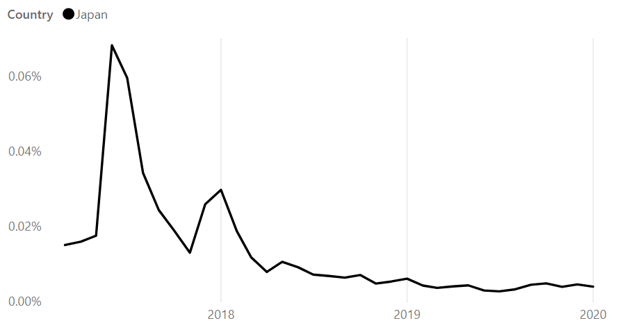
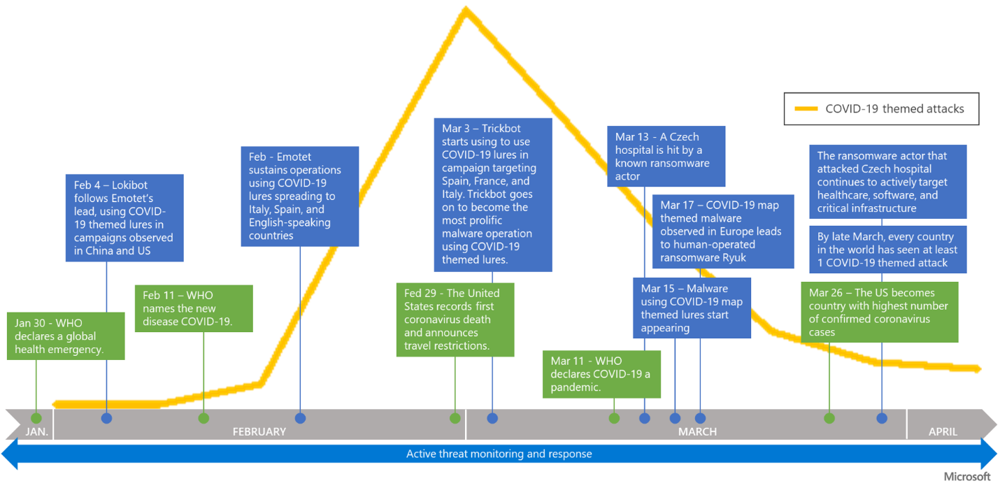
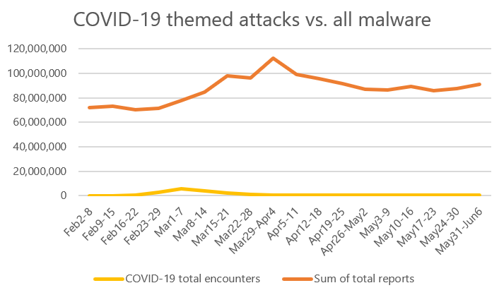

2020 年 6 月 16 日、マイクロソフトは、[セキュリティエンドポイント脅威レポート 2019 (Security Endpoint Threat Report)](https://news.microsoft.com/apac/features/microsoft-security-endpoint-threat-report-2019-asia-pacific/) を発表し、2019 年のアジア太平洋地域のセキュリティ脅威状況を調査した結果を公開しました。

このレポートは、進化する脅威状況をより深く理解し、高度化が進む攻撃の影響を軽減させて組織のサイバーセキュリティ体制の改善につなげてもらうことを目的に、マイクロソフトのデータソースを分析し調査した結果をまとめたものです。

これまでマイクロソフトは、「[セキュリティ インテリジェンス レポート](https://msrc-blog.microsoft.com/2019/03/01/sir24_released/) (SIR)」 として、世界における脆弱性の傾向、エクスプロイト (悪用) の傾向、マルウェアの傾向や、各国・地域での脅威の傾向などを分析・調査した結果を公開してきました。セキュリティエンドポイント脅威レポートは、セキュリティ インテリジェンス レポートに代わる新しいマイクロソフトのセキュリティ脅威レポートで、マイクロソフトが収集している脅威シグナルから、主にエンドポイントが遭遇しているマルウェアなどの脅威を分析したレポートです。

今回は、IT 管理者向けに、このレポートの概要とマイクロソフトが提唱している対策をご紹介します。

**マルウェアの傾向**

2019 年のマルウェア全般におけるの遭遇率 (\*1) は世界的な平均で 3.24% となり、2018 年 (5.07%)、2017 年 (6.29%) と減少傾向が見られます。

アジア太平洋地域全体では、マルウェアの遭遇率は減少しているものの、インドネシア、スリランカ、インド、ベトナムなどの発展途上国 (\*2) では遭遇率が高い傾向がみらる一方で、日本、ニュージーランド、オーストラリアなどの市場国での遭遇率は低い結果となりました。

日本の遭遇率と世界の遭遇率を比較すると、日本は世界平均より 4 倍低く、アジアの中では最も低く、世界的にも遭遇率の低い国のひとつとなっています。この傾向は、過去の[セキュリティ インテリジェンス レポート](https://msrc-blog.microsoft.com/2019/03/01/sir24_released/)にて公開してきた 2018 年以前の状況も同じで、日本は世界と比較するとマルウェアの遭遇率は低い傾向にあります。

マルウェア遭遇率は、海賊版の比率やソフトウェアの定期的なセキュリティ更新プログラムの適用の比率と比例することが多く、海賊版や非公式のマーケットプレイスの利用を避けること、利用する製品は最新の状態で利用すること、マルウェア対策ソフトを利用することなどの基本事項を確実に実行することが重要です。

**ランサムウェアの傾向**

2019 年のランサムウェア遭遇率の世界平均は 0.03% で、2017 年の WannaCry の流行以降、世界的にランサムウェアの遭遇率は減少傾向にあります。だからといってランサムウェアの脅威がなくなっているわけではありません。ランサムウェアは、[CVE-2017-0145 (MS17-010) ](https://docs.microsoft.com/ja-jp/security-updates/securitybulletins/2017/ms17-010)を悪用した [WannaCrypt/WannaCry](https://msrc-blog.microsoft.com/2017/05/14/ransomware-wannacrypt-customer-guidance/) や NotPetya のように自動的に感染を広げるようなタイプから「Human-Operated Ransomware (人間が操作するランサムウェア) 」と呼んでいる、より攻撃対象の組織にあわせて攻撃を実施するタイプへと変化しています。このタイプでは、攻撃者の金銭的利益が最大になるように、攻撃対象の組織のネットワーク構成を調査し、組織の内部システムへと徐々に侵入を進めた後にランサムウェアが利用される状況がみられ、2020 年 4 月以降は特に、医療関係や重要システムにおける被害が確認されています。こうした状況から、現在は単にランサムウェアへの遭遇率という観点ではなく、リモートデスクトップ (RDP) や VDI のエンドポイントの適切な管理や多要素認証の有効化といった、組織への侵入を防ぐ、組織内部での侵入拡大を防ぐ、早期に問題を検出し対処するといった多層的な観点が必要とされています。詳細は以下の関連ブログを参照してください。

- [Human-operated ransomware attacks: A preventable disaster](https://www.microsoft.com/security/blog/2020/03/05/human-operated-ransomware-attacks-a-preventable-disaster/)
- [Ransomware groups continue to target healthcare, critical services; here’s how to reduce risk](https://www.microsoft.com/security/blog/2020/04/28/ransomware-groups-continue-to-target-healthcare-critical-services-heres-how-to-reduce-risk/)
- [The science behind Microsoft Threat Protection: Attack modeling for finding and stopping evasive ransomware](https://www.microsoft.com/security/blog/2020/06/10/the-science-behind-microsoft-threat-protection-attack-modeling-for-finding-and-stopping-evasive-ransomware/)

図 1: ランサムウェアの遭遇率の推移 (日本)

**暗号通貨マイニングの傾向**

2019 年、暗号通貨マイニングの遭遇率の世界平均は低下し、日本における遭遇率も低下しました。最近では暗号通貨の価値が変動しており、暗号通貨の生成にもより時間がかかるようになったことなどから、犯罪者はおそらく他の形態のサイバー犯罪に目を向けるようになった可能性が挙げられます。

**ドライブバイダウンロードの傾向**

ドライブバイダウンロードでは、ウェブサイトを閲覧した際などに意図せずユーザーのコンピュータに悪意のあるコードがダウンロードされます。悪意のあるコードは、ブラウザやアドインなどの脆弱性を悪用し、別のマルウェアを感染させたり金融情報を盗み出すために利用されます。

Bing 検索エンジンにインデックスされたページのうち、ドライブバイダウンロードが検出されたページ数の平均を分析すると、2019 年の世界での平均検出数は前年に比べ減少しました。日本の平均検出数は、世界平均と比較すると 2 倍近く低い結果となっていますが、2018 年と比較すると増加しました。日本だけではなく、シンガポールや香港でも同様の傾向が見られました。

**COVID-19 関連の脅威の傾向**

2020 年に入り、COVID-19 が世界的な状況を一変させ、同ウイルスの感染は最大の懸念材料と捉えられています。マイクロソフトの調査でも、世界中すべての国で少なくとも一度は COVID-19 に乗じた攻撃が発生し、特に 3 月上旬に多数確認されています。日本でも、2 月初めから 5 月 2 日までの期間で 14,000 を超える COVID-19 に乗じた攻撃を確認しています。

図 2: COVID-19 をテーマとした攻撃の推移

これら COVID-19 をテーマとした攻撃は、全体の約 2 %程度で、多くは既存の攻撃を COVID-19 に関連付けているものです。つまり攻撃者は、既存のマルウェアやランサムウェア、フィッシングなどの攻撃手法やインフラに、COVID-19 のキーワードを加えることで人々の興味や恐怖心をあおり、攻撃の成功率を上げようとしていることが伺えます。詳細は、[Exploiting a crisis: How cybercriminals behaved during the outbreak](https://www.microsoft.com/security/blog/2020/06/16/exploiting-a-crisis-how-cybercriminals-behaved-during-the-outbreak/) をぜひご参照ください。

図 3: COVID-19 をテーマとした攻撃と全体数

**ベストプラクティス**

今回の脅威レポートで紹介しているようにセキュリティ脅威は年々変化しています。しかしながら、脅威の傾向ごとの対策を行うよりも、どのような攻撃があっても動じない IT 環境を作り、維持することを提唱しています。詳細は、[攻撃があっても動じない IT 環境の新しいカタチ： Security Posture](https://news.microsoft.com/ja-jp/2020/06/18/200618-it-environment-security-posture/) をぜひご参照ください。

また重要となる基本的な対応について、ご参考いただきたい情報を合わせて紹介していますので、今一度ご確認ください。

**_企業・組織における対応:_**

- 従業員とインフラを保護する強力なセキュリティツールの利用

  - 多層防御による保護

    - セキュリティ更新プログラムの迅速な適用
    - [セキュリティ構成フレームワーク](https://msrc-blog.microsoft.com/2020/03/30/secconjp/)等を利用したエンドポイントの堅牢化

  - [多要素認証](https://www.microsoft.com/ja-jp/security/business/identity/mfa) (MFA) の利用や組織内の特権アカウント[資格情報の適切な保護](https://www.microsoft.com/security/blog/2018/11/29/secure-your-privileged-administrative-accounts-with-a-phased-roadmap/)、[レガシー認証プロトコルをブロック](https://docs.microsoft.com/en-us/azure/active-directory/conditional-access/block-legacy-authentication)

  - [Cloud App Security ](https://docs.microsoft.com/ja-jp/cloud-app-security/discovered-apps)などを利用したシャドー IT や無許可アプリの利用対策

- 従業員向けのセキュリティガイドラインの徹底

  - フィッシング詐欺の見分け方や、正式な情報や企業ポリシーに反する不審なメールなどを区別する方法、発見した際の社内での報告先の整備

    - 「[職場でコンピューターをセキュリティ保護する](https://support.microsoft.com/ja-jp/help/4092059/windows-keep-your-computer-secure-at-work)」

  - ファイル共有や、音声・ビデオ通話、会議システムでのエンドツーエンドの暗号化: Microsoft Teams は 安全なセキュリティ開発ライフサイクルに基づいて設計・開発され、エンドツーエンドの暗号化に対応しています。 ([Microsoft Teams セキュリティガイド](https://docs.microsoft.com/ja-jp/microsoftteams/teams-security-guide))

**_個人向けの対応_\*\***_:_\*\*

- すべてのデバイスを最新のセキュリティアップデートで更新して最新の状態に保つ

  - マイクロソフトのセキュリティ更新プログラムの適用に関してよくある質問は「[セキュリティパッチの基本](https://msrc-blog.microsoft.com/2020/02/03/secmonth2020-1/)」を参考にしてください。
  - リモート環境での更新プログラム適用の考慮事項は「[リモート環境における更新プログラム適用の考慮事項](https://msrc-blog.microsoft.com/2020/04/08/patchingforremotelocation/)」を参考にしてください。

- マルウェア対策サービスなどの基本的なセキュリティ対策を確実に実行する

  - Windows 10 の基本的なセキュリティ対策の設定方法は、図解つきの資料「[Windows 10 基本セキュリティ確認事項](https://msrc-blog.microsoft.com/2020/04/20/remoteworksecuresettings/)」を公開していますので、参考にしてください。

- 不審なリンクや添付ファイルに気をつける

  - Office ファイルを開く際には[保護ビュー](https://support.microsoft.com/ja-jp/office/%e4%bf%9d%e8%ad%b7%e3%83%93%e3%83%a5%e3%83%bc%e3%81%a8%e3%81%af-d6f09ac7-e6b9-4495-8e43-2bbcdbcb6653?ocmsassetid=ha010355931&correlationid=874c21d9-3d1d-4d2a-910b-c2a8214bdf21&ui=ja-jp&rs=ja-jp&ad=jp)を活用しましょう。
  - [Microsoft Edge ](https://www.microsoft.com/edge)などの最新ブラウザーを使用すると、悪意のある Web サイトのブロックに役立ち、コンピューター上で悪意のあるコードの実行をブロックできます。

- 多要素認証 (MFA) 利用する

  - 生体認証機能の Windows Hello や、Microsoft Authenticator などのスマートフォン認証アプリが多くのサービスで利用可能です

- 自宅でコンピューターを使用する際の[オンライン リスクの軽減に役立つ方法](https://support.microsoft.com/ja-jp/help/4092060/windows-keep-your-computer-secure-at-home)

**参考情報**

**・**プレスリリース: [攻撃があっても動じない IT 環境の新しいカタチ： Security Posture](https://news.microsoft.com/ja-jp/2020/06/18/200618-it-environment-security-posture/)

・マイクロソフト セキュリティインテリジェンスのサイトでは、調査結果の詳細を掲載しています。<https://www.microsoft.com/securityinsights> をご覧ください。

・現在どのようなマルウェアが流行しているか、マルウェアの動作詳細などを知りたい場合は、[Threat Encyclopedia](https://www.microsoft.com/en-us/wdsi/threats) を参照してください。地域ごとの脅威の傾向や、攻撃手法の解説、それぞれのマルウェアの動作の詳細などを解説しています。またマルウェアの名前で検索もできますので、特定の脅威がどの検出名で検出可能かなどを確認することもできます。

・ウイルスなど、悪意のあるソフトウェア (マルウェア） と思われるファイルがある場合は、[疑わしいファイルの報告フォーム](https://www.microsoft.com/en-us/wdsi/filesubmission)から報告してください。「Home customer (ご家庭で利用のユーザー向け)」を選択した場合は匿名で報告するか、マイクロソフト アカウントでサインインしたうえで報告することが可能です。マイクロソフト セキュリティソリューションを利用している企業ユーザーの場合は、「Enterprise customer (企業ユーザー向け)」を選択することで利用しているソリューションと連携することが可能です。マイクロソフト アカウントや企業アカウントでサインインをして報告をした場合は、調査が完了次第、報告されたファイルがマルウェアであるか、もしそのファイルがマルウェアである場合は Microsoft Defender などのマイクロソフト製品やサービスでの検出名などを調査結果として返答します。

垣内 由梨香 セキュリティプログラムマネージャー セキュリティレスポンスチーム マイクロソフト

---

(\*1) 遭遇率

遭遇率は、マイクロソフトのリアルタイム セキュリティ ソフトウェアを実行しているコンピューターが、マルウェアを検出してインストールをブロックした際のレポートに基づいた割合です。これは、実際にマルウェアに感染したシステムの数、つまり CCM (1,000 回ごとに駆除されたコンピューター数) と呼ばれる測定値とは異なります。

(\*2) 調査対象となったのは合計 15 市場で、発展途上国が中国、インド、インドネシア、マレーシア、フィリピン、スリランカ、タイ、ベトナム、先進市場が台湾、シンガポール、ニュージーランド、韓国、日本、香港、オーストラリアです。市場の分類は、2018 年 10 月の国際通貨基金世界経済データベース (International Monetary Fund’s World Economic Database, October 2018) に基づいています。
