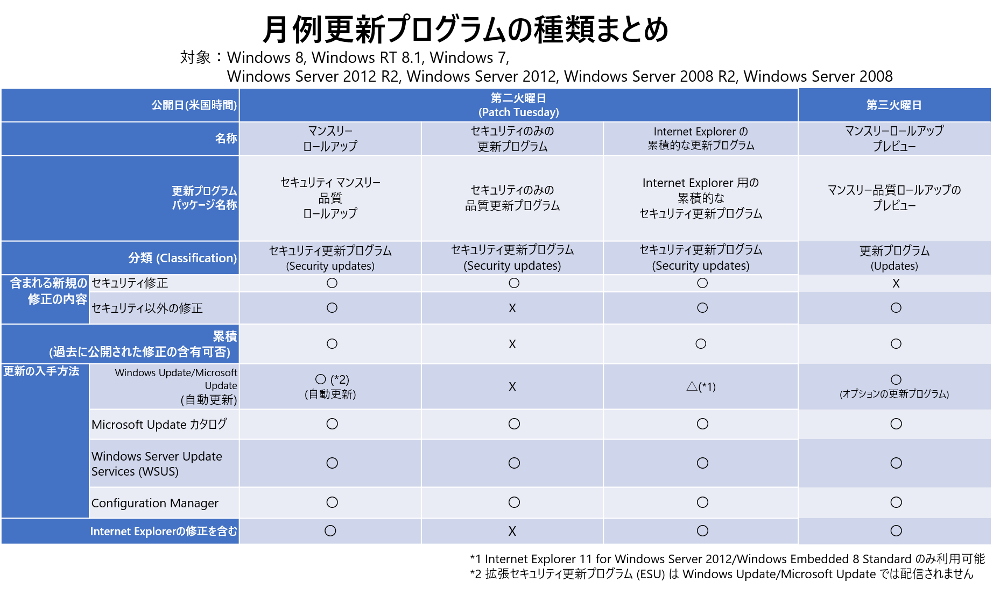

企業内でご利用の端末に更新プログラムを適用される際、特に Windows Server 2012 R2 などのサーバー OS 環境で Internet Explorer (IE) の累積的な更新プログラムを適用する必要はないのではないか？というお話を頂戴することがあります。結論から言うと、IE の累積的な更新プログラムも確実に適用いただくことを強く推奨しています。

今回の記事では IE の更新プログラムの提供方法の変遷について簡単に振り返りつつ、この観点について考察をしていきます。

■ 更新プログラムの歴史的変遷

IE における更新プログラムの提供方法は、Windows の更新モデルの変更やユーザーの皆様からのフィードバックにより、変化してきました。

・**2016 年 10 月以前**: 単体の Internet Explorer の累積的な更新プログラムとして提供。

・**2016 年 10 月～ 2017 年 2 月**: Windows がロールアップモデルへに変更したことに伴い、Windows の更新プログラムに IE の更新も統合し、提供。

・マンスリー ロールアップ: Windows および IE のセキュリティ・非セキュリティの更新が含まれる

・マンスリーのロールアップのプレビュー: 次の月の Windows および IE のセキュリティ・非セキュリティの更新のプレビューが含まれる

・セキュリティのみの更新プログラム: Windows および IE のセキュリティ更新が含まれる

・**2017 年 2 月～現在**:

Windows・IE の更新プログラムのインストール プロセスはシンプルになりましたが、一方で、限られたネットワーク帯域のシナリオでより小さなパッケージ サイズになるようダウンロードを最適化したいというようなお声も頂戴しました。そこで、2017 年 2 月より Windows 8.1、Windows Server 2012 R2 以前の「セキュリティのみの更新プログラム」には、Internet Explorer のセキュリティ修正は含まず、個別の累積的な更新プログラムとしても再び提供されるようになりました。

Windows 10、Windows Server 2016 以降 (2016 年 10 月～ 2017 年 2 月期の提供方式と変更なし)

・Windows 10、Windows Server 2016 では、Windows および IE のセキュリティ・非セキュリティを含む累積的な更新プログラムとして提供しています。セキュリティの修正は B リリース (米国時間の第二火曜) と呼ばれる月例の公開時にリリースされる累積的な更新プログラムに含まれ、「セキュリティ更新プログラム」の分類として自動配信されます。C リリース (米国時間の第三火曜)、D リリース (米国時間の第四火曜) はオプションの累積的な更新プログラムとなり、機能追加と機能修正のみが含まれ、「更新プログラム」の分類として公開されます。

Windows 8.1、Windows Server 2012 R2 以前

・マンスリー ロールアップ: Windows および IE のセキュリティ・非セキュリティの更新が含まれる

・マンスリーのロールアップのプレビュー: 次の月の Windows および IE のセキュリティ・非セキュリティの更新のプレビューが含まれる

・セキュリティのみの更新プログラム: Windows のセキュリティ更新が含まれる

・Internet Explorer 累積的な更新プログラム: IE の更新が含まれる

参考：「[\[サイバーセキュリティ月間 2020\] マイクロソフト セキュリティパッチのきほん ③](https://msrc-blog.microsoft.com/2020/02/17/secmonth2020-3/)」

「[シンプル化された Windows 7 および Windows 8.1 のサービス モデル: 最新の改善点について](https://msrc-blog.microsoft.com/2017/01/17/simplified-servicing-for-windows-7-and-windows-8-1-the-latest-improvements/)」

■ IE の累積的な更新プログラムの重要性

このように、現在、Windows 8.1、Windows Server 2012 R2 以前の環境では、セキュリティのみの更新プログラムには、IE の更新が含まれていません。そのため、特に Windows Server 環境で、セキュリティのみの更新プログラムを利用しているユーザーのみなさまから、サーバー上では Internet Explorer (ブラウザ） は使用しないので、Internet Explorer 用の更新プログラムは適用しなくてもよいかという質問を頂戴することがあります。

結論から言うと、セキュリティのみの更新プログラムを利用している場合、IE の累積的な更新プログラムも確実に適用いただくことを強く推奨しています。

Internet Explorer は単一のモジュールで構成されるアプリケーションではなく、通信コンポーネント、描画コンポーネント、スクリプトコンポーネントなど様々な役割をもつ再利用可能なコンポーネントで構成されるアプリケーションです。これらのコンポーネントは Internet Explorer 以外の OS の機能のみではなく API や WebBrowser コントロールなどのブラウザー機能を切り出したコンポーネントが公開されており、サードパーティ製のアプリケーションでユーザーがログオンをするときに利用するなど幅広く利用されています。つまり、Internet Explorer そのものを利用していない場合にも Internet Explorer を構成するコンポーネントが利用されている可能性があります。

また、IE の累積的な更新プログラムが適用されておらず構成するコンポーネントが正しくアップデートされていない場合、互換性の問題 (ページが表示されない、ブラウザ以外の通信コンポーネントを使用するアプリが正常に動作しない等) が生じる場合もあります。

このため、セキュリティのみの更新プログラムを適用している場合、システムを保護するために Internet Explorer 累積的な更新プログラムを適用し、Internet Explorer のセキュリティの問題も確実に修正され、最新の状態を保つことが重要です。

■ 最後に

弊社では環境を安全にご利用頂くため、最新のセキュリティ更新を適用した状態を保つことを推奨しています。

繰り返しとなりますが、安全・安全に製品をご利用頂くために、Windows 8.1 や Windows Server 2012 R2 で「セキュリティのみの更新」を適用している環境の場合には、併せて「Internet Explorer の累積的な更新プログラム」の適用をお願いいたします。

これまでに Internet Explorer の累積的な更新プログラムを適用されていない場合は、最新の「Internet Explorer の累積的な更新プログラム」の適用いただくことで、最新の状態にすることが可能です。これは Internet Explorer の更新プログラムは、「累積的な」更新であり過去の修正も含むためで、最新の更新を適用いただくことで過去全ての修正も適用されるためです。

ぜひ、すべての最新のセキュリティ更新プログラム・マンスリー ロールアップを適用し、安心・安全な環境を保ちましょう。

垣内 由梨香 セキュリティ プログラム マネージャ、セキュリティ レスポンス チーム

藤代 真道 伊藤 義一 ブラウザ サポートチーム
