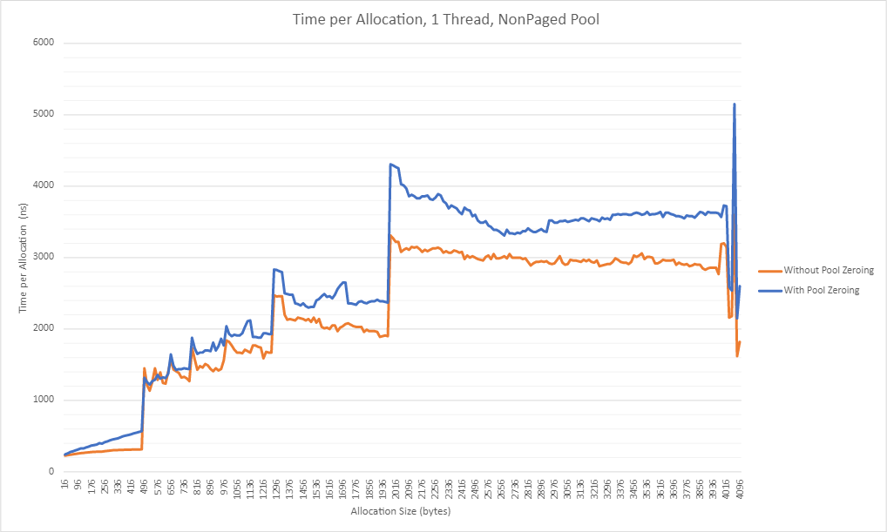
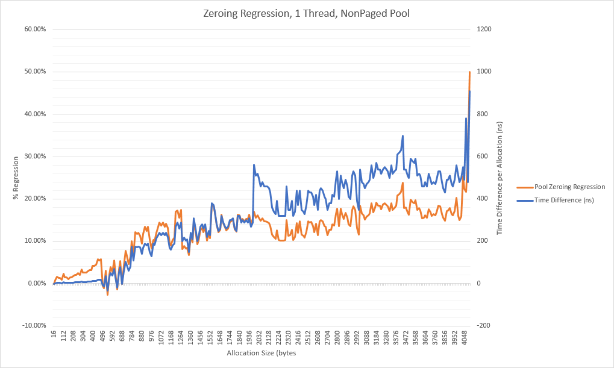
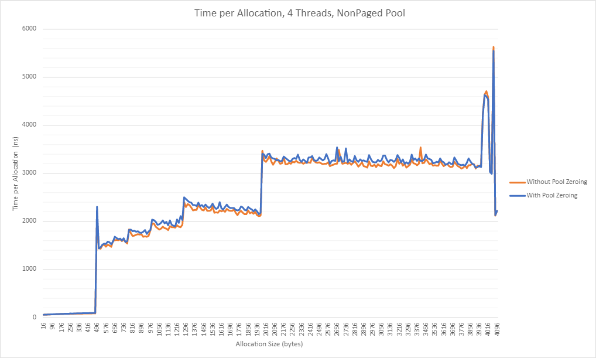
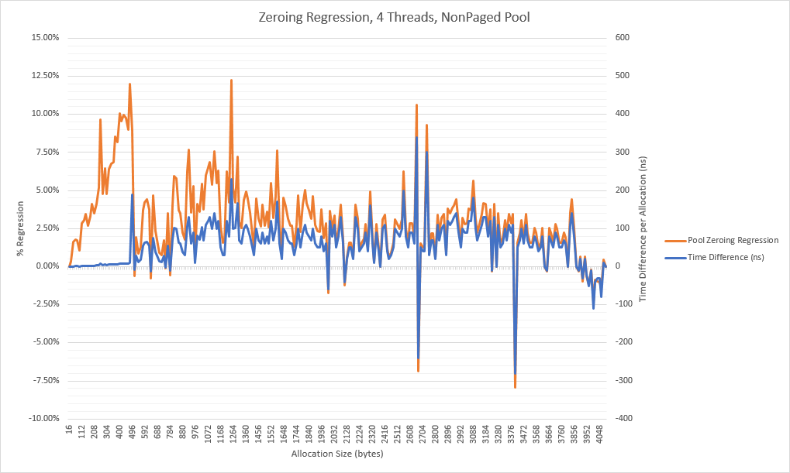
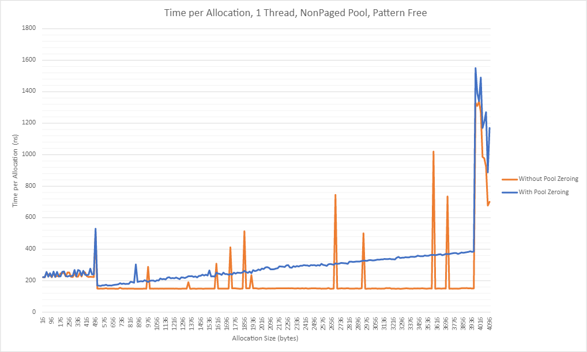
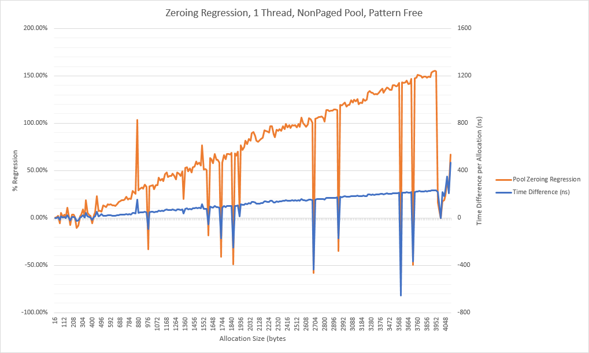
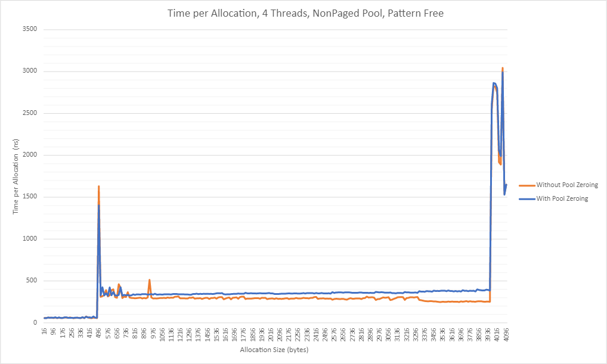
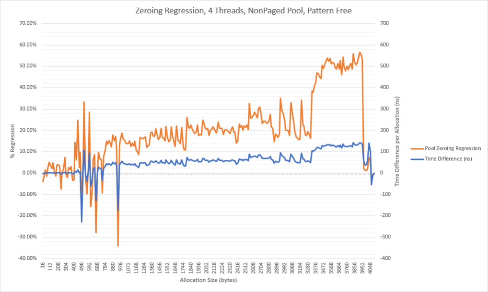
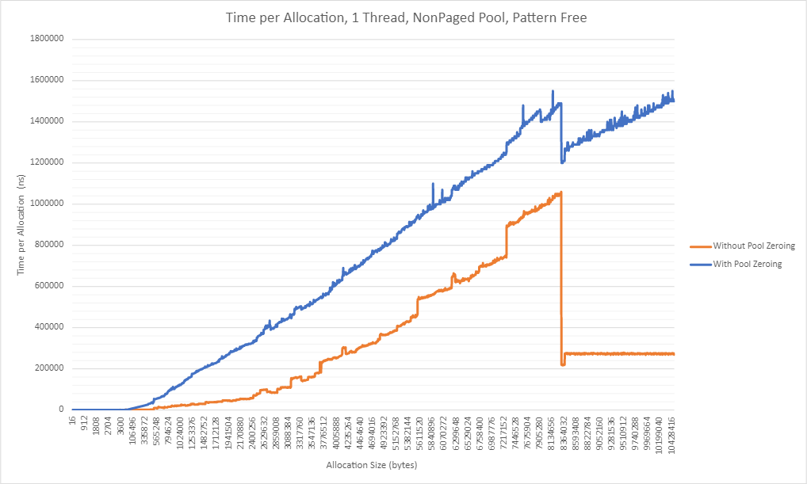
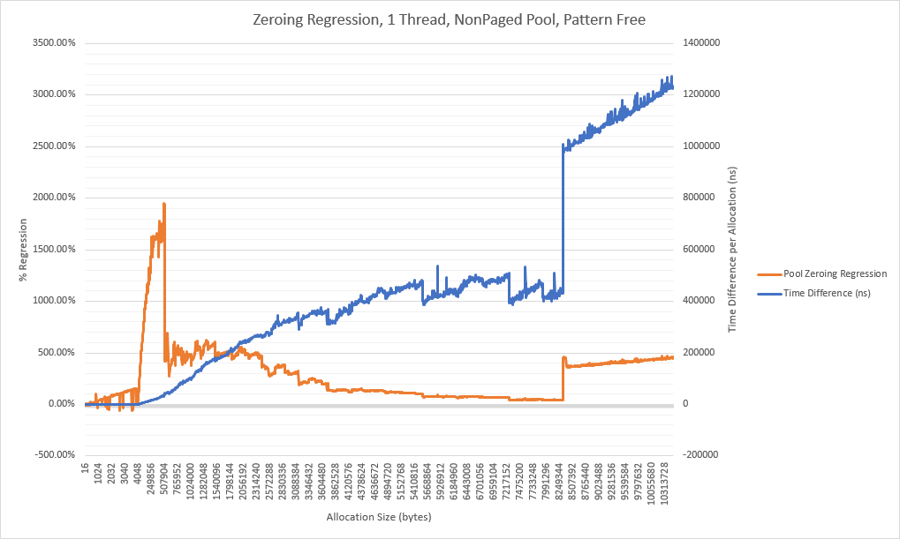

This blog post outlines the work that Microsoft is doing to eliminate uninitialized kernel pool memory vulnerabilities from Windows and why we’re on this path.

For a background on why uninitialized memory matters and what options have been used in the past to tackle this issue, please see our previous [blog post](https://msrc-blog.microsoft.com/2020/05/13/solving-uninitialized-stack-memory-on-windows/). The brief recap is that uninitialized kernel pool vulnerabilities account for a little under half of all uninitialized memory issues that were reported to Microsoft between 2017 and the middle of 2018.

This blog post is broken down into a few parts that you can jump to:

1. Understanding the Feasibility of Solving Uninitialized Pool Memory
2. Potential Implementation Options
3. New Windows Kernel Pool API’s
4. Performance Optimizations
5. Deployment Plan
6. Impact for Customers
7. Forward Looking Plans

None of this work would have been possible without close partnership between the Windows organization and MSRC.

# Understanding the Feasibility of Solving Uninitialized Pool Memory

The work to solve uninitialized kernel pool memory began after the work to solve uninitialized stack memory.

Just like with uninitialized stack memory, we wanted a solution that can deterministically prevent vulnerabilities rather than relying only on static analysis, fuzzing, or code review. The ideal end state for us is to know that our code has no uninitialized kernel pool issues by construction.

Initially, solving uninitialized pool memory seemed much more challenging than uninitialized stack memory. Consider the following differences:

|                                                           |                                                                                                                                                        |                                                                                                                                                                                                                                                                                                                                                                                              |
| --------------------------------------------------------- | ------------------------------------------------------------------------------------------------------------------------------------------------------ | -------------------------------------------------------------------------------------------------------------------------------------------------------------------------------------------------------------------------------------------------------------------------------------------------------------------------------------------------------------------------------------------- |
|                                                           | **Stack Allocations**                                                                                                                                  | **Kernel Pool Allocations**                                                                                                                                                                                                                                                                                                                                                                  |
| **Typical Size**                                          | Small (kernel stack is 20KB and cannot grow)                                                                                                           | Can be many MB. Average pool allocation size larger than stack.                                                                                                                                                                                                                                                                                                                              |
| **Cache**                                                 | Active stack is typically in the L1 cache or about to be (when the variable is used by code).                                                          | Pool allocations may be satisfied by memory that is not in the cache at all and may not be used immediately (although pool allocations are generally used soon after allocation).                                                                                                                                                                                                            |
| **Ability to Optimize**                                   | MSVC does a great job eliminating redundant stores to stack variables.                                                                                 | If allocations are zeroed in the pool API, it is impossible for the compiler to automatically optimize away the initial zeroing. MSVC would need custom optimization logic to recognize “this API zeroes so if the caller immediately memset’s it to zero after allocation, the memset can be eliminated”. MSVC generally has a harder time optimizing redundant stores to pool/heap memory. |
| **Allocation Time**                                       | Instant, stack allocations are effectively made in bulk when the function is entered by adjusting the stack pointer.                                   | Fast but not instant. Involves branching logic, multiple memory reads to consult structures and metadata, and potentially obtaining locks or calling in to the memory manager to obtain additional virtual address space.                                                                                                                                                                    |
| **Percent of “Total Allocation Time” Spent Initializing** | If forced initialization cannot be optimized away, the “allocation time” goes from zero to however long it takes to initialize. This is pure overhead. | Heap allocations already have overhead, hopefully the time spent in memset will be a single-digit percentage of the total allocation time. For very large memsets we expect that the memset cost will dominate the total allocation time.                                                                                                                                                    |

In short, we expect that pool allocations will be bigger than stack allocations on average, will be harder (or impossible) to optimize redundant stores away from on average, and will be dealing with memory in a slower CPU cache. The only redeeming factor is that it takes longer to make a heap allocation than a stack allocation so while we may spend more time initializing heap allocations, it will hopefully blend in to the noise of “time spent making a heap allocation”.

To test this theory we performed two sets of tests.

## Real-World Windows Performance Tests

In this test, we modified the existing pool API’s to unconditionally zero all allocations with no ability to opt-out of the behavior. We then used our existing performance gate infrastructure to measure the impact of this change in critical scenarios.

These test results were extremely positive. Most of the benchmarks showed no measurable performance regression.

One of our critical benchmarks, web fundamentals (a measure of web server performance), does a great job of estimating full system performance and is known to be extremely sensitive to kernel pool allocator performance. When we previously replaced the old kernel pool allocator with the segment heap implementation that runs in user-mode, web fundamentals saw regressions of around 15% initially (note: we fixed these regressions). The point here is that web fundamentals is very sensitive to pool allocator performance.

With pool zeroing in place, one of the web fundamentals tests showed a noise-level regression of around 1%. The rest of the web fundamentals tests showed no regression.

This gave us confidence that pool zeroing was feasible so long as we had a way for developers to opt-out hot allocations that cause regressions.

## Microbenchmarks

We also built microbenchmarks to help us understand what the overhead of zeroing is for allocations of different sizes. Note that these microbenchmarks do have some noise; if you see massive spikes at a single size it is likely just noise in the test. Also note that these benchmarks are not representative of current performance after some performance tweaks were made. These are the initial performance numbers.

### Test 1: Allocate 8GB of Memory Using Multiple Allocations of the Same Size

The following benchmark measures the regression caused by pool zeroing when a single thread makes repeated allocations of some fixed size. Note that for these tests, 8GB of allocations are made.

The scenario is somewhat unrealistic since in normal heap operation we expect allocations are made and freed (and thus virtual address space can be re-used). In this test the heap periodically needs to go to the memory manager to request additional memory (which is slower).

The next graph shows the same scenario except each particular size is being made from 4 threads at once. This can cause lock contention, interlocked operations to collide with each other, and SList operations to collide.

Once thing worth noting is that multi-threaded tests typically have much higher noise than single threaded tests which is apparent in the graph. It’s also worth noting that overall, the regression seems to be lower here (although it was higher for very small sizes). This is expected since the allocation path has additional overhead (as mentioned above) when multiple threads are executing it at once.

### Test 2: Allocations and Frees

The next test allocates and frees memory, reducing the overhead of the memory manager periodically having to provide additional memory to the heap. We expect that the regression will be worse in this set of tests since the heap itself should be operating faster.

The graph above shows that the regression is substantially higher, as expected, when allocations are allocated and freed.

What about for 4 threads at once?

Once again, we can see that the regression is bigger here than it was previously.

The following graphs show that as size of allocation increases, memset completely dominates the time it takes to make the allocation.

## Rationalizing the Performance Data

The real-world data looks good but some of the micro benchmark data looks fairly concerning. Here’s how we can rationalize what we’re seeing:

1. Smaller allocations are more likely to be seen in hot paths than larger allocations. For example, you don’t typically see multi-megabyte or even multi-kilobyte allocations being made in a hot path. Larger allocations are typically made in a limited number of places and the hot path is the code using the allocations, not the code making the allocation.
2. Small allocation performance is not super regressed. There is still impact, but it’s not unreasonable.
3. Many existing code paths already zero allocations after making them. Our real-world test setup is unconditionally zeroing allocations inside of the pool API so we are causing many allocations to be double zeroed. We can win back some performance if we ensure allocations are only zeroed once.
4. The micro benchmarks are still not perfectly accurate. The benchmark works by making allocations of the same size which means that branch predictors inside of the API will be well-trained. In the real world this is sometimes true (I.e. sometimes applications make a bunch of allocations of the same size in a row), but it is also often not true. If branch predictors are not perfectly trained, the normal pool allocation code will have additional branch misprediction overhead that isn’t reflected by these tests.
5. We can always allow developers to opt-out allocations if the zeroing behavior ends up being a bottleneck in their code.

As you may have guessed, we ended up moving forward with the pool zeroing project based on the data we collected.

# Potential Implementation Options

There were three approaches we considered for getting initialized pool memory:

1. Creating new pool API’s that zero memory by default.
2. Using some compiler magic to zero initialize pool allocations that are not provably fully initialized after being allocated.
3. Make the existing pool API’s zero memory by default and provide a new flag to allow an opt-out.

We ruled out #2 because it would involve one-off compiler logic to recognize pool allocations, detect if they were fully initialized, and insert initialization if they weren’t. It would also only benefit developers compiling drivers with MSVC whereas the first approach would also help developers who compile their drivers with other compilers.

We ruled out #3 because it creates a breaking change for the existing pool API’s. Many companies write drivers that run on all versions of Windows. If we changed the existing pool API then driver writers would face a dilemma if their driver needed to run on older versions of Windows:

1. Continue to zero allocations returned by the existing pool API’s so their driver will be functionally correct when run on versions of Windows without this behavior.
2. Write their driver to only work on versions of Windows with the new pool API behavior.

Note that even if we shipped this change down level, driver developers wouldn’t be able to depend on it. Some customers don’t install updates or take a long time to install updates.

We spent some time investigating solutions that would allow us to “upgrade” the existing API’s to have zeroing behavior, however, we couldn’t come up with a good solution that satisfied the following requirements:

1. Must be more convenient for a developer to use the zeroing API than the non-zeroing API (I.e. we prefer forcing someone to opt-out of zeroing rather than opt-in)
2. Must not result in functional correctness issues on any in-support platform
3. Must not require double-zeroing on any in-support platform
4. Must be able to disable zeroing if required for performance

# New Windows Kernel Pool API’s

## Windows 10 Version 2004 API’s

For the Windows 10 Version 2004 release, we have introduced new pool API’s that zero by default.

These API’s are:

- [ExAllocatePool2](https://docs.microsoft.com/en-us/windows-hardware/drivers/ddi/wdm/nf-wdm-exallocatepool2)
- [ExAllocatePool3](https://docs.microsoft.com/en-us/windows-hardware/drivers/ddi/wdm/nf-wdm-exallocatepool3)

ExAllocatePool2 takes less parameters making it easier to use. It covers the most common scenarios.

Less common scenarios (such as priority allocations) that require more flexible parameters go through ExAllocatePool3. Both API’s are designed to be extensible for the future so we do not need to continue adding new API’s.

## Down-Level Compatible API’s

We have also introduced a new set of wrapper API’s that work on all supported down-level operating systems. These are implemented as forceinline functions and require the driver developer:

1. Define POOL_ZERO_DOWN_LEVEL_SUPPORT in their driver (using a #define) prior to pulling in any Windows headers.
2. Call ExInitializeDriverRuntime prior to using these API’s.

|                               |                                                                                                                                   |                                                                                                                                                     |
| ----------------------------- | --------------------------------------------------------------------------------------------------------------------------------- | --------------------------------------------------------------------------------------------------------------------------------------------------- |
| **Old API**                   | **Zeroing Wrapper**                                                                                                               | **Uninitialized Wrapper**                                                                                                                           |
| ExAllocatePoolWithTag         | [ExAllocatePoolZero](https://docs.microsoft.com/en-us/windows-hardware/drivers/ddi/wdm/nf-wdm-exallocatepoolzero)                 | [ExAllocatePoolUninitialized](https://docs.microsoft.com/en-us/windows-hardware/drivers/ddi/wdm/nf-wdm-exallocatepooluninitialized)                 |
| ExAllocatePoolWithQuotaTag    | [ExAllocatePoolQuotaZero](https://docs.microsoft.com/en-us/windows-hardware/drivers/ddi/wdm/nf-wdm-exallocatepoolquotazero)       | [ExAllocatePoolQuotaUninitialized](https://docs.microsoft.com/en-us/windows-hardware/drivers/ddi/wdm/nf-wdm-exallocatepoolquotauninitialized)       |
| ExAllocatePoolWithTagPriority | [ExAllocatePoolPriorityZero](https://docs.microsoft.com/en-us/windows-hardware/drivers/ddi/wdm/nf-wdm-exallocatepoolpriorityzero) | [ExAllocatePoolPriorityUninitialized](https://docs.microsoft.com/en-us/windows-hardware/drivers/ddi/wdm/nf-wdm-exallocatepoolpriorityuninitialized) |

When these API’s are used on operating systems that support pool zeroing natively they simply call in to the pool API’s and allow it to do the zeroing. When they are used on operating systems that do not support pool zeroing natively (i.e. operating systems prior to Windows 10 Version 2004) they will make the pool allocation and then memset the allocation to zero.

The intention here is to get driver developers a way to be more explicit way about what they are doing in their program. There will never be any question of if a developer truly intended for an allocation to be uninitialized or zeroed since the behavior is explicitly specified in the API name.

### ExAllocatePool2/3 Improvements Over Old API’s

#### Throwing Behavior

The old pool API’s had confusing error path behavior.

ExAllocatePoolWithQuotaTag throws an exception on error unless the POOL_QUOTA_FAIL_INSTEAD_OF_RAISE flag is passed to it, in which case it returns NULL on error. ExAllocatePoolWithTag and ExAllocatePoolWithTagPriority return NULL on failure unless the POOL_RAISE_IF_ALLOCATION_FAILURE flag is passed to them, in which case they throw an exception. It’s a bit confusing having a set of API’s that have different semantics.

ExAllocatePool2/3 return NULL on failure unless the POOL_FLAG_RAISE_ON_FAILURE flag is specified, in which case an exception is thrown.

#### Tag Behavior

The old pool API’s accept pool tags of zero. This can make debugging more difficult. The new pool API’s don’t accept zero pool tags.

#### Non-Executable Non-Paged-Pool by Default

Using POOL_FLAGS_NON_PAGED defaults to non-executable memory. POOL_FLAGS_NON_PAGED_EXECUTABLE must be used for executable non-paged pool memory. By making the more convenient allocation type the safer allocation type, developers are less likely to accidentally do the insecure thing.

Note: The paged pool is always executable on the x86 architecture and non-executable on all other architectures.

#### Zeroing by Default

The new pool API’s zero allocations by default. Callers must specify the POOL_FLAGS_UNINITIALIZED flag if they need uninitialized allocations.

# Performance Optimizations

Since the performance looked good in real-world tests as-is, not much was done to optimize it further. There are a few things worth calling out.

1. When large allocations are made with zeroing requested, the heap may need to retrieve memory from the memory manager. In this case, the heap will request zero’d pages and the memory manager will attempt to provide these using memory that was already zero’d using the background zeroing thread. This allows for large amounts of zero’d memory to be quickly allocated.
2. For very large allocations, developers can manually opt-out the allocation from zeroing by using the appropriate flag. It is not typical to have very large allocations made in a hot path so this typically doesn’t need to be used.
3. A heap specific zeroing function was created that outperforms the normal memset implementation. We plan to release another blog post about this in the future. This function takes advantage of specific alignment guarantees that the heap makes for its allocations.

No other optimizations have been needed.

# Deployment Plan

Unlike with InitAll, the new pool zeroing API’s require code changes to use.

For Windows 10 Version 2004, the entire Windows memory manager has been converted to use the new pool zeroing API’s. All but one place (a bitmap allocation that can be quite large) use zeroing allocations.

We have also made changes (that will ship in a future release) to Hyper-V and a number of networking components to use these new API’s. Our current plan is to convert all kernel-mode code over to the new API’s in the near future using automatic bug filing tools to help ensure everything gets converted.

Thus far the feedback on the new API’s has been positive. No performance issues have been noticed and code size has been reduced as developers no longer need to call both the pool API and memset if they need a zero’d allocation.

We’re also looking in to how we can help 3rd party drivers move away from the old pool API’s. We don’t have any firm plans to share on this front yet, but work is in progress.

# Impact for Customers

Once we finish transitioning our code over to the new pool API’s, the majority of uninitialized memory vulnerabilities that currently affect customers will be mitigated on Windows. Uninitialized memory vulnerabilities will still be possible of course, but between InitAll protecting the stack and most allocations using the zeroing flag, the chances of these issues sneaking in will be much smaller.

It is also still possible that while memory is initialized, it is not initialized to a program meaningful value (i.e. memory is initialized to 0, but it should be initialized to something else for the program to be correct). In these cases, we at least end up with deterministic behavior in our programs (i.e. the program always does the wrong thing since the value is initialized incorrectly) rather than random behavior (i.e. the program does completely different things depending on what the uninitialized value is). This makes problems easier to triage and makes assessing the impact of a bug more straight forward since we always know what the memory is set to. In most cases, even if zero isn’t a “correct” value to go with, it is still the safest automatic value to go with from a security point of view.

We remain hopeful that these mitigations will mostly eliminate the threat of a vulnerability class that accounted for 5-10% of all Microsoft CVE’s in recent years.

# Forward Looking Plans

While pool zeroing is a great start for us, we still have a few areas to investigate:

1. What to do about user-mode heaps. Should we ban malloc and force the use of calloc? Something else?
2. What to do about C++ classes with constructors. Should these opt-out of zeroing but be required to fully initialize the class in the constructor? What about any internal padding bytes?

We also plan to release a future blog post about how we created a new, specialized memset for the kernel pool to use to zero allocations with and how this work led to a higher performance memset implementation for all Windows applications.
