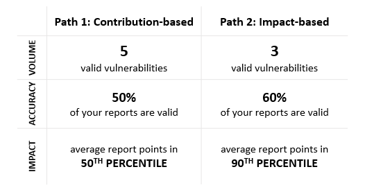

**Today we announce our Most Valuable Security Researchers for 2020!**

The [MSRC Researcher Recognition program](https://www.microsoft.com/msrc/researcher-recognition-program) is an integral aspect of recognizing the ongoing partnerships with our community of talented security researchers who report through [Coordinated Vulnerability Disclosure (CVD)](https://www.microsoft.com/msrc/cvd). These recognitions run throughout specific periods of the year and provide regular opportunities to recognize those who have the greatest impact on the security environment.

Every year during Black Hat USA, we take time to recognize our Most Valuable Security Researchers (MVRs) based on the _volume_, as well as the _accuracy_ and _impact of their vulnerability reports_. While we cannot come together physically to celebrate their accomplishments, the researchers listed in today’s announcement have made exceptional contributions to the overall security of Microsoft’s customers between July 1, 2019 and June 30, 2020, one of the most challenging periods in recent history.

![1. SHEFANG ZHONG
2. ZHINIANG PENG (@EDWARDZPENG)
3. YUKI CHEN
4. ASHAR JAVED
5. SURESH CHELLADURAI
6. OLEKSANDR MIROSH
7. HOSSEIN LOTFI
8. YANGKANG
9. CAMERON VINCENT
10. XUEFENG LI
11. HUYNH PHUOC HUNG
12. TERRY ZHANG
13. KE LIU (@KLOTXL404)
14. FANGMING GU
15. WTM
16. JIADONG LU
17. MARKUS WULFTANGE
18. HAORAN QIN
19. PHAM VAN KHANH
20. JEONGOH KYEA
21. IVAN VAGUNIN
22. ABDUL-AZIZ HARIRI
22. JAANUS KÄÄP
24. GUOPENGFEI
25. HAIFEI LI
26. MARCIN 'ICEWALL' NOGA
27. 男人至死是少年
28. GAL DE LEON
29. CVIEW
30. GIL DABAH
30. SOROUSH DALILI (@IRSDL)
32. WILLJ
33. ZHANGJIE
34. ANDREA PIERINI
34. SIMON BARSKY
36. EDWARD TORKINGTON
36. S0RRYMYBAD
38. CHRIS DANIELI 
39. QUAN JIN
40. ANDREA MICALIZZI AKA RGOD
40. MEYSAM FIROUZI
40. NETANEL BEN-SIMON
40. YOAV ALON
44. DHANESH KIZHAKKINAN
44. K0SHL
46. ANONYMOUS
46. SHIH-FONG PENG 
46. WAYNE LOW
46. ZHIYI ZHANG
50. MOON LIANG
50. RAMZES
52. OMER TSARFATI
53. WENGUANG JIAO
54. OSKARS VEGERIS
54. SHI JI
54. ZHANG SEN
57. ZHIPENG HUO
58. VIKAS ANIL SHARMA
59. ADRIAN IVASCU
59. HONGZHENHAO
61. STEVEN SEELEY (MR_ME) 
61. WENQUNWANG
63. LIUBENJIN
64. ABDULRAHMAN ALQABANDI
64. FABIAN SCHMIDT
66. YING XINLEI
67. SEFA ALTIN
68. HÀ ANH HOÀNG
68. LE HUU QUANG LINH
70. DIRK-JAN MOLLEMA
71. MARCEL BILAL
72. CLÉMENT LAVOILLOTTE
73. WENXU WU
74. ANAS LAABAB
74. JOSIP FRANJKOVIĆ
76. ANONYMOUS
77. PHILLIP LANGLOIS
78. ANEES KHAN
78. HE YISHENG
78. JUNGU
78. MOHAMED HAMED 
78. YHZX_2013
78. ZHANG WANGJUNJIE
78. ZHUNKI 
85. CLÉMENT LABRO
86. ANONYMOUS
87. BAR LAHAV
88. HUỲNH THÔNG
89. RIUSKSK
90. MOSLEM HAGHIGHIAN
91. DANG THE TUYEN](./img/wp-content-uploads-2020-08-leaderboard-0806-533x1024.png)

These researchers have successfully achieved at least one of the following paths during the last program period. The complete criteria and program scope for recognizing security researchers in 2020 can be found in our blog [here](https://msrc-blog.microsoft.com/2020/02/03/recognizing-security-researchers-in-2020/).

We are thrilled that so many researchers achieved this status and join those who were recognized as the [2019 Most Valuable Security Researchers](https://msrc-blog.microsoft.com/2019/08/07/announcing-2019-msrc-most-valuable-security-researchers/). We can’t wait to see what our researchers do in the coming year!

_Sylvie Liu, Security Program Manager, Microsoft Security Response Center_
