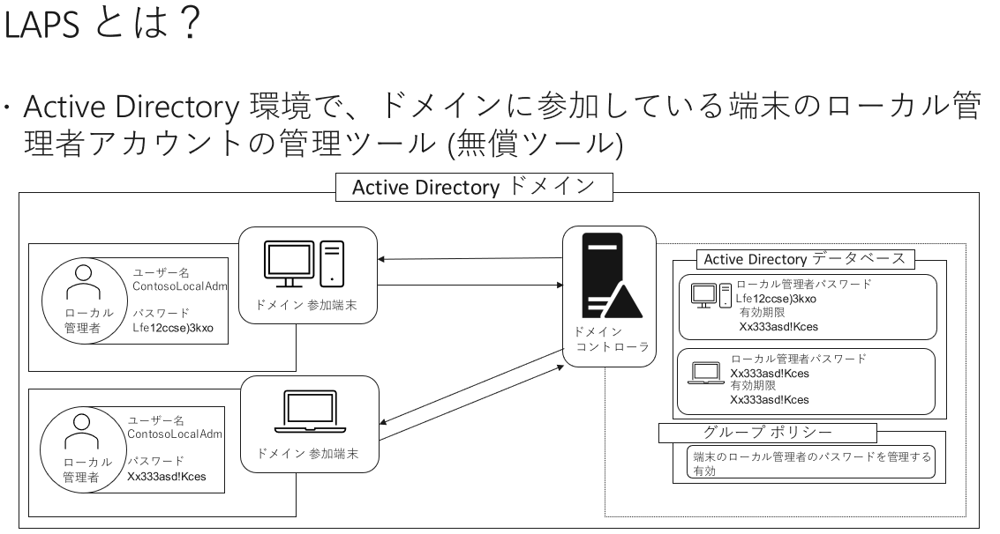
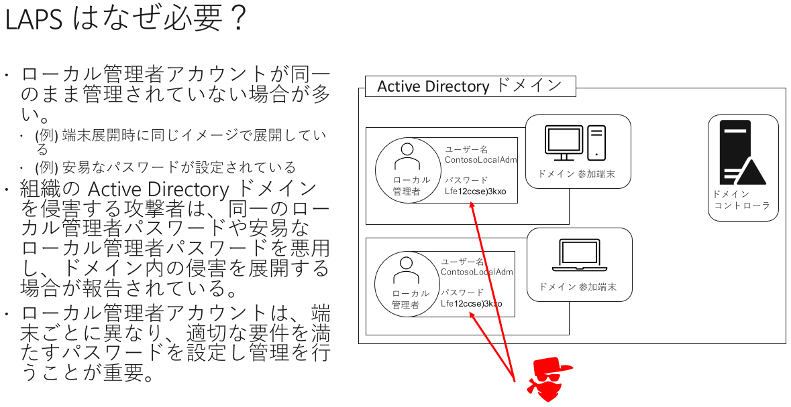
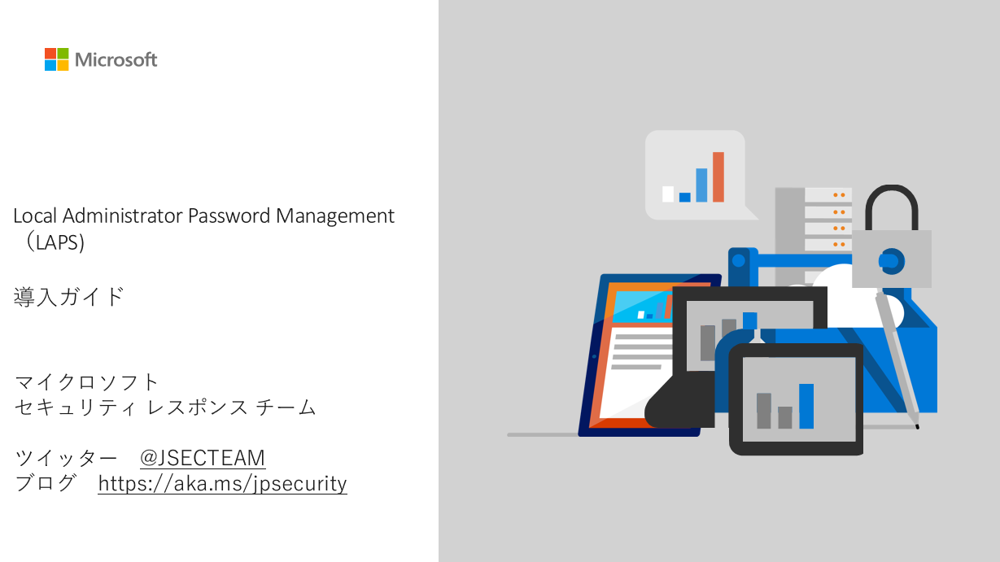

Active Directory 管理者のみなさん、[Local Administrator Password Solution (LAPS) ツール](https://www.microsoft.com/en-us/download/details.aspx?id=46899)はご存じですか? LAPS ツールは、Active Directory (AD) に参加しているコンピューターの、ローカル管理者アカウントのパスワードを AD にて管理することができる無償のツールです。

Active Directory 環境への侵害では、ローカル管理者アカウントに設定されている安易なパスワードや、複数の端末で同一のパスワードが利用されていることが要因となり、侵害が広がるケースが報告されています。組織内への攻撃の広がりや侵入拡大を防ぐために、ローカル管理者のパスワードを適切に管理することが重要です。

マイクロソフトでは、LAPS ツールを、2015 年に [マイクロソフト セキュリティ アドバイザリ 3062591](https://support.microsoft.com/ja-jp/help/3062591/) で広く周知を始め、いまでは多くの Active Directory 環境で利用されています。その一方で、LAPS ツールの導入ガイドは英語でしか提供されていないため、導入に向けたハードルが高い、あるいは設定方法がよく分からないという声も聞かれました。そこで、日本のお客様が LAPS を導入する手助けになるよう、日本語の LAPS 導入ガイドを作成しました。

[**Local Administrator Password Management (LAPS) 導入ガイド (ダウンロード)**](https://download.microsoft.com/download/2/9/5/295b78a4-7051-4873-a00c-4beaf416ccec/LAPS_Guide_JA.pdf)

LAPS を未導入の Active Directory 環境をお持ちの管理者の皆様は、ぜひこの日本語ガイドを参考にして LAPS の導入をご検討ください。

垣内 由梨香 セキュリティ プログラム マネージャー マイクロソフト セキュリティ レスポンス チーム
