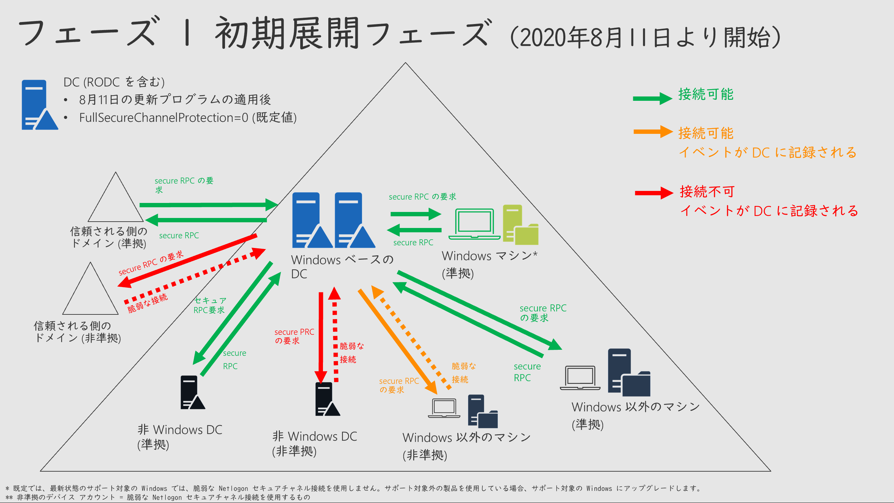
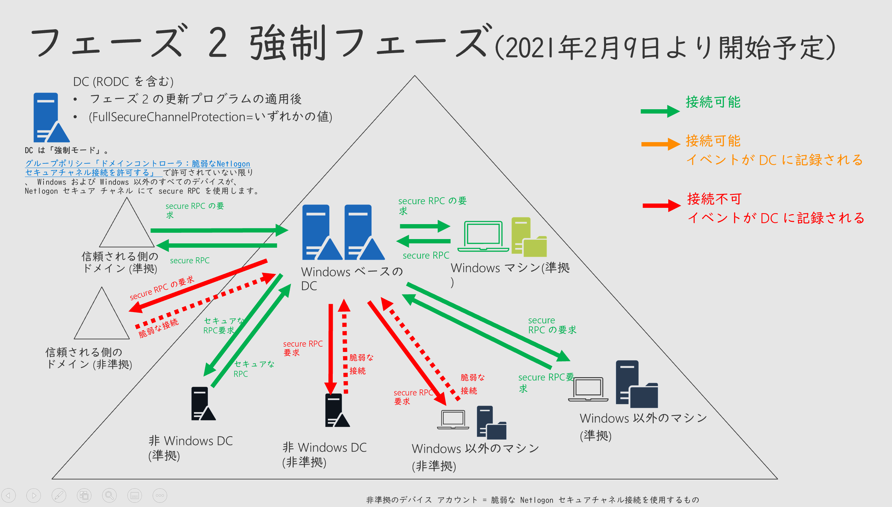
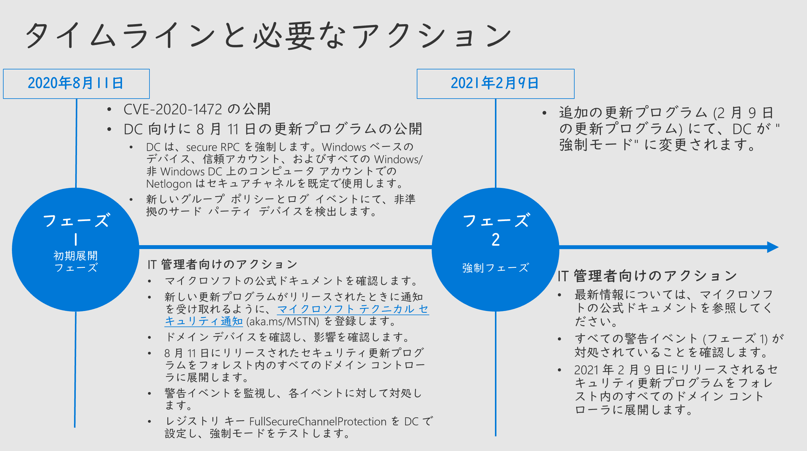
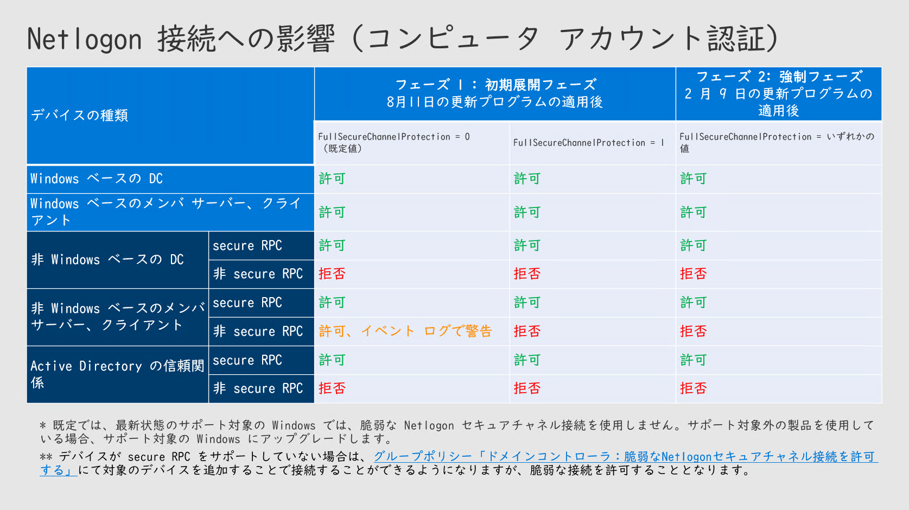

2020 年 8 月の月例セキュリティ更新プログラム (2020 年 8 月 11 日 公開 (米国時間)) にて、Active Directory で利用されている [Netlogon プロトコルの実装における特権昇格の脆弱性 CVE-2020-1472](https://portal.msrc.microsoft.com/ja-jp/security-guidance/advisory/CVE-2020-1472) を修正しました。

本脆弱性が修正している Netlogon プロトコルは、Windows デバイスだけではなく、非 Windows のデバイスにおいても実装されています。このため非 Windows デバイスの Netlogon 実装への互換性を考慮し、本脆弱性への対処を 2 段階に分けて実施する予定です。

2020 年 8 月の月例セキュリティ更新プログラム公開から 1 か月経ち、既に更新プログラムを適用して本脆弱性への対処を開始しているお客様もいらっしゃいますが、一方で、本脆弱性に対して必要な対処を把握しきれていないお客様もおられるかと思います。そこで、本ブログでは Active Directory 管理者向けに、本脆弱性の概要と必要となる作業の概要を説明します。

**&lt;注意 > 本脆弱性の詳細および最新の情報は、下記の Security Update Guide ポータルの脆弱性ページ、およびサポート技術情報を参照してください。**

“セキュリティアップデートガイド"CVE-2020-1472 | NetLogon の特権の昇格の脆弱性” <https://portal.msrc.microsoft.com/ja-jp/security-guidance/advisory/CVE-2020-1472> “CVE-2020-1472 に関連する Netlogon セキュア チャネル接続の変更を管理する方法” <https://support.microsoft.com/help/4557222> “CVE-2020-1472 に関連する Netlogon セキュリティで保護されたチャネル接続の変更に関連するイベント ID の監視に役立つスクリプト” <https://support.microsoft.com/help/4557233/>

#### **\[1] 脆弱性の概要 (CVE-2020-1472)**

**・\*\***2020 年 8 月 11 日 (米国時間) に、マイクロソフトは **[**CVE-2020-1472 Active Directory の Netlogon における 特権の昇格の脆弱性**](https://portal.msrc.microsoft.com/ja-jp/security-guidance/advisory/CVE-2020-1472)**に対するセキュリティ更新プログラムを公開しました。\*\*

- 認証されていない攻撃者が、この脆弱性を悪用する特別に細工されたアプリケーションなどを利用し、Netlogon リモート プロトコル ([MS-NRPC](https://docs.microsoft.com/ja-jp/openspecs/windows_protocols/ms-nrpc/ff8f970f-3e37-40f7-bd4b-af7336e4792f)_ とも呼ばれます_) を使用してドメイン コントローラ (DC) に対して脆弱な Netlogon セキュア チャネル接続を確立した場合、特権の昇格が可能になります。

**・\*\***Active Directory を管理する IT 管理者は、この脆弱性から保護するために追加の対応を実行する必要があります。\*\*

- この脆弱性が存在する Netlogon リモート プロトコルは、ドメインに参加しているデバイスでのみ使用される RPC インターフェイスにあります。
- 脆弱性からシステムを保護するためには、「安全な RPC (Secure RPC)」を利用する必要があります。
- すべての[サポート内の Windows OS](https://support.microsoft.com/ja-jp/help/13853/windows-lifecycle-fact-sheet) は、「安全な RPC (Secure RPC)」を既定で利用可能で、ドメインコントローラが「安全な RPC (Secure RPC)」を要求した場合、ドメイン内の Windows OS 端末は自動的に「安全な RPC (Secure RPC)」を利用した接続を行います (DC 以外に更新プログラム適用の必要はありません)。しかしながら、このフェーズでは安全な RPC を使用しない Netlogon セキュア チャネル接続 (脆弱な接続） も、引き続き許可され利用可能になっています。
- 脆弱性から Active Directory を保護するためには、ドメインコントローラが Netlogon セキュア チャネル接続で、「安全な RPC (Secure RPC)」を強制し、すべての Active Directory ドメイン参加端末が「安全な RPC (Secure RPC)」を利用する必要があります。

**・マイクロソフトは段階的に、この脆弱性を解決します。\*\*\*\***

- すべてのサポート内の Windows OS は、Netlogon における「安全な RPC (Secure RPC)」を既定で利用可能ですが、非 Windows デバイスの Netlogon 実装への互換性を考慮し、本脆弱性への対処を 2 段階に分けて実施しました。詳細は \[3] 段階的な対処のスケジュールをご参照ください。

#### **\[2] 影響を受ける環境**

Active Directory ドメインを利用しているすべての Windows OS および非 Windows デバイスが影響を受けます。

**・ドメイン コントローラ**

- フォレスト内すべてのドメインコントローラ (読み取り専用ドメインコントローラ: RODC 含む) の更新が必要です。
- Windows OS 上のドメインコントローラの場合は、2020 年 8 月の月例セキュリティ更新以降の更新プログラムの適用が必要です。
- 非 Windows OS 上のドメインコントローラの場合は、Netlogon 実装が Secure RPC に対応するよう更新する必要があります。詳細は、提供元にご確認ください。

**・ドメイン メンバーサーバー、ドメイン クライアント**

- Active Directory に参加しているすべてのデバイスは、Secure RPC に対応する必要があります。

- サポート対象内の Windows OS の場合は、既定で Secure RPC を利用可能です。追加の作業は必要ありません。ドメインコントローラが Secure RPC を利用するようになれば、ドメイン参加しているクライアントも自動的に Secure RPC を利用するようになります。サポート対象外の Windows を使用している場合、サポート対象の Windows にアップグレードします。

  - 非 Windows OS の場合は、Netlogon 実装が Secure RPC に対応するよう更新する必要があります。詳細は、提供元にご確認ください。

#### **\[3] 段階的な対処のスケジュール**

##### **フェーズ \*\***1 初期展開フェーズ (2020 年 8 月 11 日- 2021 年 2 月 9 日 (米国時間))\*\*

マイクロソフトは、Windows ドメインコントローラ用セキュリティ更新プログラム (2020 年 8 月 11 日公開) を公開しました。フォレスト内すべてのドメインコントローラの更新する必要があります。この更新プログラムを適用すると、ドメインコントローラは次のような動作を行います。

**・「安全な \*\***RPC (Secure RPC)」の既定での利用\*\*: ドメインコントローラが、Netlogon セキュア チャネル接続で「安全な RPC (Secure RPC)」を既定で利用するようになり、「安全な RPC (Secure RPC)」を利用できるドメイン端末間では「安全な RPC (Secure RPC)」を利用します。

- **ドメインコントローラと、\*\***Windows ベースのドメイン参加クライアント・メンバーサーバとの接続: \*\*ドメインコントローラにて、Netlogon セキュア チャネル接続で「安全な RPC (Secure RPC)」が必須です。サポート対象内の Windows OS の場合は、既定で Secure RPC を利用可能で追加の作業は必要ありません。ドメインコントローラが Secure RPC を利用するようになれば、ドメイン参加しているクライアントも、自動的に Secure RPC を利用するようになります。
- **ドメインコントローラと、非 \*\***Windows ベースのドメイン参加クライアント・メンバーサーバとの接続: \*\*ドメインコントローラは、Netlogon セキュア チャネル接続で「安全な RPC (Secure RPC)」を利用するよう求めますが、この段階では「安全な RPC (Secure RPC)」を利用できない「非準拠デバイス」も、ドメインコントローラとの接続は許可されます。
- **ドメインコントローラと、信頼するドメインとの接続\*\***: \*\*ドメインコントローラが、Netlogon セキュア チャネル接続で、「安全な RPC (Secure RPC)」が*必須*です。信頼先のドメインコントローラが Windows ベースの場合は、(Netlogon クライアントとして) 既定で Secure RPC を利用可能であるため接続は可能です。信頼先のドメインコントローラが非 Windows ベースで、「安全な RPC (Secure RPC)」が利用できない場合、接続は許可されません。

**・新しいイベントログ\*\***:\*\*

- DC でアカウントが拒否された場合や強制モードで拒否される可能性がある場合に、DC は新しいイベントのログを記録します。

・**新しいグループポリシー \*\***(「ドメイン コントローラー:脆弱な Netlogon セキュア チャネル接続を許可する」):\*\*

- このグループポリシーで許可されたドメインメンバー端末は、DC が[強制モード](https://support.microsoft.com/help/4557222)で実行されている場合や、今後[強制フェーズ](https://support.microsoft.com/help/4557222)を開始した場合でも、許可されたデバイスは接続を拒否されません。

**・フェーズ 2 をテストするためのレジストリキー\*\***:\*\*

- レジストリ キー FullSecureChannelProtection = 1 を DC で設定し、強制モードをテストすることができます。

  - FullSecureChannelProtection が設定されている場合、DC はすべてのコンピュータ アカウントに対して secure RPC を強制します (DC 強制モード)。
  - フェーズ 2 強制フェーズでは DC が強制モードに変更されます。

##### **フェーズ\*\***2 強制フェーズ(2021 年 2 月 9 日以降))\*\*

マイクロソフトは、2021 年 2 月 9 日 (米国時間) に、Windows ドメインコントローラ用の、追加のセキュリティ更新プログラムを公開しました。フォレスト内すべてのドメインコントローラの更新する必要があります。この更新プログラムを適用すると、ドメインコントローラは次のような動作を行います。

**・「安全な \*\***RPC (Secure RPC)」の強制\*\*:

- ドメインコントローラにて、Netlogon セキュア チャネル接続で「安全な RPC (Secure RPC)」の利用が強制されます。「安全な RPC (Secure RPC)」を利用できない「非準拠デバイス」は、ドメインコントローラと接続できません (ただし「ドメイン コントローラー:脆弱な Netlogon セキュア チャネル接続を許可する」グループポリシーで指定したデバイスは接続を許可されます)。

**・イベントログ機能の更新\*\***:\*\*

- ID 5829 を記録する機能は削除されます。すべての脆弱な接続が拒否されるため、システム イベント ログに ID 5827 と 5828 のみが表示されるようになります。

****

****

---

#### **\[4] 必要となる作業**

Active Directory を管理する IT 管理者は、次のような作業を実施することを推奨します。

(1) マイクロソフトの公式ドキュメントを確認し、脆弱性の詳細、および必要となる対処の詳細を確認します。

“セキュリティアップデートガイド"CVE-2020-1472 | NetLogon の特権の昇格の脆弱性” <https://portal.msrc.microsoft.com/ja-jp/security-guidance/advisory/CVE-2020-1472> “CVE-2020-1472 に関連する Netlogon セキュア チャネル接続の変更を管理する方法” <https://support.microsoft.com/help/4557222> “CVE-2020-1472 に関連する Netlogon セキュリティで保護されたチャネル接続の変更に関連するイベント ID の監視に役立つスクリプト” <https://support.microsoft.com/help/4557233/>

(2) 新しい更新プログラムがリリースされたときに通知を受け取れるように、マイクロソフト テクニカル セキュリティ通知 (aka.ms/MSTN) を登録します。

(3) ドメイン デバイスを確認して、影響を確認します。

(4) 2020 年 8 月 11 日にリリースされたセキュリティ更新プログラムをフォレスト内のすべてのドメイン コントローラに展開します。

(5) 更新プログラムが適用された DC で警告イベントを監視し、それらの警告に対処します。

- イベント ログにエラーが記録された Windows デバイス: 既定では、最新状態のサポート対象の Windows では、脆弱な Netlogon セキュアチャネル接続を使用しません。サポート対象外の Windows を使用している場合、サポート対象の Windows にアップグレードします。
- イベント ログにエラー記録された Windows 以外のデバイス: デバイスの製造元 (OEM) またはソフトウェアの製造元に問い合わせて、ソフトウェアが最新の Netlogon リモート プロトコルと互換性があるかどうかをご確認ください。
- 非準拠デバイスが Secure RPC をサポートできない場合は、グループポリシー「ドメインコントローラ：脆弱な Netlogon セキュアチャネル接続を許可する」を設定します。

(6) レジストリ キー FullSecureChannelProtection を DC で設定し、強制モードをテストします。

2020 年 8 月 11 日の更新プログラムにて、強制モードを早期に有効にするために次のレジストリ設定が利用可能になります。この設定は 2021 年 2 月 9 日からの強制フェーズに関係なく有効になります。

HKEY_LOCAL_MACHINE\\SYSTEM\\CurrentControlSet\\Services\\Netlogon\\Parameters\\FullSecureChannelProtection

1 – 強制モードを有効にします。グループポリシー「ドメインコントローラ：脆弱な Netlogon セキュアチャネル接続を許可する」 で許可されていない限り、すべての非準拠のアカウントからの接続は拒否されます。

0 – DC は Windows 以外のデバイスからの脆弱な Netlogon セキュアチャネル接続を受け入れます。このオプションは、強制フェーズでは非推奨になります。

#### **早めの適用を\*\***!\*\*

この脆弱性はセキュリティ更新プログラムが公開されるよりも前に脆弱性の詳細や攻撃コードが公開される、いわゆる“ゼロデイ” の脆弱性ではありません。[協調的な脆弱性の公開](https://www.microsoft.com/ja-jp/msrc/cvd)の考えを元に、脆弱性の発見者とともに、脆弱性を調査しセキュリティ更新プログラムを公開しています。しかしながら、セキュリティ更新プログラム公開後その脆弱性の存在が明らかになると、セキュリティ更新プログラムを適用していない環境を狙い、脆弱性を悪用する可能性が生じます。どの脆弱性にも共通していえることですが、最新の更新プログラムを適用していない環境の場合は、早急に更新プログラムを適用することを検討してください。

垣内由梨香 セキュリティ プログラム マネージャ セキュリティ レスポンス チーム

---

2021 年 2 月 10 日: Windows ドメインコントローラ用の追加の更新プログラムを公開し、強制フェーズに移行したことを追記しました。
