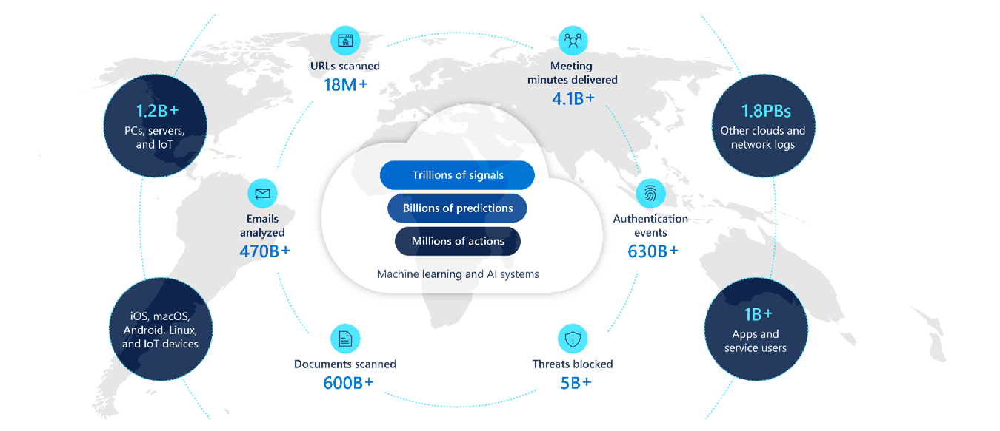
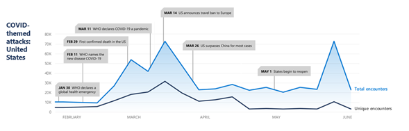
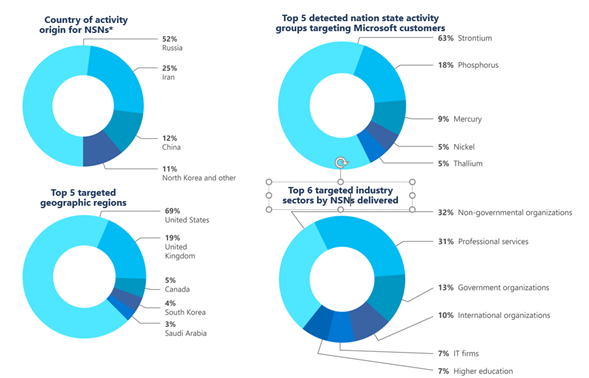
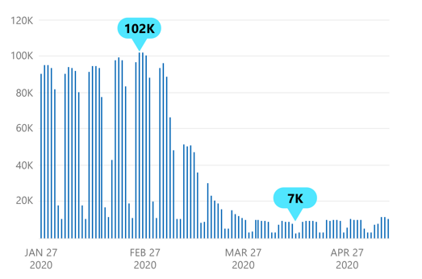
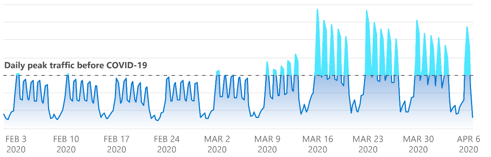
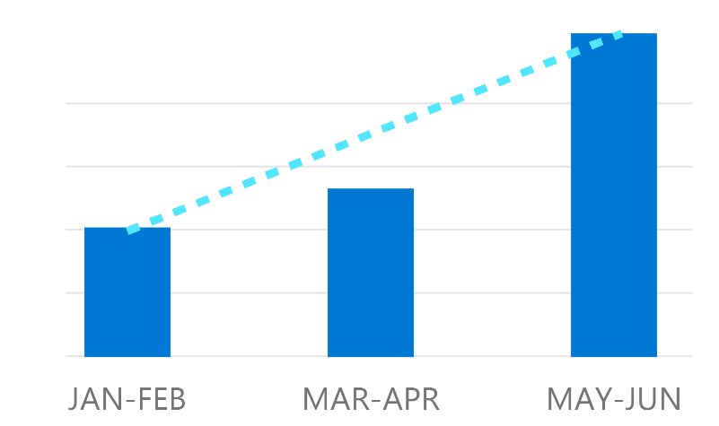
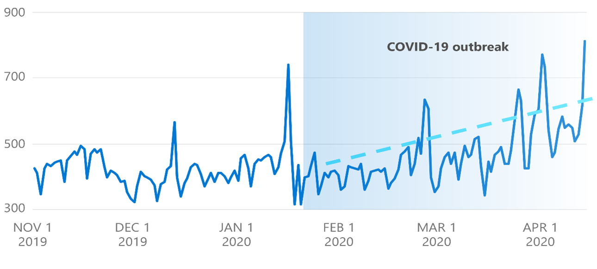

2020 年 9 月マイクロソフトは、昨年のサイバーセキュリティの動向を網羅した「[Microsoft Digital Defense Report](https://aka.ms/DigitalDefense)」と呼ばれる新しい年次報告書を発表しました。

この [Microsoft Digital Defense Report](https://aka.ms/DigitalDefense) は、マイクロソフトが収集している 1 日あたり 8 兆件を超えるセキュリティ シグナルと、77 カ国にまたがる数千人のセキュリティ専門家による知見を取りまとめ、3 つの注目するべきテーマを中心に、脅威の状況を解説し、推奨する対策について提言しています。

既にご覧になった方もいらっしゃるかと思いますが、今回は IT 管理者向けに、このレポートの概要とマイクロソフトが提唱している対策をご紹介します。

#### **(1) サイバー犯罪の状況**

サイバー犯罪者は、犯罪の成功率を上げるために、様々な攻撃のテクニックを進化させることに長けています。数年前までは、サイバー犯罪者は最大の ROI を得るためにマルウェアを利用した攻撃に力を注いでいる様子が見られましたが、最近では、ユーザーの認証情報を盗み出すことを目的としたフィッシング攻撃に焦点を移しています。特に、企業を狙う電子メールを媒体としたフィッシングは拡大を続けており、圧倒的な攻撃手段となっています。最近では、より直接的な手段としてフィッシング攻撃に焦点を移しています。以下のように、フィッシング攻撃キャンペーンの手法に変化が見られます。

1. **クラウド サービスと侵害されたインフラの利用が増加:** フィッシング攻撃の検知率の向上に伴い、クラウドサービスや侵害された電子メールやウェブホスティングのインフラを悪用して、フィッシングキャンペーンを仕掛けるようになってきています。サイバー犯罪者は、よく利用されているクラウド サービス、電子メール送信サービス、ファイル共有サービスなどに身を潜め、検知を回避しようとしています。
2. **急速に変化するキャンペーン**: 検知を回避するために、攻撃キャンペーンに利用する送信ドメイン、メールアドレス、コンテンツ テンプレート、URL ドメインを急速に変化させバリエーションの組み合わせを増やす傾向もみられます。
3. **ペイロード配信メカニズムの継続的な進化**: サイバー犯罪者が、汚染された検索結果と、それらの検索にリンクする正規の URL を使って攻撃を行っている様子が見られました。またサイバー犯罪者が、カスタマイズされた 404 ページを使用して、フィッシング・ペイロードをホストしているケースや、あまり怪しくないサイトをターゲットに提示したり検出を隠すためにキャプチャやその他の回避ツールを使用したりすることで、セキュリティ製品やサービスの検知を逃れようとしているケースも見られました。

**COVID-19 パンデミック**

サイバー犯罪者は、COVID-19 パンデミックのように、社会的に注目されているテーマを利用します。2020 年前半の脅威の状況を分析すると、マルウェアの全体的な量は比較的一定していますが、攻撃者は COVID-19 に対する世界的な関心を利用して、攻撃を展開している様子が見られました。例えば、米国のフィッシング攻撃の状況を分析してみると、世界保健機関 (WHO） が 3 月 11 日に COVID-19 をパンデミックと宣言したことで、COVID-19 をテーマにしたフィッシング攻撃が増加しています。その後、米国内のいくつかの州が活動を再開し始める (5 月 1 日) と、COVID-19 をテーマにしたフィッシング攻撃の遭遇率が減少している様子が確認できました。このように、攻撃者は既知のマルウェアやフィッシングの手法を、社会的なニュースに関連づけて変化させています。

**ランサムウェア \*\***(Ransomware) が大きな脅威\*\*

マイクロソフトの企業顧客向けインシデント検出・対応チーム (DART） が支援したインシデントにおいて、2019 年 10 月から 2020 年 7 月までの間、ランサムウェアに関連するインシデントが最も多かったことが分かっています。多くのインシデントケースでは、Cobalt Strike、MimiKatz、ProcessHacker、LaZagne などのオープンソースのツールが利用され、最終的にランサムウェアのペイロードが配信され、マルウェアは、スピアフィッシングやよく知られたアプリケーションの脆弱性を悪用して配信されていました。

人間が操作するランサムウェア (Human-operated Ransomware) は、攻撃者がまず標的となる企業や組織を選択したうえで、その組織に侵入するための調査を実施し、ランサムを利用した攻撃を行う、というアプローチを取るパターンもありますが、過去 1 年間の大規模なランサムウェア攻撃の多くでは、これは例外的なケースとなっています。この 1 年間の代表的な人間が操作するランサムウェアを利用した攻撃は、攻撃者がインターネット上で大規模かつ広範囲な探索を行うことで脆弱な侵入口を持つ標的を洗い出したうえで、その脆弱な対象に対して効率よく攻撃を行うケースが大多数となっています。

人間が操作するランサムウェアを利用した攻撃キャンペーンは、ツールや最終的に選択するランサムウェア・ペイロードが異なるものの、標的のネットワークに効果的に侵入し、組織のシステム内を横方向に移動し侵入を広げる、というアプローチは共通したものがみられます。また最初の侵入経路は未パッチの脆弱性など様々ですが、ランサムウェアの展開が成功する最大の要因は、サイバー犯罪者が標的組織の高度なシステム権限を持つアカウントの認証情報にアクセスできるようになることです。例えば Active Directory ドメイン管理者のアカウントは Active Directory のポリシーやソフトウェア配布用のファイル共有を利用して、壊滅的なランサムウェアのペイロードを、悪意を持って展開するために使用されることがよくあります。

#### **(2) 国家レベルの脅威の状況**

マイクロソフトでは、お客様を保護するために国家レベルの脅威や攻撃アクターの活動を追跡しています。

お客様 (組織または個人のアカウント所有者) が、マイクロソフトが追跡している国家レベルの脅威アクターによって標的にされたり危険にさらされたりした場合、マイクロソフトはお客様に Nation state notification (NSN) を配信し、お客様の保護に努めています。過去 2 年間で、マイクロソフトは 13,000 件以上の NSN を配信しており、NSN の割合が最も高かったのはロシアで、次いでイラン、中国、北朝鮮、その他の国の活動でした。

国家レベルの脅威アクターのターゲットは、重要インフラ部門が中心だと思われる場合もありますが、マイクロソフトの調査では、重要インフラ以外の組織をターゲットにしている可能性が高く、NSN 通知の 90% 以上がこれらの部門以外の組織に配信されています。

また、国家レベルの脅威アクターの活動は、ほぼすべての産業部門や地理的地域にまたがっている状況も見られました (注意: 当社のインテリジェンスは、当社の製品やプラットフォームが特定の地域や特定の目的でどの程度利用されているかによっても影響を受けます)。またこのような国家レベルの脅威アクターの戦術、技術、および手順がユニークで斬新であることが多く、多くのサイバー犯罪者が、最終的には彼らの手法を踏襲するケースがあります。言い換えれば、国家レベルの脅威アクターの活動で利用されいている戦術に対する保護は、すべての組織と個人にとって非常に重要なのです。このような知見を多くのお客様の保護するための技術に活用しています。

#### **(3) リモートワークとセキュリティ**

COVID-19 パンデミックは、企業における働き方を変化させはじめリモートワークの需要も増加しています。

マイクロソフトでは数年前から柔軟な働き方を推進しており、COVID-19 パンデミックの状況下でも、政府機関の指示が発令されるよりも前に在宅勤務を開始しています。下の図が示すように、通常 100,000 件の社員のオフィス入館が、COVID-19 パンデミックが高まった 3 月末には 7,000 件まで減少しています。多くの従業員は遠隔地で安全かつ十分なインターネットアクセスを確保していれば、生産性を十分に発揮し続けることができ、何よりもパンデミックから自分自身とその家族を守ることができました。この急速な移行を成功させることができたのは、マイクロソフトが以前から推進してきた、ゼロトラストを基調としたアーキテクチャをベースに MFA、デバイス管理、条件付きアクセスなどを実施しているからだと考えています。

図: マイクロソフト社屋の入館数の推移

COVID-19 の影響でオフィスへのアクセスが閉鎖されたり出張が制限されたりしている企業では、ユーザーの認証パターンに変化が見られました。COVID-19 の発生後、在宅勤務のポリシーが制定されたため、MFA 対応のリクエストが約 2 倍に増加しました。多くの組織が MFA の使用を採用して、もはや企業ネットワーク上には依存しない労働力をサポートするようになったため、MFA トラフィックのレベルは上昇の一途をたどっています。

図: MFA 有効化のリクエスト (週別)

同時に Azure Active Directory では、2020 年上半期に企業アカウントに対するブルートフォースを利用した ID ベースの攻撃が増加しました。これらの攻撃から身を守るためには、強力な認証方法が鍵となります。

図: Azure AD アカウントに対するパスワードブルートフォースの試行回数

**DDoS 攻撃の増加**

分散型サービス拒否 (DDoS） 攻撃は、アプリケーションをクラウドに移行する顧客が直面している可用性とセキュリティの最大の問題の 1 つで、リモートワークの大きな懸念材料となっています。この種の攻撃は、時間、リソース、さらには顧客の減少という点でビジネスに多大なコストをもたらします。

組織がアプリケーションをクラウドに移行し続けるにつれ、下の図に示すように、サイバー犯罪者による DDoS 攻撃が増加している様子がみられました。

Azure 上のリソースは、[Azure DDoS Protection](https://docs.microsoft.com/ja-jp/azure/virtual-network/ddos-protection-overview) などを利用し DDoS 攻撃から保護することを推奨しています。

図: COVID-19 発生時の DDoS 攻撃の件数

#### **(4) ベストプラクティス**

COVID-19 への企業の対応は、私たちに多少の運用手順の変更を余儀なくさせただけでなく、対応策や学んだ教訓を説明するために使用するキーワードにも変化が起きています。「拡張したセキュリティの境界」、「パンデミックへの耐性 (レジリエンス)」、「人的インフラ」などのキーワードは、今では世界中の経営陣の分析や取締役会でもよく聞かれるようになっています。今回の脅威レポートで紹介しているようにセキュリティの脅威は変化していますが、脅威の傾向ごとの対策を行うのではなく、どのような攻撃があっても動じない IT 環境を作り維持することが重要です。詳細は、「[攻撃があっても動じない IT 環境の新しいカタチ： Security Posture](https://news.microsoft.com/ja-jp/2020/06/18/200618-it-environment-security-posture/)」をぜひご参照ください。

また今回のレポートでは、マイクロソフトが分析した脅威から得られた知見をもとに、短期で実行可能な 20 のアクションを提案しています。そのうち、特に重要な 5 つを紹介します。

1. [多要素認証](https://www.microsoft.com/ja-jp/security/business/identity/mfa) (MFA) の利用: 多要素認証は、資格情報の窃盗による不正アクセスを大幅に軽減できます。追加要素にアクセスできなければ、攻撃者はアカウントや保護されたリソースにアクセスできません。MFA はすべての管理者アカウントに必ず有効にすることを強く推奨しています。また、そのほかのユーザも有効にし、可能であれば SMS や音声ではなく、認証アプリを使用することをお勧めします。
2. メール システムのセキュリティ衛生状態を良くする: 攻撃の 90% はメールから始まっているため、フィッシング (ボイスメールやテキストベースのもの、Vishing や SMiShing を含む） を防ぐことで、攻撃が成功する機会を制限することができます。適切なメールのフィルタリングとセーフリンクによるクリック時のリンクチェックなど、[Microsoft 365 でのフィッシング対策保護](https://docs.microsoft.com/ja-jp/microsoft-365/security/office-365-security/anti-phishing-protection?view=o365-worldwide)を有効にし、メールの健全性を整えることを推奨しています。
3. セキュリティ更新プログラムの迅速な適用: 特にリモートワークで利用する VPN やリモート デスクトップ サービスなどにある脆弱性が悪用され、組織のシステムに侵入されるケースが増えています。アプリやプラットフォームが、既存の VPN アーキテクチャへのパッチも含めて最新のバージョンを使用していることを確認することが重要です。
4. 最小限の特権でアクセスを制限する: 組織内の特権アカウント[資格情報の適切な保護](https://www.microsoft.com/security/blog/2018/11/29/secure-your-privileged-administrative-accounts-with-a-phased-roadmap/)、[レガシー認証プロトコルをブロック](https://docs.microsoft.com/en-us/azure/active-directory/conditional-access/block-legacy-authentication)することが重要です。ドメイン全体の管理者レベルのサービスアカウントの使用は避けて、最小特権の考えに基づいたアクセスコントロールを推奨します。デバイスのローカルの管理者権限を制限することは、リモートアクセスのトロイの木馬やその他の不要なアプリケーションのインストールを制限するのに役立ちます。
5. ネットワークのセグメンテーション: ネットワークをセグメント化することで、攻撃の広がりを制限し、攻撃速度を緩和するのに役立ちます。

マイクロソフトは、得られた知見を継続的に共有することで、進化する脅威状況をより深く理解し、組織のサイバーセキュリティ体制の改善につなげていただくことを切に願っています。

今回ご紹介した Microsoft Digital Defense Report のフルレポートは、[こちら](https://aka.ms/DigitalDefense)から入手可能です。ぜひご覧になってください。

(お知らせ）

2020 年 10 月 28 日 (水)、29 日 (木) には、日本マイクロソフトが主催するセキュリティイベント [Microsoft Digital Trust Summit 2020](https://www.microsoft.com/ja-jp/biz/security/summit.aspx) が開催されます。本イベントでは、単なる情報資産の保護やリスク回避のためのレガシでサイロ化されたセキュリティ対策から、経営判断をスピーディに反映しサポートできる包括的なセキュリティ ガバナンスへの変革に、マイクロソフトがどうご支援できるか、テクノロジ、ビジネス プロセス、コストなどさまざまな面から、Ignite 2020 で発表された最新の製品情報やお客様事例も交えて、その全容をご紹介します。参加は無償 (事前登録制) です。ぜひ[参加](https://www.microsoft.com/ja-jp/biz/security/summit.aspx)をご検討ください。

垣内ゆりか セキュリティ プログラム マネージャー セキュリティ レスポンス チーム Microsoft

---

参考情報

[Digital Defense Report](https://aka.ms/digitaldefense)

[Microsoft Digital Defense Report 2020: Cyber Threat Sophistication on the Rise](https://www.microsoft.com/security/blog/2020/09/29/microsoft-digital-defense-report-2020-cyber-threat-sophistication-rise/)

[Microsoft report shows increasing sophistication of cyber threats](https://blogs.microsoft.com/on-the-issues/2020/09/29/microsoft-digital-defense-report-cyber-threats/)
