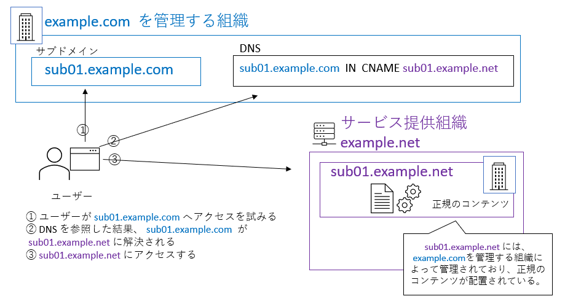
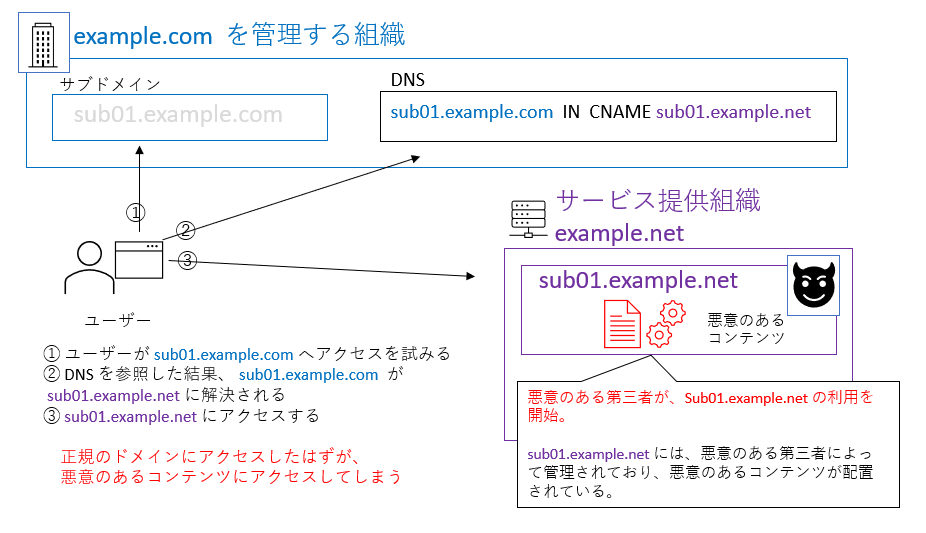
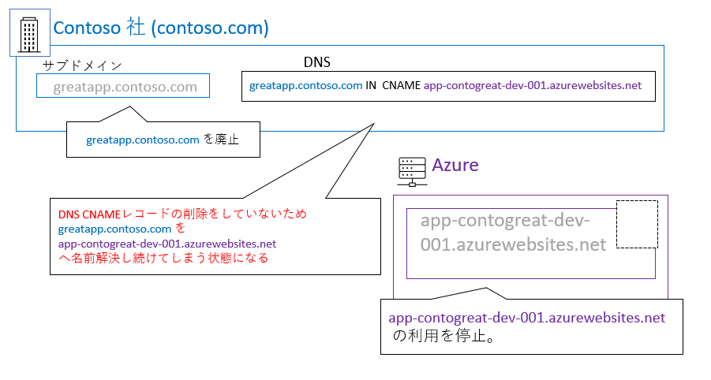
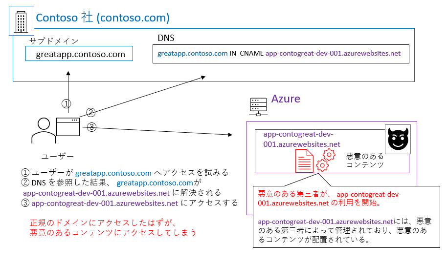

みなさんは、「サブドメイン テイクオーバー」というセキュリティの問題をご存じですか?

サブドメイン テイクオーバーは、以前から存在する一般的なセキュリティの問題ですが、クラウド サービスの利用増加に伴い、特に注意が必要になっています。マイクロソフトのサービスだけに発生する問題ではありませんが、Microsoft Azure を例に挙げながら、サブドメイン テイクオーバーの概要、発生原因と対策について解説したいと思います。

#### **\[1] サブドメイン テイクオーバーとは？**

サブドメイン テイクオーバー (Subdomain Takeover) は、DNS レコードの不適切な管理が要因となって発生するセキュリティの問題です。例えば CDN (Content Delivery Network) サービスなどの外部のサービスを利用する際、自組織が管理するドメインやサブドメインを外部のサービスに名前解決するように、DNS レコードを設定することがあります。これにより自社のドメインにアクセスしてきたユーザーを、自社が契約している外部サービスへと誘導することが可能になります。

この外部サービスの利用を終了する際、本来であれば、外部サービスの契約を解除しサービスを利用不可とさせるだけではなく、設定していた CNAME レコードを削除し、自組織が管理するドメインを外部のサービスに名前解決しないようにしなくてはいけません。そうしないと、自社のドメインにアクセスしてきたユーザーが、利用を停止した外部のサービスにアクセスし続けることになってしまいます。

残念ながら、外部サービスの利用停止の際に DNS レコードの管理ができておらず、ドメインが利用ができない外部サービスを指したままの状態になっているケースが発生しています。そうなると悪意のある第三者が、ここに目を付け、この状態を悪用し、正規のドメインへのアクセスを悪意のある第三者のもとに渡すようにします。これが、サブドメイン テイクオーバーと呼ばれる問題です。

****

**発生シナリオ 例 \*\***(Microsoft Azure)\*\*

サブドメイン テイクオーバーは、以前から存在する一般的なセキュリティの問題です。しかしながら、昨今、CDN サービスや、クラウド サービスの利用増加に伴い、組織のドメインから外部サービスへと誘導する構成が増え、そのためにサブドメイン テイクオーバーの問題が注目されるようになってきました。Microsoft Azure だけに発生する問題ではありませんが、より理解しやすくするために、Microsoft Azure を利用している架空の会社 Contoso 社を例に挙げて説明してみます。

(1) Contoso 社の管理者が、Microsoft Azure 上に app-contogreat-dev-001.azurewebsites.net というウェブサイト リソースを作成する

(2) Contoso 社のサブドメイン ドメイン名 greatapp.contoso.com を、Microsoft Azure 上に作成したリソース (app-contogreat-dev-001.azurewebsites.net) に紐づけるために、CNAME レコードを追加する。

(3) 数か月後、Contoso 社の管理者は、Microsoft Azure 上のウェブサイトを利用を停止することにしたため、Azure のリソース app-contogreat-dev-001.azurewebsites.net を削除。

しかしながら、この時 CNAME レコードを削除し忘れる。CNAME レコードは削除されずに残ったままなので、greatapp.contoso.com は削除済みのリソース (app-contogreat-dev-001.azurewebsites.net) を指したままとなっている状態になる。

(4) 悪意のある第三者が、Microsoft Azure 上のウェブサイトと同名のウェブサイトリソース (app-contogreat-dev-001.azurewebsites.net) を立ち上げてしまう。

(5) greatapp.contoso.com を app-contogreat-dev-001.azurewebsites.net に紐づける CNAME レコードが残存したままの状態になっているため、greatapp.contoso.com へのトラフィックが悪意のある第三者が立ち上げたウェブサイトリソースに行ってしまう。

**サブドメイン テイクオーバーが発生してしまうと\*\***?\*\*

サブドメイン テイクオーバーの問題が発生している場合、正規のドメインへのトラフィックが、悪意のある第三者のもと渡ることになってしまいます。悪意のある第三者はこれを利用して攻撃を行い、例えば以下のような影響をもたらす可能性があります。

・フィッシング詐欺: もし悪意のある第三者のサイトが Contoso 社を装ったフィッシング サイトとなっていた場合、正規の Contoso 社のサイトと信じて greatapp.contoso.com にアクセスしたユーザーは、フィッシングの被害に遭う可能性があります。

・Cookie 窃取: サブドメインから Session Cookie をアクセスが可能となっているウェブアプリも多くあります。正規の Contoso 社を装ったページを用意し、ページを閲覧したユーザーから Cookie を摂取する可能性があります。

#### **\[2] サブドメイン テイクオーバーを防ぐには？（ドメイン管理者側）**

サブドメイン テイクオーバーは、DNS レコードの管理不備に起因して発生します。このため、サブドメイン テイクオーバーを防ぐためには、自組織のドメインに関して、不要になった DNS レコードを速やかに削除し、健全な状態を保つことが必要です。特に外部サービスを利用を終了する場合は、サービスの利用解約やコンテンツの削除に加え、設定した CNAME リソース レコードや A/AAAA レコードも削除するようにします。例えば、サブドメインの利用終了時や外部のサービスの利用終了時、外部リソース削除のプロセスなどに DNS レコード削除に関するプロセスを組み込み、また、開発者・運用者に周知するなど、DNS レコードの削除を正しく IT 運用のプロセスに組み込み、管理を行うことが重要です。

**対策に役立つ機能 \*\***(Microsoft Azure)\*\*

Microsoft Azure では、サブドメイン テイクオーバーの防止に役立つ機能を用意しています。Azure リソースの管理運用に組み入れ、対策に役立ててください。

(1) 自組織の DNS ゾーン内に、不要な DNS レコードが存在していないか確認する

利用していないリソースを指している DNS レコードがないかを確認するために有用な PowerShell スクリプトを提供しています。

<https://aka.ms/DanglingDNSDomains>

この PowerShell スクリプトを使用すると、Azure のサブスクリプションまたはテナントで作成された既存の Azure リソースに CNAME が関連付けられているすべてのドメインを一覧表示できます。もし利用していない Azure リソースを指しているなど、不要な DNS レコードが見つかった場合は、[修復ガイド](https://docs.microsoft.com/ja-jp/azure/security/fundamentals/subdomain-takeover)に従って、リスクを軽減することを推奨します。

(2) 不要な DNS レコードが発生しないよう管理する

サブドメイン テイクオーバーを防ぐためには、自ドメインが指しているリソースの利用が終了したら、速やかに DNS レコードを削除する必要があります。Azure リソースを利用する場合、不要な DNS レコードが残存しないよう、リソースの管理プロセスに組み入れる機能があります。

(2-1) Azure DNS のエイリアス レコードを使用する

従来の DNS ゾーン レコードでは、ターゲットの IP または CNAME が存在しなくなった場合、それに関連付けられている DNS レコードを手動で更新する必要が多く、このために、サブドメイン テイクオーバーの問題が発生するケースがみられます。Azure DNS の[エイリアス レコード](https://docs.microsoft.com/ja-jp/azure/dns/dns-alias)を利用すると、参照されている Azure リソースに関するライフサイクル イベントが発生した場合に DNS レコードが自動的に更新されるようにすることができます。エイリアス レコードを使用して保護できるものには制限がありますが、利用可能なサービスに関しては、可能な限りエイリアス レコードを使用することで、DNS レコードの管理を自動化することをお勧めします。詳細は、[Azure DNS でのエイリアス レコードのお知らせ](https://azure.microsoft.com/ja-jp/blog/announcing-alias-records-for-azure-dns/)を参照してください。

(2-2) Azure App Service のカスタム ドメインの検証を使用する

Azure App Service の DNS エントリを作成する場合は、ドメイン検証 ID を持つ asuid.{subdomain} TXT レコードを作成します。ドメイン検証 ID をカスタム ドメインに追加すると、未解決の DNS エントリが回避され、サブドメインの乗っ取りを防ぐのに役立ちます。これらのレコードによって、他の誰かが CNAME エントリにある同じ名前の Azure App Service を作成することを阻止するわけではありませんが、ドメイン名の所有権を証明することができない第三者が、トラフィックを受信したりコンテンツを制御したりすることはできません。詳細は、[既存のカスタム DNS 名を Azure App Service にマップする](https://docs.microsoft.com/ja-jp/azure/app-service/app-service-web-tutorial-custom-domain)を参照してください。

(2-3) 脅威を軽減するためのプロセスを構築して自動化する

上記の対策が利用できない場合は、サブドメイン テイクオーバーを防止するための手順、検出するための手順、そして万が一被害に遭っている場合の修復手順を確立しておくことを強く推奨します。

(i) 防止手順を作成する:

- リソースを削除するたびにアドレスを再ルーティングするようにアプリケーション開発者に指導します。
- サービスを停止するときに、必要なチェック事項の一覧に "DNS エントリの削除" を含めます。
- カスタム DNS エントリがあるすべてのリソースに対して[削除ロック](https://docs.microsoft.com/ja-jp/azure/azure-resource-manager/management/lock-resources)をかけます。削除ロックは、リソースがプロビジョニング解除される前にマッピングを削除する必要があることを示すインジケーターとして機能します。このような対策は、社内の教育プログラムと組み合わせて初めて機能します。

(ii) 検出手順を作成する:

- DNS レコードを定期的に確認して、サブドメインがすべて以下の Azure リソースにマップされていることを確認します。

  - 存在しているかどうか - DNS ゾーンに対して、\*.azurewebsites.net や \*.cloudapp.azure.com などの Azure サブドメインを指すリソースのクエリを実行します (詳しくは[このリファレンス リスト](https://docs.microsoft.com/ja-jp/azure/security/fundamentals/azure-domains)を参照してください)。
  - 所有者が自分であるかどうか - DNS サブドメインが対象としているすべてのリソースを所有していることを確認します。

- Azure の完全修飾ドメイン名 (FQDN) エンドポイントとアプリケーション所有者のサービス カタログを維持します。サービス カタログをビルドするには、該当の Azure Resource Graph クエリ スクリプトを実行します。このスクリプトからは、アクセスできるリソースの FQDN エンドポイント情報が表示され、それらが CSV ファイルに出力されます。テナントのあらゆるサブスクリプションにアクセスできる場合、このスクリプトでは次のサンプル スクリプトで確認できるように、それらすべてのサブスクリプションが考慮されます。特定のサブスクリプション セットに結果を制限するには、表示されているとおりにスクリプトを編集します。

(iii) 修復手順を作成する:

- 未解決の DNS エントリが見つかった場合、チームは侵害が発生したかどうかを調査する必要があります。
- リソースが使用停止になったときにアドレスが再ルーティングされなかった理由を調査します。
- 使用されなくなった DNS レコードは削除するか、組織が所有する正しい Azure リソース (FQDN) へポイントされるようにします。

#### **\[3] サブドメイン テイクオーバーの被害を避けるには? (利用者側)**

正規のサイトを閲覧しているつもりのユーザーにとっては、そのサイトがサブドメイン テイクオーバーの問題により第三者に “乗っ取られている” 場合、意図せず悪意のあるコンテンツにアクセスしてしまうことになります。昨今のフィッシング詐欺など、サイバー犯罪は巧妙さを増しており、正規のサイトを踏み台にしている場合は特にユーザー自身が、悪意のあるコンテンツかどうかを見分けることは難しくなってきています。

こうした脅威に対抗するため、最新の製品には、ユーザーを悪意のあるコンテンツから守る最新の機能が多く搭載されています。例えば Windows 10 および Microsoft Edge に標準で搭載されている [Windows Defender SmartScreen](https://docs.microsoft.com/ja-jp/windows/security/threat-protection/microsoft-defender-smartscreen/microsoft-defender-smartscreen-overview) では、たとえ正規のサイトであったとしても、サイトに悪意のあるコンテンツが含まれていないか、疑わしい動作の兆候や評判、様々な脅威の情報から機械学習を用いて分析し悪意があると考えられる場合にはブロックします。企業ユーザーであれば Microsoft 365 E5、[Microsoft Defender Advanced Threat Protection](https://docs.microsoft.com/ja-jp/windows/security/threat-protection/microsoft-defender-atp/microsoft-defender-advanced-threat-protection) (ATP) などを利用することで、エンタープライズネットワークで高度な脅威を回避、検出、調査、対策することができます。利用者側としては、利用するデバイスを最新の状態に保ち、最新のセキュリティ機能を活用することが重要です。

**健全な管理体制を**

特に COVID-19 パンデミック以降、クラウドの利用が増えるにつれ、クラウド上の管理の甘い環境を狙われるケースが増加し、攻撃者はそのような環境に目を付けています。運用環境だけではなく、開発環境、テスト環境含め、健全な IT 環境を作り維持することはセキュリティの大事な基本です。不要な DNS レコードの見直しを図るとともに、ぜひ Azure リソースの管理体制、組織のセキュリティ能勢の見直しを行ってみてください。詳細は「[攻撃があっても動じない IT 環境の新しいカタチ： Security Posture](https://news.microsoft.com/ja-jp/2020/06/18/200618-it-environment-security-posture/)」をぜひご参照ください。

垣内ゆりか  
セキュリティ プログラム マネージャー  
セキュリティ レスポンス チーム  
Microsoft

---

参考情報:

Microsoft Azure [未解決の DNS エントリを防ぎ、サブドメインの乗っ取りを回避する](https://docs.microsoft.com/ja-jp/azure/security/fundamentals/subdomain-takeover)

<!-- wp:paragraph -->

<!-- /wp:paragraph -->
