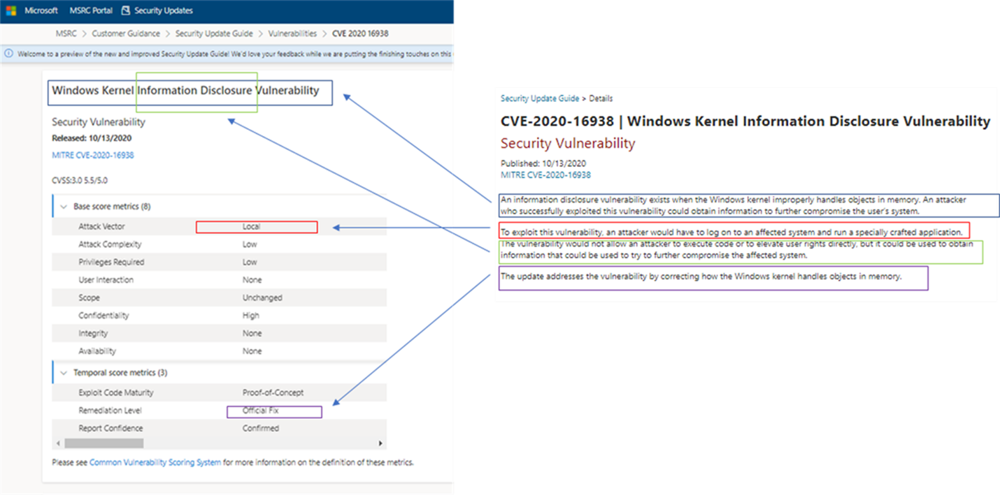
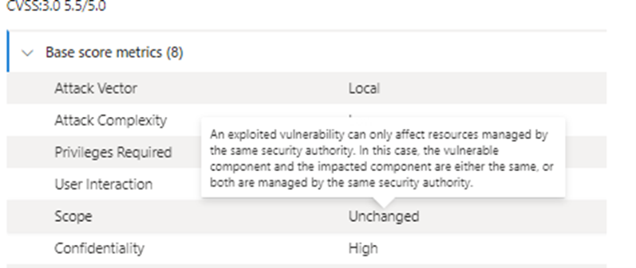
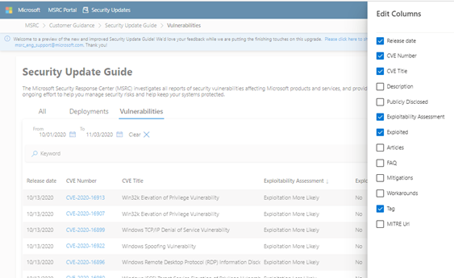
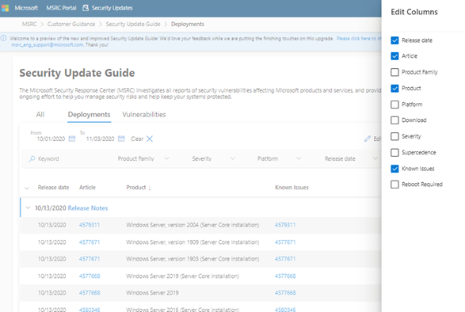
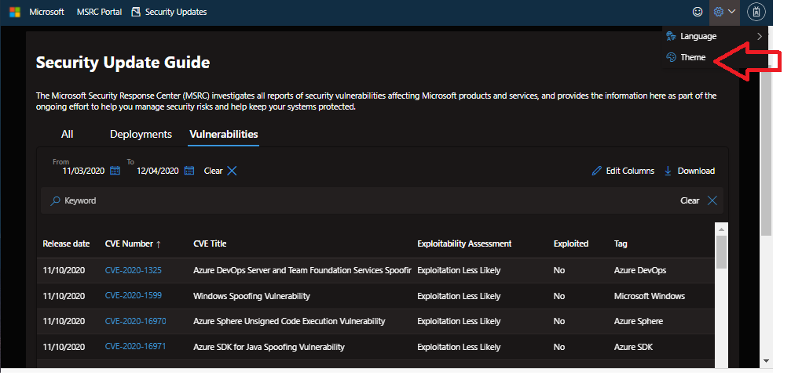

新しいバージョンのセキュリティ更新プログラムについては下記の関連ブログもご覧ください。

「[新しいセキュリティ更新プログラム ガイド (Security Update Guide) を使ってみよう](https://msrc-blog.microsoft.com/2020/12/02/20201203_sugv2_howto/)」

「[\[IT 管理者向け\] CVSS を読み解いて脆弱性をより正しく理解する](https://msrc-blog.microsoft.com/2020/12/16/20201217_cvss/)」

---

「[Vulnerability Descriptions in the New Version of the Security Update Guide](https://msrc-blog.microsoft.com/2020/11/09/vulnerability-descriptions-in-the-new-version-of-the-security-update-guide/)」の日本語抄訳です。

マイクロソフトは新しいバージョンの[セキュリティ更新プログラム ガイド](https://msrc.microsoft.com/update-guide/)を公開しました。新しいセキュリティ更新プログラム ガイドでは、共通脆弱性スコアリング システム (CVSS) を使用して脆弱性情報を表現することにより、業界標準へ対応できるようになっています。CVSS は脆弱性を利用した攻撃の手法や複雑さ、特権を必要とするかどうかなどの属性情報を使って脆弱性情報を正確に表現しています。CVSS についてより詳しく知りたい場合は、情報処理推進機構 (IPA) の [CVSS v3 概要ページ](https://www.ipa.go.jp/security/vuln/CVSSv3.html) (日本語情報)、または[こちらのサイト](https://www.first.org/cvss/specification-document) (英語情報) をご参照ください。また[オンライン トレーニング コース](https://www.first.org/cvss/training) (英語情報) にて CVSS を学習することもできます。Microsoft Security Response Center (MSRC) は 2016 年以降、Windows とブラウザの脆弱性に対して CVSS のスコア評価をしてきました。新しいバージョンのセキュリティ更新プログラムではすべての脆弱性に対して CVSS のスコアを評価し、そのスコアの詳細を確認できるようになっています。

ここから、従来のバージョンと新しいバージョンの比較しながら、新しいバージョンを使うことでのメリットを説明していきます。



(左が新しいバージョン、右が従来のバージョン)

1. CVE タイトルは「Windows カーネルの情報漏えいの脆弱性」となっていて、下記の第一段落を簡潔に表現しています。

“Windows カーネルがメモリ内のオブジェクトを適切に処理しない場合に情報漏えいの脆弱性が存在します。攻撃者がこの脆弱性を悪用した場合、ユーザーのコンピューターをさらに侵害する情報を取得する可能性があります。”

2. 第二段落目は、冒頭で下記のように記載されていましたが、これは CVSS スコアの**攻撃手法**で確認できます。上記の例の場合、「**ローカル \*\***(Local)\*\*」で、攻撃者は影響を受けるシステムにログオンすることを意味しています。二つ目の文章は、情報漏えいの脆弱性であることを説明しています。

“この脆弱性を悪用するには、攻撃者は影響を受けるシステムにログオンして、特別に細工されたアプリケーションを実行する必要があります。”

3. 最後に、下記のように修正したことを記載していますが、これはテンポラル スコア メトリックの**修復レベル**にて確認することができます。

“この更新プログラムは、Windows カーネルがメモリ内のオブジェクトを処理する方法を修正することによりこの脆弱性を解決します。”

今まで脆弱性情報の詳細にて記載していたものは、慣れ親しんだものではありますが、十分な情報を提供できていたわけではありませんでした。CVSS スコアの情報は、より有益な情報を含んでいます。例えば、スコープが「**変更済み\*\*** (Changed)**」であれば、アプリケーション メモリなどが悪用され、その後カーネル メモリといった他の場所に変わる可能性があります。上記の例で、スコープが「**未変更\***\* (Unchanged)**」ではなく「**変更済み\*\*** (Changed)\*\*」であった場合は、スコアは 5.5 から 6.5 に変わります。このように、CVSS スコアは脆弱性を評価するのにとても有益な情報となります。これらの値を変更した際にベース スコアにどのように影響を与えるのかは、[CVSS Calculator](https://www.first.org/cvss/calculator/3.1) を使って確認することができます。

別の例:


(各評価値が CVSS スコアの計算に与える影響)

説明:

- ここでは、攻撃対象が第一段落目で記載のとおり「**ネットワーク**」となっています。SharePoint サーバーがリモート サーバー上でコンテンツをホストしていて、ユーザーがその SharePoint サイトを参照します。
- この脆弱性を悪用するには、攻撃者はコンテンツをサーバーにアップロードする権限が必要となります。管理者ではないアカウントでもコンテンツをアップロードすることができるため、**必要な特権**は「**低\*\*** (Low)**」に設定されています。さらに、悪意のあるコンテンツがアップロードされた後に対象ユーザーはそのコンテンツを操作する必要があるため、**ユーザー操作**は「**必須\***\* (Required)**」に設定されています。第二段落目で記載されている内容に関して付け加えると、従来の記事では対象ユーザーが悪意のあるコンテンツを操作する必要があることを言及していませんでした。しかし、これは CVSS スコアでは表記されています。

この脆弱性情報では、スコープが「**変更済み\*\*** (Changed)\*\*」となっています。脆弱性は SharePoint サーバーに存在しますが、脆弱性を攻撃されると、このサイトを参照したどのシステムも影響を受けます。サーバーは影響を受けませんが、クライアントは影響を受けます。

2020 年 12 月 9 日 追加

新しいバージョンのセキュリティ更新プログラム ガイドを公開して以来、脆弱性情報の詳細に関する多くのフィードバックをいただきました。皆さまからいただいたフィードバックをもとに、悪用コードを作成しやすくするような詳細な情報を掲載しないようにしながらも、お客様にとって有益な情報を提供できる方法として、よく寄せられる質問 (FAQ) に情報を追加しています。

例)

- すべての情報漏えいの脆弱性には、「この脆弱性により、どのような情報が漏えいする可能性がありますか」の FAQ を追加
- Office デスクトップ クライアントの脆弱性には、プレビュー ウィンドウが攻撃対象になりうるかの FAQ を追加
- グループ ポリシーに変更が必要な場合には、それに関する FAQ を追加

CVSS スコアと併せて、各脆弱性情報ページのよく寄せられる質問も確認することをお勧めします。

#### **新しいセキュリティ更新プログラム ガイドでの変更点**

1. スコアの説明の評価値のいずれかにカーソルを合わせると、その定義を確認できるようになりました。

   (各評価値の定義)

2. セキュリティ更新プログラム ガイド API にも変更があり、今回の脆弱性情報の詳細の表記方法を変更したことを反映させるために GitHub 上の [MSRC-Microsoft-Security-Updates-API](https://github.com/microsoft/MSRC-Microsoft-Security-Updates-API) のレポジトリを更新しました。PowerShell にて 2020 年 10 月のデータを表示するレポートを取得するサンプル スクリプトは下記となります。

```
<span style="color: #3366ff">Install-Module</span> <span style="color: #993366">MSRCSecurityUpdates</span> -Force<br><br><span style="color: #3366ff">Import-Module</span> <span style="color: #993366">MSRCSecurityUpdates</span><br><br><span style="color: #339966">Set-MSRCApiKey -Verbose -ApiKey "YourAPIKey"</span><br><br><span style="color: #ff0000">$cvrfDoc</span> = <span style="color: #3366ff">Get-MsrcCvrfDocument</span> -ID <span style="color: #993366">2020-Oct</span><br><br><span style="color: #ff0000">$CVRFDoc</span> | <span style="color: #3366ff">Get-MsrcVulnerabilityReportHtml</span> | <span style="color: #3366ff">Out-File</span> -FilePath <span style="color: #993366">Oct20.html</span>
```

3. 新しいセキュリティ更新プログラム ガイドでの**脆弱性**タブでは、CVE のリストが一覧で表示されますが、ここで表示したい項目を選択することができるようなりました。

   (表示したい項目の選択)

4. **展開**タブでは、**列の編集**で「Known Issues」を選択することで既知の問題を含むサポート技術情報のリストを作ることができるようになりました。

   (サポート技術情報の選択)

5. ダーク モードを選択できることもできます。

(設定の「Theme」でダークモードに変更)

新しいバージョンのセキュリティ更新プログラム ガイドでは、お客様の利用用途に合わせてカスタマイズされた表示に設定できるようになっています。今回の変更が、お客様が脆弱性情報を評価する際の手助けになることを願っています。また新しいセキュリティ更新プログラム ガイドに関して、フィードバックがありましたら、[こちらのフォーム](https://aka.ms/msrc-feedback-sug) (英語) か [msrc_eng_support@microsoft.com](mailto:msrc_eng_support@microsoft.com) (英語) までご連絡ください。

---

\* 2020 年 12 月 9 日: [MSRC Blog](_wp_link_placeholder) の公開に伴い、「よく寄せられる質問」に関する内容を追加しました。

<!-- wp:paragraph -->

<!-- /wp:paragraph -->
