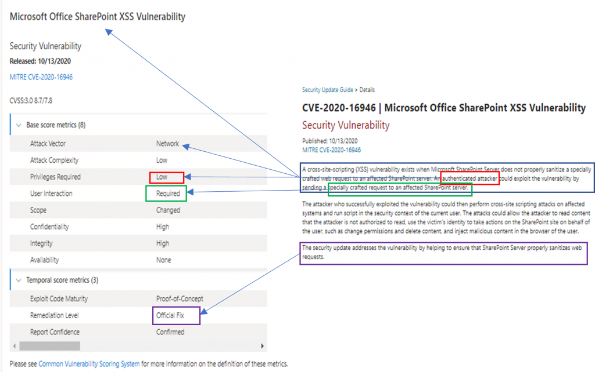

<!-- wp:paragraph -->

With the launch of the new version of the Security Update Guide, Microsoft is demonstrating its commitment to industry standards by describing the vulnerabilities with the Common Vulnerability Scoring System (CVSS). This is a precise method that describes the vulnerability with attributes such as the attack vector, the complexity of the attack, whether an adversary needs certain privileges, etc. You can find more information about CVSS [here](https://www.first.org/cvss/) and even take a short online course [here](https://learning.first.org/courses/course-v1:FIRST+CVSSv3.1+2020/about). The Microsoft Security Response Center has been scoring Windows and Browser vulnerabilities since 2016. Now we are scoring every vulnerability and displaying the details that make up that score in the new version of the [Security Update Guide](https://msrc.microsoft.com/update-guide/).

<!-- /wp:paragraph -->

<!-- wp:paragraph -->

Let me show you a comparison between the old and new article and then you can see how moving to this model has benefits:

<!-- /wp:paragraph -->

<!-- wp:image {"id":12370,"sizeSlug":"large"} -->

_Comparison between the new SUG articles and the previous model_

<!-- /wp:image -->

<!-- wp:list {"ordered":true,"type":"1"} -->

1. You can see that the CVE Title “Window Kernel Information Disclosure Vulnerability” is a more succinct form of the first paragraph: “An information disclosure vulnerability exists when the Windows kernel improperly handles objects in memory. An attacker who successfully exploited this vulnerability could obtain information to further compromise the user’s system”
2. The second paragraph starts out with: “To exploit this vulnerability, an attacker would have to log on to an affected system and run a specially crafted application”. This is the described in the first element of the CVSS score “Attack Vector”. In this case it is local which is equivalent to “log on to affected system”. The second sentence just reiterates that it is an Information Disclosure.
3. The conclusion is that we’ve fixed it “The update addresses the vulnerability by correcting how the Windows kernel handles objects in memory.” This information is also in the CVSS scoring in the Remediation Level element.

<!-- /wp:list -->

<!-- wp:paragraph -->

So, you see? There wasn’t much to the three paragraph descriptions, though they were comforting. The information in the CVSS score contains all sorts of more useful information. For example, if the scope is **Changed**, it means that the exploit can start in one place, say application memory, and jump to another place like the kernel memory. If the **Scope** value in the example above was **Changed** instead of **Unchanged**, the score would move from 5.5 to 6.5. So, you can use the score to assess the risk of the vulnerability. You can use the [CVSS Calculator](https://www.first.org/cvss/calculator/3.1) to see what effect changing these values does to the base score.

<!-- /wp:paragraph -->

<!-- wp:paragraph -->

Another example:

<!-- /wp:paragraph -->

<!-- wp:image {"id":12371,"sizeSlug":"large"} -->

_Understanding which variables in the SUG reports influence how CVSS scores are calculated_

<!-- /wp:image -->

<!-- wp:list {"type":"1"} -->

- Here:

  - We can see that the attack vector is listed as **Network** which is detailed in paragraph One. SharePoint Server is hosting content on a remote server, and users browse to the SharePoint site.

  - To exploit this vulnerability, the attacker will need permission to upload content to the server. A non-administrator account is capable of uploading content, so **Privileges Required** is set to **Low**. Additionally, a targeted user needs to interact with the malicious content once it has been uploaded, hence **User Interaction** is set to **Required**. One thing to note is that in paragraph Two, this article didn’t specifically call out the need for a targeted user to interact with the malicious content; however, this is represented in the CVSS score.

- This vulnerability also demonstrates a situation where the **Scope** would be marked as **Changed**. The vulnerable condition exists on the SharePoint Server, but the vulnerability results in the exploit affecting any system that browses to the site. The server is unaffected, but the client is impacted!

<!-- /wp:list -->

<!-- wp:paragraph -->

<!-- /wp:paragraph -->

<!-- wp:group -->

<!-- wp:paragraph {"fontSize":"medium"} -->

**Fun Facts in the new version of the Security Update Guide**

<!-- /wp:paragraph -->

<!-- wp:group -->

<!-- wp:group -->

<!-- wp:paragraph -->

1\. You can hover over any of the elements in the score description to see the definition of that element:

<!-- /wp:paragraph -->

<!-- wp:image {"align":"center","id":12373,"sizeSlug":"large"} -->

_Hovering over elements in the score description for a definition of the element_

<!-- /wp:image -->

<!-- wp:paragraph -->

2\. For those of you who like to use the API to download the security updates information, you will be happy to know that we’ve updated the scripts in the [MSRC-Microsoft-Security-Updates-API](https://github.com/microsoft/MSRC-Microsoft-Security-Updates-API) Repository on GitHub to reflect the change to the vulnerability descriptions. Here is how you get a report showing a month’s worth of data in a PowerShell environment.

<!-- /wp:paragraph -->

<!-- wp:group -->

<!-- wp:paragraph {"style":{"typography":{"fontSize":14}}} -->

`Install-Module MSRCSecurityUpdates-Force Import-Module MSRCSecurityUpdates Set-MSRCApiKey -Verbose -ApiKey "YourAPIKey" $cvrfDoc=Get-MsrcCvrfDocument-ID 2020-Oct $CVRFDoc | Get-MsrcVulnerabilityReportHtml | Out-File -FilePath Oct20.html`

<!-- /wp:paragraph -->

<!-- wp:paragraph -->

3\. The **Vulnerabilities **tab on the new Security Update Guide shows you a list of CVEs, and you can choose what columns you want to see!

<!-- /wp:paragraph -->

<!-- /wp:group -->

<!-- wp:image {"align":"center","id":12374,"sizeSlug":"large"} -->

_Select all or only the columns you need - the choice is yours!_

<!-- /wp:image -->

<!-- wp:paragraph -->

4\. You can create a list of KB articles that have Known Issues by using the **Edit Column** feature on the new **Deployments **tab.

<!-- /wp:paragraph -->

<!-- /wp:group -->

<!-- wp:image {"align":"center","id":12375,"sizeSlug":"large"} -->

_Customize your KB articles by selecting all or only the columns you need._

<!-- /wp:image -->

<!-- wp:paragraph -->

5\. Did you notice that you can go into Dark Mode?

<!-- /wp:paragraph -->

<!-- /wp:group -->

<!-- wp:image {"align":"center","id":12376,"sizeSlug":"large"} -->

_Enable Dark Mode by clicking on "theme" in the Settings menu (the cog icon_).

<!-- /wp:image -->

<!-- wp:paragraph -->

We hope that you enjoy finding your way around the new Security Update Guide. Please let us know what you think about it [here](https://aka.ms/msrc-feedback-sug) or by emailing us at [msrc_eng_support@microsoft.com](mailto:msrc_eng_support@microsoft.com).

<!-- /wp:paragraph -->

<!-- /wp:group -->

<!-- wp:paragraph -->

\_Lisa Olson, Senior Security Program Manager, \_Microsoft Security Response Center\_\_

<!-- /wp:paragraph -->
