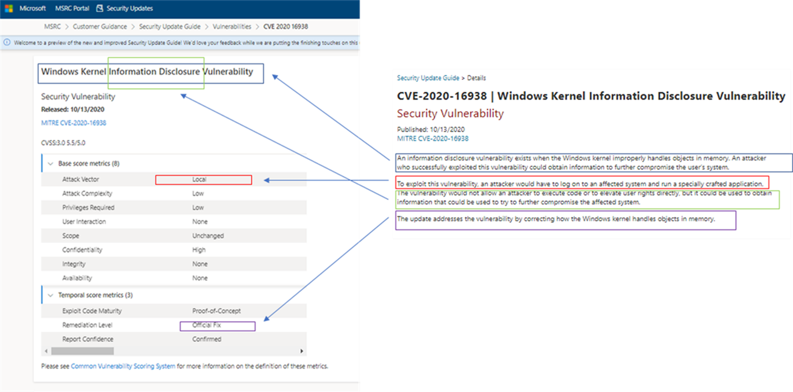
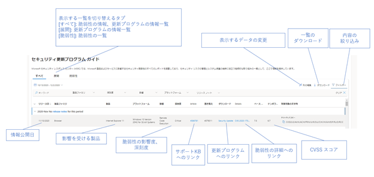

新しいバージョンのセキュリティ更新プログラムについては下記の関連ブログもご覧ください。

「[新しいセキュリティ更新プログラム ガイドでの脆弱性情報の詳細](https://msrc-blog.microsoft.com/2020/11/09/20201110_sugv2/)」

「[\[IT 管理者向け\] CVSS を読み解いて脆弱性をより正しく理解する](https://msrc-blog.microsoft.com/2020/12/16/20201217_cvss/)」

---

2020 年 11 月より、セキュリティ更新プログラム ガイドポータルがリニューアルしました。

すでに新しいサイトをご利用いただいている方も多いかと思いますが、「まだ慣れていない」「初めてこのポータルを知った」という方もいらっしゃると思います。そこで今回は、リニューアル後のセキュリティ更新プログラム ガイドの基本的な使い方をご紹介します。

#### **セキュリティ更新プログラム ガイドとは？**

セキュリティ更新プログラム ガイドは、マイクロソフトの製品やサービスの脆弱性およびセキュリティ更新プログラムに関する情報を提供するポータルサイトです。脆弱性の詳細、セキュリティ更新プログラムを公開した製品、セキュリティ更新プログラムに関する主な注意事項、追加情報が記載された脆弱性情報 (CVE) ならびにその一覧、そして、既知の問題が確認されているセキュリティ更新プログラムの一覧が記載されています。脆弱性の存在する製品や公開日付の期間などでフィルタリングをしたり、CVE 番号などのキーワードで検索したりすることも可能です。

---

**脆弱性の情報ページ**

各脆弱性の情報ページでは、脆弱性の詳細が記載されています。

**・\*\***CVSS スコア\*\*

セキュリティ更新プログラム ガイドでは、共通脆弱性スコアリング システム (CVSS) を使用して脆弱性情報を表現することにより、業界標準へ対応できるようになっています。スコアの説明の評価値のいずれかにカーソルを合わせると、その定義を確認することができます。

**・悪用可能性**

セキュリティ更新プログラムを公開するよりも前に、脆弱性の詳細が一般に公開されていたか、悪用がおこなわれていたかを示します。また、マイクロソフトでは、脆弱性の悪用がどの程度容易に行えるのかについて独自の指標「[悪用可能性評価](https://www.microsoft.com/msrc/exploitability-index)」を用いて評価しています。それぞれの脆弱性について、セキュリティ更新プログラムを公開した時点における悪用可能性指標を示しています。

**・謝辞**

マイクロソフトでは、協調的な脆弱性の公開を推進しており、脆弱性報奨金プログラムなどを通じて広く脆弱性の情報を受け付けています。この項目では、脆弱性の発見にご協力いただいた個人・団体への謝辞を示しています。

**・よく寄せられる質問**

脆弱性に関して、CVSS スコアでは説明することができない追加の情報がある場合は、「よく寄せられる質問」に記載されています。例えば、特定の設定を有効にしている場合のみ影響を受ける場合、更新プログラムが通常の Windows Update 配信メカニズム以外の方法で提供されている場合、更新プログラムを適用後に実施するべき作業がある場合などです。

**・セキュリティ更新プログラム**

脆弱性を修正するセキュリティ更新プログラムの一覧を示しています。

#### **API で取得したい**

セキュリティ更新プログラム ガイドポータルで公開している情報は、ポータルサイト上で閲覧する以外に、API を利用して業界標準の CVRF 形式でデータを引き出すことが可能です。

データを取得するために必要な API キーやサンプルプログラムは、[GitHub のセキュリティ更新プログラム ガイド プロジェクト](https://github.com/Microsoft/MSRC-Microsoft-Security-Updates-API) (英語情報) を参照してください。また API を使用してセキュリティ更新プログラムのデータを取得する方法や、取得したデータを Excel ファイルに取り込んで加工する方法を動画で説明しています。こちらも併せて参考にしてください。

・\[動画] [GitHub 上のセキュリティ更新プログラム API の情報の見方](https://aka.ms/SUGAPIdemo1_J)  
・\[動画] [セキュリティ更新プログラム API のアクセス方法](https://aka.ms/SUGAPIdemo2_J)  
・\[動画] [月例のセキュリティ更新プログラムの概要を HTML ファイルで取得す方法](https://aka.ms/SUGAPIdemo3_J)  
・\[動画] [セキュリティ更新プログラムの情報を Excel ファイルへエクスポートする方法](https://aka.ms/SUGAPIdemo4_J)  
・\[動画] [Excel で CVE リストを取得する方法](https://aka.ms/SUGAPIdemo5_J)  
・\[動画] [Excel で KB リストを取得する方法](https://aka.ms/SUGAPIdemo6_J)

垣内ゆりか  
セキュリティ プログラム マネージャー  
セキュリティ レスポンス チーム  
Microsoft

---

**補足事項**

セキュリティ更新プログラム ガイド ポータルは、フィードバックを受けて改良を継続しています。今後、デザインや機能が更新される可能性があります。

**関連ブログ**

[新しいセキュリティ更新プログラム ガイドでの脆弱性情報の詳細 – Microsoft Security Response Center](https://msrc-blog.microsoft.com/2020/11/09/20201110_sugv2/)

[New and improved Security Update Guide! – Microsoft Security Response Center](https://msrc-blog.microsoft.com/2020/09/21/new-and-improved-security-update-guide/)

<!-- wp:paragraph -->

<!-- /wp:paragraph -->
