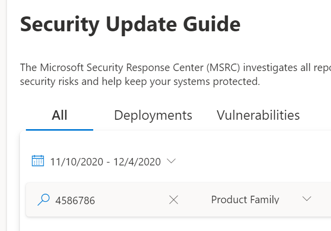
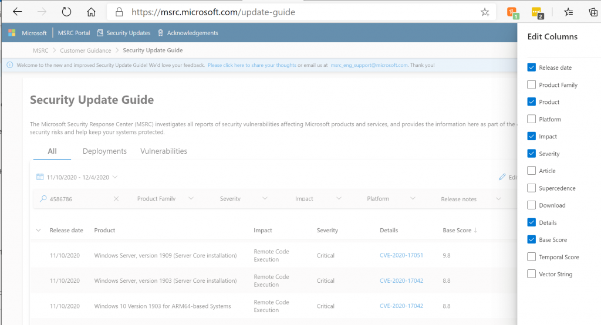
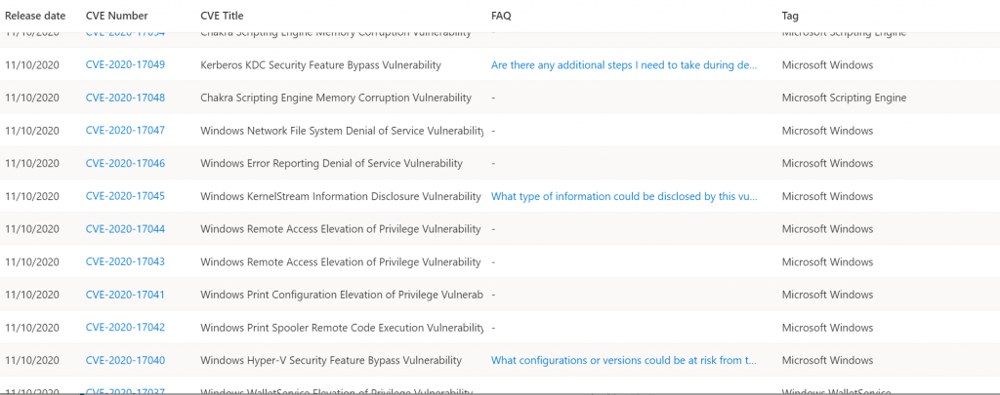

<!-- wp:paragraph -->

Hi Folks,

<!-- /wp:paragraph -->

<!-- wp:paragraph -->

We want to continue to highlight changes we’ve made to our Security Update Guide. We have received a lot of feedback, much of which has been very positive. We acknowledge there have been some stability problems and we are actively working through reports of older browsers not being able to run the new application. We really appreciate your feedback as we review these issues.

<!-- /wp:paragraph -->

<!-- wp:paragraph -->

We've heard frustrations over the removal of the previous _Executive Summary_ section and we particularly appreciate specific examples of CVEs which needed more details in order to properly perform risk analysis on the more complex vulnerabilities. This change reflects our intentional efforts to add more information to the Frequently Asked Questions (FAQs) for certain types of CVEs over the last several years, for example:

<!-- /wp:paragraph -->

<!-- wp:list -->

- For _Information Disclosure vulnerabilities_, we incorporate “What type of information might be disclosed?”
- _Office Desktop_ _application vulnerabilities_ include possible Preview Pane attack vectors
- If a\_ Group Policy \_needs to be adjusted, the FAQ reflects that.

<!-- /wp:list -->

<!-- wp:paragraph -->

These FAQ content examples are a result of your direct feedback. Some are generated systemically for certain common types of vulnerabilities, while others are manually created for particularly unusual CVEs. We feel this strikes a good balance between providing our customers useful and actionable information while not describing the vulnerability in such detail that helps our adversaries build an exploit.

<!-- /wp:paragraph -->

<!-- wp:paragraph -->

In the Security Update Guide updated design, we focus on features which provide the ability to tailor the information for a specific user's function. We now offer three different views:

<!-- /wp:paragraph -->

<!-- wp:image {"align":"center","id":12416,"width":498,"height":349,"sizeSlug":"large","className":"is-style-default"} -->

<!-- /wp:image -->

<!-- wp:list -->

- **All: **A general view that shows **All** available information
- **Deployments**: The best view for people who are responsible for **deploy**ing updates into their environment.
- **Vulnerabilities**: This view focuses on the **vulnerabilities** and relevant information associated with each.

<!-- /wp:list -->

<!-- wp:paragraph -->

Looking more closely, each of the tabs allows you to choose which columns are displayed, and can be exported as a spreadsheet.

<!-- /wp:paragraph -->

<!-- wp:image {"id":12418,"sizeSlug":"large"} -->

<!-- /wp:image -->

<!-- wp:paragraph -->

The “**All**” tab has access to all of the different data items and you can further filter by changing column options with the **Edit Columns** pane. So, for example, if you want to see the CVEs sorted by the highest CVSS base score first, you can choose to add Base Score to the grid and sort by that column.

<!-- /wp:paragraph -->

<!-- wp:paragraph -->

The second tab is designed with the **Deployment **team in mind, where CVE information is less important. The Edit Column on this tab allows you to get a unique list of packages for the month by unselecting the Product and Platform columns. This list can be exported to Excel to setup a deployment schedule.

<!-- /wp:paragraph -->

<!-- wp:paragraph -->

The **Vulnerabilities** tab puts focus on the CVEs, front and center. Here, the Edit Column include options like links to FAQs, Articles, mitigations and workarounds.

<!-- /wp:paragraph -->

<!-- wp:image {"id":12417,"sizeSlug":"large"} -->

<!-- /wp:image -->

<!-- wp:paragraph -->

We realized that many _Executive Summaries_ reused content which has become stale and aren’t particularly actionable, feedback indicates they aren't often read. In every Update Tuesday, there are specific vulnerabilities which are tricky and need more information which Executive Summaries contain. That’s why we replaced the _Executive Summaries_ with the more comprehensive CVSS scores, alongside the launch of the more flexible Security Update Guide. As the Security Update Guide now includes scoring for all CVEs, sort entries by highest severity then drill down into the provided articles for more information.

<!-- /wp:paragraph -->

<!-- wp:paragraph -->

For example, let’s take three complex CVEs from November 2020:

<!-- /wp:paragraph -->

<!-- wp:list -->

- The FAQ for [CVE-2020-17040](https://msrc.microsoft.com/update-guide/vulnerability/CVE-2020-17040) describes the attack vector and configurations for this vulnerability
- [CVE-2020-17049 ](https://msrc.microsoft.com/update-guide/vulnerability/CVE-2020-17049)raised a bunch of questions post release. We decided that an executive summary might help in this case so we added one. We also added to the list of questions in the FAQ.
- [CVE-2020-](https://nam06.safelinks.protection.outlook.com/?url=https%3A%2F%2Fmsrc.microsoft.com%2Fupdate-guide%2Fvulnerability%2FCVE-2020-17051&data=04%7C01%7Celolson%40microsoft.com%7Cb47865ae4f57475961f708d897df9752%7C72f988bf86f141af91ab2d7cd011db47%7C1%7C1%7C637426333856098795%7CUnknown%7CTWFpbGZsb3d8eyJWIjoiMC4wLjAwMDAiLCJQIjoiV2luMzIiLCJBTiI6Ik1haWwiLCJXVCI6Mn0%3D%7C1000&sdata=06EyxX5Y7DH5YLhDzwCGDUXCvLvc5UQ00OfpvSgbMwM%3D&reserved=0)[17051](https://msrc.microsoft.com/update-guide/vulnerability/CVE-2020-17051) has an FAQ that lists the Frequently Asked Questions that we've received.

<!-- /wp:list -->

<!-- wp:paragraph -->

These changes create a platform that meet different needs across a wide range of users. Please continue to share your constructive feedback to help us make it even better!

<!-- /wp:paragraph -->

<!-- wp:paragraph -->

\_Lisa Olson, Senior Security Program Manager, \_Microsoft Security Response Center\_\_

<!-- /wp:paragraph -->
