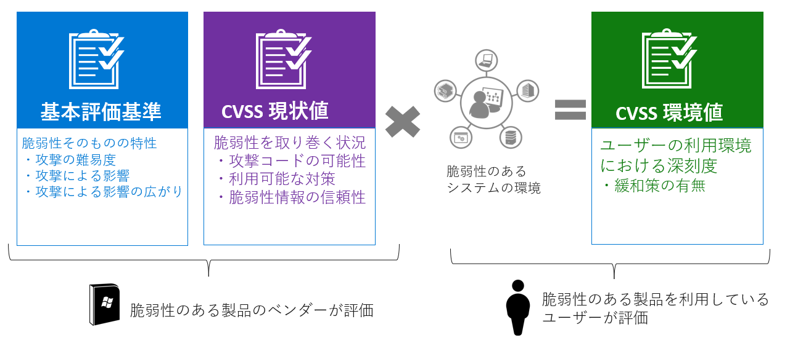
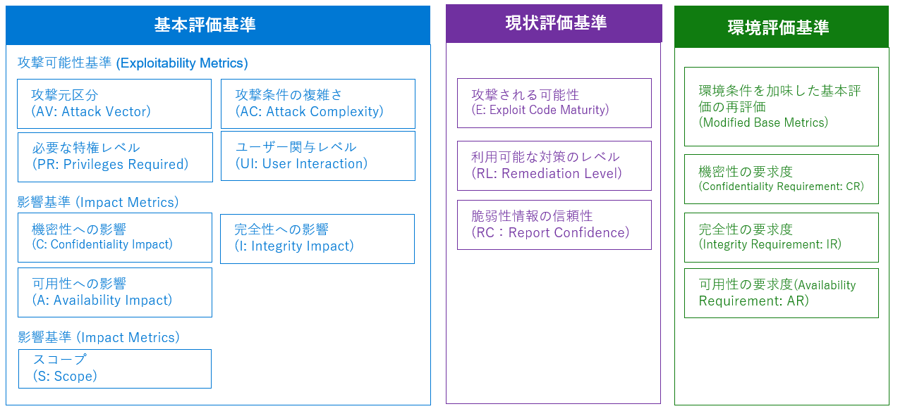
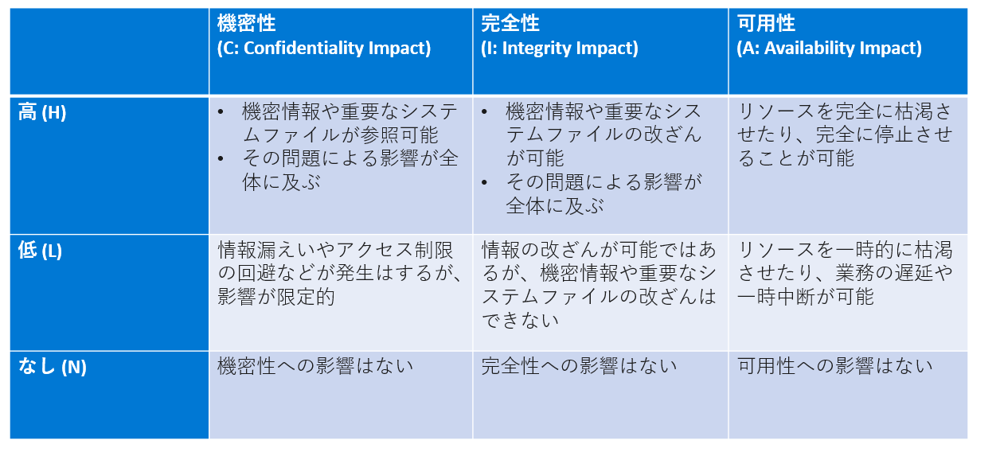
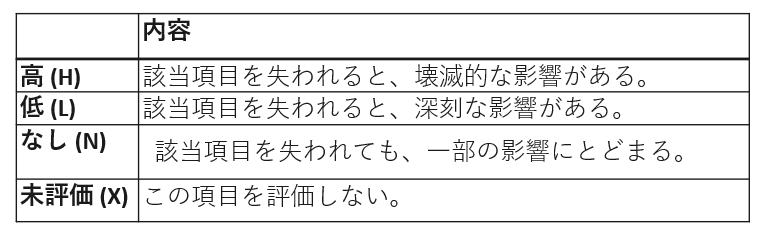
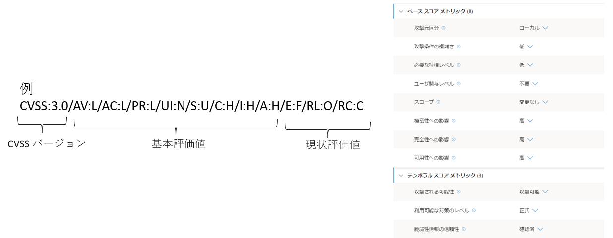
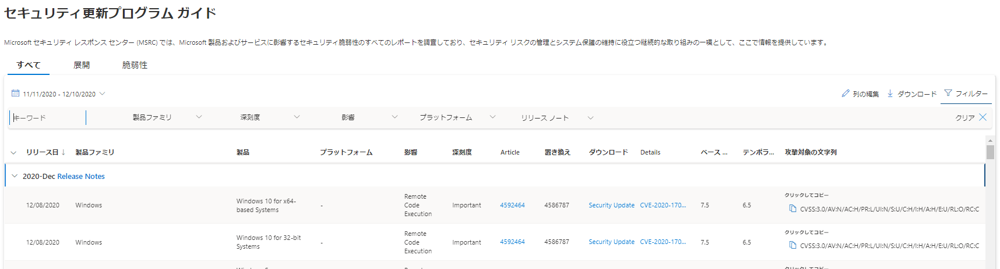
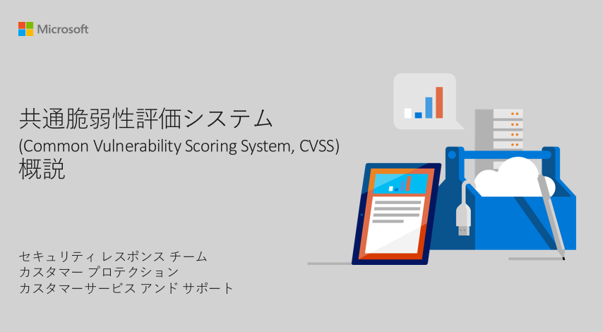

新しいバージョンのセキュリティ更新プログラムについては下記の関連ブログもご覧ください。

「[新しいセキュリティ更新プログラム ガイドでの脆弱性情報の詳細](https://msrc-blog.microsoft.com/2020/11/09/20201110_sugv2/)」

「[新しいセキュリティ更新プログラム ガイド (Security Update Guide) を使ってみよう](https://msrc-blog.microsoft.com/2020/12/02/20201203_sugv2_howto/)」

---

2020 年 11 月からは、マイクロソフトではすべての製品の脆弱性について共通脆弱性スコアリング システム (CVSS) で評価を行い、評価値の公開を開始しました。CVSS はセキュリティ業界標準の脆弱性の重要度を図る仕組みです。2016 年以降、Windows とブラウザの脆弱性に対して CVSS のスコア評価をしてきました。新しいバージョンのセキュリティ更新プログラム ガイドではすべての脆弱性に対して CVSS のスコアを評価し、そのスコアの詳細を確認できるようになっています。これにより、ユーザーの皆様にとっては、ベンダーに依存しない統一した基準で、脆弱性を評価、管理がしやすくなることが期待されます。

一方で、CVSS に馴染みがなかったユーザーの皆さまにとっては、CVSS をどのように読み解けばよいのか、戸惑うこともあるかもしれません。そこで、今回はマイクロソフトの製品における脆弱性を例に挙げながら、CVSS の示す内容を紹介します (現在、マイクロソフトでは CVSS 3.0 による評価を実施しています。このため、ここでは、CVSS 3.0 に基づいて紹介します)。

### **CVSS とは？**

CVSS 共通脆弱性評価システム (Common Vulnerability Scoring System) とは、セキュリティ脆弱性の深刻度を評価するための標準化されたシステムです。現在は [FIRST](https://www.first.org/) (Forum of Incident Response and Security Teams) が管理しています。CVSS は標準化されているため、ベンダーに依存せず、異なった製品間の脆弱性を比較することが容易になります。また規格は一般に公開されており、誰でも CVSS の評価システムの仕組みを確認、利用することができます。

- [CVSS v3.1 Specification Document (first.org)](https://www.first.org/cvss/specification-document)
- [CVSS v3.1 User Guide (first.org)](https://www.first.org/cvss/user-guide)
- [共通脆弱性評価システム](https://www.ipa.go.jp/security/vuln/CVSSv3.html)[CVSS v3](https://www.ipa.go.jp/security/vuln/CVSSv3.html)[概説：](https://www.ipa.go.jp/security/vuln/CVSSv3.html)[IPA ](https://www.ipa.go.jp/security/vuln/CVSSv3.html)[独立行政法人 情報処理推進機構](https://www.ipa.go.jp/security/vuln/CVSSv3.html)

### **CVSS 評価基準**

CVSS には、3 つの異なる評価基準があり、0.0 から 10.0 までの範囲で値が算出されます。**基本評価基準 \*\***(Base Metrics) **では、脆弱性そのものの特性を評価し、**CVSS 基本値** (CVSS Base Score) が算出されます。現状評価基準 (Temporal Metrics) では、脆弱性をとりまく状況を評価し、**CVSS 現状値 **(Temporal Score) が算出されます。**環境評価基準\*\* (Environmental Metrics) では、脆弱性を利用する環境における重要度を評価し、CVSS 環境値 (Environmental Score) が算出されます。

各評価基準では、複数の項目を評価し CVSS 値が算出されます。値の計算方法は複雑ですが、CVSS 計算ツールが公開されており、簡単に値を算出することができます。

FIRST

- - [Common Vulnerability Scoring System Version 3.1 Calculator](https://www.first.org/cvss/calculator/3.1)
  - [Common Vulnerability Scoring System Version 3.0 Calculator](https://www.first.org/cvss/calculator/3.0)

### **基本評価基準\*\***/基本値 (Base Score)\*\*

基本評価基準 (Base Metrics) では、脆弱性そのものの特性を評価し、CVSS 基本値 (CVSS Base Score) が算出されます。

#### **攻撃元区分 \*\***(AV: Attack Vector)\*\*

脆弱性のあるコンポーネントが、どこから攻撃可能であるかを評価します。

- ネットワーク (N): インターネットなどネットワーク経由でリモートから攻撃可能。

(例) インターネット経由でアクセス可能な標的のシステム/ポートに、特別に細工されたリクエストを送信する

(例) 特別に細工されたウェブサイトにアクセスすると、任意のコードが実行される

- 隣接 (A): ローカル IP サブネット内、Bluetooth など、隣接するネットワークから攻撃する必要がある

(例) 特別に細工されたパケットを、同一のローカルサブネットから送信する

(例) Hyper-V にて、ゲスト オペレーティング システム上で特別に細工されたコードを実行すると、ホスト オペレーティング システム上で任意のコードが実行できる

- ローカル (L): ローカル環境から攻撃をする必要がある

(例) 特別に細工されたアプリケーションを標的のシステム上で実行する

(例) 特別に細工されたファイルを標的のシステム上のアプリで開く

- 物理 (P): 物理アクセス環境から攻撃する必要がある

(例) 標的のシステムに物理的にアクセスし、USB メディアを挿入し起動操作により攻撃する

(例) 標的のシステムに物理的にアクセスし、設定を変更する必要がある

#### **攻撃条件の複雑さ \*\***(AC: Attack Complexity)\*\*

脆弱性のあるコンポーネントを攻撃する際に必要な条件の複雑さを評価します。

- 低 (L): 特別な攻撃条件を必要とせず、対象コンポーネントを常に攻撃可能

(例) 特別に細工されたパケットを送信することで攻撃が成立する (特定の情報や認証の必要なし)

- 高 (H): 攻撃の前に入手する必要のある情報や、攻撃を成功させるための環境条件など、攻撃者以外に依存する攻撃条件が存在する

(例) 攻撃者は、事前に標的からの通信を傍受し、攻撃に必要な情報を入手しておく必要がある

(例) 脆弱性の悪用には、事前に特定の設定を、既定の値から変更しておく必要がある

(例) 脆弱性の悪用は、特定の処理タイミングが発生した場合にのみ成功する

#### **必要な特権レベル \*\***(PR: Privileges Required)\*\*

脆弱性のあるコンポーネントを攻撃する際に必要な特権のレベルを評価します。

- 不要 (N): 特別な権限を有する必要はない

(例) 特別に細工されたパケットを送信することで攻撃が成立する (特定の情報や認証の必要なし)

- 低 (L): コンポーネントに対する基本的な権限を有していれば良い

(例) 一般ユーザー権限で、悪意のあるコードを実行することで攻撃が成立する

- 高 (H): コンポーネントに対する秘密情報へのアクセスする権限や管理者権限相当を有する必要がある

(例) 攻撃の実行にはシステム権限や管理者権限が必要

(例) 攻撃の実行には Active Directory の管理者権限が必要

(例) 攻撃の実行にはサーバーの特定のフォルダを閲覧する権限が必要

#### **ユーザ関与レベル \*\***(UI: User Interaction)\*\*

脆弱性のあるコンポーネントを攻撃する際に必要なユーザ関与レベルを評価します。

- 不要 (N): 攻撃が成功するために必要なユーザー操作はない

(例) 特別に細工されたリクエストを送信することで攻撃が成立する

(例) 悪意のあるファイルをプレビュー画面で閲覧するだけで攻撃が成立する

- 要 (R): 攻撃が成功するためには、ユーザーの操作が必要

(例) 攻撃者の用意したリンクをクリックし、サイトへ接続させる必要がある

(例) 攻撃者の用意したサーバーへ接続させる必要がある

(例) 標的となるユーザーに悪意のあるファイルをアプリケーションで開かせる必要がある

#### **影響基準**

脆弱性が攻撃された場合の機密性、完全性、可用性への影響を評価します。

#### **スコープ\*\*** (S: Scope)\*\*

脆弱性のあるコンポーネントへの攻撃による影響範囲を評価します。

- 変更あり (C): 影響範囲が脆弱性のあるコンポーネントの帰属するオーソリゼーションスコープ以外にも広がる可能性がある

(例) クロスサイト スクリプティング (XSS) Web アプリケーションの脆弱性がクライアント環境 (ブラウザなど) に影響を与える

(例) 仮想環境: 仮想マシンがホストに影響を与える

(例) 特権昇格: 低い特権レベルで動作しているプログラムが任意のコードを高い特権レベルで実行できる

(例) サンドボックス バイパス: サンドボックス内で実行されたコードがサンドボックス外へ影響を及ぼす

- 変更なし (U): 影響範囲が脆弱性のあるコンポーネントの帰属するオーソリゼーションスコープに留まる

(例) 攻撃が成功した場合、攻撃コードを実行したユーザー権限内でのみ任意のコードを実行できる

### **現状評価基準\*\***/現状値 (Temporal Score)\*\*

現状評価基準 (Temporal Metrics) では、脆弱性をとりまく状況を評価し、CVSS 現状値 (Temporal Score) が算出されます。

#### **攻撃される可能性\*\*** (E: Exploit Code Maturity)\*\*

- 容易に攻撃可能 (H): 攻撃コードがいかなる状況でも利用可能である。攻撃コードを必要とせず、攻撃可能である。
- 攻撃可能 (F): 攻撃コードが存在し、ほとんどの状況で使用可能である。
- 実証可能 (P): 実証コードが存在している。完成度の低い攻撃コードが存在している。
- 未実証 (U): 実証コードや攻撃コードが利用可能でない。攻撃手法が理論上のみで存在している。
- 未評価 (X): この項目を評価しない。

#### **利用可能な対策のレベル\*\*** (RL: Remediation Level)\*\*

脆弱性の対策がどの程度利用可能であるかを評価

- なし (U): 利用可能な対策がない。対策を適用できない。
- 非公式 (W): 製品開発者以外からの非公式な対策が利用可能である。
- 暫定 (T): 製品開発者からの暫定対策が利用可能である。
- 正式 (O): 製品開発者からの正式対策が利用可能である。
- 未評価 (X): この項目を評価しない。

#### **脆弱性情報の信頼性\*\*** (RC: Report Confidence)\*\*

脆弱性に関する情報の信頼性を評価します。

- 未確認 (U): 未確認の情報のみ存在している。いくつかの相反する情報が存在している。
- 未確証 (R): セキュリティベンダーや調査団体から、複数の非公式情報が存在している。ソースコードレベルで脆弱性の存在が確認できていない。脆弱性の原因や検証が十分ではない。
- 確認済 (C): 製品開発者が脆弱性情報を確認している。ソースコードレベルで脆弱性の存在を確認されている。脆弱性情報が実証コードや攻撃コードなどにより広範囲に確認されている。
- 未評価(X): この項目を評価しない。

### **環境評価基準\*\***/環境値 (Environmental Score)\*\*

環境評価基準 (Environmental Metrics) では、脆弱性を利用する環境における重要度を評価し、CVSS 環境値 (Environmental Score) が算出されます。

#### **セキュリティ要求度\*\*** (CR, IR, AR: Security Requirements)\*\*

利用環境にて要求されるセキュリティ特性を、機密性の要求度 (Confidentiality Requirement: CR)、完全性の要求度 (Integrity Requirement: IR)、可用性の要求度 (Availability Requirement: AR) について評価します。

#### **環境条件を加味した基本評価の再評価 \*\***(Modified Base Metrics)\*\*

基本評価の項目を、緩和策や対策後の利用環境に対して再評価します。

- 緩和策後の攻撃元区分 (MAV: Modified Attack Vector)
- 緩和策後の攻撃条件の複雑さ (MAC: Modified Attack Complexity)
- 緩和策後の必要な特権レベル (MPR: Modified Privileges Required)
- 緩和策後のユーザ関与レベル (MUI: Modified User Interaction)
- 緩和策後のスコープ (MS: Modified Scope)
- 緩和策後の機密性への影響 (MC: Modified Confidentiality Impact)
- 緩和策後の完全性への影響 (MI: Modified Integrity Impact)
- 緩和策後の可用性への影響 (MA: Modified Availability Impact)

### **CVSS パラメーターの短縮表記**

CVSS の評価項目は短縮表記をおこなうことができます。

### **マイクロソフトの脆弱性を確認するには**

マイクロソフトの脆弱性は、すべて[セキュリティ更新プログラム ガイド](https://aka.ms/SUG)に掲載されています。各脆弱性の情報ページでは、脆弱性の詳細が記載され、今回ご紹介した CVSS 評価値も掲載されています。脆弱性に関して、CVSS スコアでは説明することができない追加の情報がある場合は、「よく寄せられる質問」に記載されています。

**\[概説ドキュメント]**

画像付きで紹介した PDF 資料も用意していますので、ぜひご活用ください。

**&lt;資料のダウンロードはこちらから \[[ダウンロード](https://download.microsoft.com/download/2/9/5/295b78a4-7051-4873-a00c-4beaf416ccec/CVSS_Basics_CustomerReady.pdf)] >**

垣内 由梨香 セキュリティ プログラム マネージャ セキュリティ レスポンス チーム マイクロソフト
