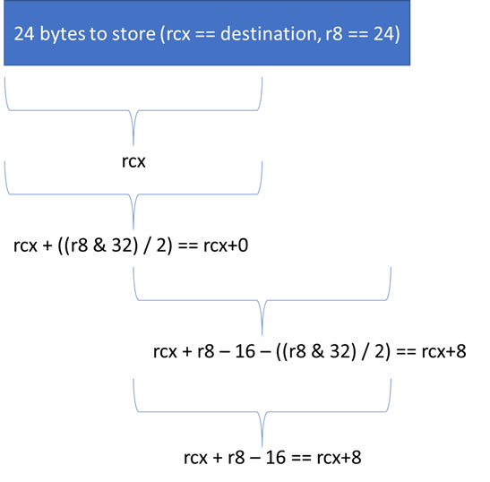
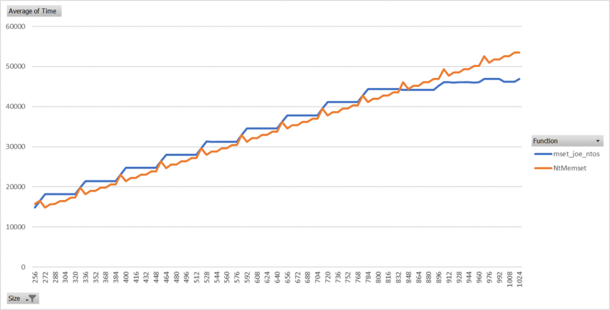

Over the past several years, Microsoft has rolled out several changes that result in more memory being zeroed. These mitigations include:

1. [The InitAll mitigation which zeros most stack variables](https://msrc-blog.microsoft.com/2020/05/13/solving-uninitialized-stack-memory-on-windows/)
2. [Switching most Microsoft kernel code over to the ExAllocatePool2/ExAllocatePool3 API’s which zero memory by default](https://msrc-blog.microsoft.com/2020/07/02/solving-uninitialized-kernel-pool-memory-on-windows/).

Where possible the compiler will unroll calls to memset. This means that rather than calling memset, the generated code will directly perform the store operations. This is substantially faster than calling memset because it eliminates the overhead of the call instruction and the overhead that memset has (branches, having to support setting arbitrary values, etc.). This is only possible to do when the compiler can statically determine the size of the memset and the size is relatively small. For large memsets, we prefer to call the memset function to reduce code size. For large or unknown size memsets, we prefer to call the memset function because it can query for various CPU features that allow it to perform better than an unrolled implementation would be able to. All zeroing operations that the pool allocator performs and many structure/array initializations that InitAll performs end up going through the memset function.

Memset is one of the hottest functions on the operating system and is already quite optimized as a result. When analyzing the memset implementation, I realized there was still a bit of room for improvement and this blog details the approach that was taken in optimizing this function the results.

The implementation documented in this blog is in use by a number of Windows components (all kernel-mode components, plus a number of user-mode components). Any 3rd party drivers building with the latest WDK will also use this implementation. It is not currently used by the user-mode CRT shipped with Visual Studio (UCRT.dll).

# Disclaimer About Performance Numbers

This blog contains observations I’ve made about things that perform well / do not perform well and some benchmarks that I’ve performed.

The performance testing was done across a wide range of AMD and Intel CPU’s ranging from 10+ year old CPU’s to Kaby Lake and Ryzen 2. The numbers and observations shared in the blog are not necessarily true across every generation of CPU. They are observations being made about the aggregate of all the testing I have done.

Memset performance can have large variations across:

1. Different CPU generations
2. Different CPU vendors
3. Different CPU’s of the same generation but targeting different platforms (laptop vs. desktop vs. server chips)

If you are building your own memset, always test across as many CPU’s as you can possibly find.

# Memset Primers

Before diving into the optimizations, there’s a few baseline things that are helpful to understand.

1. Each CPU core has multiple “ports” that can perform different operations at the same time. While your eyes read assembly instructions one at a time, CPU’s work on multiple instructions at once. The specifics change each CPU generation.
2. Modern CPU’s are out-of-order, meaning that they don’t necessarily execute instructions in the order which they were read, although certain rules must be followed to ensure correctness.
3. CPU’s use pipelines where each part of the pipeline handles a certain part of executing an instruction. The depth of the pipeline depends on the CPU generation.
4. CPU’s use branch prediction and speculative execution to predict what direction of a branch will be taken and begin speculatively executing down that path. If the CPU predicts incorrectly it must throw away all the work it did and start executing down the correct path. This will temporarily stall the CPU while it re-populates its pipeline and results in bad performance. The deeper the CPU pipeline is, the worse this regression can be.
5. Current Intel/AMD CPU’s can retire a single store instruction per clock cycle. Assuming alignment is okay, the CPU can retire one 16-byte store per cycle just like it can retire one 1-byte store per cycle; for best performance you should use the biggest stores possible.
6. Unaligned store instructions that straddle a cache line incur a bit of a performance penalty. Unaligned store instructions that straddle a page boundary are substantially slower (taking about 4x as long to execute). Unaligned store instructions that do not straddle either of these boundaries are almost free on modern CPU’s.

Memset is all about setting memory which means that making it perform well essentially boils down to retiring one store per clock cycle with as big of stores as possible (to reduce the total number of stores that need to be retired). Memset has multiple things that actively work to make this task difficult:

1. Memset works on arbitrary sizes so it must contain branches. Branch mispredictions will waste multiple CPU cycles.
2. Memset can take an arbitrary byte value to store. If memset is going to use instructions that store more than 1-byte at a time, it must expand this single byte value into a pattern (typically using an expensive “imul” instruction).
3. The address passed to memset can have an arbitrary alignment which may need to be corrected in order to use the fastest instructions (i.e. avoiding cross cache line or cross page boundary accesses).
4. In kernel-mode implementations, it is not practical to use AVX instructions which allow storing 32 or 64 bytes at a time. For efficiency reasons, the Windows kernel does not save a copy of the AVX registers when a user-mode program calls in to kernel-mode so if the kernel-mode memset tries to use these registers it will destroy the contents that user-mode placed in them.

# Existing NT Memset

The below diagram outlines the logic of the existing NT memset function.

- Blue squares represent branching points.
- Orange squares represent stores happening in inefficient loops that are not able to retire 1 instruction per clock. Orange squares also represent single stores that are guarded by a branch that can mispredict.
- Green squares represent stores that are efficient either because they happen unconditionally or because they are inside of an efficient loop that can retire 1 store per clock.


After analyzing this memset implementation, I had the following concerns:

1. For sizes under 80 bytes, the bulk of the stores are done in loops that do a single store per iteration. This is suboptimal and will not achieve 1 store retired per clock cycle. Each iteration of a loop needs to have at least 4 store instructions in it in order to retire one store per clock. This number was found by benchmarking different store loops on a variety of hardware.
2. There are 2 places where a check (branch) is done prior to setting trailing bytes. It would almost certainly be faster to always set trailing bytes (even if it completely overlaps with a previous store) rather than risking a branch misprediction to save a single store.
3. The hot-path code (for sizes greater than 79 bytes) has several places for mispredictions to happen. I’m not sure how this original threshold was determined.
4. The hot-path code has a 16-byte at a time loop to set trailing bytes that does not retire 1 store per clock.

Interestingly, I found that when sizes were over several hundred bytes, the concerns for point #4 became a non-issue. I believe this is because the CPU was able to speculatively execute far enough ahead to mitigate the impact of the inefficient trailing byte loop.

The implementation also has some great characteristics such as:

1. Very small code size.
2. Great performance for allocations of 256 bytes and bigger. A single 16-byte unaligned store is done, then the destination is 16-byte aligned so that no further memory accesses straddle cache lines or pages.
3. Pretty reasonable performance for smaller allocation sizes, especially if the branch predictors are predicting correctly.

The implementation also has a neat trick. In cases where the size of the original buffer is big enough, the trailing bytes of the buffer can be set with a single (possibly unaligned) store operation. The end address of the buffer is computed, and 8 (or 16) bytes is subtracted from it. This gives the address to use for the last 8- or 16-byte store instruction. This instruction may overlap with other instructions but it’s much better than doing a byte-at-a-time loop to set the trailing bytes. Note that in the existing memset, there is a branch to determine if the trailing store is necessary or if the buffer has already been completely filled.


This trick will be used more later to even greater effect.

# Optimization

Memset is basically broken down into two primary pieces:

1. A hot loop that handles sizes above a certain threshold with extremely good efficiency and very near 1-store per cycle retirement.
2. Code that handles anything too small for the hot loop to take care of.

Memset is used in the following common scenarios:

1. Memsetting the same size over and over (in a hot loop for example) where the branch predictors of the function will be perfectly trained after some number of iterations of the loop.
2. Memsetting a variety of different sizes (such as different size structures on the stack) where the branch predictors will not predict correctly.

My approach in optimizing memset was that:

1. We want the hot loop to be extremely efficient for large sizes.
2. We want the hot loop to handle as many sizes as possible so that most setting is handled along a single branch.
3. We want to minimize the number of branch mispredictions since this can cripple performance. For small memsets, a single branch misprediction can consume more CPU cycles than all the stores. Common sizes should be handled with very few mispredictions and maximum stores retired per cycle, less common sizes can be handled in more expensive ways.
4. The compiler will unroll memsets that are 63 bytes or smaller when compiling for size, and 127 bytes or smaller when compiling for speed. While small variable sized memsets will still use the memset function, small statically sized memsets will never reach the memset function so very small size performance can be de-prioritized a bit.

And with that, the first branching decision is added.


## Step 1: Determine the Minimum Necessary Size of the Hot Loop

For large sizes (whose minimum size we need to determine), memset will end up looping over the buffer and doing stores.

For example, here’s a naïve implementation of this loop:

```
; rcx  = destination buffer
; r8   = number of bytes to store
; xmm0 = a 16-byte pattern where every individual byte equals the byte to store

    shr r8, 4             ; r8 contains number of 16-byte chunks to set

big_loop:
    movdqu [rcx], xmm0    ; store 16 bytes
    add     rcx, 16       ; increment pointer
    dec     r8            ; decrement counter
    jnz     big_loop      ; if counter is not zero, do the loop again

; store trailing bytes (not yet implemented!)
```

As previously mentioned, memset needs to retire as close to 1 store per clock cycle as possible. Ignoring the rest of memset for the moment, the loop implemented here needs to retire 1 store per clock cycle to perform optimally. Unfortunately, doing 1 store per loop iteration is not enough to keep the CPU saturated across all architectures tested (a variety of AMD and Intel CPU’s ranging from 10 years old to Kaby Lake / Ryzen 2) and across all size ranges tested (64 bytes up to 1MB).

The existing memset implementation used by Windows used a loop that performed 8 XMM stores (128 bytes) per iteration. This performs well; it retires 1 store instruction per clock. However, because the loop stores 128 bytes per iteration, special logic is necessary to handle sizes under 128 bytes. Special logic means additional branching which we are trying to minimize.

After some testing, I determined that doing 2 stores per loop iteration still does not perform optimally but 4 stores per loop iteration does. This allows our loop to handle 64-bytes per iteration. This is convenient because since the compiler will unroll statically sized memsets that are smaller than 64 bytes, all statically sized memsets that do use the memset function will be handled in the hot loop code path.


## Step 2: Efficiently Set Trailing Bytes

We know the buffer is at least 64 bytes big. There are anywhere between 0-63 trailing bytes to set. Modern CPU’s internally implement store buffers that allow them to efficiently handle stores to the same address without needing to actually write to RAM multiple times. On most CPU’s this requires that the stores directly overlap to maximize efficiency.

Rather than use conditional branching to store the 0-63 bytes of trailing data, we do the following:

1. Compute 1 byte past the end of the destination.
2. Subtract 16 bytes from this, save this (in a register) as the location of the last trailing store.
3. Subtract 48 bytes from this and align the result down to the nearest 16-byte boundary, save this (in a register) as the location of the last 3 aligned stores.
4. After the hot loop, do 3 16-byte stores to the aligned location computed in step 3 (incrementing the address by 16 each store).
5. Do 1 16-byte store for the last 16 bytes of data computed in step 2.

In assembly it looks like this:

```
; rcx  = destination buffer
; r8   = number of bytes to store
; xmm0 = a 16-byte pattern where every individual byte equals the byte to store


        lea     rdx, [rcx + r8 - 16]    ; calculate where the last 16-byte store goes
        lea     r9, [rcx + r8 - 48]     ; calculate where the first "trailing bytes"
                                        ; store goes
        and     r9, NOT 15              ; first "trailing bytes" store should be 16-
                                        ; byte aligned


        movaps  [r9], xmm0
        movaps  [r9 + 16], xmm0
        movaps  [r9 + 32], xmm0
        movups  [rdx], xmm0
```

Note that if the buffer were exactly 64 bytes big, this would result in 8 stores being retired. The hot loop would do 4 stores and the trailing byte code would also unconditionally do 4 stores. It will take 8 CPU cycles to retire all these stores, but due to the CPU’s store buffers the multiple stores will only be written into the CPU cache once per 16-byte location. In other words, in exchange for a 4 CPU cycle overhead to retire 4 extra store instructions we can:

1. Eliminate a loop that the previous NT memset had to set trailing bytes.
2. Eliminate a 0-size branch that the previous NT memset had before setting the last 16 bytes.


This is likely worth it since a single branch misprediction costs more than 4 cycles.

## Step 3: Efficiently Setting Small Amounts of Bytes

This memset now handles all sizes greater or equal to 64 bytes but needs to efficiently handle sizes of less than 64 bytes.

We expect to see super-small memsets infrequently. For example, a 1-byte memset should be fairly uncommon and will already have a ton of overhead relative to the operation being done (a single byte write). With that in mind, I decided it would be fine to give priority to bigger sizes in this range.

#### Variable Size Branchless Store Technique

One observation I made is that the trailing bytes code from the previous section would be useful here. Assuming the size is at least 16 bytes, I can unconditionally set between 16 and 63 bytes using the following sequence of assembly:

```
; rcx = destination
; r8 = size
; xmm0 = pattern to store

        lea     r9, [r8 + rcx - 16]     ; compute the location of the last
                                        ; store, could be unaligned
        and     r8, 32                  ; if size at least 32 bytes, r8 = 32,
                                        ; otherwise r8 = 0
        movups  [rcx], xmm0             ; set the first 16 bytes
        shr     r8, 1                   ; divide r8 by 2, this is now either 16 or 0
        movups  [r9], xmm0              ; set the last location
        movups  [rcx + r8], xmm0        ; set index 0 or index 16 based on if the
                                        ; size is at least 32
        neg     r8                      ; either 0 or -16
        movups  [r9 + r8], xmm0         ; set the second to last location
```

This assembly sequence can retire 1 store per CPU cycle. Similar arithmetic can be used to then set 4 to 15 bytes (using 4-byte store instructions instead of 16-byte store instructions). For sizes 0, 1, 2, and 3, branches are used to determine the precise number of bytes. These sizes should be exceedingly uncommon so slow performance is not a concern.

This is a large win because we expect that when memset is called for sizes under 64 bytes, the sizes will likely be at least 16 bytes big. We need a single branch to check the size is greater than 16 bytes and can then perform the memset with no additional branches.

Here are some example diagrams to help illustrate how the 4 stores are done for different sizes:




This is what the decision tree for memset looks like with all small sizes handled:


## Step 4: Optimize Really Large Sizes

Circling back around to the code responsible for setting large buffers, there’s one additional optimization that can be done. Modern Intel CPU’s support an enhanced “rep stosb” instruction that can operate faster than SSE instructions for large sizes (software implementations are still better for small-medium sizes). The big advantage that “rep stosb” has, particularly in kernel-mode, is that it can use 32-byte or 64-byte stores under the covers. The only other way the kernel could use stores that big is if it first saved all the AVX register state (which is over 1,000 bytes of data to store).

In my testing I did notice one large deficiency in “rep stosb” that reproduces on every CPU I’ve tested it on: Passing addresses that aren’t aligned to a 32-byte boundary will result in performance that is degraded around 50%. This can be fixed by using XMM store instructions to store the first 64 bytes of the buffer, then aligning the buffer to a 64-byte boundary, adjusting the size, and passing the remainder of the buffer to “rep stosb”. You might be wondering why I 64-byte aligned the buffer instead of 32-byte. I don’t have any CPU’s that support AVX-512 to test on and I assume that “rep stosb” will have degraded performance if the buffer isn’t 64-byte aligned while doing the 64-byte stores that architecture allows for. Given that there’s no real reason not to 64-byte align the buffer, I do it to play it safe.

I also observed that for sizes under 800 bytes, it was typically better to just use normal XMM stores in a loop rather than using “rep stosb”. Note that this threshold varies depending on CPU generation (with newer generations typically able to use a lower threshold), but the 800 byte threshold is a good overall compromise for all CPU generations tested.

We also need an additional branch to check a pre-populated global variable indicating if the CPU supports “enhanced stosb”. If the CPU doesn’t indicate support then memset will not use the “rep stosb” instruction as it will perform extremely poorly. All modern Intel CPU’s support “rep stosb” and hopefully AMD supports it in the future.


At first glance it may seem that these extra branches added in the hot path loop are unnecessary overhead. The “enhanced stosb supported check” should always be speculated correctly by the CPU since it is configured at boot time and never changes. Most sizes passed to memset are under 800 bytes so the 800-byte size check should also always typically speculate towards the smaller sizes. For sizes larger than 800 bytes the branch misprediction is acceptable since there is such a large performance win from using “rep stosb”. The default speculation behavior (if no branch prediction information exists) is that enhanced stosb is supported and size is under 800 bytes.

# Analyzing Theoretical Performance

Note that in the table below, while it is theoretically possible that every iteration of a loop has a branch misprediction it is extremely unlikely. I assume that the maximum number of times a loop will mispredict is 1 (the misprediction to exit the loop, which some CPU's may actually optimize away).

|                 |                                           |                                           |                              |                             |
| --------------- | ----------------------------------------- | ----------------------------------------- | ---------------------------- | --------------------------- |
| **Memset Size** | **Old Memset Min/Max Branch Mispredicts** | **New Memset Min/Max Branch Mispredicts** | **Old Memset Stores**        | **New Memset Stores**       |
| 8               | 0 min, 4 max                              | 0 min, 3 max                              | 1                            | 4                           |
| 16              | 1 min, 5 max                              | 0 min, 2 max                              | 2                            | 4                           |
| 24              | 1 min, 5 max                              | 0 min, 2 max                              | 3                            | 4                           |
| 32              | 1 min, 5 max                              | 0 min, 2 max                              | 4                            | 4                           |
| 36              | 1 min, 5 max                              | 0 min, 2 max                              | 5                            | 4                           |
| 48              | 1 min, 5 max                              | 0 min, 2 max                              | 6                            | 4                           |
| 64              | 1 min, 5 max                              | 0 min, 4 max                              | 8                            | 5                           |
| 80              | 1 min, 6 max                              | 0 min, 5 max\* (depends on alignment)     | 5-7 (depends on alignment)   | 5-9 (depends on alignment)  |
| 96              | 1 min, 6 max                              | 1 min, 5 max\*                            | 6-8 (depends on alignment)   | 9                           |
| 128             | 1 min, 6 max                              | 1 min, 5 max\*                            | 8-10 (depends on alignment)  | 9                           |
| 144             | 1 min, 7 max                              | 1 min, 5 max\*                            | 9-11 (depends on alignment)  | 9-13 (depends on alignment) |
| 160             | 2 min, 7 max                              | 1 min, 5 max\*                            | 10-12 (depends on alignment) | 13                          |
| 176             | 2 min, 7 max                              | 1 min, 5 max\*                            | 11-13 (depends on alignment) | 13                          |
| 192             | 2 min, 7 max                              | 1 min, 5 max\*                            | 12-14 (depends on alignment) | 13                          |

_\* one of these potential mispredictions is on enhanced stosb support which is incredibly unlikely to mispredict_

One thing this table does not represent is how many mispredictions are expected in the normal case. While this is largely application dependent, due to the way the new memset is structured it should have fewer branch mispredictions in normal operation even if the theoretical number is not much lower. A single branch misprediction is easily more expensive than a few extra stores (especially since these extra stores write to memory that was recently stored too, so they are extremely cheap).

# Microbenchmarks

The following benchmarks were performed by:

1. Selecting a size
2. Calling memset on the same buffer with this selected size a set number of times (1,000 for smaller sizes, but shrinking on very large sizes)
3. Taking the mean of the fastest 10% of the results (to help eliminate noise from interrupts and context switches)

The tests were performed on a wide range of CPU’s, but these results are from a system with 2 Intel E5-2630 V4 CPU’s (dual socket Broadwell).

In these tests, the branch predictors will be perfectly trained since the exact same size is set so many times in a row. This gives a good indicator of the maximum possible performance, but this performance is only achievable if the specific size was repeated used inside of a hot loop (or the branch predictors happened to be perfectly trained). For all other scenarios we’d expect more branch mispredictions.


One thing you can immediately see is that because the variable size branchless store code implemented, the time for the new memset implementation is extremely stable across a wide range of sizes.




We can also observe that for sizes under 256 bytes, the new memset implementation generally has an advantage over the previous NT memset implementation assuming perfectly trained branches even though in many cases the new memset implementation will retire more store instructions. The reason for this is as follows:

1. For many sizes in this range, the old implementation will do a 1-store-at-a-time loop. While it retires fewer stores in total, it is not retiring 1 store per clock.
2. For many sizes in this range, the old memset implementation has a higher number of unavoidable branch mispredictions. Even though the branch predictors are optimally trained, the new implementation has less mispredictions.

As size increases over 256 bytes (up to around 800 bytes or so) the performance becomes comparable (with the old NT memset actually outperforming the new memset for a lot of sizes). This surprised me initially because the old implementation does have a 1-store-per-iteration loop to set trailing bytes which should perform poorly What I believe is happening is that enough stores are happening in the 8-store-per-iteration loop that the CPU can speculatively execute far enough ahead to mitigate the impacts of the 1-store-per-iteration loop that sets trailing bytes.

As size increases, enhanced rep store shows its advantage. Since this implementation must be able to run in kernel-mode, no AVX instructions are used. This means that “rep stosb” is able to use 32-byte (or larger) stores under the covers while the old implementation is stuck using 16-byte stores.

One rather interesting observation from these graphs is that “rep stosb” has a big performance advantage over SSE stores from around 1k to 32kb in buffer size. Once we exceed 32kb being stored, the L1 cache can no longer fit the entire buffer and performance becomes equivalent to SSE stores. Once the size of the L2 cache is exceeded, “rep stosb” once against starts out performing SSE stores. This behavior reliably reproduces across a range of Intel CPU’s that support enhanced “rep stosb”. I didn’t attempt to determine why exactly this behavior occurs.

## Random Size Tests

For the next set of tests, an array is generated containing 50,000 randomly generated sizes between some specified range. Memset is then used to zero the same buffer with the different sizes in the array. The same array is used for all implementations, so the results are directly comparable. This is intended to measure how memset operates under hopefully more realistic scenarios where the branch predictors may be incorrectly trained.

These tests are done with a variety of parameters such as:

- Granularity of size chosen (size must be a multiple of this value)
- Minimum size.
- Maximum size.
- Minimum offset from the start of a page to start zeroing from.
- Maximum offset from the start of a page to start zeroing from.
- Clear the L1 cache prior to zeroing the allocation?

There are far too many of these tests run to include all the data in this blog post, but below contains some of the data for a variety of size ranges.

One particularly interesting test to look at is “gran:16_minSize:256_maxSize:512_minOffsetFromPageAlignment:0_maxOffsetFromPageAlignment:0”. This test chooses random sizes between 256 and 512 bytes (that are a multiple of 16 bytes). If you look at the tests above, you’ll see that the old NT memset algorithm typically outperforms the new memset in this size range when branch predictors are perfectly trained. The random size test shows a 12.9% performance gain for the new memset algorithm. This is because the new algorithm performs better even when branch predictors are not perfectly trained.

|                 |             |             |               |               |               |                        |
| --------------- | ----------- | ----------- | ------------- | ------------- | ------------- | ---------------------- |
| **Granularity** | **MinSize** | **MaxSize** | **MinOffset** | **MaxOffset** | **Clear L1?** | **Perf % Improvement** |
| 1               | 1           | 1024        | 0             | 0             | No            | 17.74                  |
| 1               | 1           | 1024        | 0             | 0             | Yes           | 17.77                  |
| 1               | 1           | 1024        | 0             | 4095          | No            | 16.66                  |
| 1               | 1           | 128         | 0             | 0             | No            | 21.99                  |
| 1               | 1           | 128         | 0             | 0             | Yes           | 19.05                  |
| 1               | 1           | 128         | 0             | 4095          | No            | 21.66                  |
| 1               | 1           | 16          | 0             | 0             | No            | 16.10                  |
| 1               | 1           | 16          | 0             | 0             | Yes           | 15.27                  |
| 1               | 1           | 16          | 0             | 4095          | No            | 15.78                  |
| 1               | 1           | 256         | 0             | 0             | No            | 20.51                  |
| 1               | 1           | 256         | 0             | 0             | Yes           | 19.62                  |
| 1               | 1           | 256         | 0             | 4095          | No            | 18.80                  |
| 1               | 1           | 32          | 0             | 0             | No            | 13.28                  |
| 1               | 1           | 32          | 0             | 0             | Yes           | 11.28                  |
| 1               | 1           | 32          | 0             | 4095          | No            | 11.97                  |
| 1               | 1           | 4096        | 0             | 0             | No            | 34.61                  |
| 1               | 1           | 4096        | 0             | 0             | Yes           | 25.40                  |
| 1               | 1           | 4096        | 0             | 4095          | No            | 33.11                  |
| 1               | 1           | 512         | 0             | 0             | No            | 19.93                  |
| 1               | 1           | 512         | 0             | 0             | Yes           | 17.64                  |
| 1               | 1           | 512         | 0             | 4095          | No            | 19.03                  |
| 1               | 1           | 64          | 0             | 0             | No            | 27.91                  |
| 1               | 1           | 64          | 0             | 0             | Yes           | 23.50                  |
| 1               | 1           | 64          | 0             | 4095          | No            | 25.40                  |
| 1               | 1           | 768         | 0             | 0             | No            | 18.35                  |
| 1               | 1           | 768         | 0             | 0             | Yes           | 17.55                  |
| 1               | 1           | 768         | 0             | 4095          | No            | 17.68                  |
| 16              | 1024        | 4096        | 0             | 0             | No            | 38.40                  |
| 16              | 1024        | 4096        | 0             | 0             | Yes           | 28.12                  |
| 16              | 1024        | 4096        | 0             | 4095          | No            | 36.90                  |
| 16              | 256         | 1024        | 0             | 0             | No            | 14.92                  |
| 16              | 256         | 1024        | 0             | 0             | Yes           | 15.21                  |
| 16              | 256         | 1024        | 0             | 4095          | No            | 15.01                  |
| 16              | 256         | 4096        | 0             | 0             | No            | 35.14                  |
| 16              | 256         | 4096        | 0             | 0             | Yes           | 26.64                  |
| 16              | 256         | 4096        | 0             | 4095          | No            | 33.87                  |
| 16              | 256         | 512         | 0             | 0             | No            | 12.96                  |
| 16              | 256         | 512         | 0             | 0             | Yes           | 10.08                  |
| 16              | 256         | 512         | 0             | 4095          | No            | 14.30                  |
| 16              | 256         | 768         | 0             | 0             | No            | 15.25                  |
| 16              | 256         | 768         | 0             | 0             | Yes           | 13.55                  |
| 16              | 256         | 768         | 0             | 4095          | No            | 16.13                  |
| 16              | 32          | 1024        | 0             | 0             | No            | 16.89                  |
| 16              | 32          | 1024        | 0             | 0             | Yes           | 16.89                  |
| 16              | 32          | 1024        | 0             | 4095          | No            | 16.69                  |
| 16              | 32          | 128         | 0             | 0             | No            | 23.62                  |
| 16              | 32          | 128         | 0             | 0             | Yes           | 22.00                  |
| 16              | 32          | 128         | 0             | 4095          | No            | 22.60                  |
| 16              | 32          | 256         | 0             | 0             | No            | 19.06                  |
| 16              | 32          | 256         | 0             | 0             | Yes           | 17.86                  |
| 16              | 32          | 256         | 0             | 4095          | No            | 18.61                  |
| 16              | 32          | 512         | 0             | 0             | No            | 18.58                  |
| 16              | 32          | 512         | 0             | 0             | Yes           | 16.00                  |
| 16              | 32          | 512         | 0             | 4095          | No            | 19.57                  |
| 16              | 32          | 64          | 0             | 0             | No            | 25.92                  |
| 16              | 32          | 64          | 0             | 0             | Yes           | 19.96                  |
| 16              | 32          | 64          | 0             | 4095          | No            | 23.28                  |
| 16              | 512         | 1024        | 0             | 0             | No            | 11.75                  |
| 16              | 512         | 1024        | 0             | 0             | Yes           | 13.80                  |
| 16              | 512         | 1024        | 0             | 4095          | No            | 11.46                  |
| 16              | 512         | 768         | 0             | 0             | No            | 9.03                   |
| 16              | 512         | 768         | 0             | 0             | Yes           | 11.31                  |
| 16              | 512         | 768         | 0             | 4095          | No            | 9.79                   |
| 16              | 64          | 1024        | 0             | 0             | No            | 15.57                  |
| 16              | 64          | 1024        | 0             | 0             | Yes           | 16.68                  |
| 16              | 64          | 1024        | 0             | 4095          | No            | 16.84                  |
| 16              | 64          | 128         | 0             | 0             | No            | 19.55                  |
| 16              | 64          | 128         | 0             | 0             | Yes           | 21.16                  |
| 16              | 64          | 128         | 0             | 4095          | No            | 21.18                  |
| 16              | 64          | 512         | 0             | 0             | No            | 17.67                  |
| 16              | 64          | 512         | 0             | 0             | Yes           | 15.03                  |
| 16              | 64          | 512         | 0             | 4095          | No            | 18.82                  |

Under these harsh conditions for the branch predictor, we can see the new memset implementation is typically considerably faster than the old one.

## Performance Gates Data

We also looked at total CPU time spent in memset while Windows automated performance tests were running. Below is some of the data.

The table below was generated by running the Windows performance gates with CPU sampling enabled using both the new and old memset implementations. The table measures the improvement. A positive improvement percentage means that we had X% less CPU samples in memset with the new implementation compared to the old implementation.

|                                                    |                        |
| -------------------------------------------------- | ---------------------- |
| **Test**                                           | **Perf Improvement %** |
| **wcat_webfundamentals_dynamic**                   |                        |
| C:\\Windows\\system32\\ntoskrnl.exe                | 2.962923007            |
| **wcat_webfundamentals_fullmix_200k_rps**          |                        |
| C:\\Windows\\system32\\drivers\\HTTP.sys           | 6.003367755            |
| C:\\Windows\\system32\\ntdll.dll                   | -12.12894329           |
| C:\\Windows\\system32\\ntoskrnl.exe                | -0.518717875           |
| **wcat_webfundamentals_fullmix_ssl_40k_rps**       |                        |
| C:\\Windows\\system32\\bcryptprimitives.dll        | -1.950845076           |
| C:\\Windows\\system32\\drivers\\HTTP.sys           | 8.847381952            |
| C:\\Windows\\system32\\ntdll.dll                   | 17.72216325            |
| C:\\Windows\\system32\\ntoskrnl.exe                | 8.856946825            |
| **wcat_webfundamentals_fullmix_ssl_http2_40k_rps** |                        |
| C:\\Windows\\system32\\bcryptprimitives.dll        | 26.54095238            |
| C:\\Windows\\system32\\drivers\\HTTP.sys           | 7.532052256            |
| C:\\Windows\\system32\\ntdll.dll                   | 8.903747007            |
| C:\\Windows\\system32\\ntoskrnl.exe                | 7.570520429            |
| **wcat_webfundamentals_nka_ssl_full_6k_rps**       |                        |
| C:\\Windows\\system32\\bcryptprimitives.dll        | 7.117296919            |
| C:\\Windows\\system32\\drivers\\HTTP.sys           | 15.36784447            |
| C:\\Windows\\system32\\drivers\\tcpip.sys          | 10.05117623            |
| C:\\Windows\\system32\\ntdll.dll                   | 15.99903869            |
| C:\\Windows\\system32\\ntoskrnl.exe                | 8.360050312            |
| **wcat_webfundamentals_static_cold_50k_rps**       |                        |
| C:\\Windows\\system32\\drivers\\HTTP.sys           | 8.471010572            |
| C:\\Windows\\system32\\drivers\\Ntfs.sys           | 16.09645595            |
| C:\\Windows\\system32\\ntdll.dll                   | -16.36893506           |
| C:\\Windows\\system32\\ntoskrnl.exe                | -2.482949813           |

It is interesting to note that some of these tests show the new implementation is regressed, but this is not actually the case.

Windows Performance Recorder will periodically record what address the instruction pointer is currently executing. Because CPU’s execute code speculatively and execute multiple instructions at a time on different ports, it becomes a bit muddy as to what the CPU is actually executing at any point in time. What the traces are showing is what the next instruction is that is being waiting on to retire.

The new memset implementation will read from a global variable to determine if enhanced rep store is supported. The user-mode implementation (which works similar to what is documented in this blog, with the exception that it also has a code path that can use AVX instructions) also checks the global to see if AVX is supported.

We determined that a substantial number of CPU cycles in the new memset were spent waiting for this global variable read instruction to retire. The branching decisions based on this global variable should speculate correctly even if the global variable read operation hasn’t completed.

What happened in these traces is that the global variable is not in the L1 CPU cache, so it takes a long time for the load to retire. It takes longer for that load to retire than for the rest of the memset function to speculatively execute and return to the calling function. While there are more samples spent in the memset function in certain cases, that does not actually mean memset is taking longer to execute.

We also see many cases where even with the global variable read, the new memset has substantially less samples.

# Pool Zeroing

Windows recently rolled out the ExAllocatePool2 and ExAllocatePool3 API’s that zero allocations by default. While arbitrary sizes can be allocated, the allocator internally will allocate memory in multiples of 16 bytes (or larger, depending on the specific code path) on 64-bit platforms.

Rather than calling the general memset function, the pool uses a specialized function that only accepts a 16-byte aligned base address and sizes that are a multiple of 16 bytes. The function also only zeros.

This allows for the following optimizations:

1. No code is needed to expand a “byte” pattern to a larger register. This eliminates an expensive imul instruction that regular memset uses to expand the fill pattern.
2. No code is needed to 16-byte align the start address before the hot loop code executes its 16 byte stores. This eliminates a branch because 16-byte aligning the pointer prior to the hot loop may result in a size too small for a single iteration of the hot loop.
3. None of the trailing byte stores (after the hot loop) will ever partially overlap with each other. They will either not overlap at all or completely overlap. Completely overlapping stores perform better on the CPU.
4. Don’t need branches to handle sizes of 1 to 15 bytes, the only sizes that need to be handled are 0 bytes and 16 bytes.
5. Smaller code size makes the function more cache friendly
6. Less math needed for pointer alignment makes the function slightly more efficient

In some cases, these efficiencies don’t matter much. In other cases they can result in runtime performance that is 5-10% better compared to generic memset.


This graph shows how the RtlHeapZero function compares to the old memset and new memset implementations for 16-byte aligned sizes and 16-byte aligned start addresses.


For sizes under 128 bytes, RtlHeapZero provides a solid performance gain over the old and new memset routines.

# Interesting Cases

## Mysterious AMD-FX 8100 Perf Regression

When building my memset implementation, I originally wrote the hot loop as follows:

```
mset30:
        movaps  [rcx],xmm0              ; set 16 bytes
        movaps  [rcx + 16], xmm0        ; set 16 bytes
        add     rcx, 64                 ; increment the pointer
        sub     r8, 1                   ; decrement the loop counter
        movaps  [rcx - 32], xmm0        ; set 16 bytes
        movaps  [rcx - 16], xmm0        ; set 16 bytes
        jnz     mset30                  ; if nz, there are at least 64 bytes left
```

For a memset of 4096 bytes, this hot loop ran at 25% the speed of the previous NT memset. For a memset of 64kb, this hot loop ran at 50% the speed of the previous NT memset.

I originally thought this was because the loop needed to do 8 stores per loop instead of 4 stores per loop to achieve good performance on this CPU. Unfortunately, this change didn’t solve the regression. What did solve the regression was changing the “sub r8, 1” instruction to a “dec r8” instruction, like this:

```
mset30:
        movaps  [rcx],xmm0              ; set 16 bytes
        movaps  [rcx + 16], xmm0        ; set 16 bytes
        add     rcx, 64                 ; increment the pointer
        dec     r8                      ; decrement the loop counter
        movaps  [rcx - 32], xmm0        ; set 16 bytes
        movaps  [rcx - 16], xmm0        ; set 16 bytes
        jnz     mset30                  ; if nz, there are at least 64 bytes left
```

Most CPU’s did not have this incredible performance penalty from a single instruction which highlights why it’s important to test functions like this on a wide variety of hardware.

## Uncached Memory Performance

A partner noticed that memset performance when operating on uncached memory was severely degraded for very large sizes. On the CPU’s we tested, SSE stores are 16x faster than using enhanced “rep stosb”. This indicates that on uncached memory, “rep stosb” stores one byte at a time. It is very fast with cached or write back memory only.

As there is no way for memset to determine what kind of memory it is writing to, we decided to leave the code as-is. Drivers that need to zero large regions of uncached memory quickly can either write their own SSE loop or call [RtlFillMemoryNonTemporal](https://docs.microsoft.com/en-us/windows-hardware/drivers/ddi/wdm/nf-wdm-rtlfillmemorynontemporal).

## Enhanced Rep Store on Unaligned Buffers

When rep stosb is used on buffers that are not at least 32-byte aligned, performance is heavily regressed on all CPU’s tested (that support enhanced rep stosb).

The new memset implementation completes the first 64 bytes of stores using SSE stores so that it can pass rep stosb a 64-byte aligned start address. This eliminates the performance regression.

## Rep stosb Versus rep stosq, etc.

We discovered that for very large sizes, rep stosq performs identically to rep stosb. For sizes under 4096 bytes, rep stosq performs noticeably worse than rep stosb. Our implementation always uses rep stosb since it performs the best (when enhanced rep store is supported).

## Usage of imul

Earlier in the blog, I mentioned that memset will use the imul instruction to expand out a byte pattern to a full 8 bytes. This is done as follows:

```
movzx   edx, dl                 ; set fill pattern
mov     r9, 0101010101010101h   ; replicate fill over 8 bytes
imul    rdx, r9
```

Upon reviewing this blog, a question was raised about “why use imul as opposed to doing a sequence of shifting and masking operations”? I never benchmarked this alternative approach, but my thought was as follows:

1. The imul is one of the first things to occur in memset, prior to any branches (since the result is needed regardless of which branch is taken).
2. The imul approach is very compact which allows the CPU to retrieve the branching instructions sooner. My priority is getting the branches evaluated quickly so that any mispredictions can be resolved. Delaying the evaluation of the branches by 1 or 2 cycles is not ideal.
3. The imul instruction will be executed while any mispredictions are sorted out since it is executed prior to any branches which mitigates the slowness of the instruction.

# Summary

This blog summarizes the work I did to optimize both memset in the general case, and build a specialized memset for the heap to use, in order to reduce the performance impact that several mitigations (InitAll, Pool Zeroing) introduced.

Luckily for us, the overhead of InitAll and Pool Zeroing was already quite small. As a result, the performance improvements are difficult to observe in end-to-end scenario performance tests but are quite visible in microbenchmarks.

You might wonder why a security engineer would dedicate a bunch of time to this sort of optimization work, and it really boils down to the following:

1. Security engineers should always do their best to reduce the performance impact of security changes. I view this work as part of being a good engineering citizen.
2. With a function that is used incredibly heavily such as memset, performance matters even if you don’t have an end-to-end scenario that shows obvious improvements. At datacenter scale, shaving CPU cycles off memset saves money, power, and helps the environment.

The optimization work done on this project has also paved the way for some interesting new security features that we are currently doing R&D on and will hopefully share more broadly in the future. It’s a good reminder that having a solid understanding of performance optimization can pave the way to do additional security work that was previously thought to be non-viable due to performance overhead.

I’d like to thank Matthew Parkinson for his help in building optimized memset and heap zeroing functions.

Joe Bialek

MSRC Vulnerabilities & Mitigations Team
