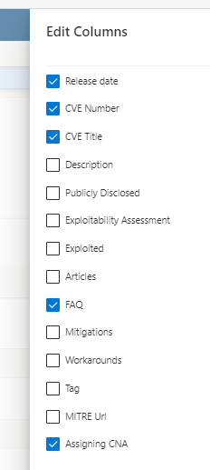
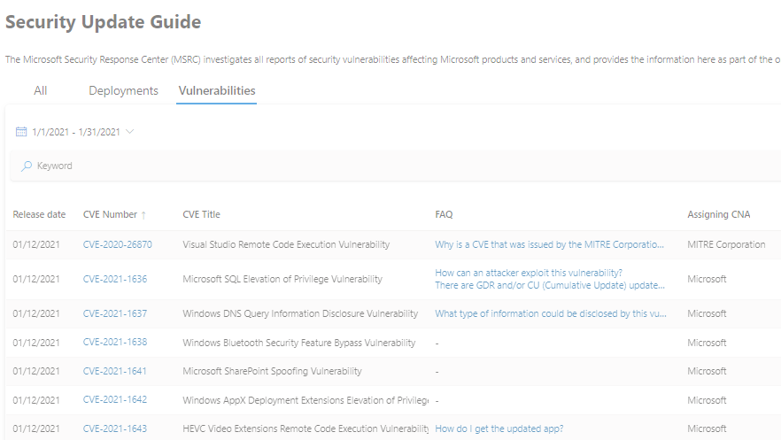
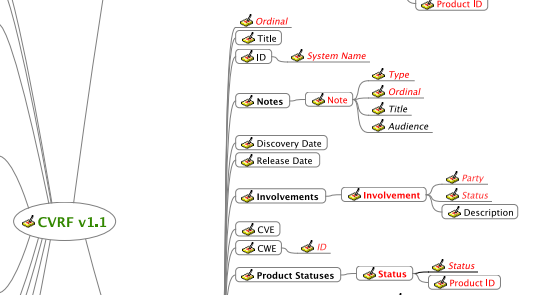

<!-- wp:paragraph -->

Hi Folks,

<!-- /wp:paragraph -->

<!-- wp:paragraph -->

This month we are introducing a new data element for each CVE in the Security Update Guide, called **Assigning CNA**.

<!-- /wp:paragraph -->

<!-- wp:paragraph -->

First let me back up a bit and give some information about the CVE program. The purpose of a CVE is to uniquely identify a cybersecurity vulnerability. The CVE program was started back in 1999 and is funded by the US federal government, currently out of the Cybersecurity and Infrastructure Security Agency (CISA). The MITRE Corporation is paid by CISA to administer the program. There is a board which consists of numerous cybersecurity-related organizations, including commercial security tool vendors, academia, research institutions, government departments and agencies, and other security experts, as well as end users of vulnerability information. Through open and collaborative discussions, the Board provides critical input regarding the data sources, product coverage, coverage goals, operating structure, and strategic direction of the CVE Program. Also, companies and agencies that designate vulnerabilities with CVEs can become a CVE Numbering Authority (CNA) which means that they are authorized to assign CVE IDs to vulnerabilities which are in their scope. Currently there are 151 CNAs from 25 different countries. You can read all of this information and more here: [CVE - Home (mitre.org)](https://cve.mitre.org/about/index.html).

<!-- /wp:paragraph -->

<!-- wp:paragraph -->

Microsoft has been an active participant in the CVE program since its inception, and became a CNA at the earliest opportunity. The first Microsoft CVE was [CVE-1999-0007](https://cve.mitre.org/cgi-bin/cvename.cgi?name=CVE-1999-0007). Over the life of the program, we’ve issued over 7000 CVEs. More than half of those CVEs have been issued since the Security Update Guide was launched in 2016. This growth has fueled the requirements for the Guide and the API to allow our customers to digest the CVE information in a much more structured way.

<!-- /wp:paragraph -->

<!-- wp:paragraph -->

Fast forward two decades and my, how the world has changed. The use of Open Source Software (OSS) has become ubiquitous. The days of closed, single source proprietary products are really behind us now. This can make the job of ensuring that vulnerabilities are patched in a complex enterprise environment quite challenging. It is with this thought in mind that we are introducing this new **Assigning CNA** field. We will use this field if a vulnerability has been identified and addressed in an Open Source Library that is bundled in a Microsoft product.

<!-- /wp:paragraph -->

<!-- wp:paragraph -->

We have an example of such a third-party CVE in this month’s set of CVEs. [CVE-2020-26870](https://msrc.microsoft.com/update-guide/vulnerability/CVE-2020-26870) documents a vulnerability in Cure53 DOMPurify which is open source software used by Visual Studio. The Assigning CNA for this was MITRE Corporation. After publishing a third-party CVE such as this one we will add a link to our documentation in the [**References** section of that CVEin the official CVE List](https://cve.mitre.org/cgi-bin/cvename.cgi?name=CVE-2020-26870).

<!-- /wp:paragraph -->

<!-- wp:image {"align":"center","id":12590,"sizeSlug":"large","linkDestination":"none"} -->

See previous blog about using the Security Update Guide [here](https://msrc-blog.microsoft.com/2020/11/09/vulnerability-descriptions-in-the-new-version-of-the-security-update-guide/)

<!-- /wp:image -->

<!-- wp:paragraph -->

In the Security Update Guide, you can see this **Assigning CNA** field on the CVE detail page as well as select it for viewing on the **Vulnerabilities** tab.

<!-- /wp:paragraph -->

<!-- wp:image {"align":"center","id":12593,"sizeSlug":"large","linkDestination":"none"} -->

See more information about the Vulnerabilities Tab [here](https://msrc-blog.microsoft.com/2020/12/08/security-update-guide-lets-keep-the-conversation-going/)

<!-- /wp:image -->

<!-- wp:paragraph -->

We will assign CVSS scores to these CVEs. An interesting thing to note about documenting a CVSS score for an OSS vulnerability: one implementation using an OSS library with a vulnerability may manifest a different score than others. For this reason, the score documented by [NIST](https://nvd.nist.gov/vuln/detail/CVE-2020-26870) for a vulnerability like this may differ from a score that we will assign as the code is used by Visual Studio. If there is interest, we could expand on this in a future blog.

<!-- /wp:paragraph -->

<!-- wp:paragraph -->

We will use this new **Assigning CNA** feature to identify other types of CVEs in a more transparent way as well. Many of you might be familiar with the advisory [ADV200002](https://msrc.microsoft.com/update-guide/vulnerability/ADV200002) which we use to document vulnerabilities that Chrome has identified and removed in the open source Chromium software. With this new capability we will add those CVEs to the Security Update Guide directly and the Assigning CNA for them will be Chrome.

<!-- /wp:paragraph -->

<!-- wp:paragraph -->

For those of you using the API, the Assigning CNA information is also included in the API. The Assigning CNA information is in the [Notes section](https://www.icasi.org/wp-content/uploads/2015/06/CVRF-mindmap-1.1.pdf) as Type 8.

<!-- /wp:paragraph -->

<!-- wp:image {"align":"center","id":12594,"sizeSlug":"large","linkDestination":"none"} -->

CVRF Mindmap 1.1 Snippet

<!-- /wp:image -->

<!-- wp:paragraph -->

We hope that the addition of the **Assigning CNA** feature will help you in your risk analysis and vulnerability management.

<!-- /wp:paragraph -->

<!-- wp:paragraph -->

\_Lisa Olson, Senior Security Program Manager, \_Microsoft Security Response Center\_\_

<!-- /wp:paragraph -->
